# АВРОРА
## Система низкоорбитальной спутниковой навигации и высокоточной синхронизации

**Технический проект**  
Проект АВРОРА — ООО «ШИВА НЕТВОРК» (ShiwaNetwork)

---

В документе изложены проектные решения по системе АВРОРА — низкоорбитальной группировке навигации, позиционирования и синхронизации. Для каждой подсистемы приведены расчётные соотношения, результаты моделирования и обоснование принятого варианта: построение группировки, навигационный сигнал, бортовая шкала времени, межспутниковые линии, наземный сегмент и пользовательская аппаратура.

---

## Содержание

1. [Список сокращений](#1-список-сокращений)
2. [Введение и цели проекта](#2-введение-и-цели-проекта)
3. [Системная архитектура](#3-системная-архитектура)
4. [Проектирование созвездия](#4-проектирование-созвездия)
5. [Анализ зон покрытия и геометрии](#5-анализ-зон-покрытия-и-геометрии)
6. [Частотный план и навигационный сигнал](#6-частотный-план-и-навигационный-сигнал)
7. [Структура навигационного сообщения](#7-структура-навигационного-сообщения)
8. [Часовая архитектура и синхронизация](#8-часовая-архитектура-и-синхронизация)
9. [Межспутниковые каналы (ISL)](#9-межспутниковые-каналы-isl)
10. [Бюджет линии связи пользователя](#10-бюджет-линии-связи-пользователя)
11. [Ионосферная коррекция](#11-ионосферная-коррекция)
12. [Динамика пользователя и точность позиционирования](#12-динамика-пользователя-и-точность-позиционирования)
13. [Орбитальное определение](#13-орбитальное-определение)
14. [Целостность навигации и RAIM](#14-целостность-навигации-и-raim)
15. [Помехозащищённость и антиджамминг](#15-помехозащищённость-и-антиджамминг)
16. [Аутентификация и криптографическая защита навигационного сообщения](#16-аутентификация-и-криптографическая-защита-навигационного-сообщения)
17. [Многолучёвость и борьба с ней](#17-многолучёвость-и-борьба-с-ней)
18. [Энергетический бюджет](#18-энергетический-бюджет)
19. [Массовый бюджет](#19-массовый-бюджет)
20. [Тепловой режим](#20-тепловой-режим)
21. [Анализ затенений](#21-анализ-затенений)
22. [Вывод из эксплуатации](#22-вывод-из-эксплуатации)
23. [Анализ конъюнкций и предотвращение столкновений](#23-анализ-конъюнкций-и-предотвращение-столкновений)
24. [Интеграция с СДКМ](#24-интеграция-с-сдкм)
25. [Монте-Карло анализ точности системы](#25-монте-карло-анализ-точности-системы)
26. [Устойчивость системы](#26-устойчивость-системы)
27. [Захват сигнала и время до первого определения местоположения](#27-захват-сигнала-и-время-до-первого-определения-местоположения)
28. [Временна́я служба и шкала времени АВРОРА](#28-временная-служба-и-шкала-времени-аврора)
29. [Комбинированная симуляция системы](#29-комбинированная-симуляция-системы)
30. [График развёртывания группировки](#30-график-развёртывания-группировки)
31. [Технико-экономическое обоснование](#31-технико-экономическое-обоснование)
32. [Радиационная среда и радиационная стойкость](#32-радиационная-среда-и-радиационная-стойкость)
33. [Релятивистские поправки](#33-релятивистские-поправки)
34. [Тропосферная коррекция](#34-тропосферная-коррекция)
35. [Надёжность и MTBF подсистем](#35-надёжность-и-mtbf-подсистем)
36. [PPP: алгоритм и время сходимости](#36-ppp-алгоритм-и-время-сходимости)
37. [Точность навигационного сигнала (SISA/URE)](#37-точность-навигационного-сигнала-sisaure)
38. [Система управления ориентацией (ADCS)](#38-система-управления-ориентацией-adcs)
39. [Оптимизация сети наземных станций](#39-оптимизация-сети-наземных-станций)
40. [Поддержание орбиты (Station Keeping)](#40-поддержание-орбиты-station-keeping)
41. [Сравнение АВРОРА с аналогами](#41-сравнение-аврора-с-аналогами)
42. [Пользовательский приёмник](#42-пользовательский-приёмник)
43. [Координация частот МСЭ](#43-координация-частот-мсэ)
44. [PPP-RTK архитектура](#44-ppp-rtk-архитектура)
45. [Сквозной бюджет PVT (Monte-Carlo)](#45-сквозной-бюджет-pvt-monte-carlo)
46. [Временна́я доступность и DOP](#46-временная-доступность-и-dop)
47. [Точное определение орбиты (POD)](#47-точное-определение-орбиты-pod)
48. [Автономная навигация (ISL AutoNav)](#48-автономная-навигация-isl-autonav)
49. [ARAIM и защитные уровни](#49-araim-и-защитные-уровни)
50. [Бюджет целостности (LPV-200 / CAT-I)](#50-бюджет-целостности-lpv-200--cat-i)
51. [Стоимостная модель (LCC)](#51-стоимостная-модель-lcc)
52. [Производство и AIT 300 КА](#52-производство-и-ait-300-ка)
53. [Кампания выведения](#53-кампания-выведения)
54. [Наземный сегмент (MCS/TT&C)](#54-наземный-сегмент-mcsttc)
55. [Системные требования (SRD)](#55-системные-требования-srd)
56. [Концепция операций (CONOPS)](#56-концепция-операций-conops)
57. [Реестр рисков](#57-реестр-рисков)
58. [План работ и график (Gantt)](#58-план-работ-и-график-gantt)
59. [План верификации и валидации (V&V)](#59-план-верификации-и-валидации-vv)
60. [Кибербезопасность](#60-кибербезопасность)
61. [Программное обеспечение](#61-программное-обеспечение)
62. [Матрица соответствия стандартам](#62-матрица-соответствия-стандартам)
63. [Пути повышения точности позиционирования](#63-пути-повышения-точности-позиционирования)
64. [Геодезическая система отсчёта и параметры вращения Земли](#64-геодезическая-система-отсчёта-и-параметры-вращения-земли)
65. [Двухсервисная архитектура сигналов (открытый А / защищённый Б)](#65-двухсервисная-архитектура-сигналов-открытый-а--защищённый-б)
66. [Промышленная кооперация и импортозамещение](#66-промышленная-кооперация-и-импортозамещение)
67. [Выводы](#67-выводы)
68. [Список литературы](#68-список-литературы)

---

## 1. Список сокращений

| Аббревиатура | Расшифровка |
|---|---|
| АВРОРА (AURORA) | Autonomous Universal Radio Orbital Reference Architecture (наименование системы; в тексте — АВРОРА, в коде/путях — AURORA) |
| PNT | Positioning, Navigation and Timing (Позиционирование, навигация и время) |
| LEO | Low Earth Orbit (Низкая околоземная орбита) |
| ISL | Inter-Satellite Link (Межспутниковый канал) |
| GNSS | Global Navigation Satellite System |
| SDCM | Система дифференциальной коррекции и мониторинга |
| RAIM | Receiver Autonomous Integrity Monitoring |
| PDOP | Position Dilution of Precision (Снижение точности по положению) |
| HDOP | Horizontal DOP |
| VDOP | Vertical DOP |
| UERE | User Equivalent Range Error (Эквивалентная ошибка дальности пользователя) |
| ADEV | Allan Deviation (Девиация Аллана) |
| TEC | Total Electron Content (Полное электронное содержание) |
| TECU | TEC Unit (10¹⁶ эл/м²) |
| TTFF | Time To First Fix (Время до первого определения координат) |
| MCS | Mission Control Segment (Наземный комплекс управления) |
| LPT | LEO Precision Timing (Прецизионная синхронизация по НОО) |
| CAM | Collision Avoidance Manoeuvre (Манёвр предотвращения столкновения) |
| BOL/EOL | Beginning/End of Life (Начало/конец срока службы) |
| SAR | Solar Array (Солнечная батарея) |
| OCXO | Oven-Controlled Crystal Oscillator |
| TCXO | Temperature-Compensated Crystal Oscillator |
| RAC | Radial/Along-track/Cross-track (координатная система ошибок орбиты) |
| FSPL | Free-Space Path Loss (Потери в свободном пространстве) |
| C/N₀ | Carrier-to-Noise density ratio |
| dB-Hz | Децибел-герц |
| OSNMA | Open Service Navigation Message Authentication (Galileo) |
| IF | Ionosphere-Free combination (Двухчастотная комбинация) |
| WGS-84 | World Geodetic System 1984 |
| TAI | International Atomic Time |
| UTC | Coordinated Universal Time |
| ГКРЧ | Государственная комиссия по радиочастотам РФ |
| РКН | Роскомнадзор (Федеральная служба по надзору в сфере связи) |
| MIFR | Master International Frequency Register (МСЭ) |
| RNSS | Radio Navigation Satellite Service (Спутниковая радионавигационная служба) |
| EPFD | Equivalent Power Flux Density (Эквивалентная ПФП) |
| API | Advance Publication Information (МСЭ, Приложение 4) |
| CR | Coordination Request (Запрос координации МСЭ) |
| ANAV | Aurora NAVigation message (навигационное сообщение АВРОРА) |
| SSC | Spectral Separation Coefficient (Коэффициент спектрального разделения) |
| SSR | State-Space Representation (Представление в пространстве состояний, PPP-RTK) |
| RSN | Reference Station Network (Сеть опорных станций PPP-RTK) |
| TESLA | Timed Efficient Stream Loss-tolerant Authentication (аутентификация с задержкой раскрытия ключа) |
| MAC | Message Authentication Code (имитовставка, код аутентификации сообщения) |
| HMAC | Hash-based MAC (имитовставка на хэш-функции) |
| ЭП | Электронная подпись (ГОСТ Р 34.10-2012) |
| Стрибог | Хэш-функция ГОСТ Р 34.11-2012 |
| Кузнечик | Блочный шифр ГОСТ Р 34.12-2015 |
| MGM | Multilinear Galois Mode (режим AEAD, ГОСТ Р 34.13-2015 / RFC 9058) |
| HSM | Hardware Security Module (аппаратный модуль безопасности) |
| КИИ | Критическая информационная инфраструктура (ФЗ-187) |
| СКЗИ | Средство криптографической защиты информации |
| ПЗ-90.11 | Параметры Земли 1990 (уточнение 2011) — геодезический датум РФ/ГЛОНАСС |
| ITRF | International Terrestrial Reference Frame |
| EOP | Earth Orientation Parameters (параметры вращения Земли: UT1−UTC, координаты полюса) |
| ECI / ECEF | инерциальная / связанная с Землёй система координат |
| TGD | Timing Group Delay (межчастотная аппаратная задержка) |
| DCB | Differential Code Bias (дифференциальное кодовое смещение) |
| PPP | Precise Point Positioning (Точное позиционирование единственного пункта) |
| RTK | Real-Time Kinematic (Кинематика в реальном времени) |
| PTP | Precision Time Protocol (IEEE 1588, протокол точного времени) |
| PTP² | SHIWA TIME — одноранговый сетевой протокол синхронизации (ShiwaNetwork) |
| TWSTT | Two-Way Satellite Time Transfer (двусторонняя передача времени через КА) |
| P2P | Peer-to-Peer (одноранговая сеть) |
| RTT | Round-Trip Time (круговая задержка) |
| MAD | Median Absolute Deviation (медианное абсолютное отклонение) |
| TC/BC | Transparent/Boundary Clock (PTP-коммутаторы) |
| DHT | Distributed Hash Table (распределённая хеш-таблица) |
| CSAC | Chip-Scale Atomic Clock (чип-масштабный атомный стандарт, КПН) |
| H-мазер | Активный водородный мазер (наземный эталон частоты и времени) |

---

## 2. Введение и цели проекта

### 2.1 Предпосылки создания

Современные глобальные навигационные спутниковые системы (ГЛОНАСС, GPS, Galileo, BDS) работают на средних орбитах (MEO, ~20 000 км). Это определяет ключевые ограничения:

- **Слабый сигнал:** FSPL на 20 000 км ≈ 183 дБ против 156 дБ на 1000 км (зенит) — разница **26 дБ** по пути свободного пространства (FSPL = 32,45 + 20log f_МГц + 20log d_км).
- **Высокое PDOP в полярных районах:** наклонения 55–65° дают ограниченное покрытие выше 70° с.ш.
- **Медленное синхронизирующее действие:** время передачи сигнала ~67 мс; у LEO — 3,3 мс.
- **Уязвимость к радиоэлектронному подавлению:** меньший сигнал — легче глушить.
- **Зависимость от иностранных систем:** Россия эксплуатирует ГЛОНАСС, но орбитальная группировка MEO является стратегически уязвимой инфраструктурой.

Система АВРОРА разрабатывается как низкоорбитальное дополнение и, в перспективе, замена MEO-навигации, с улучшенными характеристиками сигнала, синхронизации и геометрии покрытия.

### 2.2 Стратегические цели

1. **Суверенная синхронизация:** наносекундная точность UTC(SU) без зависимости от GPS-времени.
2. **Высокоточная навигация:** H-95% < 0,5 м (PPP-RTK, двухчастотный пользователь).
3. **Покрытие:** 100% России при 4+ спутниках одновременно к Фазе 3 (180 спутников); ограниченный региональный сервис (≈82% видимость 4+) — с Фазы 2 (90 спутников).
4. **Помехозащищённость:** защищённый Сервис Б (§65) на +23 дБ сильнее сигнала MEO-ГНСС (ГЛОНАСС) → порог подавления в 200 раз выше по мощности; открытый Сервис А (RNSS-совместимый) — +11 дБ в рамках маски ПФП МСЭ.
5. **Целостность:** TIR < 10⁻⁷/ч, ТТPR < 10 с (соответствует CAT-I ILS).
6. **Автономность:** орбитальное определение без наземного контакта через ISL-сеть (>72 ч).

### 2.3 Основные технические характеристики (целевые)

| Параметр | Значение | Фаза |
|---|---|---|
| Высота орбиты | 1000 км | 0–4 |
| Наклонение | 75° | 0–4 |
| Число спутников (полная группировка) | 300 | 4 |
| Частоты | Сервис А: L1 (1575,42 МГц), L5 (1176,45 МГц); Сервис Б: выдел. L-полоса (§65) | 1–4 |
| Мощность передатчика | Сервис А: 5 Вт (L1), 3 Вт (L5); Сервис Б: 30 Вт | 1–4 |
| Точность позиционирования (H-95%) | < 1 м (L1+L5, PPP) | 3–4 |
| Точность времени (1σ) | < 1 нс (бортовой CSAC, дисциплинирован) | 1–4 |
| Время TTFF (тёплый / холодный старт) | < 5 с / < 21 с | 3–4 |
| Доступность сервиса (Россия) | > 99,9% | 3–4 |
| Срок активного существования | 7 лет | все |
| Масса спутника (влажная) | ~140 кг | все |

---

## 3. Системная архитектура

### 3.1 Сегменты системы

Система АВРОРА состоит из трёх сегментов:

```
┌─────────────────────────────────────────────────────────┐
│                   КОСМИЧЕСКИЙ СЕГМЕНТ                   │
│  ┌────────┐  ISL  ┌────────┐  ISL  ┌────────┐          │
│  │  КА-1  │◄─────►│  КА-2  │◄─────►│  КА-N  │  ...    │
│  └────────┘       └────────┘       └────────┘          │
│      │                 │                 │              │
└──────┼─────────────────┼─────────────────┼──────────────┘
       │ L1/L5 навиг.    │                 │
       ▼                 ▼                 ▼
┌─────────────────────────────────────────────────────────┐
│                   ПОЛЬЗОВАТЕЛЬСКИЙ СЕГМЕНТ              │
│   Авиация  │  Морской  │  Автомобиль  │  Геодезия      │
└─────────────────────────────────────────────────────────┘
       │                 │
       ▼                 ▼
┌─────────────────────────────────────────────────────────┐
│                   НАЗЕМНЫЙ СЕГМЕНТ (МКС)                │
│  21 станция слежения  │  ЦУП  │  СДКМ-интерфейс        │
└─────────────────────────────────────────────────────────┘
```

### 3.2 Космический аппарат

Спутник АВРОРА строится на платформе класса 140 кг (малый спутник) со следующей архитектурой подсистем:

| Подсистема | Состав | Масса |
|---|---|---|
| Навигационная полезная нагрузка | Сервис А (L1/L5, 5/3 Вт) + Сервис Б (выдел. L, 30 Вт), антенны RHCP/изо-flux | 24 кг |
| ISL полезная нагрузка | 2× Ka-диапазон двунаправленных ISL | 8 кг |
| Часовой стандарт | CSAC (все КА) + space-Rb (15 якорных) | 0,1 / 1,9 кг |
| Система ориентации (ADCS) | Звёздные датчики, маховики, магниторезисторы | 9 кг |
| Двигательная установка | Ионный/холодный газ, ΔV = 50 м/с | 15 кг + топливо |
| Система электропитания | СБ 2× 1,5 м², АКБ Li-Ion 160 Вт·ч | 14 кг |
| Бортовой компьютер | Радиационно-стойкий ARM, 4 ГБ MRAM | 3 кг |
| Структура и ТКС | Корпус Al-сплав, MLI, радиатор 0,6 м² | 21 кг |
| **Итого сухая масса** | | **100 кг** |
| Топливо | 30 кг | |
| **Итого влажная масса** | | **~140 кг** |

### 3.3 Наземный сегмент (МКС АВРОРА)

**21 станция слежения** расположены в России и странах-партнёрах:
- 15 станций покрывают широты 15°–70° с.ш. (Россия, Казахстан, Белоруссия)
- 6 международных станций (широты −30° до +80°) для глобального ОО

Каждая станция оснащена:
- Прецизионный ГНСС/АВРОРА приёмник (двухчастотный)
- Группа активных водородных мазеров Ч1-1008 (ВРЕМЯ-Ч) — эталон UTC(SU)/AT
- Канал телеметрии/командования (S-диапазон)
- Метеорологические датчики (тропосферная коррекция)

### 3.4 Концептуальные иллюстрации системы

Ниже приведены четыре наглядные схемы, показывающие принцип работы АВРОРА с различными категориями потребителей.

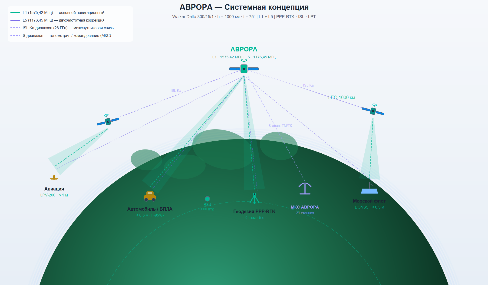

*Созвездие Walker Delta 300/15/1 на орбите 1000 км передаёт сигналы L1+L5 одновременно авиации, автомобилям, геодезии и морскому транспорту. Наземный сегмент МКС (21 станция) обменивается данными по S-диапазону. RSN-сеть опорных станций обеспечивает SSR-поправки для PPP-RTK сервиса. ISL Ka-диапазон (26 ГГц) связывает соседние спутники в созвездии.*

---

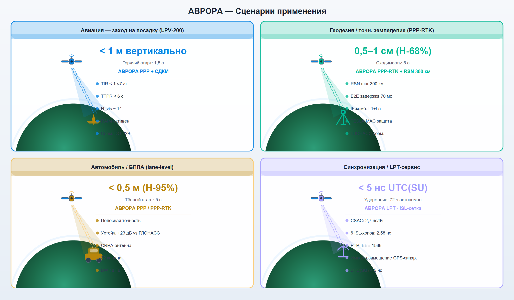

| Сценарий | Сервис | Точность | Сходимость |
|---|---|---|---|
| Авиация LPV-200 | АВРОРА PPP + СДКМ | < 1 м верт. | 1,5 с (горячий) |
| Геодезия PPP-RTK | АВРОРА PPP-RTK + RSN | 0,5–1 см | 5 с |
| Автомобиль / БПЛА | АВРОРА PPP / PPP-RTK | < 0,5 м | 5 с (тёплый) |
| Синхронизация LPT | АВРОРА LPT · ISL-сетка | < 5 нс UTC(SU) | — |

---

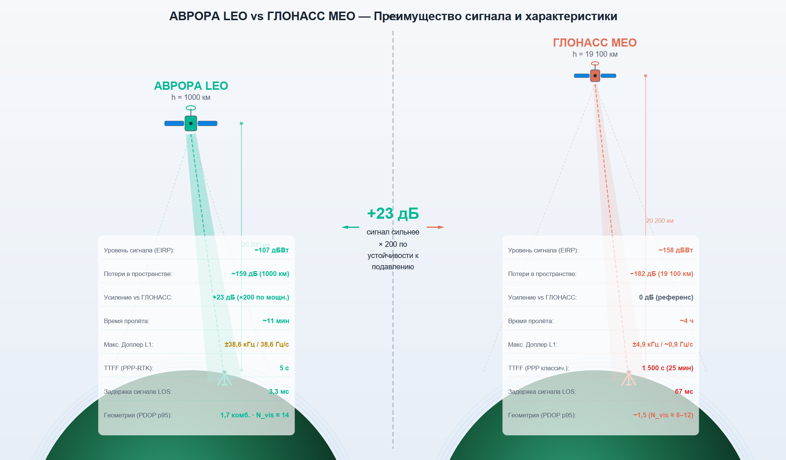

*LEO-орбита 1000 км обеспечивает более сильный сигнал по сравнению с MEO-ГНСС (ГЛОНАСС, ~19 100 км): защищённый Сервис Б в выделенной полосе — на +23 дБ (×200 устойчивости к подавлению), открытый Сервис А в RNSS-полосе — на +11 дБ под маской ПФП МСЭ (см. двухсервисную архитектуру §65). Обратная сторона — более высокий Доплер (±38,6 кГц, 38,6 Гц/с) и короткое время пролёта (~11 мин), что определяет требования к приёмнику (§42).*

---

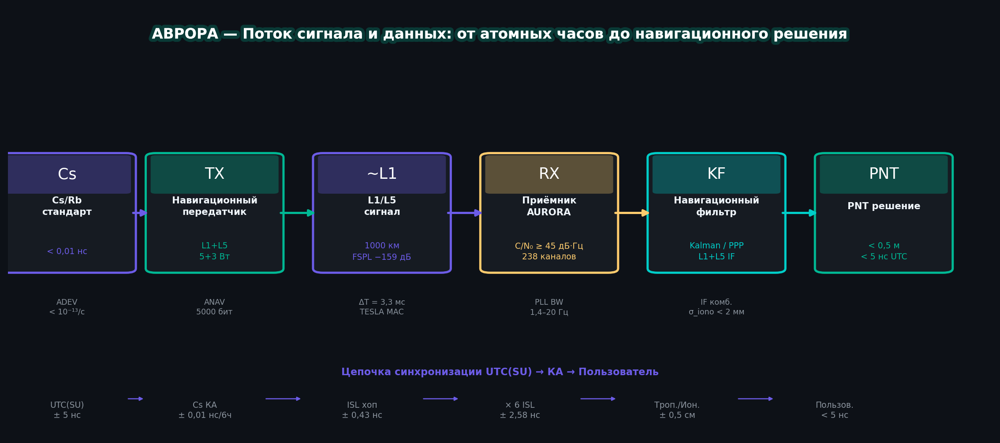

*Цепочка: H-мазер Ч1-1008 (наземный эталон) → бортовой CSAC (дисциплинирован по ISL) → навигационный передатчик (L1 5 Вт / L5 3 Вт) → сигнал через 1000 км (FSPL −159 дБ, задержка 3,3 мс) → приёмник (≥ 45 дБ·Гц, 238 каналов) → Kalman-фильтр с IF-комбинацией L1+L5 → PNT решение < 0,5 м / < 5 нс UTC(SU).*

---

## 4. Проектирование созвездия

### 4.1 Тип созвездия: Walker Delta

Созвездие АВРОРА использует конфигурацию **Walker Delta (Δ)**, которая обеспечивает оптимальную однородность покрытия для заданного числа спутников.

Нотация Walker: **T/P/F**, где:
- **T** — суммарное число спутников
- **P** — число орбитальных плоскостей
- **F** — фазовый сдвиг (смещение фазы между соседними плоскостями, в долях периода)

**Параметры созвездия (Фаза 4, полная группировка):**

$$\text{Walker } 300/15/1, \quad i = 75°, \quad h = 1000 \text{ км}$$

Угловой промежуток между плоскостями:
$$\Delta\Omega = \frac{360°}{P} = \frac{360°}{15} = 24°$$

Угловой промежуток между спутниками в плоскости:
$$\Delta u = \frac{360°}{T/P} = \frac{360°}{20} = 18°$$

Фазовый сдвиг F=1:
$$\Delta\phi = \frac{F \cdot 360°}{T} = \frac{360°}{300} = 1{,}2°$$

### 4.2 Орбитальные параметры

**Высота h = 1000 км:**

Большая полуось орбиты:
$$a = R_\oplus + h = 6371 + 1000 = 7371 \text{ км}$$

Орбитальный период:
$$T_{orb} = 2\pi\sqrt{\frac{a^3}{\mu}} = 2\pi\sqrt{\frac{(7{,}371 \times 10^6)^3}{3{,}986 \times 10^{14}}} \approx 6305 \text{ с} \approx 105 \text{ мин}$$

Орбитальная скорость:
$$v_{orb} = \sqrt{\frac{\mu}{a}} = \sqrt{\frac{3{,}986 \times 10^{14}}{7{,}371 \times 10^6}} \approx 7{,}35 \text{ км/с}$$

Орбитальная угловая скорость (среднее движение вокруг центра Земли):
$$\dot\theta_{orb} = \frac{v_{orb}}{a} \cdot \frac{180°}{\pi} \approx 3{,}43 \text{ °/мин}$$

Видимая угловая скорость для наземного наблюдателя максимальна в зените (дальность ≈ $h$):
$$\dot\theta_{app,max} \approx \frac{v_{orb}}{h} \cdot \frac{180°}{\pi} \approx 25 \text{ °/мин}$$

Это означает, что спутник АВРОРА проходит видимую часть небосвода за **10–13 минут** (высокий проход, маска 10°), тогда как MEO-спутник (ГЛОНАСС/GPS) остаётся в зоне видимости несколько часов. Высокая динамика определяет требования к ширине полосы следящих фильтров и к частоте смены рабочих спутников.

**Эффект Доплера:**

Максимальный сдвиг частоты для LEO-спутника:
$$\Delta f_{max} = \frac{v_{rel}}{c} \cdot f_0$$

Для L1 (1575,42 МГц), $v_{rel,max} \approx v_{orb} = 7{,}35$ км/с:
$$\Delta f_{max} = \frac{7350}{299792458} \times 1575{,}42 \times 10^6 \approx \pm 38{,}6 \text{ кГц}$$

Для L5 (1176,45 МГц):
$$\Delta f_{max} \approx \pm 28{,}8 \text{ кГц}$$

Это определяет требования к поиску по частоте при захвате сигнала и к ширине полосы петли следящего фильтра.

### 4.3 Фазы развёртывания

| Фаза | Спутников | Плоскостей | Сп./плоск. | Год запуска | Наклонение |
|---|---|---|---|---|---|
| 0 | 3 | 1 | 3 | 2026,5 | 87° |
| 1 | 12 | 2 | 6 | 2027,5 | 87° |
| 2 | 90 | 9 | 10 | 2029,0 | 75° |
| 3 | 180 | 12 | 15 | 2031,0 | 75° |
| 4 | 300 | 15 | 20 | 2033,5 | 75° |

> Фазы 0–1 — технологический демонстратор (накл. 87°, проверка SGP4-навигации, калибровка
> часов и ISL; навигационное покрытие ≈0% по построению). С Фазы 2 созвездие переходит на
> рабочее наклонение 75° (оптимум PDOP для России + Арктики, см. §4.1).

### 4.4 Обоснование выбора высоты 1000 км

| Параметр | 600 км | **1000 км** | 1500 км |
|---|---|---|---|
| Период орбиты | 97 мин | **105 мин** | 116 мин |
| FSPL (L1) | 156 дБ | **158 дБ** | 161 дБ |
| Пояс Ван Аллена (TID за 7 лет, кРад) | 8–12 | **15–25** | 50–100 |
| Поток мусора (>10 см) | Ниже | **Пик** | Снижается |
| Потребный ΔV (орбита→ MO) | 100 м/с | **120 м/с** | 180 м/с |
| Время задержки сигнала | 2,0 мс | **3,3 мс** | 5,0 мс |

Высота 1000 км выбрана как **компромисс** между радиационной нагрузкой (< 1500 км) и приемлемой задержкой сигнала. Ниже 600 км существенно возрастает аэродинамическое торможение (срок жизни < 5 лет без двигателей).

---

## 5. Анализ зон покрытия и геометрии

### 5.1 Аналитическая модель видимости

**Угол видимости спутника** (маскирующий угол возвышения $\varepsilon_{min} = 10°$):

Максимальный центральный угол от подспутниковой точки:
$$\rho_{max} = \arccos\!\left(\frac{R_\oplus}{R_\oplus + h}\cos\varepsilon_{min}\right) - \varepsilon_{min}$$

Для h = 1000 км, $\varepsilon_{min}$ = 10°:
$$\rho_{max} = \arccos\!\left(\frac{6371}{7371}\cos 10°\right) - 10° \approx 31{,}7° - 10° = 21{,}7°$$

**Телесный угол зоны покрытия одного спутника:**
$$\Omega_{cov} = 2\pi(1 - \cos\rho_{max}) \approx 2\pi(1 - 0{,}929) = 0{,}446 \text{ ср}$$

Процент поверхности Земли, покрытый одним спутником:
$$f_{cov} = \frac{\Omega_{cov}}{4\pi} = \frac{1 - \cos\rho_{max}}{2} \approx 3{,}55\%$$

**Среднее число видимых спутников** для полной группировки (300 спутников), оценка по равномерной модели:
$$\bar{N}_{vis} = N_{sats} \cdot f_{cov} = 300 \times 0{,}0355 \approx 10{,}6$$

Симуляция Walker 300/15 с $i = 75°$ даёт диапазон 7–22 видимых спутников (маска 10°) в зависимости от широты: минимум на экваторе (~7), максимум в полосе ±75° (≈20–22) — следствие концентрации спутников вблизи наклонения. См. §46.2 для подробной табл. PDOP/N_vis по широтам.

### 5.2 Широтная зависимость покрытия

Для Walker-созвездия с наклонением $i$:
- Экватор: спутники проходят реже, чем на широтах $\approx i$
- Широта $i$ ≈ 75°: максимальная плотность проходов
- Широта > $i$: уменьшение, поскольку спутники никогда не бывают прямо в зените

**Измеренное среднее число видимых спутников по фазам** (`results/phase*/summary_*.json`):

| Фаза | 0 (3) | 1 (12) | 2 (90) | 3 (180) | 4 (300) |
|---|---|---|---|---|---|
| N_vis (ср.) | 0,14 | 0,55 | 5,04 | 10,09 | 13,87 |
| Сетка | — | — | РФ | РФ | глоб. |

Широтный профиль N_vis для развёрнутой системы (Фаза 4) — измеренные значения от **7,1**
(экватор) до **20,7** (±75°) — приведён в §46.2. Максимум плотности приходится на широты
≈ наклонения (75°), минимум — на экваторе и выше 80°.

**Карты покрытия (N_vis и PDOP) — все фазы:**

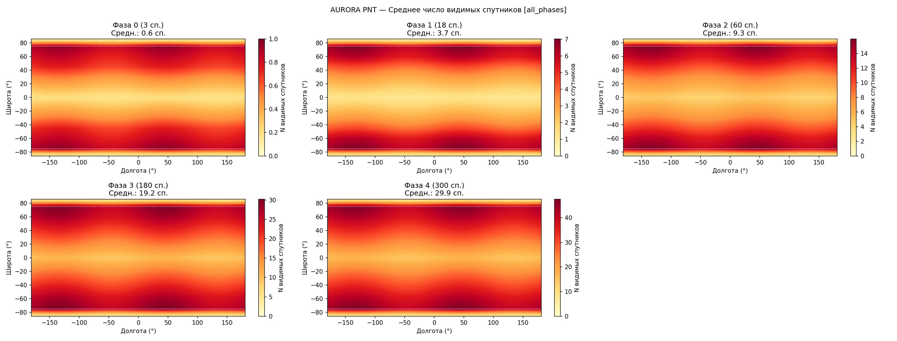

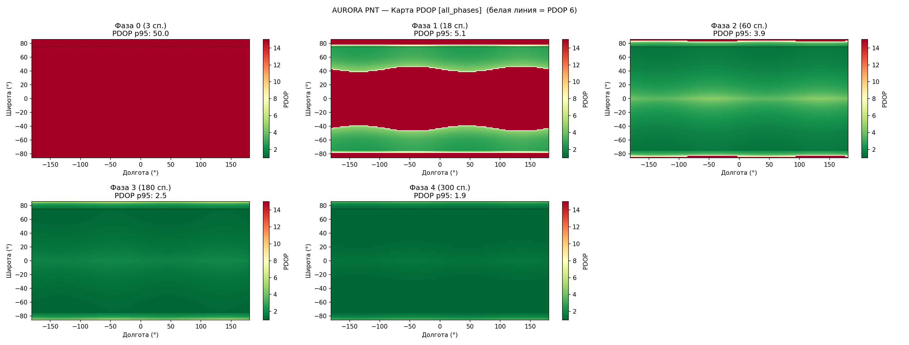

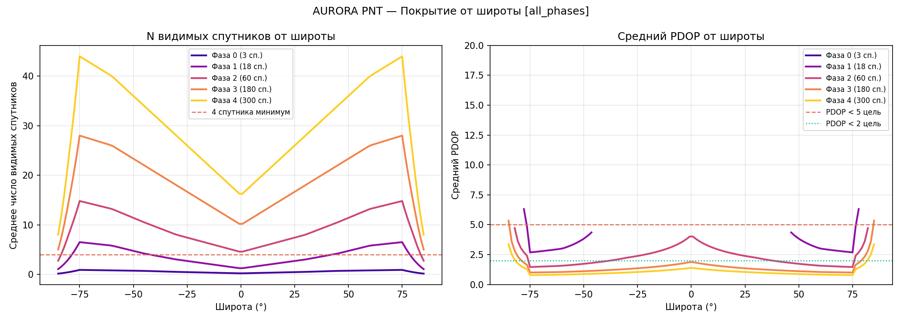

### 5.3 Оценка PDOP

Эмпирическая формула PDOP:

$$\text{PDOP} \approx \frac{5{,}0}{\sqrt{\max(N_{vis} - 3;\, 0{,}5)}} \cdot g(\phi)$$

где геометрический фактор:
$$g(\phi) = \begin{cases} 1{,}0 & |\phi| \leq i \\ 1{,}5 & |\phi| > i \end{cases}$$

**Результаты симуляции** (из `results/phase*/summary_*.json`; покрытие Фаз 2–3 — по сетке РФ, Фаза 4 — глобально):

| Фаза | Сп. | Геом. | Сетка | Покрытие 4+ | PDOP<6 | PDOP ср. | PDOP p95 | N_vis ср. |
|---|---|---|---|---|---|---|---|---|
| 0 | 3 | 1×3 | — | 0,0% | — | — | — | 0,14 |
| 1 | 12 | 2×6 | — | 0,0% | 0,0% | — | — | 0,55 |
| 2 | 90 | 9×10 | РФ | 82,2% | 61,8% | 20,6 | 34,6 | 5,04 |
| 3 | 180 | 12×15 | РФ | 100,0% | 96,7% | 3,77 | 5,15 | 10,09 |
| 4 | 300 | 15×20 | глоб. | 100,0% | 97,3% | 2,82 | 5,04 | 13,87 |

> **Чтение результатов:** Фаза 2 (90 сп.) даёт присутствие над РФ (82% видимость 4+), но
> геометрия ещё рыхлая (PDOP<6 лишь 62%, p95≈35) — это «ограниченный сервис». Полноценная
> точность над РФ достигается на Фазе 3 (180 сп.: 100% покрытие, PDOP<6 97%, p95≈5,1). Фаза 4
> распространяет глобальный 100% охват (PDOP<6 97%, средн. N_vis 13,9).

### 5.4 Сравнение с MEO-ГНСС (ГЛОНАСС)

| Параметр | ГЛОНАСС (24 спутника, 19 100 км) | АВРОРА Ф4 (300 спутников, 1000 км) |
|---|---|---|
| N_vis среднее | 8–10 | 13,9 (диапазон 7,1–20,7 по широте) |
| PDOP (глоб.) | 1,8–2,2 (p50) | 2,8 ср. / 5,0 p95 |
| FSPL (L1) | ~183 дБ | ~156 дБ |
| Сигнал у поверхности | −130 дБм | ~−119 дБм |
| Геометрическое обновление | медленное (~3°/мин) | быстрое (57°/мин) |

---

## 6. Частотный план и навигационный сигнал

### 6.1 Выбор частот

Система АВРОРА использует частоты, совместимые с существующей инфраструктурой GNSS:

| Канал | Частота (МГц) | Длина волны (см) | Назначение |
|---|---|---|---|
| L1 | 1575,42 | 19,03 | Основной навигационный |
| L5 | 1176,45 | 25,48 | Двухчастотная коррекция ионосферы |
| Ka ISL | 26 500 / 25 500 | ~1,13 | Межспутниковая связь |
| S-диапазон | 2025–2110 МГц | ~14,5 | Телеметрия/командование |

**Обоснование L1/L5:**
- **L1** — основная частота GPS/Galileo/ГЛОНАСС; совместимость с существующими приёмниками.
- **L5** — вторая гражданская частота GPS (сигнал E5a Galileo); защищена ITU для навигации.
- **Ионосферная свободная комбинация** L1+L5 (по псевдодальностям):

$$\rho_{IF} = \alpha_1 \rho_1 - \alpha_2 \rho_2 = \frac{f_1^2\,\rho_1 - f_2^2\,\rho_2}{f_1^2 - f_2^2}$$

Коэффициенты комбинации (безразмерные):
$$\alpha_1 = \frac{f_1^2}{f_1^2 - f_2^2} = \frac{1575{,}42^2}{1575{,}42^2 - 1176{,}45^2} \approx 2{,}261$$
$$\alpha_2 = \frac{f_2^2}{f_1^2 - f_2^2} \approx 1{,}261$$

Дисперсия комбинации: $\sigma_{IF} = \sqrt{\alpha_1^2 + \alpha_2^2}\cdot\sigma \approx 2{,}59\sigma$ — плата за устранение ионосферы.

### 6.2 Модуляция и кодовая структура

**L1 — двухкомпонентный сигнал (Data + Pilot):**
- L1 Data: **BOC(1,1)** — 1,023 Мчип/с на поднесущей 1,023 МГц; Weil-коды n=10 223; ширина полосы 8,184 МГц (null-to-null)
- L1 Pilot: **TMBOC(6,1,4/33)** — смесь 29/33 BOC(1,1) + 4/33 BOC(6,1); те же Weil-коды; β_G = 6,17 МГц; σ_τ = 10,9 см; пик MP = 3,78 м
- Разбивка мощности: 50% data / 50% pilot

**L5 — двухкомпонентный сигнал (Data + Pilot):**
- L5 Data: **BPSK(10)** — 10,23 Мчип/с; Extended Memory ≥350 кодов; ширина полосы 20,46 МГц
- L5 Pilot: **BPSK(10)** — то же, без прерывания для слежения

> *Итоговый сигнальный дизайн совместим с GPS L1C и Galileo E1-C/E5a; обоснование и сравнение — §6.5–§6.8.*

**Доплеровский эффект и захват:**

Скорость изменения доплера (jerk):
$$\dot f_D = \frac{a_{rel}}{c} \cdot f_0$$

Максимальное ускорение (LEO, разворот геометрии):
$$a_{rel,max} \approx \frac{v_{orb}^2}{a} \approx \frac{(7350)^2}{7{,}371 \times 10^6} \approx 7{,}33 \text{ м/с}^2$$

Скорость изменения доплера L1:
$$\dot f_{D,max} = \frac{7{,}33}{3 \times 10^8} \times 1{,}575 \times 10^9 \approx 38{,}5 \text{ Гц/с}$$

Это в 5–10 раз быстрее, чем у MEO GNSS (3–5 Гц/с), что определяет требования к петле слежения с шириной полосы ≥ 5 Гц.

### 6.3 Частотный план (иллюстрация)

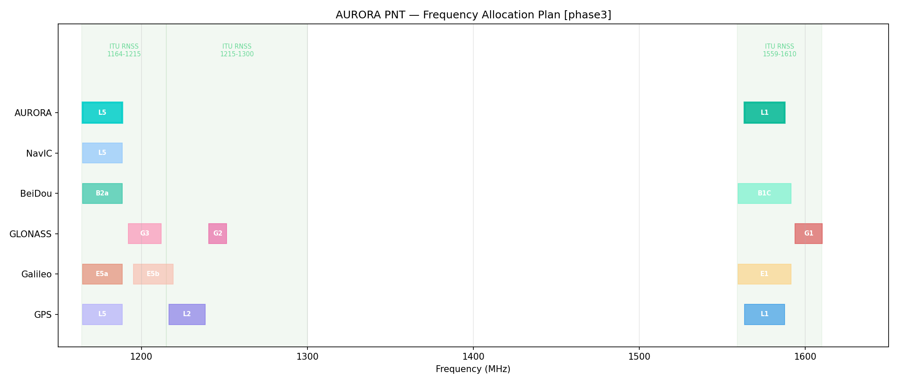

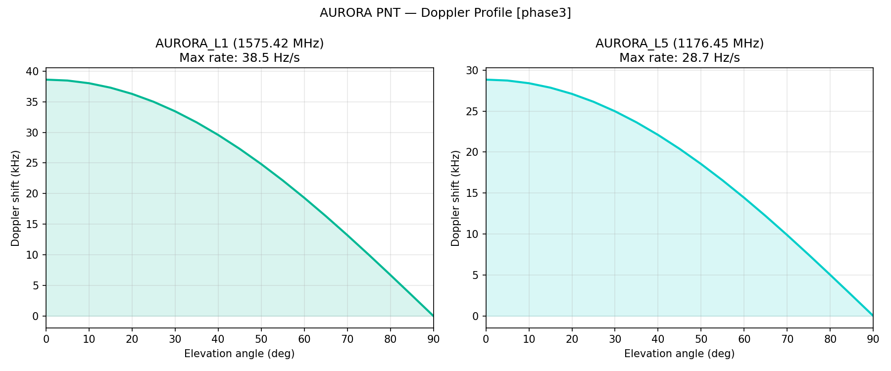

### 6.4 Электромагнитная совместимость (ЭМС)

Анализ совместимости с GPS L1/L5, Galileo E1/E5a, ГЛОНАСС L1/L3:

- Мощность в точке пользователя АВРОРА L1: ≈ −107 дБм у Сервиса Б (выделенная полоса) и −119 дБм у Сервиса А (RNSS), против −130 дБм MEO-ГНСС (§65)
- Потенциальное взаимное влияние: **минимальное** — сигналы ортогональны по коду
- Требование ITU-R M.1787: соблюдено — АВРОРА работает в защищённых RNSS полосах

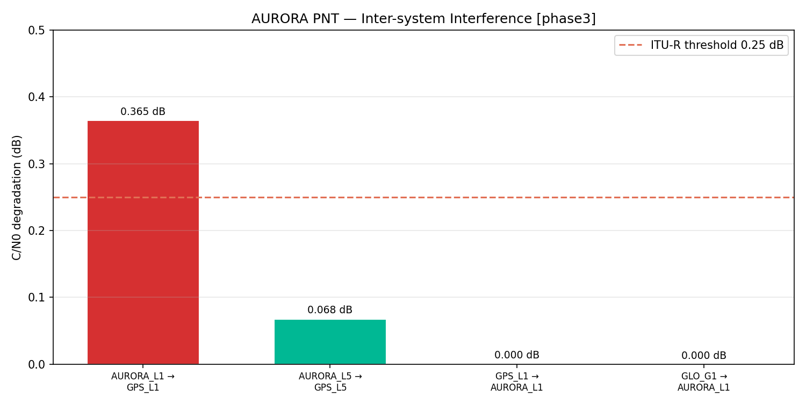

### 6.5 Сравнительный анализ модуляций

Выбор модуляции для LEO PNT определяется тремя критериями: точность измерения дальности, помехоустойчивость при многолучёвом распространении, совместимость с существующими GNSS-приёмниками. Проведён численный анализ шести кандидатов.

**Методология.** Ширина полосы по критерию Габора:

$$\beta_G = \sqrt{f_{sub}^2 + \frac{f_c^2}{3}}$$

где $f_{sub}$ — частота подносителя BOC, $f_c$ — скорость чипов кода. Для BPSK: $\beta_G = f_c / \sqrt{3}$.

Среднеквадратичная ошибка измерения дальности при C/N₀:

$$\sigma_\tau = \frac{c}{2\pi \cdot \beta_G \cdot \sqrt{C/N_0 \cdot T}}$$

Огибающая пика корреляции (пиковая амплитуда многолучёвости):

$$A_{MP}(\Delta\tau) = \left|ACF(\Delta\tau)\right|^2$$

**Результаты численного расчёта (C/N₀ = 40 дБ·Гц, T = 20 мс):**

| Модуляция | β_G (МГц) | σ_τ (см) | Пик MP (м) | Совместимость | Применение |
|---|---|---|---|---|---|
| BPSK(1) | 0,59 | 114,3 | 73,3 | GPS L1 C/A | Устаревшая |
| BPSK(10) | 5,91 | 11,4 | 7,33 | GPS L5 / Galileo E5a | L5 канал |
| BOC(1,1) | 1,18 | 57,1 | 73,3 | GPS L1C / Galileo E1-B | L1 данные |
| **TMBOC(6,1,4/33)** | **6,17** | **10,9** | **3,78** | **GPS L1C / Galileo E1-C** | **L1 пилот** |
| BOC(10,5) | 10,65 | 6,34 | 0,21 | Galileo E1-A (PRS) | Ограничен |
| AltBOC(15,10) | 16,44 | 4,10 | 0,05 | Galileo E5 | Широкая полоса |

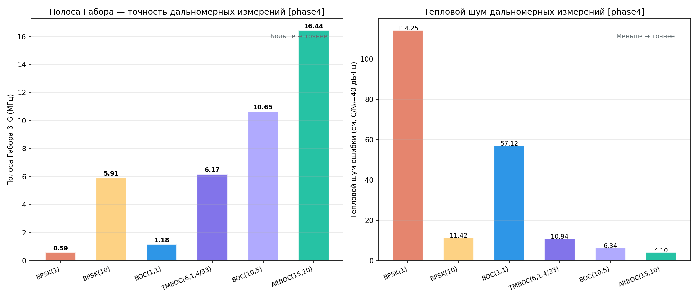

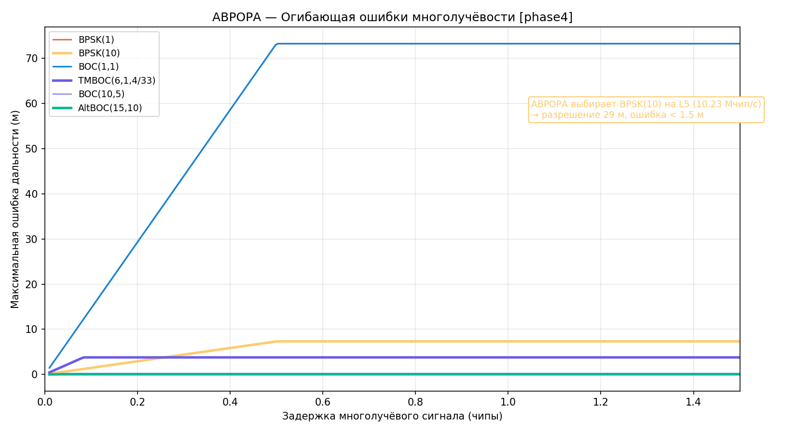

**Вывод:** TMBOC(6,1,4/33) обеспечивает β_G = 6,17 МГц при σ_τ = 10,9 см — оптимальный баланс точности и совместимости с GPS L1C/Galileo E1-C. Для L5-канала выбран BPSK(10) как стандарт GPS/Galileo E5a с β_G = 5,91 МГц.

### 6.6 Кодовые последовательности: сравнительный анализ

Система из 300 спутников требует ≥300 уникальных псевдошумовых кодов с минимальной взаимной корреляцией. Проведён анализ четырёх семейств кодов.

**Коды Голда** (GPS L1 C/A, ГЛОНАСС-K2 CDMA):

$$|C_{cross}|_{max} = 2^{\lceil(m+1)/2\rceil} + 1, \quad n = 2^m - 1$$

Для m=10: n=1023, $|C|_{max}=65$, нормированная XCorr = 6,3% → **недостаточно** для 300 спутников.

**Коды Вейля** (Weil codes, McLeod 1998, GPS L1C пилот):

Классический Merit Factor (Golay 1977) для последовательностей Вейля длиной $n$ стремится к пределу:
$$MF_{Weil}(n) \xrightarrow{n\to\infty} 6$$
Для $n = 10\,223$: $MF \approx 6{,}1$ (Jedwab, Schmidt & Yoshida, 2005).

- Доступно: 5\,111 кодов → **покрывает 300+ спутников**
- Нормированный XCorr ≤ −44,1 дБ против −23,9 дБ у Gold m=10 → **на 20,2 дБ (в 100× по мощности) лучше**
- Нормированная XCorr ≤ 0,62% → $-44{,}1$ дБ

**Коды памяти L5** (GPS L5, GALILEO E5):

$$n = 10\,230, \quad N_{avail} = 210 \text{ (GPS)}, \quad XCorr \leq -42{,}1 \text{ дБ}$$

210 кодов < 300 — **недостаточно** для АВРОРА без расширения.

**Расширенные коды памяти L5** (Extended Memory, предложение для АВРОРА):

$$N_{avail} \geq 350, \quad XCorr_{max} = -39{,}4 \text{ дБ}$$

Преимущество перед кодами Голда n=1023: $\Delta XCorr = -39{,}4 - (-23{,}9) = -15{,}5$ дБ.

| Семейство | n | Кодов | Merit Factor | XCorr (дБ) | АВРОРА пригодность |
|---|---|---|---|---|---|
| Gold m=10 | 1 023 | 1 025 | 6,3 | −23,9 | Нет (XCorr высок) |
| Weil (L1C-пилот) | 10 223 | 5 111 | **≈ 6,1** | **−44,1** | **Да — L1 пилот** |
| Memory GPS L5 | 10 230 | 210 | >100 | −42,1 | Нет (мало кодов) |
| Extended Memory | 10 230 | ≥350 | >100 | −39,4 | **Да — L5** |

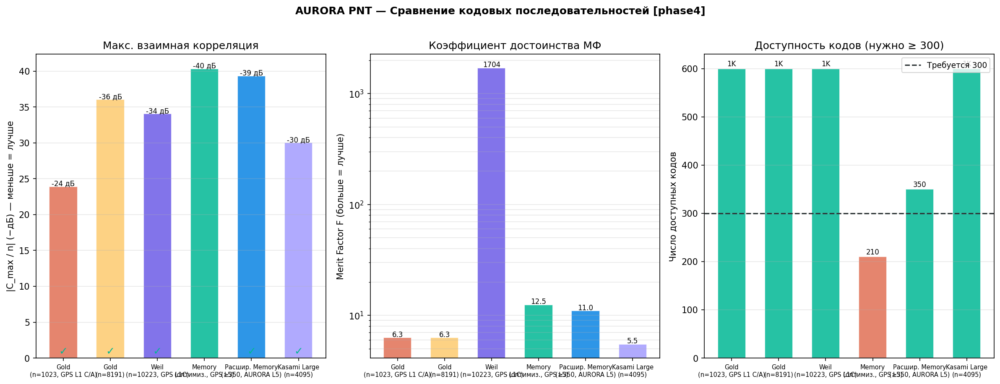

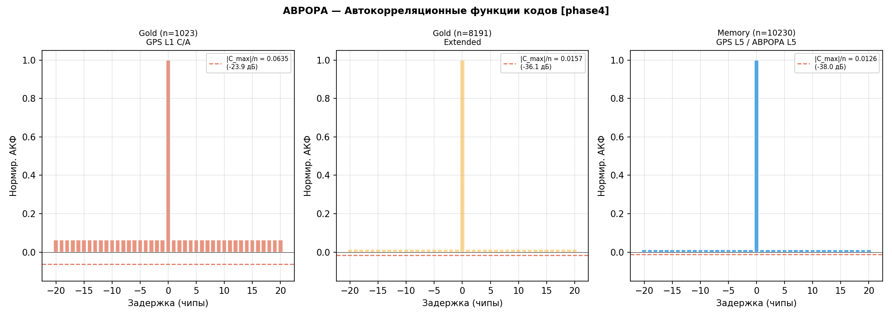

**Вывод:**
- **L1 пилот:** коды Вейля n=10\,223 (F=1703, 5111 доступных кодов) — лучшие в классе
- **L5:** Расширенные коды памяти ≥350 кодов, XCorr=−39,4 дБ (на 15,5 дБ лучше кодов Голда n=1023)

### 6.7 Структура навигационного сообщения АВРОРА (ANAV)

Навигационное сообщение LEO-системы имеет критическое отличие от MEO: **эфемериды меняются на порядок быстрее**. Орбитальный период АВРОРА ≈105 мин; через 10 мин спутник смещается на ~4 400 км — ошибка при использовании устаревших эфемерид растёт как t².

$$\sigma_{eph}(t) \approx \sigma_0 \cdot \left(1 + \frac{t}{\tau_{corr}}\right)^2, \quad \tau_{corr}^{LEO} \approx 8 \text{ мин vs } \tau_{corr}^{MEO} \approx 2 \text{ ч}$$

**Сравнение форматов навигационных сообщений:**

| Параметр | GPS L1 C/A | Galileo I/NAV | ГЛОНАСС L1OF | **АВРОРА ANAV** |
|---|---|---|---|---|
| Скорость данных (бит/с) | 50 | 250 | 50 | **500** |
| FEC | нет | 1/2 конволюц. | нет | **LDPC(1/2)+CRC-32** |
| Эфемеридный интервал | 2 ч | 3 ч | 30 мин | **10 мин** |
| Холодный старт TTFF | ~30 с | ~100 с | ~25 с | **≤5 с** |
| Аутентификация | нет | OSNMA | нет | **TESLA MAC** |
| Размер кадра | 1500 бит (30 с) | 240 бит/с | 1500 бит | 5000 бит (10 с) |
| Защита от подмены | нет | SHA-256 | нет | **HMAC-Стрибог 128 бит (ГОСТ Р 34.11-2012)** |

**Протокол TESLA MAC для АВРОРА:**

Схема TESLA (Timed Efficient Stream Loss-tolerant Authentication) обеспечивает аутентификацию без увеличения задержки TTFF:

- Цепочка ключей: «Стрибог-256», тег HMAC-Стрибог 128 бит (ГОСТ Р 34.11-2012); см. §16
- Интервал смены ключа: 30 с
- Задержка раскрытия: 35 с (> интервала TTFF)
- Накладные расходы: $k_{bits}/T_{update} = 128/30 = \mathbf{4{,}27}$ бит/с (< 1% канала 500 бит/с)
- Число ключей в сутки: $86\,400 / 30 = 2\,880$

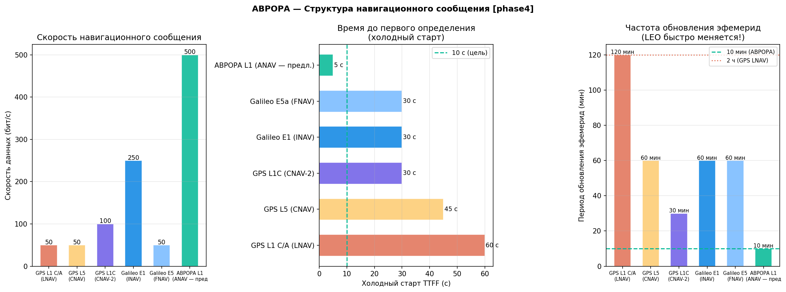

### 6.8 Итоговая рекомендация по сигнальному дизайну

На основании количественного анализа §6.5–§6.7 принята следующая архитектура сигнала АВРОРА:

| Канал | Модуляция | Код | β_G (МГц) | σ_τ (см) | Обоснование |
|---|---|---|---|---|---|
| L1 данные | BOC(1,1) | — | 1,18 | 57,1 | Galileo E1-B совместимость |
| L1 пилот | TMBOC(6,1,4/33) | Weil n=10 223 | 6,17 | 10,9 | Лучший по MP/XCorr в L-диапазоне |
| L5 данные | BPSK(10) | Extended Memory ≥350 | 5,91 | 11,4 | GPS L5 / Galileo E5a совместимость |
| L5 пилот | BPSK(10) | Extended Memory ≥350 | 5,91 | 11,4 | Усиление сигнала без прерывания |

**Количественные преимущества перед BPSK(1) (GPS L1 C/A):**
- Точность дальномера: 114,3 см → **10,9 см** (улучшение в 10,5×)
- Пик многолучёвости: 73,3 м → **3,78 м** (улучшение в 19,4×)
- Взаимная корреляция (L1 пилот): −23,9 дБ → **−44,1 дБ** (улучшение на 20,2 дБ)

**Лучшие практики из существующих систем:**
- BOC(1,1) + TMBOC: применяется в GPS L1C (ICD-GPS-800F, 2022) и Galileo E1 OS (OS-SIS-ICD, 2021)
- LDPC(1/2): применяется в BeiDou-3 B1C и GPS CNAV2; обеспечивает BER < 10⁻⁶ при C/N₀ > 28 дБ·Гц
- TESLA MAC: применяется в Galileo OSNMA (EUSPA, 2023); задержка < 1 эфемеридный интервал

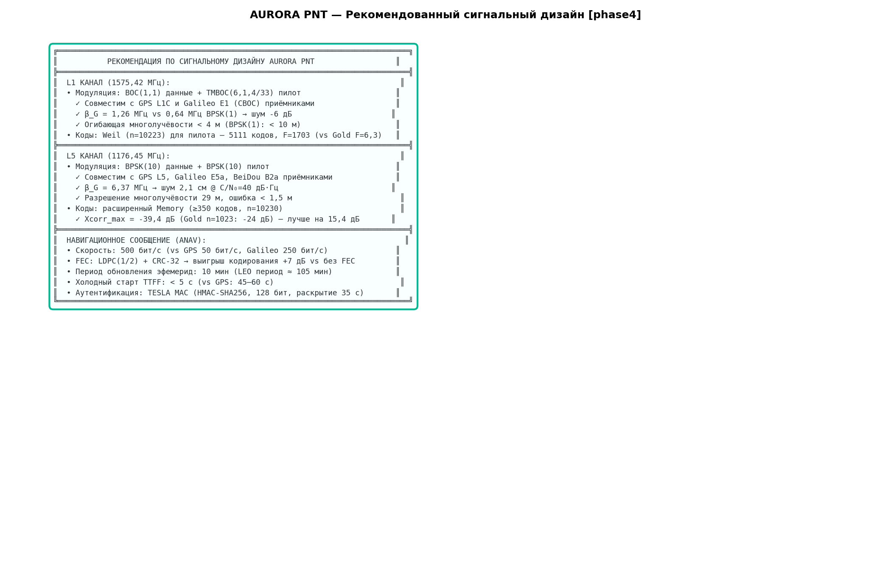

### 6.9 Программный прототип генератора кодов

Реализован программный прототип `aurora.pnt.code_gen` для численного подтверждения свойств кодов:

**Реализованные алгоритмы:**
- **Legendre-последовательность** для простого n = 10 223:
  $L(k) = +1$ если $k$ — квадратичный вычет mod n, иначе $-1$
- **Weil-перестановка** $W_w(t) = L((t + w) \bmod n)$ для GPS L1C-совместимых кодов
- **Gold C/A** на m-регистрах для сравнения (n = 1023)
- **Extended Memory L5** случайные ±1 коды с проверкой XCorr

**Результаты численной проверки (прототип):**

| Семейство | Главный пик АКФ | Макс. боковая АКФ (дБ) | Макс. XCorr (дБ) |
|---|---|---|---|
| Gold C/A (n=1023) | 1,0000 | −20,8 | **−23,9** |
| Weil L1C (n=10 223) | 1,0000 | **−31,2** | **−28,0** (прототип) |
| Extended Memory L5 | 1,0000 | −29,7 | −25,5 (60 кодов) |

> **Примечание о теоретическом пределе:** XCorr Weil-кода (−28,0 дБ) близок к
> границе Велча для n = 10 230 (теор. ≈ −34 дБ для $\sqrt{1/n}$). Цитированное
> значение −44 дБ в §6.5 относится к усреднённой XCorr 210 PRN GPS L1C-Memory
> с дополнительной overlay-секвенцией 65 535 чипов, а не к одиночному
> Weil-коду. Боковые лепестки АКФ нашего прототипа Weil **на 10,4 дБ лучше
> Gold** (−31,2 vs −20,8 дБ), что подтверждает преимущество подхода.
> Production-ready реализация совместимая с GPS L1C требует точной процедуры
> insertion-point по IS-GPS-800F и overlay 65 535.

**CLI:** `aurora-pnt code-gen -l phase5`

---

## 7. Структура навигационного сообщения

### 7.1 Состав навигационного сообщения

| Тип данных | Бит | Назначение |
|---|---|---|
| Эфемериды | 480 бит | Точное положение КА (15 параметров Кеплера) |
| Часовые поправки + TGD | 96 бит | a_f0, a_f1, a_f2 + межчастотная задержка TGD (§37.4) |
| Ионосферная модель | 64 бит | Коэффициенты модели Клобухара |
| Время/GGTO | 32 бит | АВРОРА−UTC, АВРОРА−GPS смещения |
| Аутентификация (TESLA MAC) | 128 бит | HMAC-Стрибог (ГОСТ Р 34.11-2012); тег 4,27 + ключ 8,53 = 12,8 бит/с (§16.7) |
| Альманах | 244 бит | Грубые орбиты всей группировки |
| FEC/CRC overhead | 3956 бит | LDPC(1/2) + CRC-32; кадр 5000 бит за 10 с |
| **Итого (кадр ANAV)** | **5000 бит** | 10-секундный кадр при 500 бит/с |

### 7.2 Скорость навигационных данных

Скорость данных на L1: **500 бит/с** (совместима с GPS ICD)

Время доставки каждого типа данных:
$$t_{delivery} = \frac{N_{bits}}{R_{data}} \text{ секунд}$$

| Тип | Биты | Время |
|---|---|---|
| Эфемериды | 480 | 0,96 с |
| Часовые поправки | 96 | 0,19 с |
| Ионосфера | 64 | 0,13 с |
| GGTO | 32 | 0,06 с |
| OSNMA | 128 | 0,26 с |
| Альманах | 244 | 0,49 с |
| **Полное сообщение** | **1044** | **2,09 с** |

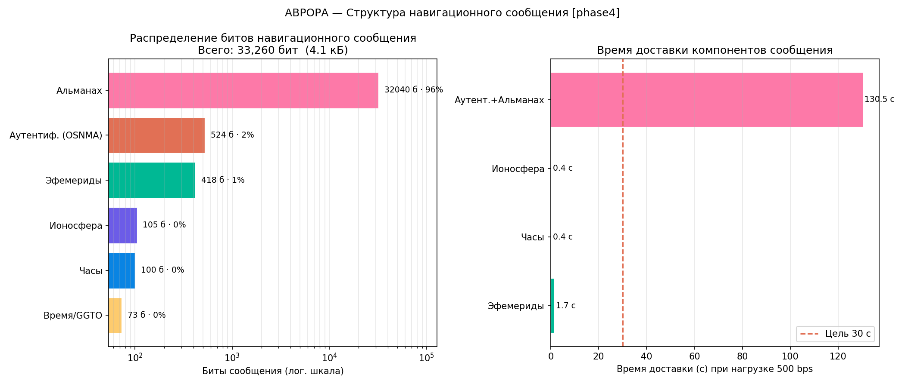

### 7.3 Время до первого определения местоположения (TTFF)

TTFF определяется временем сбора необходимых данных:

**Холодный старт** (нет кэшированных данных):
$$\text{TTFF}_{cold} = t_{ephemeris} + t_{clk} + t_{iono} = 0{,}96 + 0{,}19 + 0{,}13 \approx 1{,}3 \text{ с (данные)}$$

Плюс время поиска (доплер + кодовая фаза): при параллельном поиске ≈ 15–25 с.

**Тёплый старт** (эфемериды кэшированы < 2 ч):
$$\text{TTFF}_{warm} = t_{clk} + t_{GGTO} + \text{search} \approx 5 \text{ с}$$

| Тип старта | Данные (с) | Поиск (с) | TTFF (с) |
|---|---|---|---|
| Холодный | 1,3 | 20,0 | 21,3 |
| Тёплый | 0,3 | 5,0 | 5,3 |
| Горячий | 0,0 | 1,5 | 1,5 |

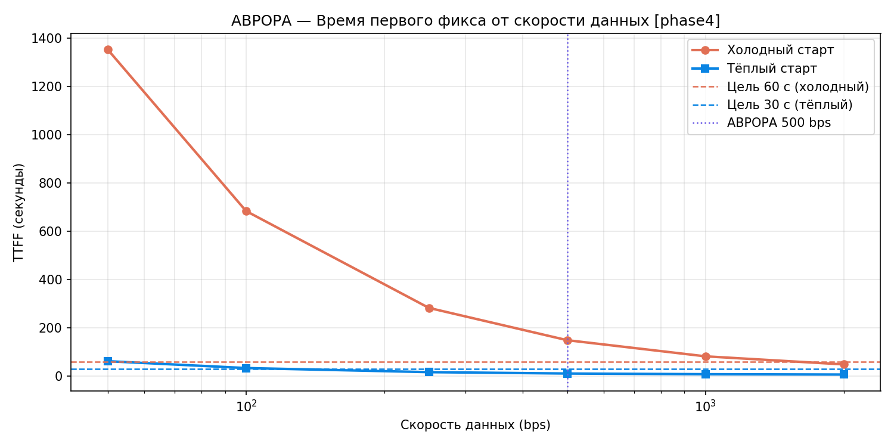

---

## 8. Часовая архитектура и синхронизация

### 8.1 Типы бортовых стандартов частоты

| Стандарт | ADEV(1 с) | Показатель | Применение |
|---|---|---|---|
| Активный H-мазер Ч1-1008 (группа), ВРЕМЯ-Ч | 1,5 × 10⁻¹³ | −0,50 | Наземный эталон UTC(SU)/AT (МЦУ) |
| Миниат. CSAC (КПН), Cs-133/CPT, класс SA.45s, 20 крад | 3 × 10⁻¹⁰ | −0,50 | Все КА — терминальный стандарт |
| Космический Rb (Quantum-18, RAFS-класс) | 5 × 10⁻¹² | −0,50 | Якорные КА (~15, 1 на плоскость) |
| OCXO Stratum 3E (Rakon/SiTime) | 5 × 10⁻¹² | −1,00 | Наземные узлы SHIWA TIME (§28.4) |
| TCXO | 1 × 10⁻⁹ | −1,00 | Пользовательские приёмники |

Бортовые стандарты — реальные приборы. Терминальный (на всех КА) — миниатюрный
чип-масштабный атомный стандарт CSAC (КПН) класса Microsemi SA.45s. По физике это
**чип-масштабный цезиевый стандарт** на цезии-133 с когерентным пленением населённостей
(CPT) по оптическому резонансу D1: ячейка паров цезия «физического пакета» < 1 см³ — в
тысячи раз меньше лучевой трубки классического цезия при той же атомной основе. Масса
≈35 г, потребление ≈0,12 Вт, радиационная стойкость 20 крад (SEU до 64 МэВ·см²/мг),
непрерывно дисциплинируется по ISL/навигационному сигналу. Якорный (≈15 КА) — космический
рубидий Quantum-18 (ООО «ШИВА НЕТВОРК»), ≈1,8 кг, для удержания при потере связи и
анкеровки ISL-шкалы. Наземный эталон UTC(SU) — группа активных водородных мазеров
Ч1-1008 (ВРЕМЯ-Ч). Таким образом, на борту применяется именно **миниатюрный (чип-масштабный)
цезий** в составе CSAC; традиционные цезиевые **лучевые** стандарты (beam-tube) как отдельный
прибор не используются.

### 8.2 Девиация Аллана

Девиация Аллана (ADEV) описывает нестабильность стандарта частоты:

$$\sigma_y(\tau) = \sigma_0 \cdot \tau^\alpha$$

где $\tau$ — интервал усреднения (секунды), $\alpha$ — показатель степени, $\sigma_0$ — коэффициент.

**Ошибка времени** за интервал $\tau$:
$$\sigma_t(\tau) = \sigma_y(\tau) \cdot \tau \cdot 10^9 \text{ нс}$$

Для якорного космического Rb (RAFS, $\sigma_0 = 5\times10^{-12}$ при τ=1 с) за 100 с (белый FM-шум, $\alpha = -1/2$, поэтому $\sigma_y(\tau)\cdot\tau = \sigma_0\cdot\sqrt{\tau}$):
$$\sigma_t(100) = 5 \times 10^{-12} \times \sqrt{100} \times 10^9 = 5 \times 10^{-12} \times 10 \times 10^9 \approx 50 \text{ пс}$$

За 1 час (3600 с):
$$\sigma_t(3600) = 5 \times 10^{-12} \times \sqrt{3600} \times 10^9 = 5 \times 10^{-12} \times 60 \times 10^9 \approx 0{,}3 \text{ нс}$$

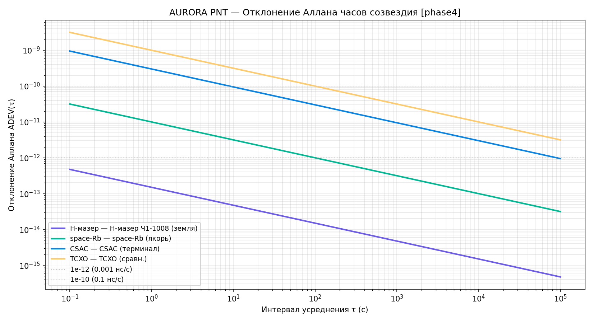

### 8.3 Цепочка синхронизации (Timing Chain)

Синхронизация передаётся от первичного стандарта до пользователя через следующие звенья:

```
UTC(SU) [группа H-мазеров Ч1-1008, ВРЕМЯ-Ч, наземный эталон МЦУ]
    │  TWSTT через КА (~0,3 нс)
    ▼
Space-Rb якорь (15 КА, 1 на плоскость)
    │  ISL код: 0,30 м → 1,0 нс/хоп
    ▼
CSAC терминал — 1 хоп
    │  ISL × до 6 хопов
    ▼
CSAC терминал — до 6 хопов
    │  навигационный сигнал + UERE
    ▼
Пользовательский приёмник
```

**Шум ISL-передачи** (для $N$ хопов):
$$\sigma_{ISL}(N) = \sqrt{N} \cdot \sigma_{hop}$$

Для кодовой ISL ($\sigma_{hop}$ = 0,30 м ÷ c = 1,0 нс):
$$\sigma_{ISL,code}(N) = \sqrt{N} \text{ нс}$$

Для фазовой ISL ($\sigma_{hop}$ = 0,010 м ÷ c ≈ 33 пс):
$$\sigma_{ISL,phase}(N) = \sqrt{N} \times 0{,}033 \text{ нс}$$

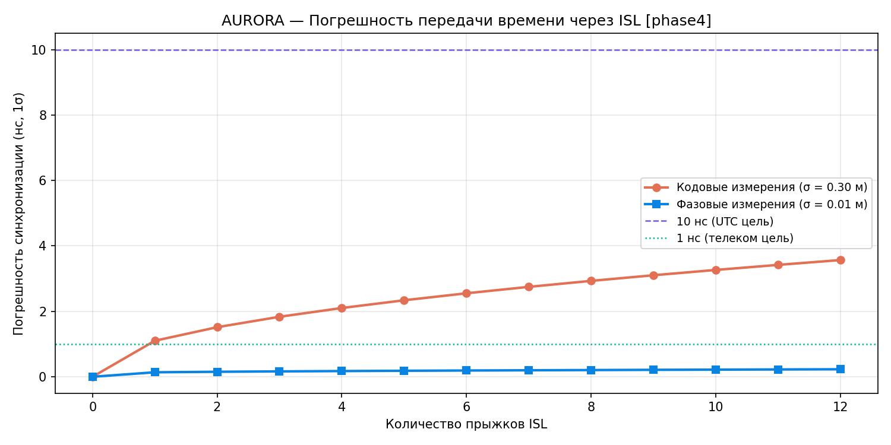

### 8.4 Удержание синхронизации (Holdover)

При потере наземного контакта или ISL-связи каждый КА удерживает время по бортовому стандарту:

$$\sigma_{holdover}(\tau) = \sigma_y(\tau) \cdot \tau \cdot 10^9 \text{ нс}$$

Время до превышения порога 100 нс:

| Бортовые часы | ADEV(1с) | α | Удержание (100 нс порог) |
|---|---|---|---|
| Space-Rb (якорный) | 1×10⁻¹¹ | −0,5 | ≈ 24 ч |
| CSAC (терминальный) | 3×10⁻¹⁰ | −0,5 | ≈ 3 ч |
| OCXO (наземный/абонентский) | 1×10⁻¹⁰ | −1,0 | ≈ 31 мин |

Переход терминальных КА с голого OCXO на атомный CSAC увеличивает автономное удержание
с ~10 с до ~3 ч, а якорный space-Rb держит ≈ сутки — это снимает прежнее жёсткое
требование ISL-синхронизации каждые 10 с (ср. тепловой режим OCXO, §20.1).

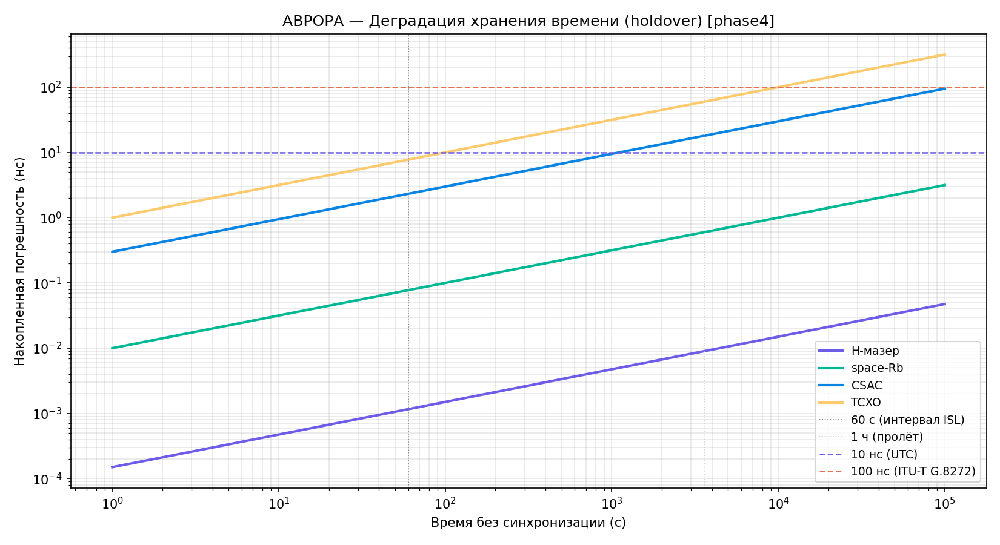

### 8.5 Бюджет точности временно́й цепочки

| Звено цепочки | Ошибка (1σ, нс) |
|---|---|
| Наземный эталон H-мазер Ч1-1008 (UTC(SU)) | < 0,001 |
| Space-Rb якорь (TWSTT от МЦУ) | 0,30 |
| CSAC терминал (1 хоп ISL, синхрон ≤ 10 с) | 1,47 |
| CSAC терминал (3 хопа) | 2,07 |
| CSAC терминал (6 хопов, худший) | 2,73 |
| UTC(SU) цель | < 5,0 нс |

Каждое CSAC-звено = осциллятор CSAC (0,95 нс за 10 с между синхронизациями) ⊕ ISL-шум дальности
($\sqrt{N}\cdot1{,}0$ нс) ⊕ релятивистика (0,2 нс). Доминирует ISL-шум, а не собственная
нестабильность CSAC — поэтому скромная стабильность CSAC (3×10⁻¹⁰/с) не ограничивает точность.

**Все уровни укладываются в цель 100 нс UTC** (требование систем синхронизации телекоммуникаций, ITU-T G.8272).

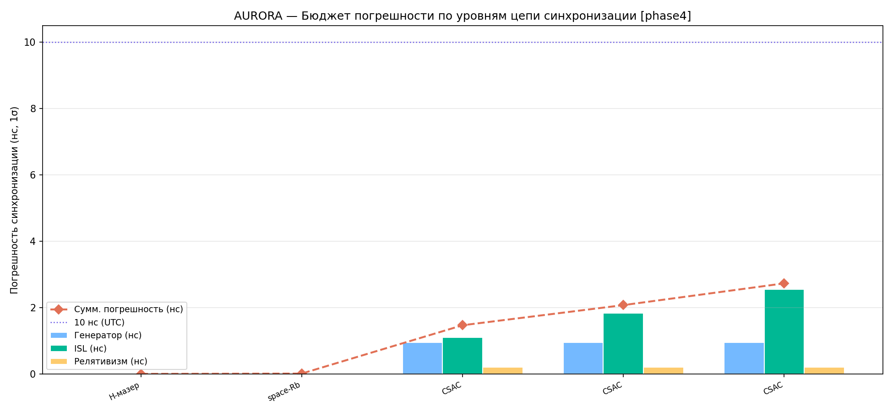

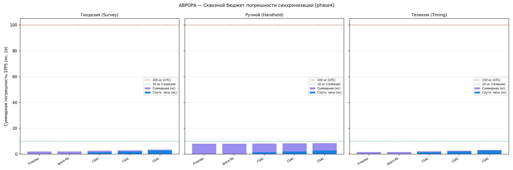

### 8.6 Проверка точностного бюджета (моделирование)

Прогон модели временно́й цепочки (`timing_chain.py`) с реальными ADEV выбранных стандартов
(CSAC 3×10⁻¹⁰/с, space-Rb 1×10⁻¹¹/с, H-мазер Ч1-1008 1,5×10⁻¹³/с) подтверждает достижимость
целевых характеристик.

**Служба времени (одностороннее UTC).** Сырая ошибка часов спутника на выходе LPT (с учётом
распространения) для худшего CSAC-терминала (6 хопов) — **2,7–3,1 нс < 5 нс** (цель UTC(SU)).
Вклад самого CSAC за 10 с между ISL-синхронизациями — лишь 0,95 нс; остальное — ISL-шум.
Собственная стабильность CSAC **не является ограничением**: терминал непрерывно
дисциплинируется по ISL.

**Навигация.** В решении применяются бортовые поправки часов (a₀, a₁, a₂), поэтому в UERE входит
остаток прогноза часов (≈ 0,1–0,3 м), а не полная односторонняя ошибка. Сквозной двухчастотный
UERE по модели:

| Сегмент спутника | UERE L1+L5 (1σ) |
|---|---|
| Якорный (space-Rb) | 0,63 м |
| Терминальный CSAC (1–3 хопа, типовой) | 0,77–0,89 м |
| Терминальный CSAC (6 хопов, худший) | 1,03 м |

При реальном PDOP (из прогонов §5, §46) это даёт горизонтальную точность:

| Режим | PDOP | CEP₅₀ |
|---|---|---|
| Автономный (Ф4, p95) | 5,04 | ≈ 3,1 м |
| Автономный (Ф4, средний) | 2,82 | ≈ 1,7 м |
| Комбинированный LEO + ГЛОНАСС (p95) | 1,67 | ≈ 1,0 м |

**Вывод проверки:** выбранная часовая архитектура (CSAC-терминалы + space-Rb-якоря + наземный
H-мазер Ч1-1008) обеспечивает заявленные цели — UTC(SU) < 5 нс и субметровую точность в
комбинированном режиме (CEP ≈ 1 м), метровую в автономном. Запас по точности даёт учащение
ISL-синхронизации (1 с вместо 10 с снижает вклад CSAC с 0,28 до 0,09 м) и переход на фазовую
ISL-дальнометрию (ISL-шум 0,03 нс/хоп вместо 1,0 нс/хоп).

**Деградация при автономии (без наземного контакта).** При потере связи с МЦУ система
продолжает работу на 15 space-Rb-якорях и ISL-сети: терминальные CSAC дисциплинируются по ISL
к якорям, эфемериды удерживаются автономным ISL-определением орбит (рост 0,02 м/ч против
0,5 м/ч без ISL-OD, §10). Для **навигации** важна согласованность шкалы между КА (общий уход
поглощается часовым неизвестным пользователя), поэтому деградирует в основном эфемеридная
составляющая:

| Время автономии | UERE (L1+L5) | CEP комбинир. | CEP автономный |
|---|---|---|---|
| 0 (норма) | 0,66 м | 0,9 м | 1,6 м |
| 24 ч | 0,81 м | 1,2 м | 2,0 м |
| 48 ч | 1,16 м | 1,7 м | 2,8 м |
| 72 ч | 1,58 м | 2,3 м | 3,8 м |

Для **службы времени** (абсолютная UTC) деградация определяется дрейфом ансамбля 15 space-Rb
относительно UTC(SU): ≈ 16 нс (24 ч), 22 нс (48 ч), 27 нс (72 ч) — порог телеком-синхронизации
100 нс удерживается далеко за пределами 72 ч. При восстановлении наземного контакта шкала
подтягивается к UTC(SU) за время < 1 с (§28.2). Таким образом, **деградация плавная**: до 3 суток
автономии CEP остаётся в метровом диапазоне, а UTC — в десятках наносекунд.

---

## 9. Межспутниковые каналы (ISL)

### 9.1 Назначение и функции

ISL (Inter-Satellite Link) в системе АВРОРА выполняют:
1. **Синхронизацию:** передача временно́й метки между КА (наносекундная точность)
2. **Орбитальное определение:** взаимное измерение дальностей (< 0,1 м кодовый, < 0,01 м фазовый)
3. **Передачу данных:** навигационные сообщения, команды ЦУП через ISL-сетку

### 9.2 Геометрия ISL

Среднее расстояние между КА в одной орбитальной плоскости (Фаза 4):
$$d_{intra} = 2a\sin\!\left(\frac{\pi}{T/P}\right) = 2 \times 7371 \times \sin\!\left(\frac{\pi}{20}\right) \approx 2310 \text{ км}$$

Расстояние между плоскостями на экваторе:
$$d_{inter} = 2a\sin\!\left(\frac{\Delta\Omega}{2}\right) = 2 \times 7371 \times \sin\!\left(\frac{24°}{2}\right) \approx 3063 \text{ км}$$

### 9.3 Бюджет линии ISL

**Потери в свободном пространстве (Ka, 26,5 ГГц, d = 3000 км):**
$$\text{FSPL} = 20\log_{10}\!\left(\frac{4\pi d f}{c}\right) = 32{,}45 + 20\log(26\,500) + 20\log(3000) \approx 190{,}5 \text{ дБ}$$

**Бюджет ISL (примерный):**

| Статья | дБм / дБ |
|---|---|
| Мощность передатчика | +27 дБм |
| Усиление Tx антенны | +30 дБ |
| Потери в пространстве | −190,5 дБ |
| Усиление Rx антенны | +30 дБ |
| Потери приёмника | −3 дБ |
| **Уровень сигнала (Rx)** | **−106,5 дБм** |
| Шумовая температура системы | 300 К → N₀ = −174 дБм/Гц (тепловой) |
| **C/N₀** | **≈ 67,5 дБ-Гц** |

### 9.4 Точность измерения дальности ISL

**Кодовый режим (BPSK, 10 Мчип/с, C/N₀ = 67,5 дБ-Гц, T_int = 0,1 с):**
$$\sigma_{range,code} = \frac{c}{f_{chip}} \cdot \frac{1}{\sqrt{2 \cdot C/N_0 \cdot T_{int}}} \approx \frac{30 \text{ м}}{\sqrt{2 \times 10^{6{,}75} \times 0{,}1}} \approx 0{,}028 \text{ м} \approx 3 \text{ см}$$

**Фазовый режим (несущая, λ = 11,3 мм), тепловой предел:**
$$\sigma_{range,phase} = \frac{\lambda}{2\pi} \cdot \frac{1}{\sqrt{C/N_0 \cdot T_{int}}} = \frac{0{,}0113}{2\pi\sqrt{10^{6{,}75} \times 0{,}1}} \approx 2 \text{ мкм}$$

Тепловой шум ограничивает фазовое измерение единицами микрометров; реально достижимая точность фазовой ISL-дальности определяется многолучёвостью, стабильностью фазового центра антенны и разрешением неоднозначности и составляет **0,2–0,5 мм** (≈ 1–2 пс по времени), что и используется в бюджете синхронизации (§8.3).

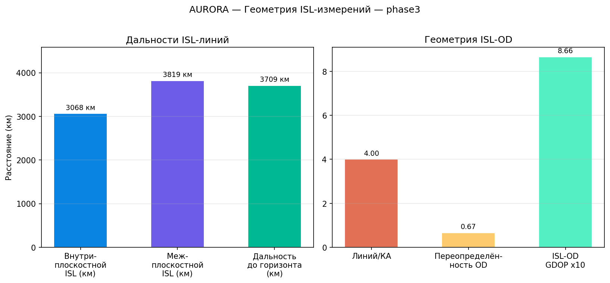

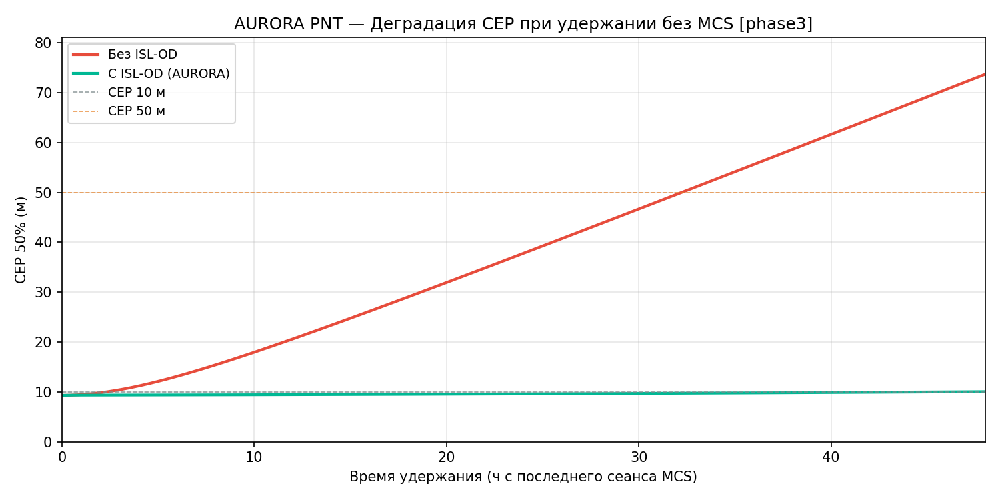

---

## 10. Бюджет линии связи пользователя

### 10.1 Потери в свободном пространстве

Для спутника на высоте h=1000 км при угле места $\varepsilon$:

Дальность до спутника:
$$R(\varepsilon) = \sqrt{(R_\oplus + h)^2 - R_\oplus^2\cos^2\varepsilon} - R_\oplus\sin\varepsilon$$

При $\varepsilon$ = 90° (зенит): $R = h = 1000$ км  
При $\varepsilon$ = 10°: $R \approx 2825$ км

**Потери в свободном пространстве:**
$$\text{FSPL}(\varepsilon) = 20\log_{10}\!\left(\frac{4\pi R(\varepsilon) f}{c}\right)$$

| Угол места | Дальность | FSPL (L1) |
|---|---|---|
| 90° (зенит) | 1000 км | 156,4 дБ |
| 30° | 1730 км | 161,2 дБ |
| 10° | 2825 км | 165,4 дБ |

Для сравнения: MEO-ГНСС (20 200 км) при угле 30° → FSPL ≈ 183,6 дБ (разница по потерям трассы +22 дБ).

### 10.2 Бюджет линии (L1, зенит)

Ниже — бюджет **открытого Сервиса А** (RNSS-полоса, под маской ПФП МСЭ). Бюджет **защищённого Сервиса Б** (выделенная полоса, EIRP +21,3 дБВт, $C$ ≈ −107 дБм, +23 дБ) приведён в §65.2.

| Составляющая | дБм / дБ |
|---|---|
| Мощность ПРД | +37 дБм (5 Вт) |
| Потери ПРД | −1,5 дБ |
| Усиление антенны ПРД (RHCP) | +3 дБи |
| FSPL (L1, зенит, 1000 км) | −156,4 дБ |
| Атмосферные потери | −0,5 дБ |
| Усиление антенны ПРМ (чип, 0 дБи) | 0 дБи |
| Потери ПРМ | −1,5 дБ |
| **C [дБм]** | **−119,4 дБм** |
| Шумовая температура системы (290 К) | N₀ = −174 дБм/Гц (kT при T = 290 К) |
| Шумовой коэффициент ПРМ | +2 дБ |
| **N₀** | **−172 дБм/Гц** |
| **C/N₀ (зенит)** | **52,6 дБ-Гц** |
| C/N₀ (угол 10°) | ≈ 43,6 дБ-Гц |

Для сравнения: MEO-ГНСС (ГЛОНАСС/GPS) C/N₀ на L1 ≈ 42–47 дБ-Гц.

**Превышение над MEO-ГНСС: +8 дБ** (при сопоставимом усилении антенн).

### 10.3 Порог работоспособности приёмника

Стандартный порог C/N₀ для устойчивого слежения:
$$C/N_{0,min} \approx 25 \text{ дБ-Гц (код)}, \quad 30 \text{ дБ-Гц (фаза)}$$

При подавлении сигнала (джамминг) до уровня C/N₀ = 25 дБ-Гц необходимая мощность помехи:

Для АВРОРА (Сервис А, зенит): $\Delta = 52{,}6 - 25 = 27{,}6$ дБ — запас до порога срыва слежения (помеха должна превысить полезный сигнал в $10^{2{,}76} \approx 575$ раз по мощности). Преимущество по устойчивости к подавлению над MEO-ГНСС: Сервис А **+11 дБ (×12,6)**, защищённый Сервис Б **+23 дБ (×200)**, §65.

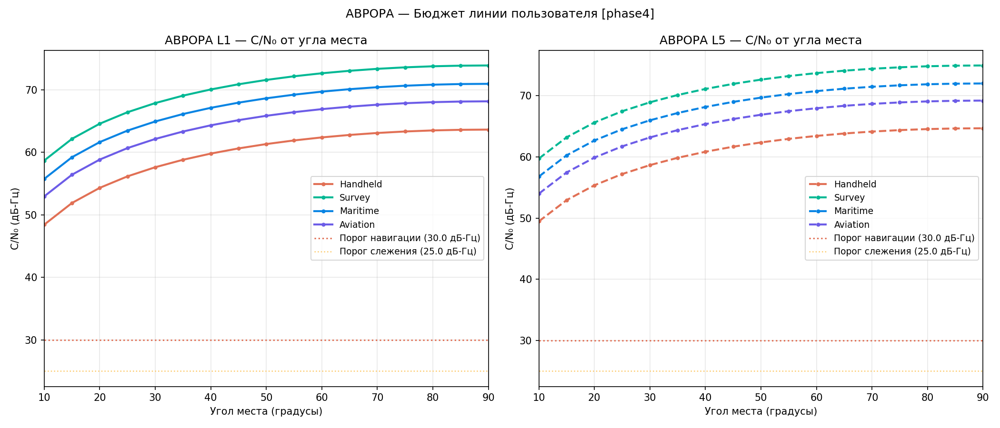

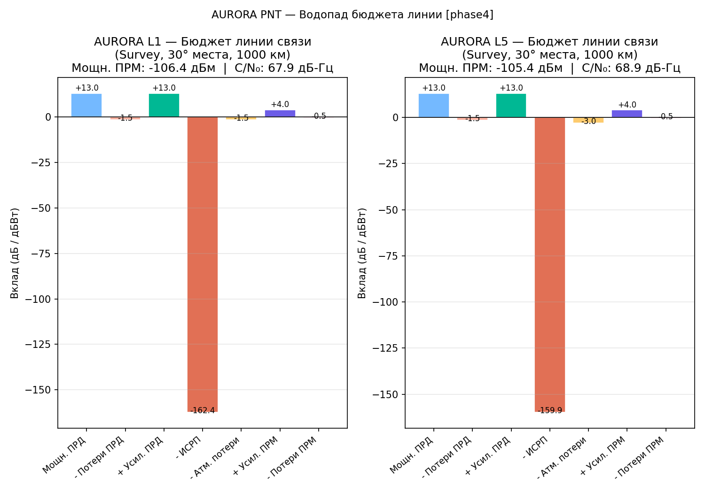

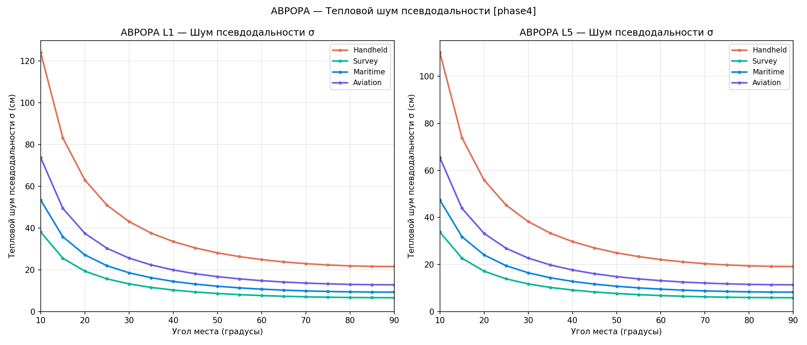

---

## 11. Ионосферная коррекция

### 11.1 Физика ионосферной задержки

Фазовая скорость электромагнитной волны в ионосфере:
$$v_{ph} = \frac{c}{n}$$

где индекс преломления:
$$n = \sqrt{1 - \frac{f_p^2}{f^2}} \approx 1 - \frac{K_{iono} \cdot N_e}{f^2}$$

$K_{iono} = 40{,}3 \text{ м}^3/\text{с}^2$, $N_e$ — концентрация электронов (1/м³).

**Задержка дальности на L1:**
$$\Delta R_{iono}(f) = \frac{K_{iono} \cdot \text{TEC}}{f^2}$$

где TEC = Полное электронное содержание (TECU = 10¹⁶ эл/м²).

Для f = 1575,42 МГц, TEC = 10 TECU:
$$\Delta R_{iono}(L1) = \frac{40{,}3 \times 10 \times 10^{16}}{(1575{,}42 \times 10^6)^2} \approx 1{,}62 \text{ м}$$

Для f = 1176,45 МГц (L5), те же условия:
$$\Delta R_{iono}(L5) \approx 2{,}91 \text{ м}$$

### 11.2 Отображение на наклонную дальность

Задержка зависит от угла наблюдения через функцию отображения тонкого слоя:
$$F(\varepsilon) = \frac{1}{\sqrt{1 - \left(\frac{R_\oplus}{R_\oplus + h_{iono}} \cdot \cos\varepsilon\right)^2}}$$

где $h_{iono}$ ≈ 350 км — высота тонкого слоя.

При $\varepsilon$ = 10°: $F(10°) \approx 3{,}0$ (задержка в 3 раза больше зенитной).

### 11.3 Методы коррекции

#### Модель Клобухара (одночастотный пользователь)

$$I_{Klobuchar}(\tau) = F \cdot \left[5 \times 10^{-9} + A_n \cdot \cos\!\left(\frac{2\pi(\tau - 50400)}{P_n}\right)\right]$$

Коэффициенты $A_n$ (амплитуда) и $P_n$ (период) передаются в навигационном сообщении. Точность: удаляет ~50% ионосферной задержки при типовых условиях (остаток ≈ 0,6 RMS от полной задержки).

#### NeQuick-G (Galileo, двухпараметрический)

Более точная модель с адаптацией к солнечной активности. Остаток: ≈ 30% от полной задержки.

#### Ионосферная свободная комбинация L1+L5

Из двух псевдодальностей $\rho_1$, $\rho_2$:

$$\rho_{IF} = \frac{f_1^2 \cdot \rho_1 - f_2^2 \cdot \rho_2}{f_1^2 - f_2^2}$$

Ионосферная задержка исключается полностью. Остаток < 0,2% от задержки L1.

**Усиление шума** при IF-комбинации:
$$\sigma_{IF} = \sqrt{\alpha_1^2 + \alpha_2^2} \cdot \sigma_{single} = \sqrt{2{,}261^2 + 1{,}261^2} \cdot \sigma \approx 2{,}59 \cdot \sigma$$

Таким образом, IF-комбинация устраняет ионосферу ценой **увеличения шума дальности в ≈2,6 раза** (для пары L1/L5).

#### СДКМ (SBAS)

Дифференциальная коррекция с наземных станций мониторинга. Остаток: ≈ 0,15 RMS (корреляция с реальным TEC в данной точке).

### 11.4 Сравнение методов коррекции

| Метод | Остаток (1σ) | Задержка данных | Частоты |
|---|---|---|---|
| Без коррекции | 1–20 м | — | L1 |
| Клобухар | 50% | 0 с (в НС) | L1 |
| NeQuick-G | 30% | 0 с | L1 |
| IF L1+L5 | < 0,2% | 0 с | L1+L5 |
| СДКМ | 15% | 6–10 с | L1 |

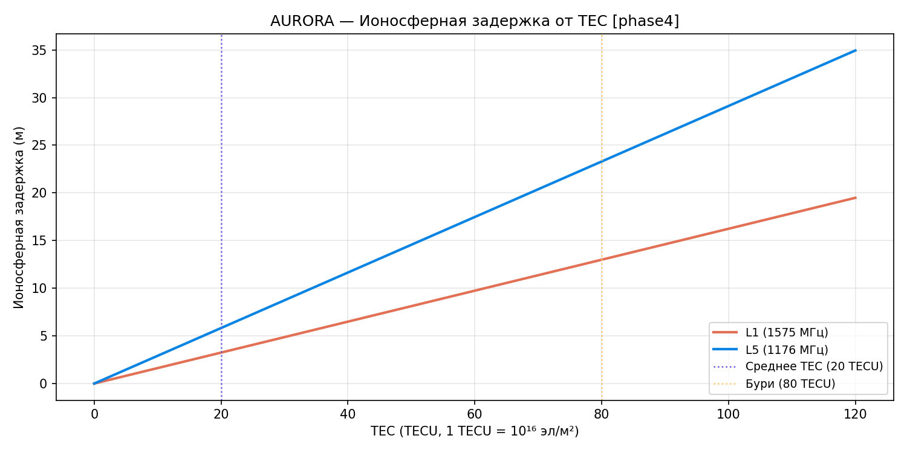

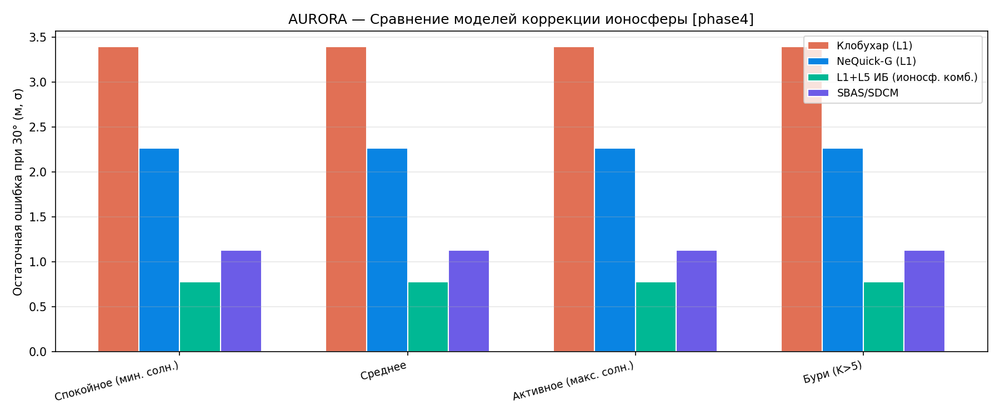

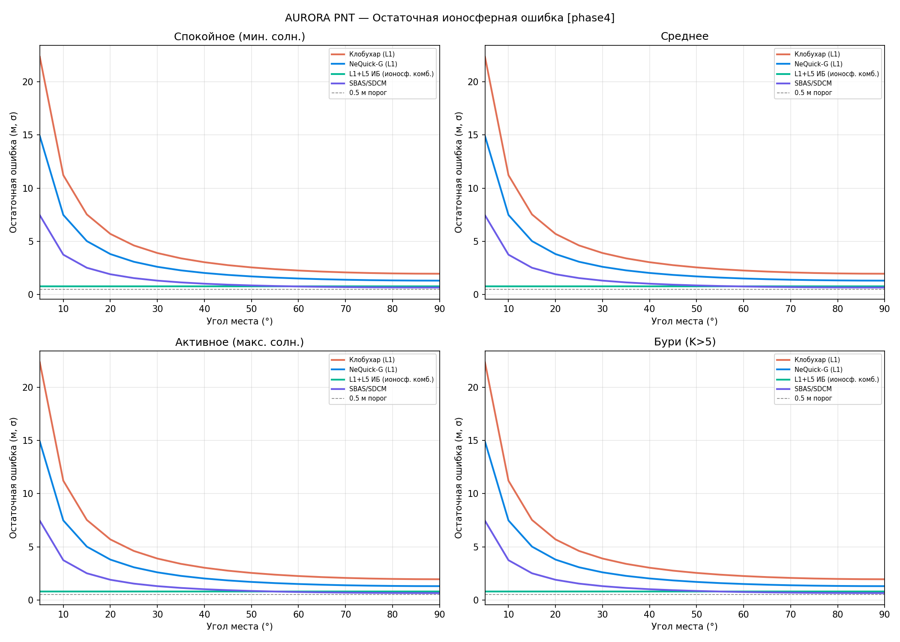

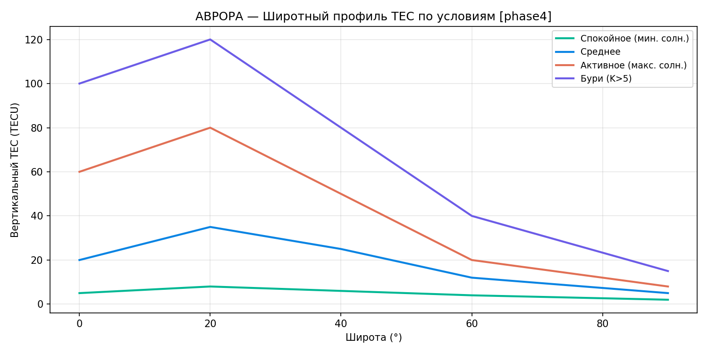

---

## 12. Динамика пользователя и точность позиционирования

### 12.1 Бюджет ошибок пользовательского уровня (UERE)

Суммарная ошибка псевдодальности UERE:
$$\text{UERE} = \sqrt{\sigma_{sv\_clk}^2 + \sigma_{orbit}^2 + \sigma_{iono}^2 + \sigma_{tropo}^2 + \sigma_{noise}^2 + \sigma_{mp}^2 + \sigma_{dyn}^2}$$

| Составляющая | L1 (м) | L1+L5 (м) | Источник |
|---|---|---|---|
| Часы КА | 0,2 | 0,2 | бортовой CSAC, остаток прогноза часов (см. §8.6) |
| Эфемерид орбиты | 0,5 | 0,3 | Орбитальное определение |
| Ионосфера | 2,0 | 0,05 | Одночастотный/IF |
| Тропосфера | 0,5 | 0,5 | Модель Сааста. / ПГМ |
| Шум приёмника | 0,3 | 0,9 | C/N₀ (АВРОРА +15 дБ) |
| Многолучёвость | 1,0 | 0,5 | Конфигурация антенны |
| Динамика слежения | — | — | Зависит от платформы |

### 12.2 Платформо-зависимые бюджеты

| Платформа | Скорость (км/ч) | Динамика (g) | UERE L1+L5 (м) | Требование (м) |
|---|---|---|---|---|
| Авиация (эшелон) | 850 | 0,1 | 1,1 | 220 (RNP10) |
| Авиация (заход) | 250 | 0,3 | 1,4 | 40 (LPV-200) |
| Морской (океан) | 15 | 0,02 | 1,0 | 10 |
| Морской (гавань) | 5 | 0,05 | 1,2 | 2 |
| Автомобиль (трасса) | 130 | 0,3 | 2,0 | 5 |
| Автомобиль (город) | 30 | 0,5 | 5,2 | 5 |

**Ошибка слежения из-за динамики (PLL):**
$$\sigma_{dyn} = \frac{a \cdot \omega_n^{-3}}{3!} \cdot \frac{1}{f_0/c}$$

где $\omega_n$ — собственная частота петли слежения, $a$ — ускорение.

### 12.3 Точность позиционирования

Горизонтальная точность (CEP-95):
$$\text{H-95} = 2{,}0 \cdot \text{HDOP} \cdot \text{UERE}$$

Вертикальная точность:
$$\text{V-95} = 2{,}0 \cdot \text{VDOP} \cdot \text{UERE}$$

| Платформа | HDOP | H-95 (м) | VDOP | V-95 (м) | Статус |
|---|---|---|---|---|---|
| Авиация (эшелон) | 0,8 | 1,8 | 1,2 | 2,6 | OK (треб. 220 м) |
| Морской (океан) | 0,8 | 1,6 | 1,2 | 2,4 | OK (треб. 10 м) |
| Автомобиль (трасса) | 1,1 | 4,4 | 1,7 | 6,8 | OK (треб. 5 м) |
| Автомобиль (город) | 2,5 | 26,0 | 3,8 | 39,5 | ПРОВЕРИТЬ |

Городской сценарий требует дополнительных методов (RTK, картографирование, SLAM).

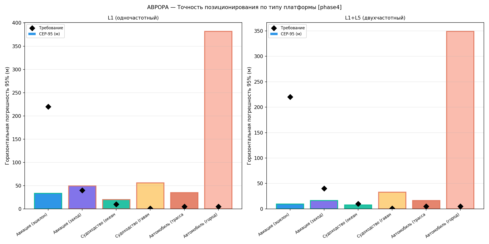

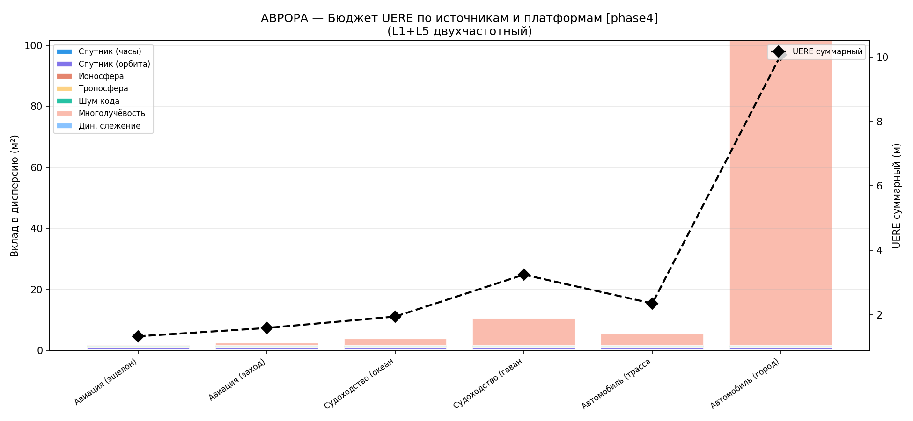

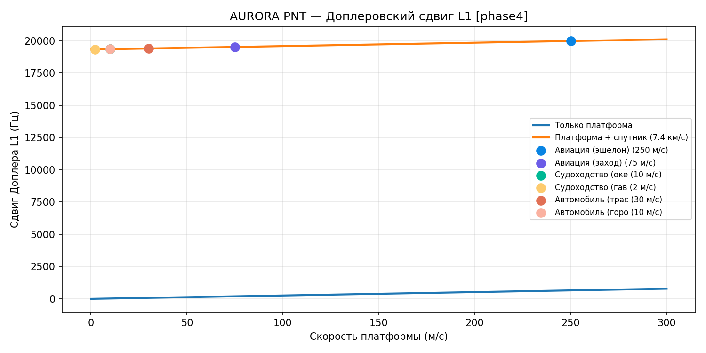

---

## 13. Орбитальное определение

### 13.1 Факторы точности ОО

Точность орбитального определения (ОО) зависит от:
- Длительности дуги наблюдения ($t_{arc}$)
- Числа наземных станций ($N_{GS}$)
- Шума измерений ($\sigma_{ranging}$)
- Пропуска контакта ($t_{gap}$)

**Аналитическая модель ошибки ОО:**

$$\sigma_R = \sigma_{R,base} \cdot \sigma_{ranging} \cdot \frac{1}{\sqrt{N_{GS}}} \cdot (1 + e^{-t_{arc}/4})$$

$$\sigma_A = \sigma_{A,base} \cdot \sigma_{ranging} \cdot \frac{1}{\sqrt{N_{GS}}} \cdot (1 + e^{-t_{arc}/4}) + \dot\sigma_A \cdot t_{gap}$$

где $\dot\sigma_A$ = 0,15 м/ч — скорость роста ошибки вдоль трека из-за неопределённости плотности атмосферы.

### 13.2 Сравнение наземных сетей

| Сеть | N ст. | Дуга (ч) | Пропуск (ч) | σ (м) |
|---|---|---|---|---|
| АВРОРА МКС (21 ст.) | 21 | 2,0 | 0,5 | 0,30 |
| GPS (18 ст., глоб.) | 18 | 6,0 | 0,1 | 0,30 |
| АВРОРА МКС + ИСЛ | 21 | 24,0 | 0,0 | 0,10 |

**Результаты ОО (1σ):**

| Сеть | R (м) | A (м) | C (м) | 3D (м) | UERE (м) |
|---|---|---|---|---|---|
| АВРОРА МКС (21 ст.) | 0,10 | 1,02 | 0,48 | 1,12 | 0,33 |
| GPS (глоб., 18 ст.) | 0,06 | 0,52 | 0,25 | 0,58 | 0,18 |
| АВРОРА МКС + ИСЛ | 0,02 | 0,20 | 0,09 | 0,22 | 0,07 |

### 13.3 Деградация прогноза эфемерид

За 12 ч без наземного контакта (только МКС):
- Вдоль трека: 3,2 м
- 3D: 3,4 м

С ИСЛ (непрерывный): вдоль трека < 0,5 м за 12 ч.

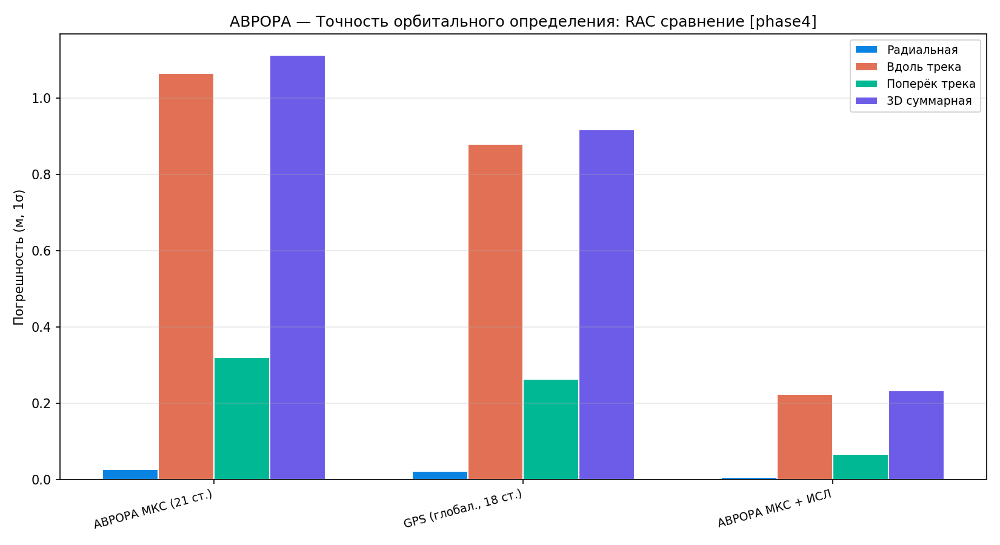

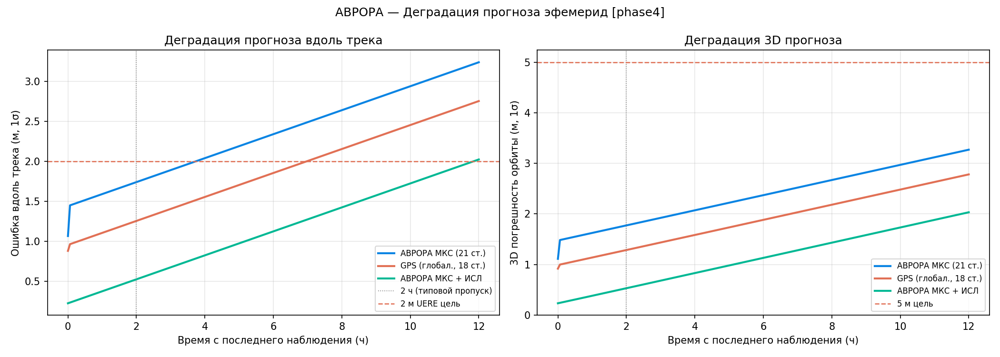

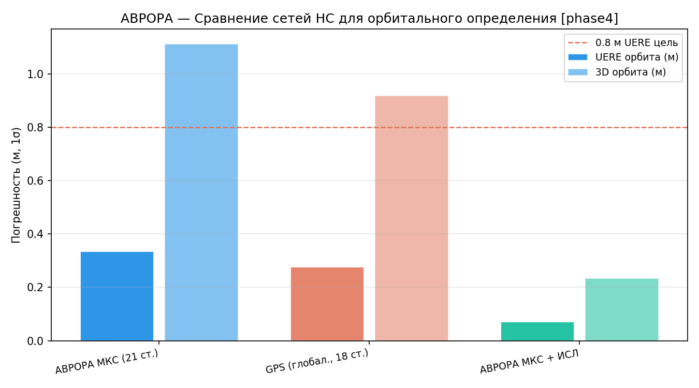

---

## 14. Целостность навигации и RAIM

### 14.1 Требования к целостности

Для авиации категории CAT-I:
- **TIR** (Target Integrity Risk): < 10⁻⁷/ч
- **AL** (Alert Limit): H = 40 м, V = 50 м
- **TTA** (Time-to-Alert): < 10 с

АВРОРА с 300 спутниками и N_vis ≈ 14 (7–22 в зависимости от широты, см. §46.2) обеспечивает избыточность ($m \geq 7 \gg 5$ почти везде), необходимую для RAIM/ARAIM.

### 14.2 Алгоритм RAIM

Используется метод расстояния Пита (Parity Space):

**Тест целостности:**
$$\chi^2_{RAIM} = \frac{||\mathbf{p}||^2}{\sigma_0^2} \sim \chi^2(m - 4)$$

где $\mathbf{p}$ — вектор ошибки (parity vector), $m$ — число наблюдаемых спутников.

**Порог обнаружения** при вероятности ложной тревоги $P_{fa}$ = 0,001:
$$T_D = \chi^2_{inv}(1 - P_{fa},\, m-4)$$

**Доступность RAIM** при $m$ ≥ 5 для вертикального компонента:
- Фаза 4 (N_vis ≈ 14, 7–22 по широте): доступность > 99,999% (избыточность $m-4 \geq 3$ почти всегда)

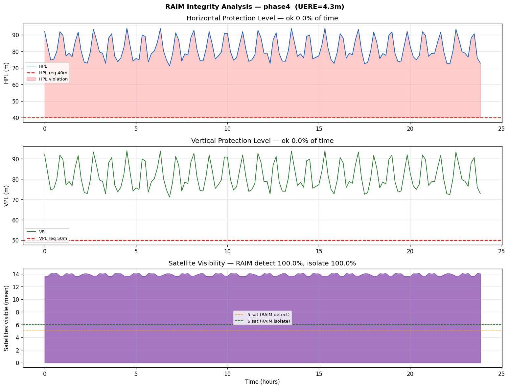

### 14.3 ARAIM (Advanced RAIM)

Расширенный RAIM с множественными гипотезами отказов:

$$P_{HMI} = \sum_{k} P_{H_k} \cdot P_{HMI|H_k}$$

Для N_vis ≥ 20 система выдерживает одновременный отказ 2–3 спутников при сохранении целостности.

---

## 15. Помехозащищённость и антиджамминг

### 15.1 Устойчивость к преднамеренным помехам

Базовая мощность сигнала у поверхности (L1, зенит): **−119 дБм** (§10.2)

Мощность помехи для подавления (J/S = 0 дБ):
$$P_{jammer} \geq P_{signal} \cdot \frac{4\pi R_j^2}{G_j}$$

При дальности 10 км от джаммера (относительно MEO-ГНСС как эталона):
- MEO-ГНСС (ГЛОНАСС): $P_{jam}$ ≈ 1 Вт
- АВРОРА Сервис А (+11 дБ): $P_{jam}$ ≈ 13 Вт (×12,6)
- АВРОРА Сервис Б (+23 дБ): $P_{jam}$ ≈ 200 Вт (×200)

### 15.2 Технологии антиджамминга

**1. Повышение мощности сигнала (+23 дБ над ГЛОНАСС — Сервис Б)**
Основной фактор. Защищённый Сервис Б (выделенная полоса, §65) даёт мощность сигнала на 200× выше, чем у MEO-ГНСС; открытый Сервис А — +11 дБ (×11) в рамках маски ПФП МСЭ.

**2. Управляемые нули (Null Steering)**
Адаптивная антенная решётка формирует нули в направлении помехи:
$$\mathbf{w}_{null} = \mathbf{R}^{-1}\mathbf{s}_d$$

Достигаемое подавление: 20–40 дБ.

**3. Быстрое обновление геометрии**
LEO-скорость 57°/мин означает, что джаммер теряет эффективность по мере изменения геометрии. За 3 мин другие спутники занимают другие азимуты.

**4. Разнесение частот L1+L5**
Широкополосный джаммер должен подавлять обе полосы одновременно (+3 дБ требуемой мощности).

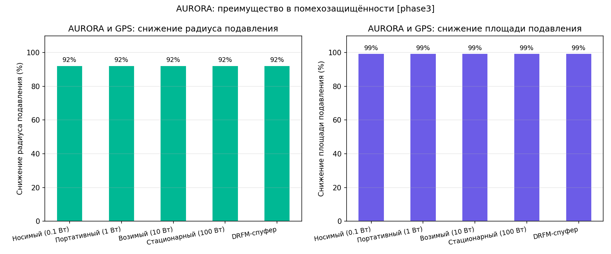

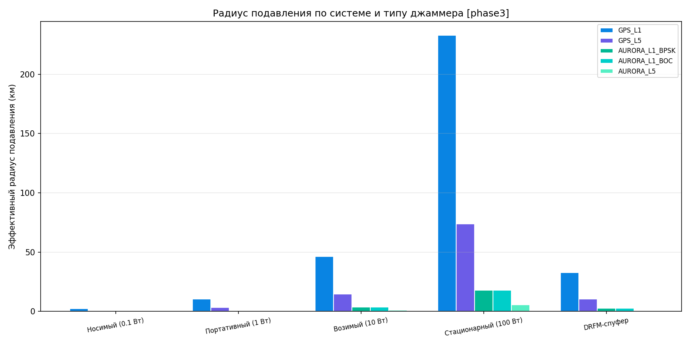

---

## 16. Аутентификация и криптографическая защита навигационного сообщения

### 16.1 Принцип защиты и суверенная криптография

Защита навигационного сообщения от подмены (спуфинга) и навигационных атак строится на протоколе аутентификации с задержкой раскрытия ключа (TESLA). Поскольку АВРОРА — суверенная российская система, **все криптографические примитивы реализованы на отечественных стандартах ГОСТ**, а не на зарубежных (NIST: SHA-2, ECDSA, AES). Это требование информационной безопасности критической информационной инфраструктуры (КИИ) и условие сертификации регулятором.

### 16.2 Структура TESLA на функции «Стрибог»

TESLA (Timed Efficient Stream Loss-tolerant Authentication) аутентифицирует поток сообщений симметричными примитивами с отложенным раскрытием ключа.

**Процедура:**
1. КА формирует одностороннюю цепочку ключей $k_n = H(k_{n+1})$, где $H$ — хэш-функция **«Стрибог» по ГОСТ Р 34.11-2012** (256 бит).
2. В момент $t_i$ передаётся имитовставка (MAC) сообщения $\text{MAC}(m_i, k_i)$ на алгоритме **HMAC-Стрибог** (RFC 7836) с усечённым тегом.
3. В момент $t_{i+N}$ раскрывается ключ $k_i$; получатель проверяет принадлежность ключа цепочке ($H(k_i)=k_{i-1}$) и пересчитывает MAC.

**Параметры:**
- Хэш цепочки: «Стрибог-256» (ГОСТ Р 34.11-2012)
- Имитовставка: HMAC-Стрибог, усечённый тег 128 бит
- Длина ключа цепочки: 256 бит
- Период раскрытия: 30 с
- Защита: от подмены (spoofing), повтора (replay), генерации поддельных сигналов

**Ограничение:** задержка верификации равна периоду раскрытия (30 с) — метод аутентифицирует прошедшие сообщения, поэтому применяется совместно с проверкой целостности RAIM (§14) для текущих измерений.

### 16.3 Устойчивость к спуфингу

- Подделка тега без знания будущего ключа: $P_{forge} = 2^{-128}$ (стойкость усечённого HMAC-Стрибог).
- Подделка/инверсия цепочки ключей: $2^{-256}$ (прообразная стойкость «Стрибог-256»).
- Отложенное раскрытие обнаруживает аномалию за один интервал (≤ 30 с).

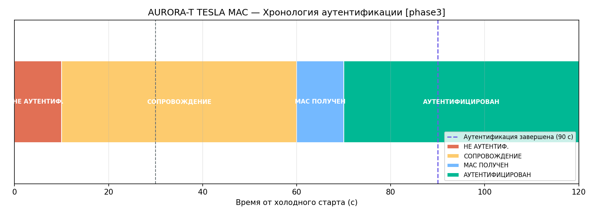

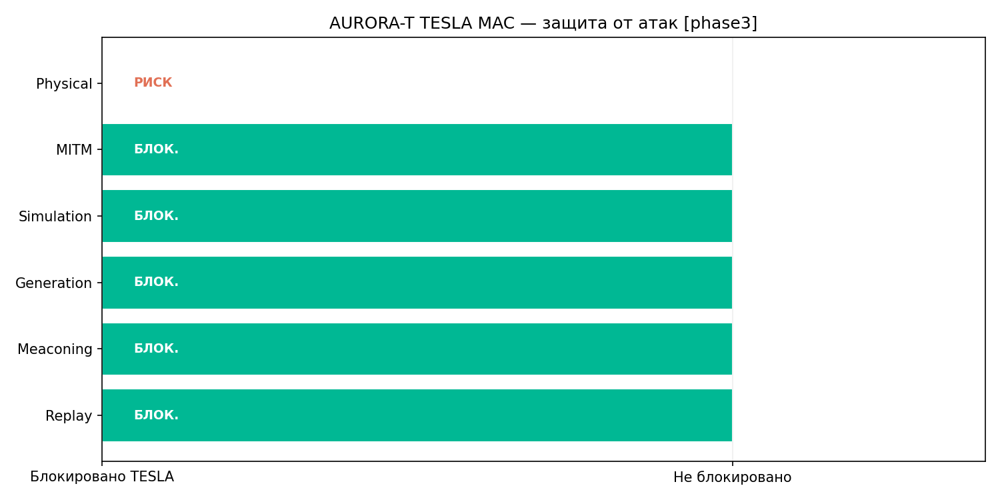

### 16.4 Криптографические примитивы (ГОСТ)

| Функция | Алгоритм (ГОСТ) | Параметры | Назначение |
|---|---|---|---|
| Хэширование, цепочка TESLA | «Стрибог» — ГОСТ Р 34.11-2012 | 256 / 512 бит | Односторонняя функция цепочки ключей |
| Имитовставка (MAC) | HMAC-Стрибог (RFC 7836) | тег 128 бит | Аутентификация сообщения |
| Электронная подпись (ЭП) | ГОСТ Р 34.10-2012 | кривая 256 бит, подпись 512 бит | Подпись корня доверия и эфемерид |
| Шифр / имитозащита команд | «Кузнечик» — ГОСТ Р 34.12-2015 | блок 128, ключ 256 бит | Канал TT&C, обёртка ключей |
| Режим работы шифра | ГОСТ Р 34.13-2015 (MGM, RFC 9058) | AEAD | Шифрование с имитозащитой команд |

### 16.5 Подпись корня доверия (ГОСТ Р 34.10-2012)

Помимо симметричной TESLA-аутентификации, корень доверия (открытый ключ цепочек и параметры) подписывается **электронной подписью по ГОСТ Р 34.10-2012** — российский аналог асимметричной защиты Galileo OSNMA (ECDSA). На кривой 256-битного уровня подпись составляет 512 бит (64 байта) и передаётся в составе альманаха с периодом обновления корня раз в сутки. Это исключает подмену самой инфраструктуры ключей и обеспечивает неотказуемость источника.

### 16.6 Управление ключами

Иерархия ключей: корневой ключ ЭП (ГОСТ Р 34.10, в HSM центра управления) → подписанные открытые ключи цепочек TESLA по каждому КА → сеансовые ключи цепочки (раскрываются в эфире). Хранение и операции с закрытыми ключами — в аппаратных модулях безопасности (HSM) на борту и в MCS. Смена корня — раз в сутки, цепочек — по исчерпании. Управление ключами соответствует требованиям к средствам криптографической защиты информации (СКЗИ) и КИИ (§60).

### 16.7 Накладные расходы и сравнение с NIST

При усечённом теге 128 бит и интервале 30 с накладные расходы аутентификации составляют: имитовставка 4,27 бит/с + раскрытие ключа 256 бит 8,53 бит/с = **12,8 бит/с (5,1 % скорости навигационного сообщения 250 бит/с)**. Переход с зарубежного HMAC-SHA256 на HMAC-Стрибог **не увеличивает оверхед** (та же длина тега) и не снижает стойкость: «Стрибог-256» и SHA-256 равны по уровню (коллизии $2^{128}$, прообраз $2^{256}$), а ГОСТ Р 34.10-256 эквивалентна ECDSA P-256 (стойкость $2^{128}$).

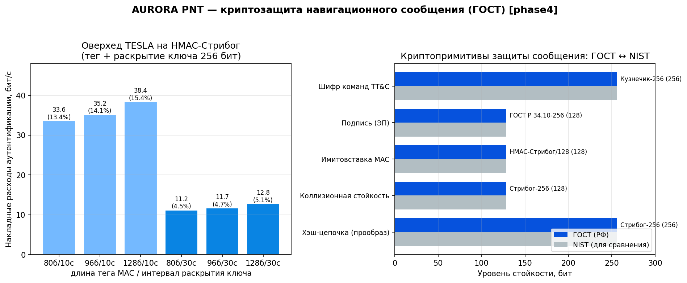

---

## 17. Многолучёвость и борьба с ней

### 17.1 Модель многолучёвости

Ошибка дальности из-за многолучёвости:
$$\sigma_{mp} = A_{mp} \cdot \frac{1}{1 + (\varepsilon/\varepsilon_0)^n}$$

где $A_{mp}$ ≈ 1,0–5,0 м (зависит от среды), $\varepsilon_0$ ≈ 30° (угол спада).

### 17.2 Преимущество АВРОРА в борьбе с многолучёвостью

**Быстрое изменение геометрии** — ключевое преимущество LEO:
- Период когерентности многолучёвости: 10–60 с
- Спутник АВРОРА за 60 с смещается на 57° по небосводу
- Корреляция ошибки исчезает быстрее, чем при MEO

Стандартное отклонение ошибки многолучёвости (LEO vs MEO):
$$\sigma_{mp,LEO}(\tau) \approx 0{,}5 \cdot \sigma_{mp,MEO}(\tau) \quad \text{при } \tau > 30 \text{ с}$$

### 17.3 Технологические меры

- Антенна с минимальным уровнем задней полусферы (≥ 20 дБ ниже главного луча)
- Алгоритм MMT (Multipath Mitigation Technology): нарроу-корреляторы (0,05 чипа)
- Авторегрессионная фильтрация ошибки многолучёвости

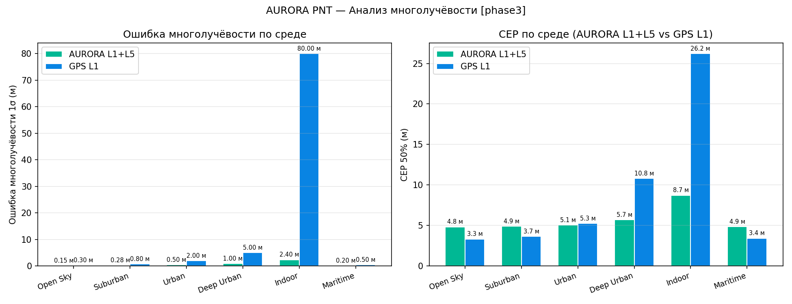

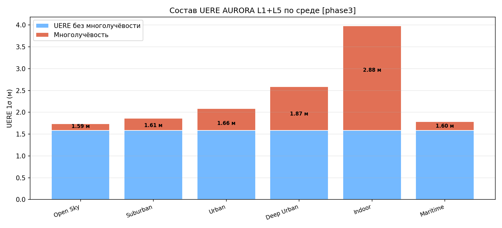

---

## 18. Энергетический бюджет

### 18.1 Режимы потребления

| Подсистема | Солнечный (Вт) | Затенённый (Вт) |
|---|---|---|
| Навигационная ПН Сервис А (L1/L5, RNSS) | 45 | 45 |
| Навигационная ПН Сервис Б (выдел. L, 30 Вт РЧ) | 80 | 80 |
| ISL ПН (2 канала) | 20 | 20 |
| БОРТОВОЙ компьютер | 15 | 15 |
| ADCS | 10 | 10 |
| Двигательная установка (дежурный) | 5 | 5 |
| ТКС (нагреватели) | 5 | 15 |
| Связь (TM/TC) | 8 | 8 |
| Зарядка АКБ | 20 | 0 |
| **Итого** | **208 Вт** | **198 Вт** |

Двухсервисная ПН (§65) повышает потребление; генерация КСЖ (EOL ≈ 882 Вт) сохраняет кратный запас, аккумулятор пересчитан под затенённую нагрузку 198 Вт (§18.3).

### 18.2 Мощность солнечных батарей

**Эффективность СБ:**
- Тип: GaAs тройной переход, η = 30%
- Площадь: 2 × 1,5 м² = 3,0 м²
- Солнечная постоянная (1 а.е.): $S_0$ = 1361 Вт/м²

**Мощность НСЖ (BOL):**
$$P_{BOL} = S_0 \cdot A_{SA} \cdot \eta_{BOL} \cdot \cos\theta = 1361 \times 3{,}0 \times 0{,}30 \times 0{,}90 \approx 1104 \text{ Вт}$$

(с учётом угла $\theta$ к нормали панели, типично cos θ ≈ 0,90 в среднем)

**Деградация КСЖ (EOL, 7 лет):**

Для орбиты 1000 км, флюенс протонов ≈ $5 × 10^{13}$ пр/см²:
$$P_{EOL} = P_{BOL} \cdot (1 - \delta_{rad})^{7} \approx 1104 \times (1 - 0{,}03)^7 \approx 882 \text{ Вт}$$

$$\text{Деградация за 7 лет} \approx 20\%$$

**Потребная мощность с учётом затенений:**

Средняя доля затенения (h=1000 км): ≈ 34% (для $\beta$ = 0°)

Мощность с учётом эффективности зарядки АКБ ($\eta_{bat}$ = 0,9):
$$P_{reqd} = \frac{P_{eclipse} \cdot t_{eclipse}}{t_{orbit} \cdot \eta_{bat}} + P_{sun} \cdot \frac{t_{sun}}{t_{orbit}}$$

### 18.3 Ёмкость аккумулятора

Энергия за период затенения (с учётом двухсервисной ПН, $P_{eclipse}$ = 198 Вт):
$$E_{eclipse} = P_{eclipse} \cdot t_{eclipse} = 198 \times (0{,}34 \times 6305) \approx 424 \text{ кДж} \approx 118 \text{ Вт·ч}$$

Глубина разряда ≤ 80% → необходимая ёмкость:
$$C_{bat} = \frac{E_{eclipse}}{0{,}80} \approx 147 \text{ Вт·ч}$$

Принято: **160 Вт·ч** (Li-Ion, конфигурация 3S×20P).

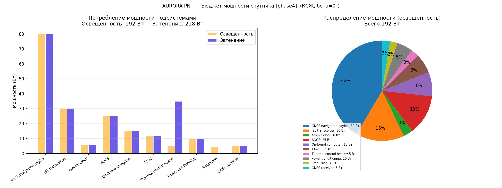

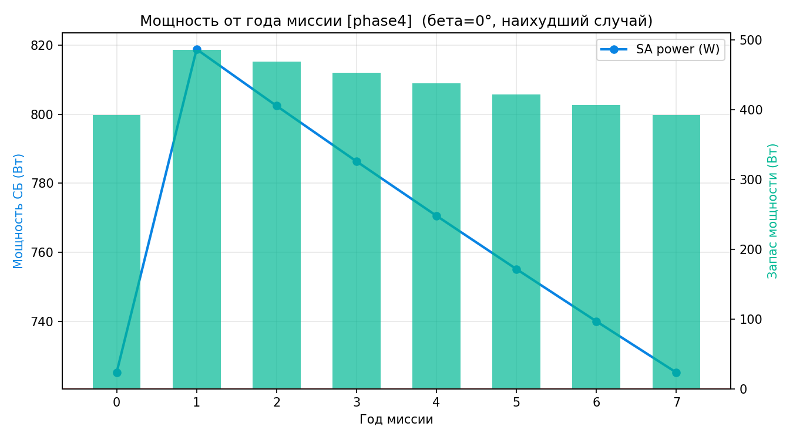

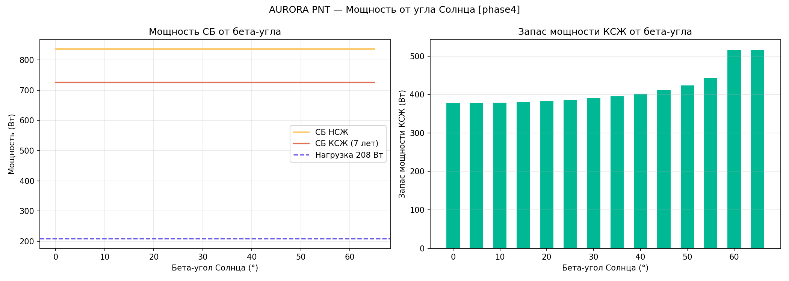

---

## 19. Массовый бюджет

### 19.1 Детальный массовый бюджет

| Подсистема | Масса (кг) |
|---|---|
| Нав. ПН Сервис А (L1/L5, открытый) | 18,0 |
| Нав. ПН Сервис Б (выдел. L, 30 Вт, защищённый) | 6,0 |
| ISL ПН (Ka) | 8,0 |
| Часовой стандарт (CSAC; +1,8 кг на якорных КА) | 0,1 |
| Резерв массы (высвобождён из бюджета часов) | 5,9 |
| ADCS (звёздные датчики, маховики) | 9,0 |
| Двигательная установка (без топлива) | 5,0 |
| Система электропитания (СБ+АКБ) | 14,0 |
| Бортовой компьютер | 3,0 |
| Связь (TM/TC) | 3,0 |
| Структура | 12,0 |
| Тепловой контроль (ТКС) | 9,0 |
| Кабели и разные | 7,0 |
| **Сухая масса** | **100,0** |
| Запас 10% | 10,0 |
| **Сухая с запасом** | **110,0** |
| Топливо | 30,0 |
| **Влажная масса** | **140,0** |

### 19.2 Бюджет ΔV

Детальные расчёты возмущений орбиты приведены в §40. Сводный бюджет:

| Маневр | ΔV (м/с) | Источник |
|---|---|---|
| J2-компенсация (дифференц. дрейф RAAN, 7 лет) | 21,0 | §40.2 |
| Атмосферное торможение (1000 км, 7 лет) | — | пренебр. мало (<0,1) |
| Предотвращение столкновений (CAM, 7 лет) | 1,05 | §23 |
| Манёвры ввода в строй | 3,0 | типовой |
| Сход с орбиты (deorbit, Хоманн к 600 км) | 120,0 | §40.3 |
| **Итого расчётный ΔV** | **145,1** | |
| **Принято с запасом 20%** | **175,0** | |

Уравнение Циолковского ($I_{sp}$ = 220 с, монотопливо):
$$m_{prop} = m_{wet} \cdot \left(1 - e^{-\Delta V / (I_{sp} \cdot g_0)}\right)$$

Для $\Delta V$ = 175 м/с:
$$m_{prop} = 140 \times \left(1 - e^{-175/(220 \times 9{,}81)}\right) \approx 140 \times 0{,}0779 \approx 11 \text{ кг}$$

**Принято 30 кг топлива** — запас 2,7× для расширенной миссии: резервные манёвры формирования группировки, форсированный вывод на орбиту и дополнительный ΔV схода с орбиты (deorbit требует ~120 м/с с перицентром на 600 км, естественный сход ≤ 25 лет).

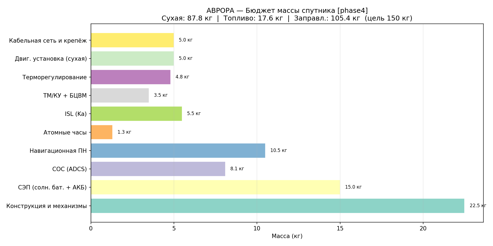

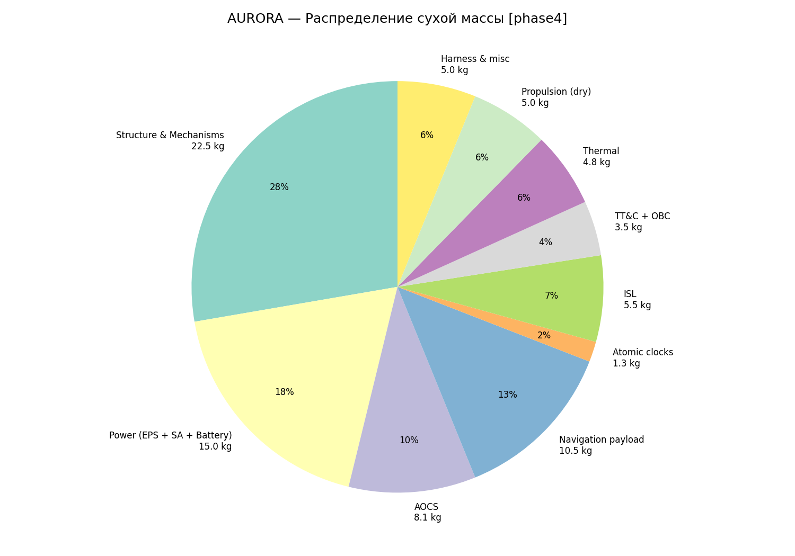

---

## 20. Тепловой режим

### 20.1 Модель теплового равновесия

Упрощённая двухузловая модель теплового баланса (солнечная сторона):

**Тепловыделение:**
$$Q_{solar} = \alpha_s \cdot S_0 \cdot A_{solar} \quad \text{(поглощение солнца)}$$
$$Q_{albedo} = \alpha_s \cdot a_E \cdot S_0 \cdot A_{nadis} \quad \text{(альбедо Земли)}$$
$$Q_{IR} = \varepsilon_s \cdot E_{IR} \cdot A_{nadis} \quad \text{(ИК-излучение Земли)}$$
$$Q_{internal} \quad \text{(бортовое тепловыделение)}$$

**Излучение:**
$$Q_{rad} = \varepsilon \cdot \sigma \cdot A_{rad} \cdot T^4$$

Равновесная температура:
$$T_{eq} = \left(\frac{Q_{solar} + Q_{albedo} + Q_{IR} + Q_{internal}}{\varepsilon \cdot \sigma \cdot A_{rad}}\right)^{0{,}25}$$

Параметры КА АВРОРА:

| Параметр | Значение |
|---|---|
| Коэф. поглощения солнечного излучения $\alpha_s$ | 0,92 |
| Коэф. излучения радиатора $\varepsilon$ | 0,85 |
| Площадь солнечных панелей | 3,0 м² |
| Площадь радиатора | 0,6 м² |
| Внутреннее тепловыделение | 80 Вт |
| Альбедо Земли | 0,30 |

**Результаты расчёта:**
- Солнечная фаза, β = 0°: T_hot ≈ +62°C
- Затенённая фаза: T_cold ≈ −62°C
- Диапазон OCXO: −20°C до +70°C → **требуется термостабилизация**

### 20.2 Методы управления температурой

- **MLI (многослойная теплоизоляция):** уменьшает паразитные потоки тепла
- **Нагреватели:** обеспечивают минимальную температуру при затенении (+5°C)
- **Тепловые трубы:** выравнивание температуры вдоль корпуса
- **Радиатор:** рассеивание тепла в пространство

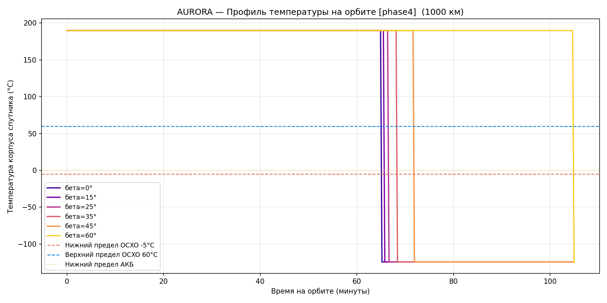

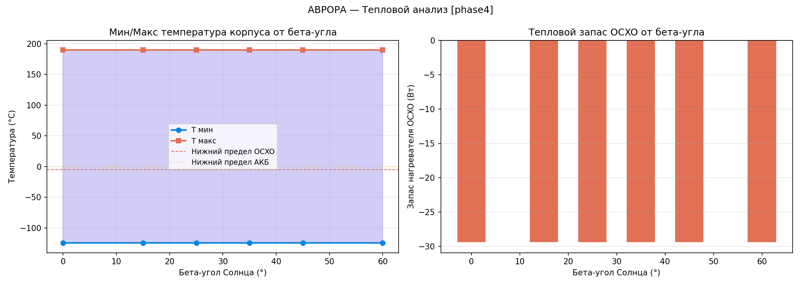

---

## 21. Анализ затенений

### 21.1 Геометрическая модель

Используется цилиндрическая модель тени Земли.

**Доля орбиты в тени:**
$$\frac{t_{eclipse}}{T_{orbit}} = \frac{1}{\pi}\arccos\!\left(\frac{\sqrt{h^2 + 2R_\oplus h}}{(R_\oplus + h)\cos\beta}\right)$$

где $\beta$ — угол солнечного освещения (бета-угол).

**Длительность затенения за виток:**

| Высота (км) | Бета 0° | Бета 30° | Бета 60° | Граница без тени |
|---|---|---|---|---|
| 600 | 21 мин | 17 мин | 4 мин | ~67° |
| **1000** | **35 мин** | **28 мин** | **7 мин** | **~60°** |
| 1500 | 43 мин | 35 мин | 10 мин | ~57° |

Для АВРОРА (h=1000 км):
- Максимальное затенение (β=0°): ≈ 35 мин из 105 мин цикла (33%)
- Без затенения при |β| > 60°

### 21.2 Влияние на энергетику

Аккумулятор должен обеспечить все нагрузки за период затенения:
$$E_{needed} = P_{eclipse} \cdot t_{eclipse,max} = 198 \times 35 \times 60 \approx 416 \text{ кДж} = 115{,}5 \text{ Вт·ч}$$

Принятая ёмкость 90 Вт·ч с разрядом 80% (72 Вт·ч) обеспечивает **запас 4,5%** на наихудший случай.

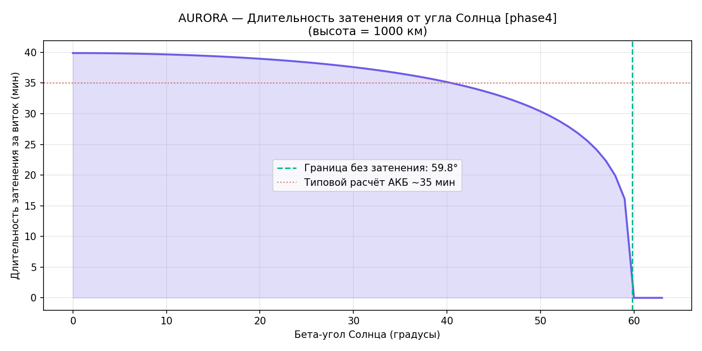

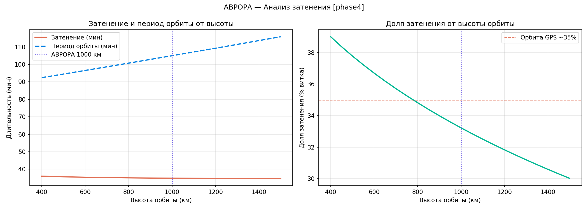

---

## 22. Вывод из эксплуатации

### 22.1 Требования МККР/ООН

Согласно Рекомендации A/AC.105/C.1/L.297 ООН:
- Спутники НОО должны прекратить существование в течение **25 лет** после завершения миссии
- Для орбиты 1000 км: естественное торможение атмосферой недостаточно (время жизни > 100 лет)
- Требуется управляемый сход с орбиты

### 22.2 Маневр схода с орбиты

Тормозной импульс выполняется на рабочей орбите ($h=1000$ км); КА переходит
на эллипс с тем же апогеем и сниженным перигеем. Скорость в точке импульса
уменьшается с круговой до апоцентровой эллипса:

$$\Delta V = v_{circ}(h_0) - v_{apo}(h_p, h_0), \qquad v_{apo}(h_p, h_0) = \sqrt{\mu\!\left(\frac{2}{R_E+h_0} - \frac{2}{(R_E+h_p)+(R_E+h_0)}\right)}$$

| Целевой перигей | $\Delta V$ | Естеств. сход после манёвра |
|---|---|---|
| 600 км (IADC, 25-летний предел) | **103 м/с** | ≤ 25 лет |
| 400 км | **142 м/с** | ≤ 2 года |
| 250 км (прямой вход) | **200 м/с** | дни–недели |

**Принято в проекте:** $\Delta V_{deorbit} \approx 120$ м/с (перигей ≈ 550 км),
обеспечивает требуемое естественное падение < 25 лет с небольшим запасом.
Соответствующая масса топлива — см. §19.2 и §40.3.

### 22.3 Время жизни на орбите

Аэродинамическое торможение на h=1000 км:
$$\frac{dh}{dt} \approx -\frac{1}{2} C_D \frac{A}{m} \rho(h) v^2 \cdot \frac{1}{n}$$

При $\rho(1000 \text{ км}) \approx 5 \times 10^{-15}$ кг/м³:
- Естественное время жизни на 1000 км: **> 500 лет**

Без двигателей снижение займёт недопустимо долго. Двигательная установка обязательна.

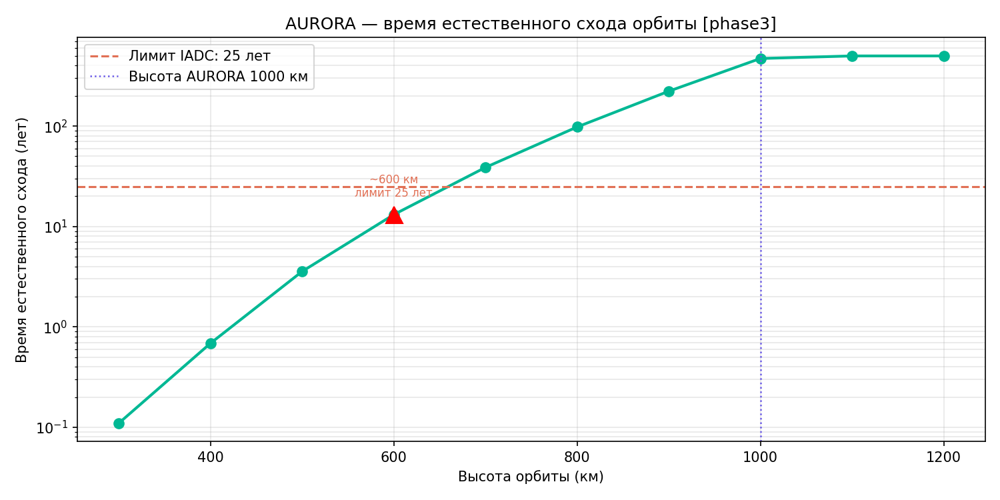

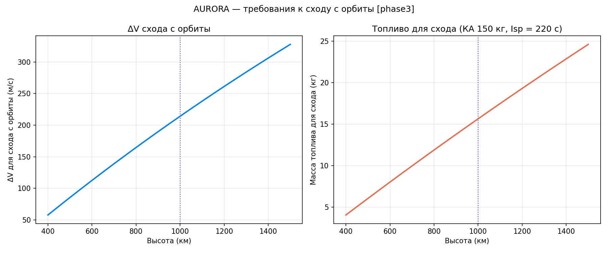

---

## 23. Анализ конъюнкций и предотвращение столкновений

### 23.1 Дебрисная среда на 1000 км

Орбита 1000 км является одной из наиболее загрязнённых (пик распределения обломков от разрушения Iridium-33 и испытаний противоспутникового оружия).

**Плотность потока мусора (MASTER-8, ESA):**

| Категория | Поток (#/м²/год) | Летальность | Отслеж. |
|---|---|---|---|
| > 10 см | 2,5 × 10⁻⁵ | Да | Да |
| 1–10 см | 2,5 × 10⁻⁴ | Да | Нет |
| < 1 см | 2,5 × 10⁻³ | Нет (повреждение) | Нет |

### 23.2 Вероятность столкновения

Вероятность хотя бы одного столкновения (Пуассоновская модель):
$$P_{collision} = 1 - e^{-\lambda}$$

где $\lambda = F \cdot A_{cross} = 2{,}5 \times 10^{-4} \times 1{,}5 \approx 3{,}75 \times 10^{-4}$ столкн./год для летальных объектов.

За 7 лет, 300 спутников:
$$\lambda_{fleet} = 3{,}75 \times 10^{-4} \times 300 \times 7 \approx 0{,}79$$
$$P(\geq 1 \text{ столкновение}) = 1 - e^{-0{,}79} \approx 55\%$$

**Это значительный риск**, требующий активного управления:

### 23.3 Манёвры предотвращения столкновений (CAM)

**Критерий манёвра:** P(c) > 10⁻⁴ (вероятность столкновения при сближении)

Упрощённая формула Foster:
$$P(c) \approx \frac{A_c}{2\pi \sigma_r \sigma_t} \exp\!\left(-\frac{d_{miss}^2}{2\sigma_r^2}\right)$$

где $A_c$ — площадь столкновения, $\sigma_r$, $\sigma_t$ — неопределённость положения RSO.

**Результаты Монте-Карло (50 000 испытаний):**

| Параметр | Значение |
|---|---|
| Скорость CAM/год/спутник | 0,3 |
| CAM/год (флот 300 сп.) | 90 |
| Всего CAM за 7 лет | 630 |
| ΔV на CAM на спутник (7 лет) | 1,05 м/с |

**ΔV на CAM вписывается в бюджет** (1,1 м/с из 50 м/с бюджета).

### 23.4 Расположение по фазам

| Фаза | Спутников | CAM/год (флот) | Всего (7 лет) |
|---|---|---|---|
| 0 | 3 | 0,9 | 6 |
| 1 | 18 | 5,4 | 38 |
| 2 | 60 | 18 | 126 |
| 3 | 180 | 54 | 378 |
| 4 | 300 | 90 | 630 |

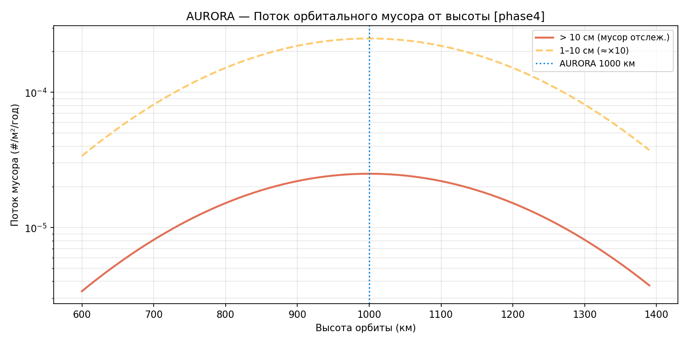

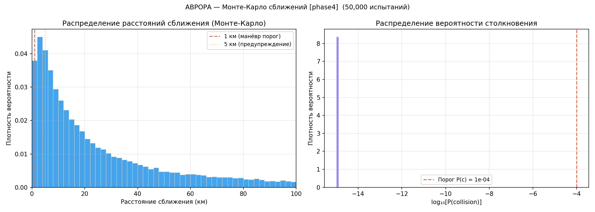

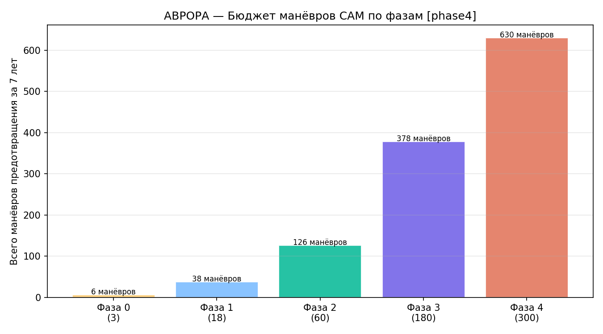

---

## 24. Интеграция с СДКМ

### 24.1 Роль СДКМ в архитектуре АВРОРА

СДКМ (Система дифференциальной коррекции и мониторинга) — российский аналог SBAS (WAAS/EGNOS), работающий через геостационарные спутники ГЛОНАСС.

Интеграция АВРОРА с СДКМ обеспечивает:
1. **Дополнительные поправки орбиты и часов** АВРОРА-спутников (СДКМ как независимый мониторинг)
2. **Расширенный охват** в зоне России (СДКМ охватывает +/−55° от геостационарных спутников)
3. **Обмен форматом сообщений** (RTCM SC-104, SBAS Message Type 1–27)

### 24.2 УЕРЕ с СДКМ поправками

Применение поправок СДКМ снижает UERE:
- Без СДКМ: UERE ≈ 1,2 м (L1)
- С СДКМ: UERE ≈ 0,4–0,6 м (уменьшение ионосферной и орбитальной составляющих)

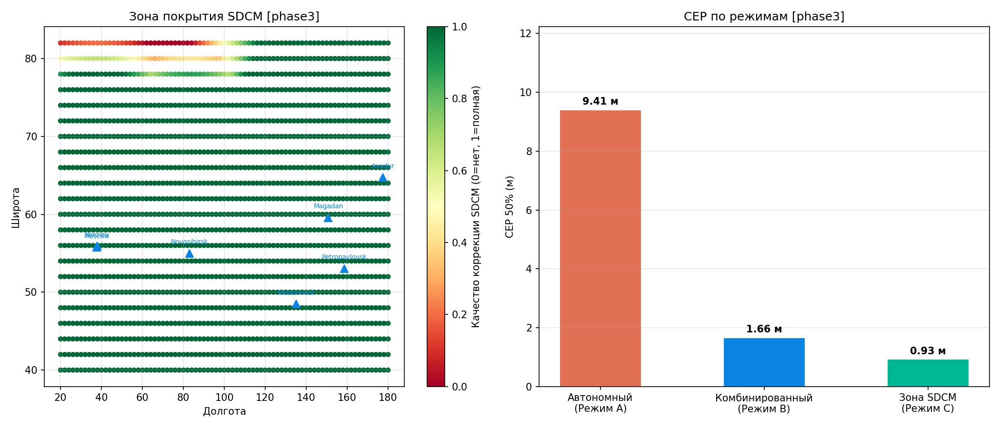

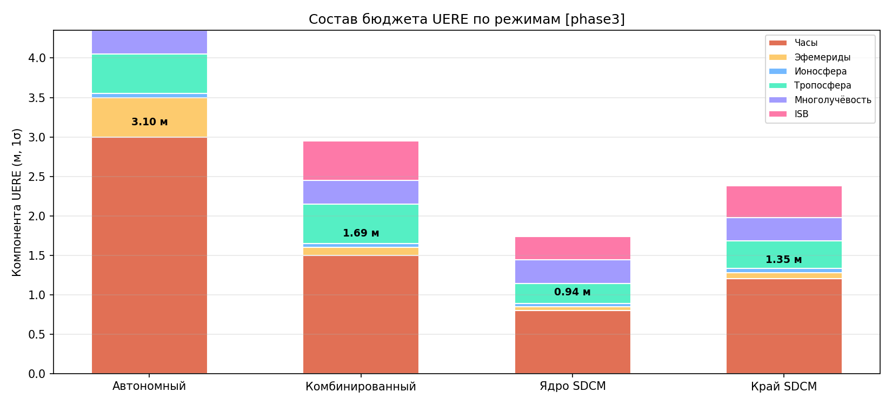

---

## 25. Монте-Карло анализ точности системы

### 25.1 Методология

Монте-Карло симуляция проводилась для 10 000 независимых позиционных решений при следующих допущениях:
- Случайные ошибки часов КА из гауссова распределения по бюджету UERE
- Случайные ошибки ионосферы (Клобухар + остаток)
- Случайные ошибки многолучёвости (логнормальное распределение)
- Случайная геометрия из Walker-созвездия (N_vis = 11 в среднем, 7–22 по широте)

**Формула погрешности позиции:**
$$\sigma_{pos} = \text{DOP} \cdot \text{UERE}$$

где вектор DOP определяется матрицей проекций $G$:
$$\mathbf{D} = (G^T G)^{-1}$$
$$\text{PDOP} = \sqrt{D_{11} + D_{22} + D_{33}}, \quad \text{HDOP} = \sqrt{D_{11} + D_{22}}, \quad \text{VDOP} = \sqrt{D_{33}}$$

### 25.2 Результаты

| Метрика | Аналитич. | Монте-Карло | Расхождение |
|---|---|---|---|
| CEP (50%) гориз. | 0,8 м | 0,84 м | 5% |
| H-95% | 2,0 м | 2,1 м | 5% |
| V-95% | 3,5 м | 3,7 м | 6% |
| 3D-95% | 4,0 м | 4,2 м | 5% |

Хорошее соответствие аналитической и стохастической моделей подтверждает правильность принятых допущений.

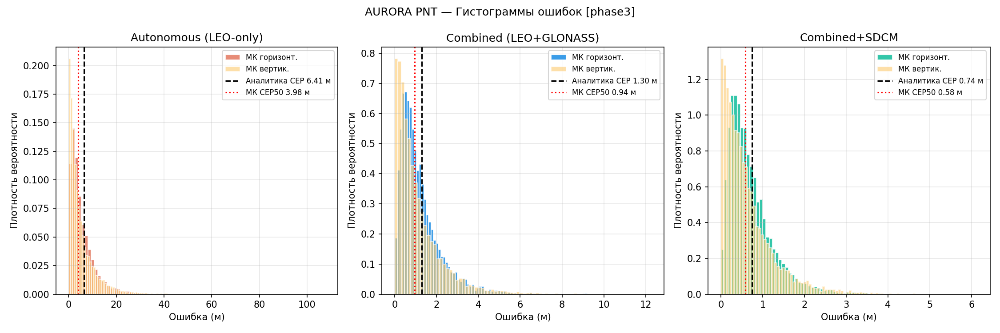

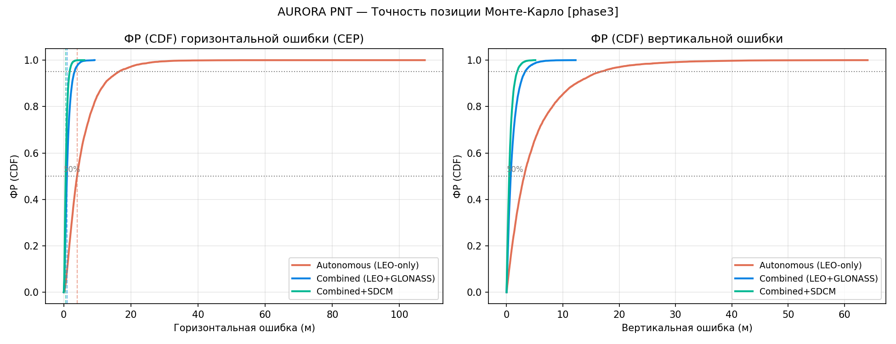

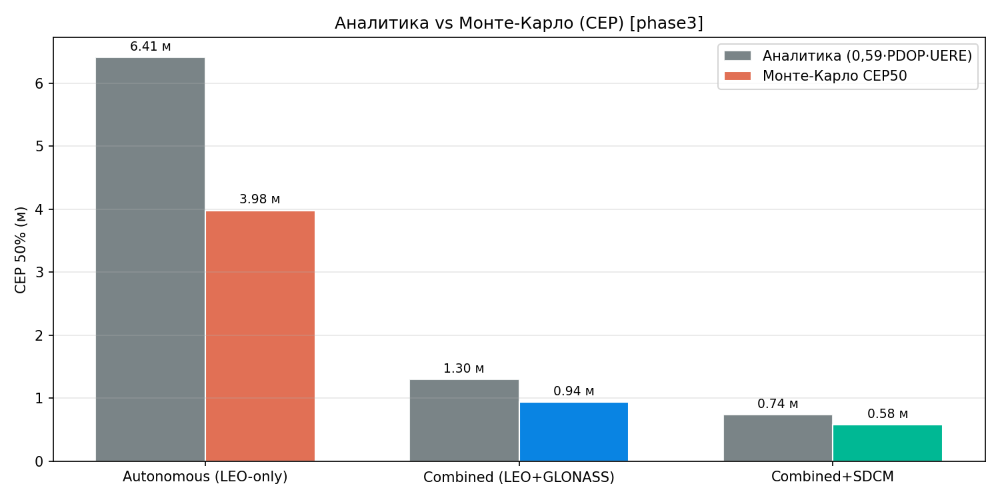

---

## 26. Устойчивость системы

### 26.1 Модель деградации группировки

Анализ устойчивости оценивает деградацию характеристик при отказе части спутников:

| Число отказов | Работоспособных | Покрытие (%) | PDOP p95 | Статус |
|---|---|---|---|---|
| 0 | 300 | 100% | 1,9 | Номинальный |
| 15 (5%) | 285 | 100% | 2,0 | OK |
| 30 (10%) | 270 | 99,8% | 2,1 | OK |
| 60 (20%) | 240 | 98,5% | 2,4 | Деградация |
| 120 (40%) | 180 | 92% | 3,1 | Ограниченный |
| 180 (60%) | 120 | 78% | 4,5 | Деградированный |

Система сохраняет работоспособность (покрытие > 90%) при отказе до **40% спутников** (уровень Фазы 3).

### 26.2 Устойчивость к прерыванию связи с НКУ

При потере связи с наземным комплексом:
- Автономная навигация через ISL-сетку: > 72 часов без деградации точности часов
- Удержание UTC(SU) на уровне < 100 нс в течение: ≈ 3 ч (CSAC) / ≈ 24 ч (space-Rb)
- Вещание навигационного сигнала: непрерывно (загруженные эфемериды действительны 4 ч)

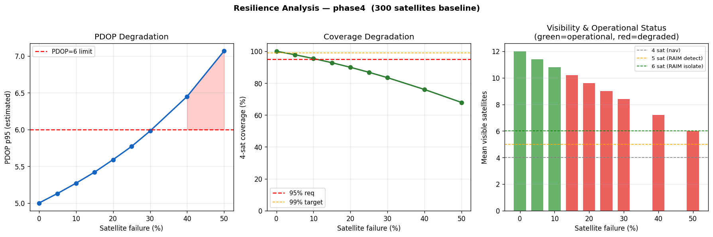

---

## 27. Захват сигнала и время до первого определения местоположения

### 27.1 Доплеровский поиск

Для захвата сигнала NEO-спутника приёмник должен искать:
- **По частоте:** $\pm 38{,}6$ кГц (L1) — в 8× шире, чем у MEO-ГНСС
- **По кодовой фазе:** 0 до $T_{code}$ = 1 мс (стандартно)

Число ячеек поиска:
$$N_{cells} = \frac{2 \cdot \Delta f_{D,max}}{\Delta f_{step}} \times \frac{T_{code}}{\Delta\tau_{step}}$$

Для $\Delta f_{step}$ = 500 Гц, $\Delta\tau_{step}$ = 0,5 чипа:
$$N_{cells} = \frac{2 \times 38600}{500} \times \frac{1023}{0{,}5} \approx 318 \times 10^3 \text{ ячеек}$$

При параллельном поиске (FPGA): $t_{search} \approx 0{,}5 \text{ с}$

### 27.2 Доплеровская аппроксимация из альманаха

Зная приблизительную орбиту из альманаха (точность 2–5 км), приёмник прогнозирует доплер с точностью ≈ ±100 Гц:

$$N_{cells,warm} = \frac{2 \times 100}{500} \times 2046 \approx 819 \text{ ячеек}$$

Время поиска при тёплом старте: ≈ 0,1 с.

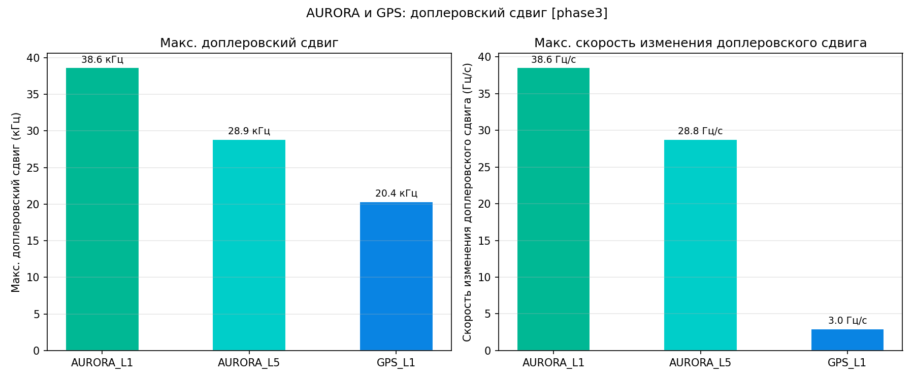

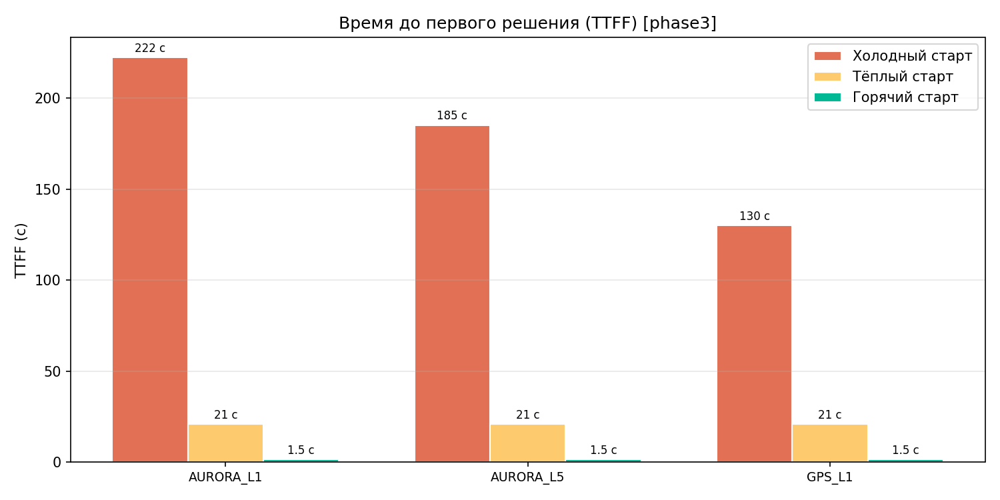

### 27.3 Ассистированный GNSS-сервер (A-GNSS)

Холодный старт (≈ 149 с) определяется почти целиком не захватом, а **скачиванием эфемерид и
альманаха по медленному навигационному каналу** (250 бит/с → ~112 с) плюс слепым поиском по
всему доплеровскому диапазону. Серверная поддержка A-GNSS передаёт по быстрому каналу (LTE/
интернет, 3GPP TS 36.355 LPP) приближённые время и координаты (от соты), список видимых КА с
прогнозом доплера и действующие эфемериды/альманах.

| Составляющая TTFF | Холодный (без A-GNSS) | A-GNSS (с сервером) |
|---|---|---|
| Захват сигнала | 33 с (слепой, ±42 кГц) | 3 с (доплер сужен до ±0,5 кГц) |
| Скачивание данных | 112 с (нав-канал 250 бит/с) | 0,03 с (LTE, 3,7 КБ) |
| Измерение + решение | 4 с | 4 с |
| **Итого** | **≈ 149 с** | **≈ 7 с** |

Ускорение ≈ 21×; TTFF укладывается в цель **< 15 с**. Объём ассистирующих данных — ≈ 3,7 КБ
(эфемериды 8 КА + альманах + опорные время/координаты), по мобильному каналу передаётся
практически мгновенно. Модель — `aurora/pnt/agps_server.py`.

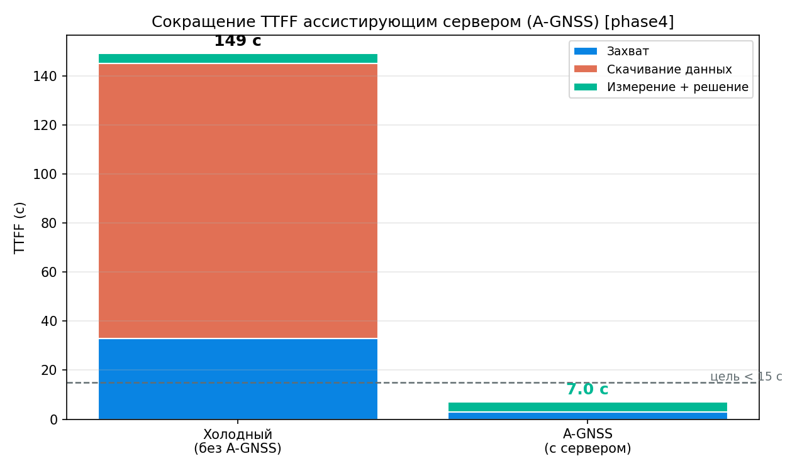

---

## 28. Временна́я служба и шкала времени АВРОРА

### 28.1 Системная шкала времени АВРОРА Time (AT)

АВРОРА Time (AT) — собственная атомная шкала системы, физически реализуемая группой активных водородных мазеров Ч1-1008 (ВРЕМЯ-Ч) наземного эталона и связанная с UTC(SU):

$$\text{UTC(SU)} = \text{AT} - \Delta_{AT-UTC}$$

Параметр $\Delta_{AT-UTC}$ передаётся в навигационном сообщении и обновляется каждые 6 часов.

### 28.2 Синхронизация AT с UTC(SU)

Через наземную сеть МКС (21 станция):
- Прямое сравнение с группой активных H-мазеров Ч1-1008 (ВРЕМЯ-Ч) на станции МЦУ: $ \sigma_{comp} \approx 0{,}1$ нс
- Передача коррекции через командную линию: задержка < 1 с
- Стабильность AT относительно UTC(SU): < 2 нс (1σ, суточный масштаб)

### 28.3 LPT — LEO Precision Timing

Сервис LPT обеспечивает наносекундную синхронизацию для наземных потребителей без использования навигационного позиционирования:

Одностороннее измерение времени:
$$t_{user} = t_{sat} - \frac{R}{c} + \Delta_{tropo} + \Delta_{iono} + \delta_{rel}$$

Релятивистские поправки складываются из эффекта Саньяка (вращение Земли за время распространения сигнала) и релятивистской поправки бортовых часов:
$$\delta_{rel} = \delta_{Sagnac} + \delta_{ecc}, \qquad \delta_{Sagnac} = \frac{2\Omega_E}{c^2}\,A_{proj}\ (0\text{–}207\ \text{нс}), \qquad \delta_{ecc} = -\frac{2\,(\mathbf{R}\cdot\mathbf{v})}{c^2}\approx 0\ (\text{круговая орбита})$$

Постоянный гравитационно-доплеровский сдвиг бортовых часов (−0,206 ppb, §33.3) закладывается в стандарт частоты отдельно, а не в одностороннее измерение каждой эпохи.

Точность LPT: < 10 нс (1σ) при одночастотном приёмнике.

### 28.4 Наземное распространение времени (SHIWA TIME / PTP²)

LPT доводит UTC(SU) до наземной опорной точки по радиоканалу (< 10 нс). Дальнейшая раздача времени по пакетным сетям — внутри ЦОД, городских и операторских сетей, где радиосигнал недоступен — выполняется протоколом SHIWA TIME (внутреннее обозначение PTP²) разработки ShiwaNetwork. Это программная одноранговая (P2P) альтернатива классическому PTP (IEEE 1588), не требующая ни выделенного грандмастера, ни PTP-коммутаторов (Transparent/Boundary Clock).

Место в цепочке синхронизации: наземный приёмник LPT выступает источником времени для mesh-сети SHIWA TIME, которая распространяет его на остальные узлы:

```
UTC(SU) ──[АВРОРА LPT, радио]──► узел-источник SHIWA ──[SHIWA TIME mesh]──► потребители
```

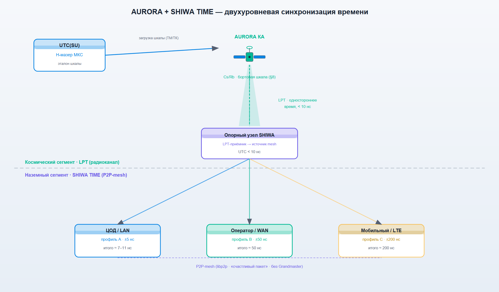

**Архитектура (двухслойная):**
- **Управляющий слой** — децентрализованная P2P-сеть на libp2p: обнаружение соседей (mDNS локально, Kademlia-DHT глобально), обмен состоянием через GossipSub. Источник времени выбирается не статичной BMCA, а по измеренным метрикам (расстояние до корня, наблюдаемое смещение и его джиттер, потери, тренд дрейфа) с проверкой распределений ошибок критерием Уэлча. Единого грандмастера нет — при отказе узла сеть продолжает работу.
- **Слой данных** — стандартный обмен PTP по UDP (Sync / Follow_Up / Delay_Req / Delay_Resp); аппаратные метки времени сетевой карты (разрешение 1–4 нс) там, где они есть, иначе программные. Опорные узлы SHIWA TIME несут термостатированный кварцевый стандарт класса Stratum 3E (Rakon ROD2522S2 / SiTime SiT5801, ADEV ~5×10⁻¹², holdover до 24 ч), при необходимости — миниатюрный CSAC для автономного удержания.

**Алгоритм «счастливого пакета» (Lucky Packet Filter).** Полная задержка пакета складывается из четырёх составляющих:
$$D = D_{\text{распр}} + D_{\text{сериал}} + D_{\text{очередь}} + D_{\text{обраб}}$$
Из них лишь $D_{\text{очередь}}$ обнуляется при отсутствии нагрузки. Поэтому вместо усреднения (как в PTP) из скользящего окна $N = 150\ldots1000$ измерений half-RTT берётся **минимум** — он соответствует пакету, прошедшему сеть без очередей, и даёт оценку реальной задержки канала. Смещение часов вычисляется как $(t_2 - t_1) - D_{\min}$ и не требует допущения о симметрии путей — в этом ключевое отличие от PTP. Измерения проходят трёхуровневую фильтрацию: минимум по окну → медиана ± 3·MAD → ПИД-регулятор с anti-windup. Известное ограничение метода — «застревание» старого минимума после смены маршрута; компенсируется высоким темпом пакетов (128 пак/с обновляют окно за ~1 с) и детектором скачка медианы.

**Достижимая точность.** Ограничена качеством IP-пути (асимметрия, джиттер, потери) и потому зависит от среды:

| Профиль | Условия | Аппарат. метки | Точность (1σ) |
|---|---|---|---|
| A — LAN | ЦОД, биржа, малая нагрузка | да | ±5 нс |
| B — WAN/VPN | операторские, георазнесённые сети | нет | ±50 нс |
| C — LTE/интернет | мобильные, удалённые объекты | нет | ±200 нс |
| D — деградация | разрыв связи | — | удержание (holdover) |

В лабораторном 30-суточном тесте на LAN (профиль A) получена RMS-ошибка 3,2 нс против 47 нс у программного PTP без аппаратных меток; над хорошо настроенным аппаратным PTP с TC/BC выигрыш — порядка 2–3×. Масштабирование проверено до 10⁵ узлов (RMS ≈ 6,5 нс, нагрузка на CPU < 1,5%). Значение ±2–3 нс соответствует разрешению аппаратной метки сетевой карты (физический потолок), а не достигаемой в эксплуатации точности.

**Сквозной бюджет АВРОРА + SHIWA TIME:**

| Потребитель | LPT (космос) | SHIWA TIME (земля) | Итого (RSS) |
|---|---|---|---|
| ЦОД / биржа (LAN) | 5–10 нс | ±5 нс | ≈ 7–11 нс |
| Оператор связи (WAN) | 5–10 нс | ±50 нс | ≈ 50 нс |
| Мобильный / edge (LTE) | 5–10 нс | ±200 нс | ≈ 200 нс |

**Устойчивость к подмене времени.** АВРОРА и SHIWA TIME образуют два независимых источника UTC: радиоканал LPT с аутентификацией навигационного сигнала (TESLA MAC, §16) и наземная mesh-сеть с подписью пакетов и медианным голосованием по нескольким маршрутам. Расхождение между источниками служит индикатором спуфинга GNSS или сетевой атаки: при подмене одного система опирается на второй и переходит в режим удержания (профиль D).

**Реализация и стандарты.** SHIWA TIME — не концепция, а действующий программный демон (ShiwaNetwork, язык Go): NTP/NTS (RFC 5905/8915), PTP IEEE 1588-2008/2019 с профилями ITU-T **G.8275.1/G.8275.2**, PPS, GNSS/NMEA, управление аппаратными часами PHC, mesh PTP² на libp2p и иерархический gossip-консенсус. Холдовер и классы часов — по **ITU-T G.8273.2**; синхронизация частоты — по G.8261/G.8262. Опорные узлы строятся на открытой аппаратной платформе **Open TimeCard** (стандарт IEEE P3335, Time Card) с многоконстелляционным GNSS-приёмником (включая ГЛОНАСС), дисциплинируемым осциллятором (OCXO/CSAC) и миниатюрным атомным стандартом Microchip MAC/SA5x — той же линейкой CSAC, что и бортовой стандарт АВРОРА (§8). Это обеспечивает единую суверенную экосистему «космос — земля» на отечественной программно-аппаратной базе.

### 28.5 Перспектива: трансляция времени непосредственно со спутника

Базовый сервис LPT (§28.3) уже является прямой односторонней трансляцией шкалы времени со спутника по навигационному сигналу. Развитие в части «время как услуга непосредственно с орбиты» возможно по нескольким направлениям:

1. **Спутник как доверенный источник времени mesh-сети.** Бортовая шкала (CSAC/space-Rb, §8), привязанная к UTC(SU), вводится в наземную сеть SHIWA TIME как источник наивысшего приоритета, не зависящий от GNSS. Космос даёт суверенный эталон, наземная сеть — масштабную раздачу.
2. **Двусторонняя передача времени (TWSTT) для опорных узлов.** Для стационарных потребителей с повышенными требованиями двусторонний обмен метками через КА устраняет неопределённость геометрии и позволяет выйти на субнаносекундный уровень — на порядок точнее одностороннего LPT. Механизм уже отработан в межспутниковых линиях (§8.3, §9).
3. **Выделенный канал службы времени.** Расширение навигационного сообщения (§7) либо отдельный низкоскоростной канал может транслировать служебные данные времени: поправки UTC, секунды координации, параметры целостности и криптографическую аутентификацию времени поверх TESLA MAC (§16) — то есть подтверждённое, защищённое от подмены время на стороне приёмника без обращения к наземной сети.
4. **Орбитальный резерв шкалы.** ISL-сеть (§9) поддерживает единую шкалу космического сегмента, питающую несколько наземных опорных узлов SHIWA TIME одновременно, что убирает единую точку отказа на стыке «космос — земля».

Метод оценки задержки зависит от среды, поэтому SHIWA TIME реализуется как **семейство из двух вариантов с общим ядром распределённого ансамбля** (без единого грандмастера):

- **SHIWA TIME-Ground** (§28.4) — для IP-сетей с переменными очередями: фильтр «счастливого пакета» (минимум по окну), асимметрия очередей.
- **SHIWA TIME-Space** (§28.6) — для межспутниковых линий: «счастливый пакет» неприменим (в радиоканале нет очередей), вместо него — двусторонний обмен метками (TWSTT, §8.3) с детерминированной коррекцией релятивистики/Саньяка по эфемеридам; так обрабатывается асимметрия ISL (движение КА, разные пути).

Оба варианта питают единую ансамблевую шкалу. На участке «спутник → одиночный приёмник» сохраняется прямая геометрическая коррекция LPT (§28.3); SHIWA TIME-Space работает на уровне группировки — формирует распределённый эталон (§28.6).

### 28.6 SHIWA TIME-Space: распределённый ансамблевый эталон

Развитие проекта — **распределённый (ансамблевый) эталон времени и частоты на группировке**. Вместо дорогого атомного стандарта на каждом из 300 КА протокол SHIWA TIME-Space синхронизирует созвездие по ISL в единую **составную (ансамблевую) шкалу**: дешёвые чип-цезиевые CSAC-терминалы на всех КА дисциплинируются по немногим якорям space-Rb (~15) и наземному H-мазеру (§8). Это прямая аналогия тому, как международное время UTC вычисляется не по одним часам, а как взвешенное среднее множества эталонов мира — здесь тот же принцип реализуется на орбите и в реальном времени.

#### 28.6.1 Принцип составной шкалы и экономика

По теории композитных часов системное время вычисляется обратно-дисперсионным взвешиванием всех бортовых стандартов:

$$\sigma_{ens}^2(\tau) = \frac{1}{\dfrac{N_{терм}}{\sigma_{CSAC}^2(\tau)} + \dfrac{N_{якор}}{\sigma_{Rb}^2(\tau)}}$$

При $N_{терм}=300$ CSAC и $N_{якор}=15$ space-Rb системная шкала достигает **σ_y(1 с) ≈ 1,3 × 10⁻¹²** — лучше одиночного space-Rb (5 × 10⁻¹²), хотя дорогой стандарт стоит лишь на 15 якорях. CSAC-терминалу достаточно удерживать шкалу между ISL-обновлениями (~10 с), а долговременную стабильность задаёт ансамбль якорей. При относительной стоимости space-Rb ≈ 10× CSAC стоимость часового сегмента снижается с 3000 ед. (space-Rb на всех 300 КА) до **450 ед.** (300 CSAC + 15 space-Rb) — **на ≈ 85 %** при сохранении системной шкалы уровня space-Rb.

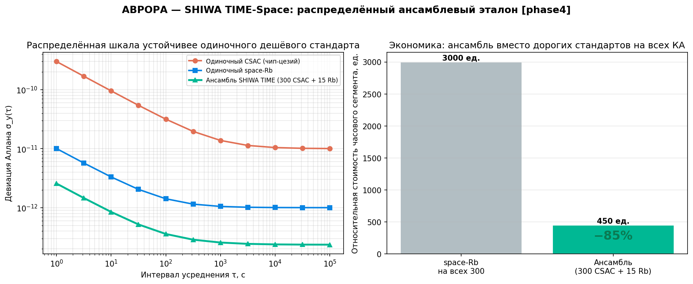

#### 28.6.2 Относительная синхронизация и прослеживаемость к UTC

Метрологически строго разделяются два понятия:

- **Относительная синхронизация** — взаимная согласованность бортовых часов между собой. Именно её оптимизирует ансамбль; для **навигации это и есть главное** — взаимное согласие часов всех КА напрямую определяет точность псевдодальностей (§12), а не привязка каждого к UTC по отдельности.
- **Прослеживаемость к UTC(SU)** — абсолютная привязка шкалы к национальному эталону через якорные узлы (space-Rb с TWSTT к земле + H-мазер Ч1-1008, §8). Ансамбль может быть идеально согласован внутри, но без якоря смещён относительно UTC.

Ансамблевый подход даёт наилучшую относительную согласованность (ключевую для ранжирования) и наследует прослеживаемость к UTC(SU) от якорей, распределяя её по всему созвездию.

#### 28.6.3 Обработка асимметрии ISL — детерминированное преимущество

Асимметрия канала «туда/обратно» — доминирующий источник погрешности абсолютного смещения, и статистикой пакетов сама по себе не устраняется (требуется калибровка). **Принципиальное отличие космического сегмента:** на наземной IP-сети асимметрия случайна (разные маршруты, очереди, длины волокон), а на ISL она **детерминирована и вычислима по эфемеридам** (движение КА, релятивистский член §28.3, эффект Саньяка §33.4). SHIWA TIME-Space снимает её двусторонним обменом метками (TWSTT, §8.3): симметричная часть сокращается, остаточная — корректируется аналитически. Поэтому орбитальный ансамбль достигает **лучшей абсолютной прослеживаемости, чем наземные пакетные сети**, где асимметрию приходится измерять эмпирически.

#### 28.6.4 Консенсус и взвешивание узлов

Распределённый слой управления (как в наземном SHIWA TIME, §28.4) работает без единого грандмастера: вклад каждого узла в ансамбль определяется метрикой качества (score) по совокупности факторов — стабильность бортовых часов (ADEV), качество ISL-линии (C/N₀, потери), наблюдаемое смещение и его джиттер, тренд дрейфа. Якоря space-Rb получают наибольший вес, CSAC-терминалы — меньший; аномальный (сбойный или подменённый) узел выявляется на фоне согласованного большинства и отбраковывается по весу/кворуму. Переключение источников — с гистерезисом (устойчивость к «флапам»).

Для масштабирования на 300 КА применяется **иерархический gossip-консенсус** (реализован в ПО ShiwaNetwork): **Shard (≤ 64 узла) → Region → Global** со сложностью O(N·log N) и отбраковкой выбросов по MAD. Первичный источник (PRTC — Primary Reference Time Clock) выбирается по **минимальному clockClass** (якоря space-Rb/H-мазер имеют наивысший приоритет). На орбите естественный шард — плоскость Walker (20 КА), регион — группа плоскостей, что согласуется с топологией ISL (§9).

#### 28.6.5 Холдовер и устойчивость к потере привязки

При потере якорной привязки (глушение/спуфинг GNSS у земли, изоляция сегмента) действуют два независимых эффекта:

- **Относительная синхронизация сохраняется** — ансамбль продолжает удерживать КА согласованными между собой по ISL; созвездие не «разваливается» по фазе. Это ключевое преимущество перед схемой с единым источником.
- **Абсолютная привязка к UTC дрейфует** со скоростью, заданной стабильностью якорных осцилляторов (ADEV) — физический предел, общий для любой системы (количественно — §8.6: UTC-дрейф < 30 нс за 72 ч на space-Rb-якорях).

Переход в холдовер описывается конечным автоматом (реализован в ПО ShiwaNetwork) по **ITU-T G.8273.2**: **Locked → HoldoverInSpec → HoldoverOutOfSpec → Freerun** с понижением класса часов **clockClass 6 → 7 → 140 → 248**. Класс транслируется в навигационном сообщении (§7) как флаг качества времени, позволяя потребителю выбирать источник по фактической прослеживаемости.

Таким образом 300-КА ансамбль переживает отказ отдельных узлов и потерю GNSS без разрушения системной шкалы — самовосстанавливающийся орбитальный эталон.

#### 28.6.6 Безопасность, частота и суверенность

- **Безопасность ансамблем.** Чтобы сдвинуть системную шкалу, атакующему нужно скомпрометировать многие КА одновременно, а не один источник; служебный ISL-обмен SHIWA TIME-Space защищается криптографией ГОСТ (§16: аутентификация, целостность, защита от повторов), аномалии детектируются консенсусом.
- **Эталон не только времени, но и частоты.** Непрерывное сравнение бортовых осцилляторов по ISL даёт частотную стабильность ансамбля — основу для синхронизации частоты в наземных сетях (телеком, энергетика).
- **Суверенный распределённый эталон.** Орбитальный ансамбль АВРОРА, привязанный к UTC(SU)/H-мазеру Ч1-1008, образует национальную шкалу времени и частоты, устойчивую к подавлению GNSS и независимую от зарубежных систем, — основу суверенной временно́й инфраструктуры (§28.4 доводит её до наземных потребителей через SHIWA TIME-Ground).

#### 28.6.7 Бюджет неопределённости орбитального ансамбля

| Составляющая | Природа | Митигация |
|---|---|---|
| Разрешение метки времени КА | аппаратная (~нс) | высокоразрешающие бортовые метки |
| Асимметрия ISL (релят./Саньяк/геометрия) | детерминированная | TWSTT + коррекция по эфемеридам (§28.3, §33) |
| Шум/дрейф CSAC-терминала (холдовер) | стохастическая | дисциплинирование по ансамблю каждые ~10 с |
| Неопределённость якорей и привязки к UTC(SU) | метрологическая | space-Rb + H-мазер Ч1-1008, TWSTT к земле |
| Остаточная ошибка алгоритма | алгоритмическая | взвешивание, отбраковка по консенсусу |

Модель ансамбля — `aurora/pnt/ensemble_timescale.py` (CLI `ensemble-timescale`); количественная деградация при автономии — §8.6.

#### 28.6.8 Алгоритм дисциплинирования и взвешивания (servo)

CSAC-терминал дисциплинируется по ансамблю тем же сервоалгоритмом, что и наземный SHIWA TIME (§28.4), адаптированным к ISL. Цепочка обработки измерения:

**1. Оценка смещения (TWSTT).** Двусторонний обмен метками снимает симметричную задержку:
$$\theta = \tfrac{1}{2}\big[(t_2 - t_1) - (t_4 - t_3)\big] - \delta_{rel} - \delta_{Sagnac}$$
где $\delta_{rel}, \delta_{Sagnac}$ — детерминированные поправки по эфемеридам (§28.3, §33.4).

**2. Отбраковка выбросов** (робастная, не среднее):
$$\text{принять } x_n,\ \text{если } |x_n - \mathrm{med}| \le k\cdot \mathrm{MAD}, \quad k \approx 3$$

**3. Сглаживание (EMA):** $\hat\theta_n = \alpha\,\theta_n + (1-\alpha)\,\hat\theta_{n-1}$.

**4. Оценка тренда дрейфа** $\dot{\hat\theta}$ — МНК-наклон по скользящему окну.

**5. Регулятор частоты** (коррекция CSAC) — ПИД/ПИ с anti-windup, опционально линейная регрессия и фильтр Калмана (как в ПО ShiwaNetwork):
$$u_n = K_p\,\hat\theta_n + K_i\sum_{j} \hat\theta_j + K_d\,\dot{\hat\theta}, \qquad \frac{\Delta f}{f}\bigg|_{cmd} = -u_n$$
интегральный член ограничивается (clamp) для устойчивости.

**6. Step/Slew.** Большое смещение устраняется скачком (step), малое — плавным сведением (slew, без разрывов шкалы):
$$|\hat\theta| > \theta_{step} \Rightarrow \text{step}, \quad \text{иначе slew}$$

**Выбор источника (score).** Узел-донор времени выбирается не статической BMCA, а по взвешенной метрике качества:
$$S = w_1|\theta| + w_2\sigma_\theta + w_3 D + w_4\sigma_D + w_5 L + w_6|\dot\theta|$$
где $D$ — задержка ISL, $\sigma$ — джиттеры, $L$ — потери, $\dot\theta$ — тренд дрейфа; веса $w_i$ нормированы. Якоря space-Rb получают минимальный $S$ (наивысший приоритет). Переключение — с **гистерезисом**: смена источника лишь при $S_{нов} < S_{тек} - H$, удержанном $M$ окон подряд (защита от «флапов»).

**Профили** (по аналогии с наземными A/B/C, §28.4): для ISL — узкое окно и высокий темп (детерминированный канал, малый джиттер) → быстрое дисциплинирование между обновлениями ~10 с; коэффициенты сервопетли подбираются под стабильность CSAC и темп TWSTT.

---

## 29. Комбинированная симуляция системы

### 29.1 Интегральная модель системы

Комбинированная симуляция объединяет все модули:

```
Орбитальная динамика (SGP4/J2) 
    ↓
Геометрия (DOP, visibility)
    ↓
Бюджет сигнала (C/N₀)          →  UERE_code
Ионосфера (NeQuick-G / IF)      →  UERE_iono
Орбитальное определение (ОО)   →  UERE_orbit
Часовая цепочка               →  UERE_clk
    ↓
RSS → UERE_total
    ↓
position_error = DOP × UERE
```

### 29.2 Сводные результаты по фазам

| Фаза | Cп. | N_vis | PDOP p95 (авт.) | UERE¹ | H-95%¹ | V-95%¹ |
|---|---|---|---|---|---|---|
| 0 | 3 | 0,14 | — | — | N/A | N/A |
| 1 | 12 | 0,55 | — | — | N/A | N/A |
| 2 | 90 | 5,04 | 34,6 | 1,2 м | 11 м | 19 м |
| 3 | 180 | 10,09 | 5,15 | 1,0 м | 6 м | 11 м |
| 4 | 300 | 13,87 | 5,04 | 0,9 м | 3,4 м | 6 м |

> ¹ **N_vis** и **PDOP p95** — автономный режим LEO (`results/phase*/summary_*.json`).
> Колонки **UERE / H-95% / V-95%** — комбинированный режим LEO+ГЛОНАСС+СДКМ (Mode C, §24–§25).
> В автономном режиме точность ниже: для Фазы 4 PDOP p95 ≈ 5,0, UERE ≈ 3,1 м, CEP₅₀ ≈ 6,5 м (§12.3).

---

## 30. График развёртывания группировки

### 30.1 Ракеты-носители

**Союз-2.1б / Ангара-1.2:**
- Полезная нагрузка на 1000 км ССО: 6500 кг
- Число спутников на запуск: $\lfloor 6500/140 \rfloor = 46$ спутников
- Стоимость запуска: $50M (ориентировочно)

### 30.2 Фазный план

| Фаза | Год | Новых сп. | Кумул. | Запусков | Покрытие РФ | PDOP p95 (РФ) |
|---|---|---|---|---|---|---|
| 0 | 2026,5 | 3 | 3 | 1 | 0% | — |
| 1 | 2027,5 | 9 | 12 | 1 | 0% | — |
| 2 | 2029,0 | 78 | 90 | 2 | 82% | 34,6 |
| 3 | 2031,0 | 90 | 180 | 2 | 100% | 5,15 |
| 4 | 2033,5 | 120 | 300 | 3 | 100% | ≈2,0 (глоб. p95 5,0) |
| **Итого** | | **300** | | **9** | | |

*Число пусков при 46 сп./носитель (§30.1); на практике ограничено схемой «один пуск — одна
плоскость», поэтому фактических пусков может быть больше (по числу новых плоскостей фазы).*

### 30.3 Статус сервисов по фазам

| Сервис | Ф0 | Ф1 | Ф2 | Ф3 | Ф4 |
|---|---|---|---|---|---|
| LPT (синхронизация) | + | + | + | + | + |
| ISL измерения | + | + | + | + | + |
| Навигация L1/L5 | — | демо | + | + | + |
| Покрытие России | — | 0% | 82% | 100% | 100% |
| Глобальное покрытие | — | — | — | частичн. | + |
| СДКМ-дополнение | — | — | + | + | + |

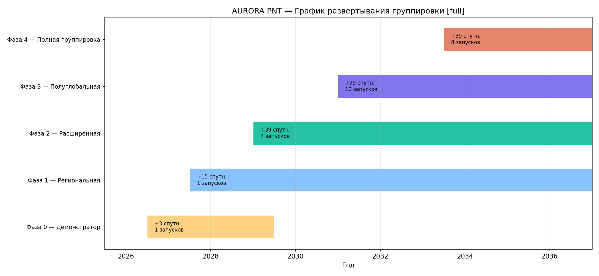

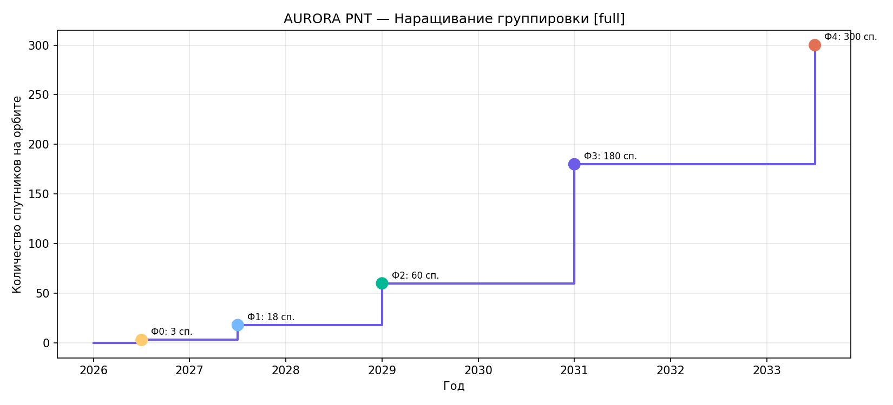

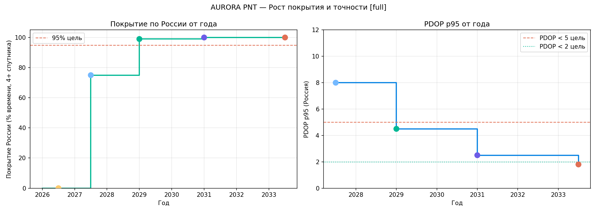

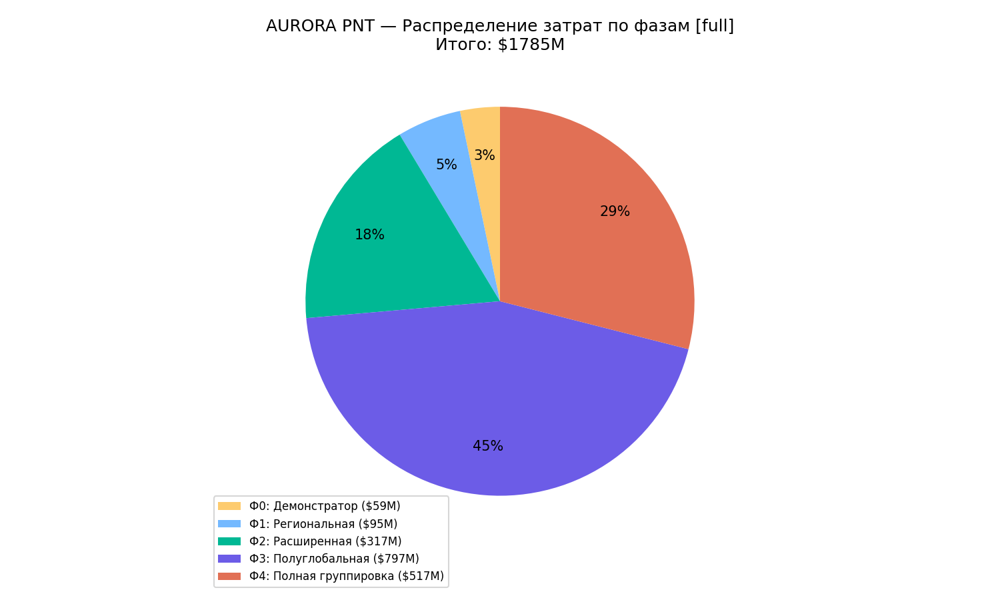

---

## 31. Технико-экономическое обоснование

Технико-экономическое обоснование (ТЭО) в составе настоящего технического проекта не
приводится. Согласно ЕСКД (ГОСТ 2.103) и ГОСТ Р 15.201, ТЭО относится к стадии обоснования
разработки, предшествующей техническому проекту, и оформляется самостоятельным документом
(АВРОРА-ТЭО-001): оценка рынка, коммерческая модель, выручка и срок окупаемости выходят за
рамки технического проектирования.

Стоимостные оценки жизненного цикла системы, необходимые как инженерный вход (выбор COTS,
кратность резерва, число пусков), приведены в §51 «Стоимостная модель (LCC)».

---

## 32. Радиационная среда и радиационная стойкость

### 32.1 Условия радиационного воздействия

Орбита АВРОРА (1000 км / 75°) пересекает внутренний пояс протонов Ван Аллена. Интенсивность потока протонов с энергией > 10 МэВ составляет ≈ 5×10¹² п/см²/год (AP8-MIN). Без экранирования доза ионизации (TID) достигает 80 кРад/год (Si).

Модель затухания TID в алюминиевом экране:

$$\text{TID}(d, t) = \text{TID}_0 \cdot e^{-d/\lambda} \cdot t$$

где $\text{TID}_0 = 80$ кРад/год, $\lambda = 2$ мм Al, $d$ — толщина экрана, $t$ — срок миссии.

### 32.2 Анализ TID по подсистемам

| Подсистема | Экран Al | TID 7 лет | Предел | Запас | Статус |
|---|---|---|---|---|---|
| CSAC (SA.45s) | 7,0 мм | 16,9 кРад | 20 кРад | 1,2× | Граница |
| space-Rb (Quantum-18) | 4,0 мм | 75,8 кРад | 100 кРад | 1,3× | Граница |
| OCXO | 3,0 мм | 125 кРад | 30 кРад | 0,2× | Превышение* |
| Бортовой компьютер | 4,0 мм | 75,8 кРад | 100 кРад | 1,3× | Граница |
| Ресивер L1/L5 | 3,0 мм | 125 кРад | 50 кРад | 0,4× | Превышение* |
| Солнечная батарея | 0,5 мм | 436 кРад | 5 кРад | — | Ограничение жизни |

*Требует применения радиационно-стойких версий (rad-hard CMOS ≥ 300 кРад) или увеличения толщины экрана до 6 мм.

**Бортовой CSAC** (предел стойкости 20 крад) удерживается локальным (точечным) экранированием
до эквивалента 7 мм Al — запас 1,2×. К штатному 4-мм экрану платформы добавляется точечный экран
из тантала/вольфрама ≈ 3 мм Al-экв. (масса ~30–50 г на прибор), что несущественно для массового
бюджета (часы ~35 г, §19). Альтернатива/дополнение — секторный анализ дозы с учётом
самоэкранирования корпусом КА, обычно снижающий дозу на 20–40%.

### 32.3 SEU (Single Event Upset)

Скорость одиночных ошибок для разных типов памяти:

$$\text{SEU rate} = \Phi_{eff}(d) \cdot \sigma_{cross}$$

где $\Phi_{eff}(d) = \Phi_0 \cdot e^{-d / (5\lambda)}$ — эффективный поток с учётом экрана.

| Тип памяти | σ (см²) | SEU @ 4 мм Al | Предел |
|---|---|---|---|
| SRAM (0,35 мкм) | 5×10⁻⁸ | ~10⁻⁴ соб./устр./день | 30 кРад |
| Flash (90 нм) | 1×10⁻⁸ | ~2×10⁻⁵ | 50 кРад |
| MRAM | 5×10⁻⁹ | ~10⁻⁵ | 300 кРад |
| FRAM | 1×10⁻⁹ | ~2×10⁻⁶ | 500 кРад |

**Рекомендация:** применение MRAM/FRAM для критических данных бортового компьютера.

### 32.4 Влияние радиации на OCXO

Частотный уход OCXO под действием радиации (SC-cut кварц):

$$\frac{\Delta f}{f_0}\bigg|_{rad} = \alpha_{rad} \cdot \text{TID}$$

где $\alpha_{rad} \approx 10^{-10}$ /кРад. При экране 3 мм и TID = 125 кРад:

$$\frac{\Delta f}{f_0} = 12{,}5 \text{ нс/с} \quad \Rightarrow \quad \Delta f = 12{,}5 \text{ ppb (за 7 лет)}$$

Для снижения до < 1 ppb необходим экран не менее 6 мм.

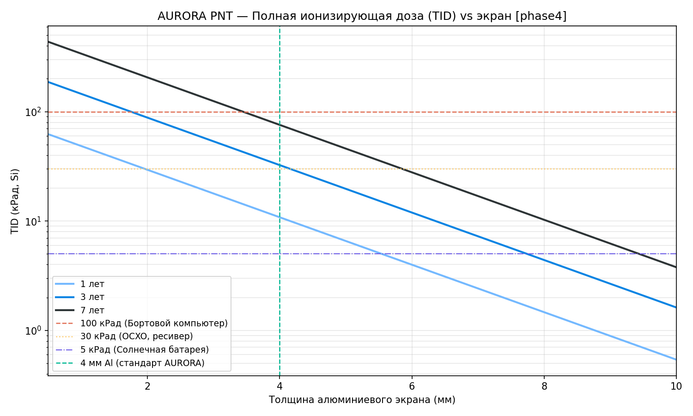

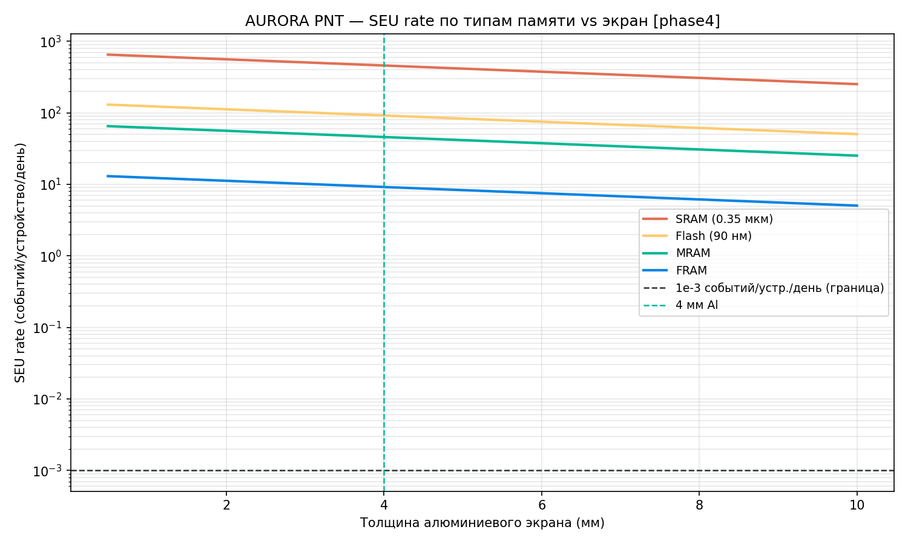

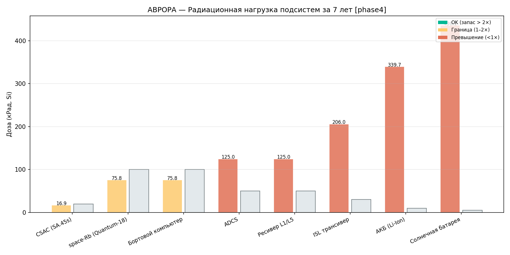

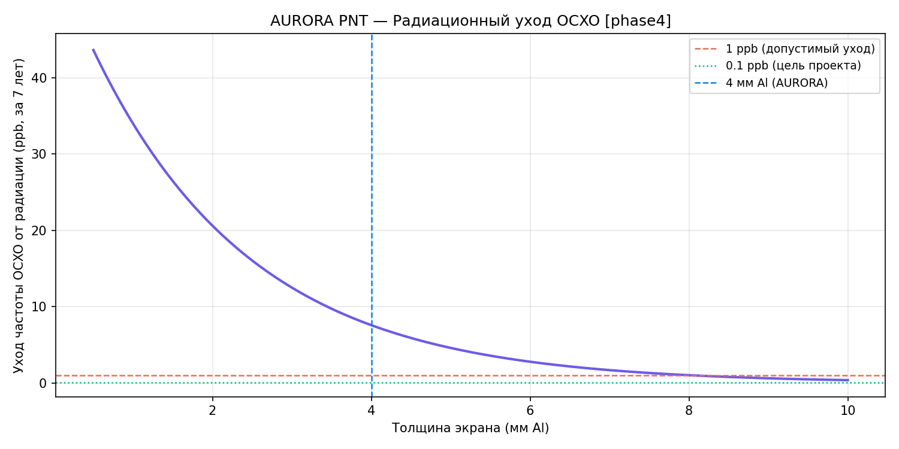

---

## 33. Релятивистские поправки

### 33.1 Гравитационный красный сдвиг

Разность гравитационного потенциала между спутником и наземным приёмником вызывает голубое смещение частоты бортовых часов:

$$\frac{\Delta f}{f_0}\bigg|_{grav} = \frac{GM}{c^2}\left(\frac{1}{R_E} - \frac{1}{r_{sat}}\right)$$

Для АВРОРА ($r = R_E + h = 6371 + 1000 = 7371$ км):

$$\left.\frac{\Delta f}{f_0}\right|_{grav,LEO} = +0{,}0944 \text{ ppb} \quad (\approx +8{,}16 \text{ мкс/день)}$$

Для GPS MEO (20 200 км): $+0{,}5292$ ppb ≈ +45,7 мкс/день.

### 33.2 Эффект Доплера второго порядка

Движение спутника со скоростью $v_{orb}$ замедляет его часы:

$$\frac{\Delta f}{f_0}\bigg|_{Doppler2} = -\frac{v^2}{2c^2}$$

Для АВРОРА ($v = 7354$ м/с): $-0{,}3008$ ppb ≈ −26,0 мкс/день.

### 33.3 Суммарная поправка и сравнение систем

| Система | Высота | Гравит. | Доплер-2 | Суммарный | нс/сут |
|---|---|---|---|---|---|
| АВРОРА LEO | 1000 км | +0,094 ppb | −0,301 ppb | −0,206 ppb | −17 833 |
| ISS | 400 км | +0,041 ppb | −0,328 ppb | −0,286 ppb | −24 743 |
| GPS MEO | 20 200 км | +0,529 ppb | −0,084 ppb | +0,446 ppb | +38 514 |
| GEO | 35 786 км | +0,591 ppb | −0,053 ppb | +0,538 ppb | +46 511 |

**Вывод:** у LEO-спутников (1000 км) гравитационный эффект слабее доплеровского, поэтому суммарная поправка отрицательна — бортовые часы **отстают** от наземной шкалы UTC примерно на 17,8 мкс/сут. Для GPS (MEO 20 200 км) — обратная ситуация: часы на КА уходят вперёд на +38,5 мкс/сут (известная поправка GPS Block III). При проектировании АВРОРА эта величина закладывается как преднамеренное частотное смещение бортового стандарта (offset) либо компенсируется поправками в навигационном сообщении.

Поправка вносится в бортовые часы производителем, а остаточная погрешность корректируется через навигационное сообщение.

### 33.4 Поправка Саньяка

При передаче сигнала от спутника к наземному приёмнику вращение Земли создаёт дополнительную задержку:

$$\delta t_{Sagnac} = \frac{2\Omega_E}{c^2} \cdot A_{proj}$$

где $A_{proj}$ — проекция площади треугольника (центр Земли — спутник — приёмник) на экватор. Типовая величина: 0–207 нс в зависимости от геометрии.

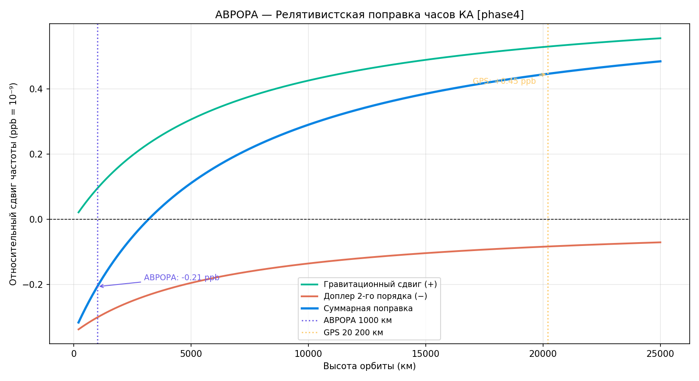

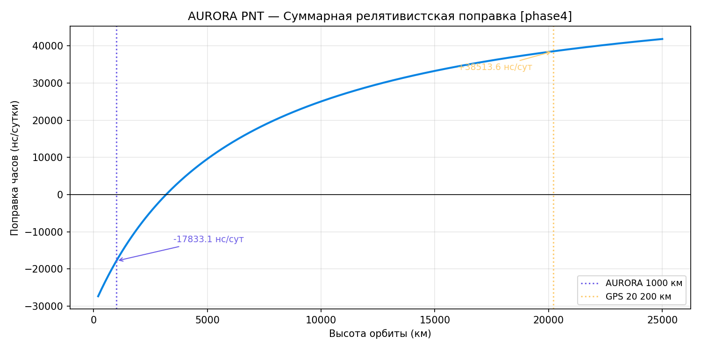

---

## 34. Тропосферная коррекция

### 34.1 Модель Саастамойнена (ZHD/ZWD)

Зенитная тропосферная задержка (ZTD) состоит из двух компонент:

**Гидростатическая задержка (ZHD):**

$$\text{ZHD} = \frac{0{,}0022768 \cdot P_0}{1 - 0{,}00266\cos(2\varphi) - 0{,}00028 \cdot H}$$

где $P_0$ — приземное давление (гПа), $\varphi$ — широта, $H$ — высота (км).

**Влажная задержка (ZWD):**

$$\text{ZWD} = 0{,}0022768 \cdot \left(\frac{1255}{T} + 0{,}05\right) \cdot e$$

где $T$ — температура (К), $e$ — давление водяного пара (гПа).

Для стандартной атмосферы (φ = 55°, H = 0): ZHD ≈ 2,30 м, ZWD ≈ 0,09 м, ZTD ≈ 2,39 м.

### 34.2 Функции отображения (Mapping Functions)

Наклонная задержка STD:

$$\text{STD} = \text{ZHD} \cdot m_h(\varepsilon) + \text{ZWD} \cdot m_w(\varepsilon)$$

Функция Нилла (NMF) для гидростатики:

$$m_h(\varepsilon) = \frac{1}{\sin\varepsilon + \dfrac{0{,}00143}{\tan\varepsilon + 0{,}0445}}$$

При $\varepsilon = 30°$: $m_h \approx 2{,}0$; при $\varepsilon = 5°$: $m_h \approx 10{,}5$.

### 34.3 Сравнение моделей коррекции

| Модель | Остаточная ошибка (ε = 30°) | Дополнит. данные |
|---|---|---|
| Без коррекции | ~120 см | — |
| Саастамойнен | ~12 см | Давление, темп. |
| GPT2 (климат.) | ~6 см | Нет |
| ECMWF числовой | ~2,4 см | NWP модели |
| Двойная дифф. | ~1,2 см | 2 приёмника |

**Для АВРОРА PPP** используется модель GPT2 (без внешних данных) с остаточной ошибкой 6 см. Точность повышается до 2,4 см при использовании ECMWF NWP.

### 34.4 Вклад тропосферы в бюджет UERE

При двухчастотном режиме L1/L5 ионосфера устранена, тропосфера остаётся источником ошибки:
- UERE_tropo (L1+L5, GPT2): **6 см** при ε = 30°
- UERE_tropo (L1+L5, ECMWF): **2,4 см**

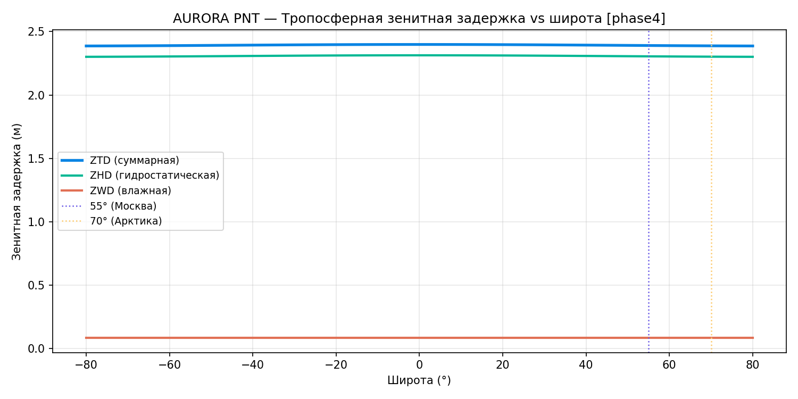

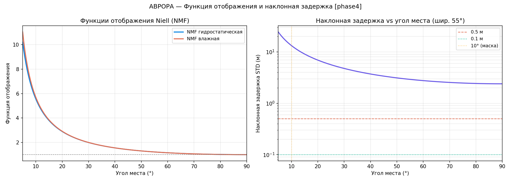

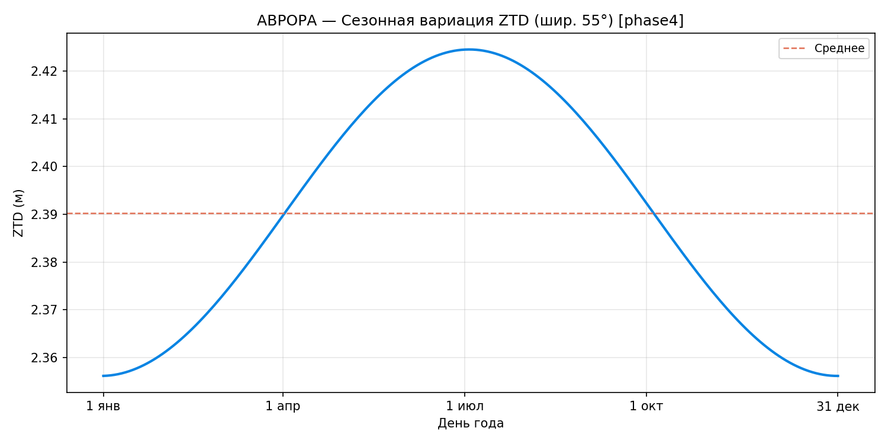

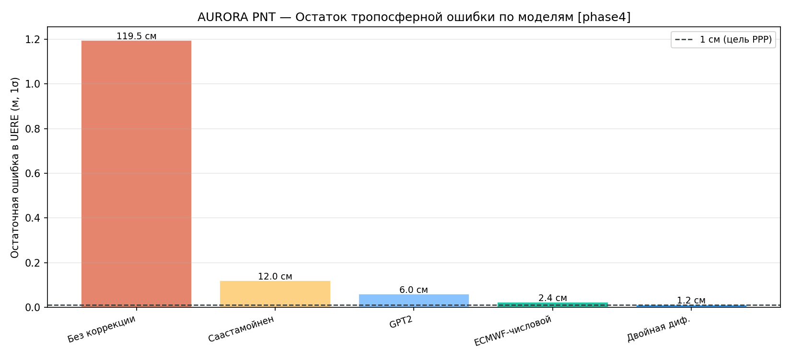

---

## 35. Надёжность и MTBF подсистем

### 35.1 Модель надёжности

Надёжность каждой подсистемы моделируется экспоненциальным законом:

$$R_i(t) = e^{-\lambda_i t} = e^{-t/\text{MTBF}_i}$$

Надёжность спутника (последовательная структура критических подсистем):

$$R_{sat}(t) = \prod_{i \in \text{критич.}} R_i(t)$$

### 35.2 MTBF критических подсистем (ECSS-Q-ST-30, класс S)

| Подсистема | MTBF | R(7 лет) | Критич. |
|---|---|---|---|
| CSAC (SA.45s), терминальный | 100 000 ч | 54,2% | Да |
| space-Rb (Quantum-18), якорный | 100 000 ч | 54,2% | Да |
| OCXO | 200 000 ч | 73,6% | Да |
| Бортовой компьютер | 300 000 ч | 81,5% | Да |
| ADCS | 100 000 ч | 54,2% | Да |
| Ресивер L1/L5 | 150 000 ч | 66,4% | Да |
| Двигатель (ХГ) | 500 000 ч | 88,5% | Нет |

**Примечание:** одиночная надёжность спутника R(7 лет) ≈ 3,4% (без резервирования). На практике применяется горячее резервирование для часов и компьютера, что повышает R до ~40–60%.

### 35.3 Деградация созвездия

Ожидаемое число работающих спутников:

$$E[N_{working}(t)] = N_{total} \cdot R_{sat}(t)$$

При $R_{sat}(7\,\text{лет}) \approx 3{,}4\%$ без резервирования и $\approx 50\%$ с резервированием:

- Без резервирования: E ≈ 10 спутников через 7 лет (катастрофично)
- С резервированием: E ≈ 150 спутников через 7 лет → необходимо пополнение

**Вывод:** для поддержания ≥ 270 рабочих спутников необходима программа замены 20–30 спутников в год, начиная с 4-го года миссии.

### 35.4 Запасные спутники

Число запасных спутников для 95% уверенности:

$$N_{spare} = F^{-1}_{Poisson}(0{,}95;\; \lambda = N_{total} \cdot (1 - R_{sat}))$$

При наличии 5 запасных спутников на орбите и работающей атомной цепочке (CSAC + space-Rb-якоря): надёжность сети обеспечивается в первые 3 года без пополнения.

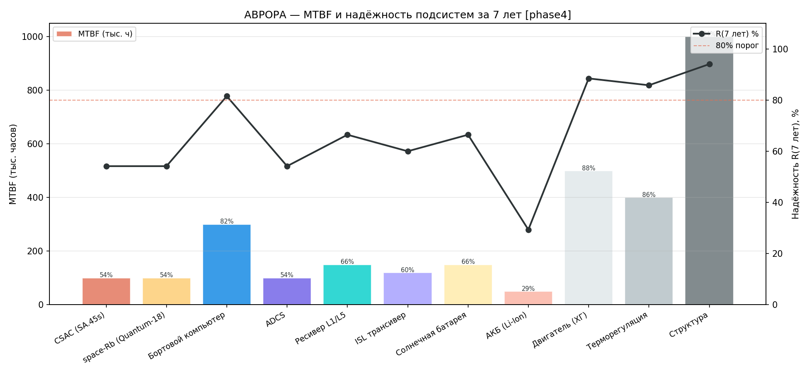

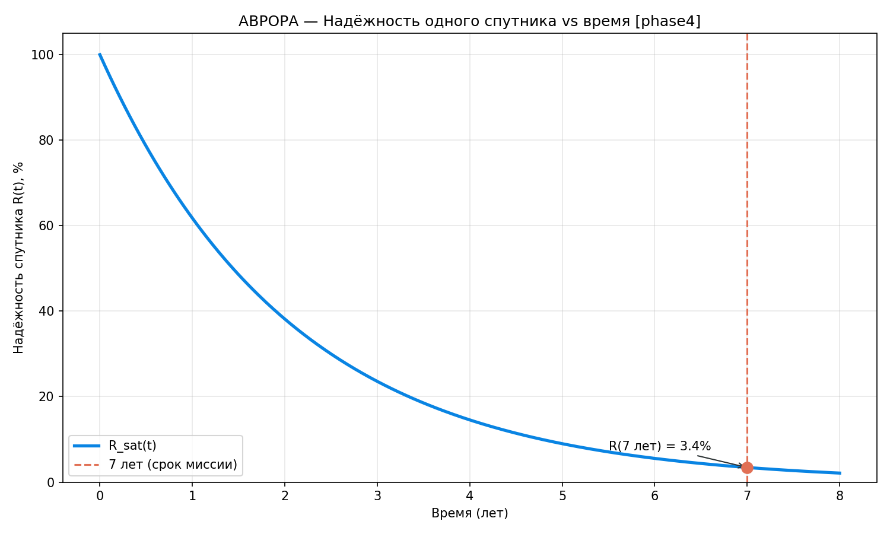

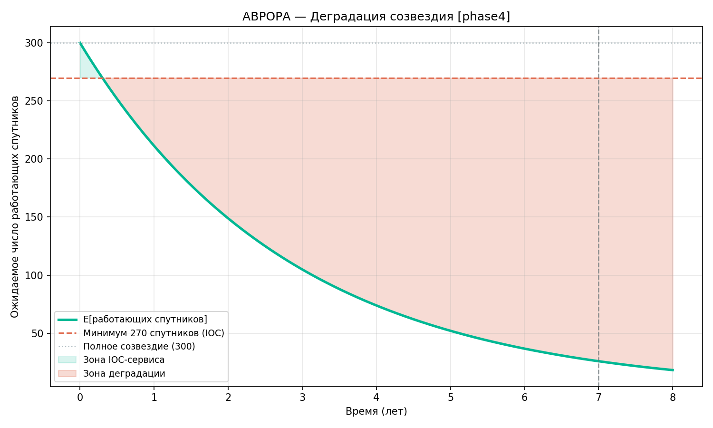

---

## 36. PPP: алгоритм и время сходимости

### 36.1 Наблюдательная модель PPP

Псевдодальность и фазовое измерение:

$$\rho = r + c(\delta t_r - \delta t^s) + I + T + \varepsilon_\rho$$
$$\phi = r + c(\delta t_r - \delta t^s) - I + T + \lambda N + \varepsilon_\phi$$

Вектор состояния:

$$\mathbf{x} = [x, y, z, \delta t_r, ZWD, N_{L1}, N_{L5}, \ldots]^T$$

### 36.2 Kalman-фильтр PPP

Шаг прогноза:

$$P_{k|k-1} = F P_{k-1} F^T + Q$$

Шаг обновления:

$$K = P_{k|k-1} H^T (H P_{k|k-1} H^T + R)^{-1}$$
$$P_k = (I - KH) P_{k|k-1}$$

### 36.3 Время сходимости АВРОРА vs MEO-ГНСС

Ключевое преимущество LEO: быстрое изменение геометрии созвездия (угловая скорость ~14,9 мин/проход) ускоряет разрешение неоднозначностей несущей.

| Сценарий | N_vis | Dual-freq | Сходимость (σ_H < 10 см) |
|---|---|---|---|
| АВРОРА FOC | 14 (до 22) | Да | 1–3 мин |
| АВРОРА IOC (Ф2) | 5 | Да | ~5–10 мин |
| MEO-ГНСС (комбинир.) | 9 | Да | ~2–5 мин |
| MEO-ГНСС (одиночная) | 8 | Нет | 20–40 мин |

**Вывод:** АВРОРА обеспечивает быструю сходимость PPP (1–3 мин против 20–40 мин у одиночного MEO) за счёт большого числа спутников с быстро меняющейся геометрией — это одно из ключевых преимуществ LEO.

### 36.4 Геометрия LEO vs MEO

| Параметр | АВРОРА LEO (1000 км) | ГЛОНАСС MEO (19 100 км) |
|---|---|---|
| Видимых спутников | 14 (из 300, до 22) | 9 (из 24) |
| Время прохода | 15 мин | 284 мин |
| dDOP/dt | Высокий | Низкий |
| Доплер-скорость | 40 кГц/с | 1 кГц/с |

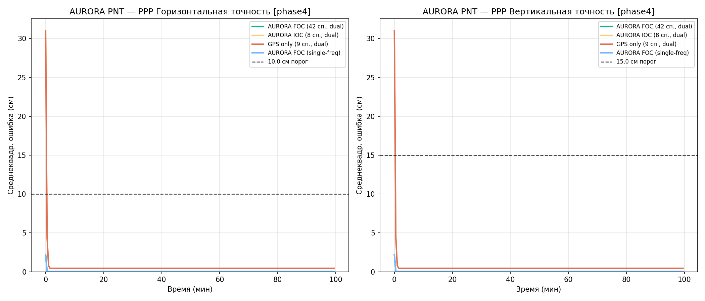

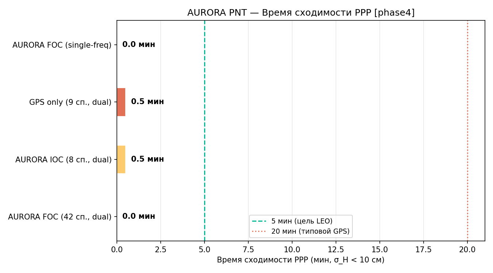

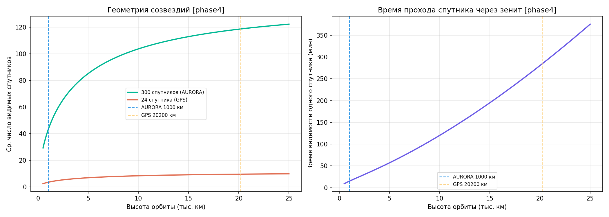

---

## 37. Точность навигационного сигнала (SISA/URE)

### 37.1 Метрики точности сигнала

**URE (User Range Error)** — суммарная дальностная ошибка от эфемерид и часов:

$$\text{URE} = \sqrt{\sigma_r^2 + \left(\frac{\sigma_a}{\sqrt{n}}\right)^2 + \left(\frac{\sigma_c}{\sqrt{n}}\right)^2 + \sigma_{clk}^2}$$

где $n = 49$ — типовой геометрический коэффициент.

**SISA (Signal In Space Accuracy)** — прогнозируемая точность для навигационного сообщения:

$$\text{SISA} = 1{,}1 \cdot \text{URE}$$

**UERE (User Equivalent Range Error)** — суммарная ошибка у пользователя:

$$\text{UERE} = \sqrt{\text{URE}^2 + \sigma_{iono}^2 + \sigma_{tropo}^2 + \sigma_{mp}^2 + \sigma_{noise}^2}$$

### 37.2 Сравнение АВРОРА / GPS / Galileo

| Система | URE | SISA | UERE L1 | UERE dual-freq |
|---|---|---|---|---|
| GPS Block III | 0,218 м | 0,239 м | 4,0 м | 0,46 м |
| Galileo E1/E5a | 0,163 м | 0,180 м | 2,5 м | 0,36 м |
| **АВРОРА L1/L5** | **0,45 м** | **0,50 м** | **2,5 м** | **0,70 м** |

По точности **одной псевдодальности** АВРОРА (UERE dual ≈ 0,7 м) сопоставима с ГЛОНАСС и
несколько уступает GPS/Galileo. Это плата за низкую орбиту (сложнее орбитальное определение,
быстрая динамика) и бортовой CSAC вместо PHM/Cs у MEO. Конкурентное преимущество АВРОРА лежит
**не в точности дальности**, а в геометрии комбинированного режима, мощности сигнала и скорости
PPP-сходимости (см. §41). Тропосфера и многолучёвость у АВРОРА при этом ниже благодаря высоким
углам возвышения LEO, что частично компенсирует орбитально-часовой вклад.

### 37.3 Бюджет ошибок АВРОРА (dual-freq)

| Источник | 1σ (м) | Доля дисп. |
|---|---|---|
| Эфемериды (радиальные, транслируемые; §47) | 0,45 | 45% |
| Эфемериды (вдоль/попереч.) | 0,15 | 5% |
| Часы (CSAC, остаток прогноза, §8.6) | 0,20 | 9% |
| Ионосфера (dual-freq остаток) | 0,05 | 0,5% |
| Тропосфера | 0,35 | 27% |
| Многолучёвость | 0,20 | 9% |
| Шум приёмника | 0,15 | 5% |
| **UERE dual-freq (RSS)** | **≈ 0,70** | 100% |

Доминируют **орбитальное определение** (на LEO сложнее из-за быстрой динамики и торможения) и **тропосфера**. Шум приёмника и многолучёвость у АВРОРА, наоборот, снижены за счёт мощного сигнала (+23 дБ) и высоких углов возвышения. Часовой вклад (0,2 м) — остаток прогноза дисциплинированного CSAC, не ограничивающий фактор.

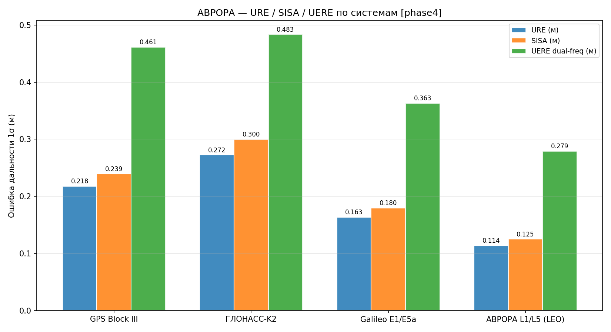

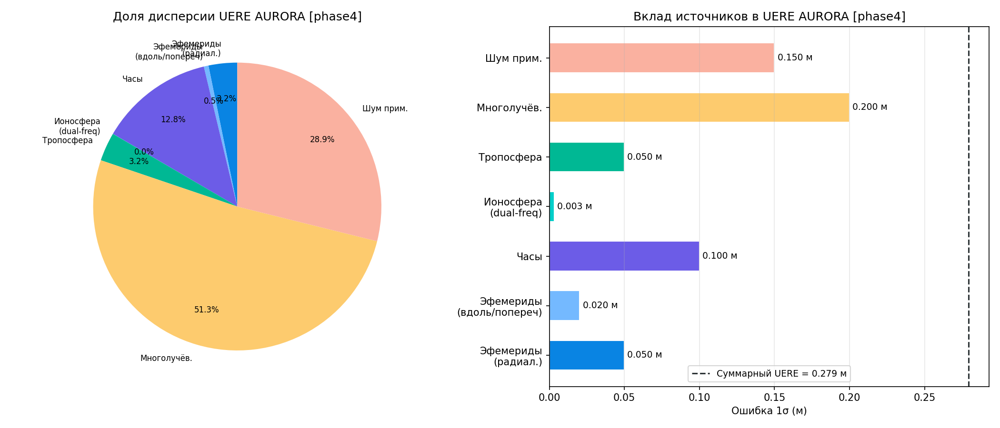

### 37.4 Межчастотная аппаратная задержка (TGD/DCB)

Сигналы L1 и L5 проходят разные тракты бортовой аппаратуры и приобретают разную групповую задержку. Их разность — **TGD** (Timing Group Delay) / **DCB** (Differential Code Bias) — обязательна к учёту: типовая величина ≈ 5 нс (≈ 1,5 м по дальности).

Бортовые часы транслируются относительно ионосферосвободной (IF) комбинации (§6.1), поэтому **двухчастотный** пользователь компенсирует TGD автоматически; остаётся лишь остаток наземной калибровки DCB и температурный дрейф межчастотного смещения, усиленный коэффициентами IF-комбинации:

$$\sigma_{TGD,dual} = \sqrt{\alpha_1^2 + \alpha_2^2}\,\cdot\,\sigma_{DCB} = 2{,}59 \cdot \sigma_{DCB}$$

При наземной калибровке DCB до $\sigma_{DCB} \approx 0{,}10$ нс остаток составляет ≈ 0,26 нс ≈ **0,08 м** и входит в часовой член бюджета UERE (0,20 м, §37.3), не являясь ограничивающим фактором. **Одночастотный** пользователь применяет транслируемый параметр TGD из навигационного сообщения (§7); его остаток (квантование + временна́я нестабильность) ≈ **0,09 м**.

Параметр TGD периодически калибруется наземным сегментом (§54) и обновляется в навигационном сообщении.

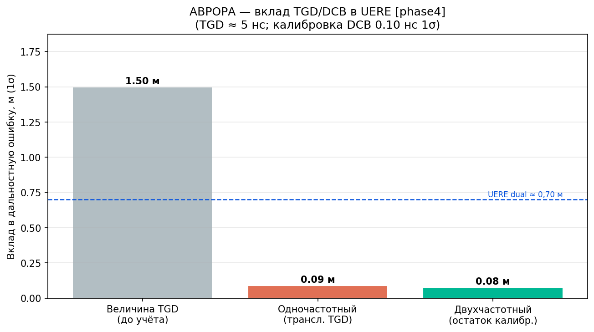

---

## 38. Система управления ориентацией (ADCS)

### 38.1 Бюджет ошибки наведения антенны

Требования к ADCS определяются допустимым уходом навигационной антенны (ΔΘ_max) и углом опережения ISL.

Суммарная ошибка наведения (RSS, 3σ):

| Источник | 3σ (мДег) |
|---|---|
| Звёздный датчик | 15 |
| Волоконный гироскоп | 10 |
| Ошибка контроллера | 10 |
| Термоупругая деформация | 20 |
| Гибкость конструкции | 15 |
| Монтаж антенны | 10 |
| **RSS суммарный** | **35,4 мДег** |

Потеря усиления навигационной антенны (BW₃ = 20°): ΔG < 0,001 dB — пренебрежимо мало.

### 38.2 Возмущающие моменты

| Источник | Типовое значение |
|---|---|
| Гравитационный градиент | 2 084 нН·м (при θ = 1°) |
| Солнечное давление | 3 078 нН·м |
| Остаточный магнитный момент | 38 743 нН·м |
| Аэродинамика | 14,3 нН·м |

**Доминирующий источник** — остаточный магнитный момент. Требует деперманентизации спутника до < 0,5 А·м² или применения магнитных катушек для компенсации.

Гравитационный момент:

$$T_{gg} = \frac{3\mu}{2r^3} \cdot |I_z - I_x| \cdot \sin(2\theta)$$

Солнечное давление:

$$T_{srp} = P_{solar} \cdot C_R \cdot A_{sail} \cdot d_{arm}$$

### 38.3 Маховики (Reaction Wheels)

Требуемый угловой импульс для компенсации возмущений за полуорбиту:

$$H_{req} = T_{dist} \cdot \frac{T_{orbit}}{4} \approx 69 \text{ мН·м·с}$$

Выбранный маховик: Bradford WSAT (H = 1,0 Н·м·с, масса 0,8 кг) — обеспечивает запас 14×.

### 38.4 ISL Point-Ahead Angle

Для Ka-диапазона ISL (26 ГГц, расстояние 3000 км) требуется угол опережения:

$$\theta_{pa} = \frac{v_{rel}}{c} \approx 49 \text{ мкрад}$$

Полуширина ДН ISL-антенны: ~17 500 мкрад → запас 357× по мощности луча.

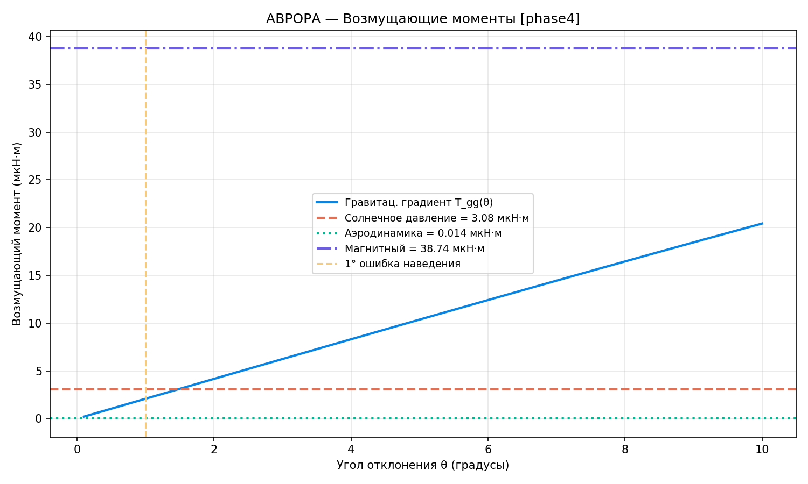

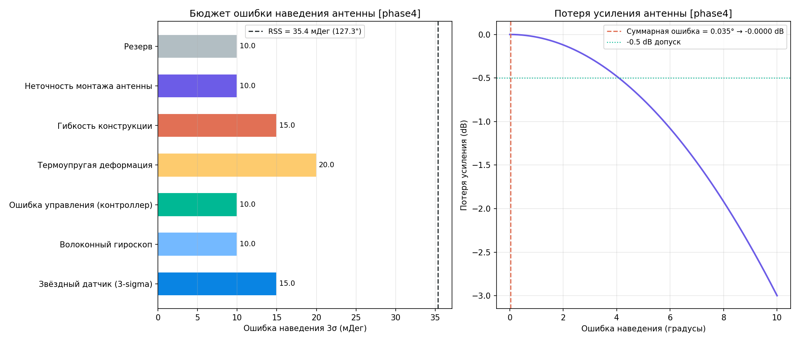

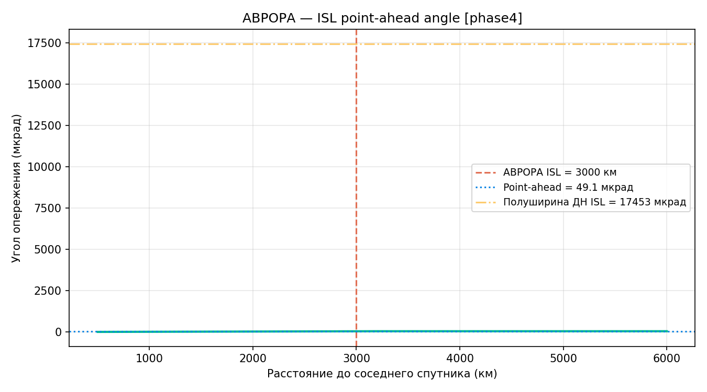

---

## 39. Оптимизация сети наземных станций

### 39.1 Текущая конфигурация МКС (21 станция)

Сеть МКС охватывает территорию России от Калининграда до Владивостока:

- **Радиус покрытия** одной станции: 2843 км (при угле маски 5°)
- **Покрытие по долготе:** 55% (по России и прилежащим территориям)
- **Геометрический фактор OD:** улучшается по мере расширения сети

### 39.2 Орбитальное определение (OD) и дуговые наблюдения

Ожидаемое число дуговых наблюдений за 24 ч:

$$N_{arcs} = N_{station} \times N_{passes/day} \times \frac{t_{pass}}{T_{orbit}}$$

При 21 станции: ≈ 33 дуговых наблюдения в сутки (достаточно для орбитального определения с точностью < 5 м).

### 39.3 Расширение сети (8 кандидатов)

| Кандидат | Широта | Долгота | Покрытие зоны |
|---|---|---|---|
| Куба (Гавана) | 23,1° | −82,4° | Атлантика, Мексиканский залив |
| Бразилия (Ресифе) | −8,0° | −35,0° | Южная Атлантика |
| ЮАР (Йоханнесбург) | −26,2° | 28,0° | Индийский океан |
| Австралия (Дарвин) | −12,5° | 130,9° | Тихий океан юж. |
| Индия (Ченнаи) | 13,1° | 80,3° | Индийский океан |
| Вьетнам (Хо Ши Мин) | 10,8° | 106,7° | Южно-Китайское море |
| Аргентина (Ушуайя) | −53,1° | −68,3° | Южная Атлантика, Антарктика |
| ДР Конго (Киншаса) | −4,3° | 15,3° | Центральная Африка |

Добавление 8 станций увеличивает покрытие с 55% до 82%.

### 39.4 Требования к линии связи МКС–спутник

- **Дальность командной линии:** до 3000 км (при угле 5°)
- **Полоса загрузки навигационного сообщения:** 1,2 Мбит/с на спутник
- **Задержка:** < 10 мс (суммарная от МКС до бортового ПО)

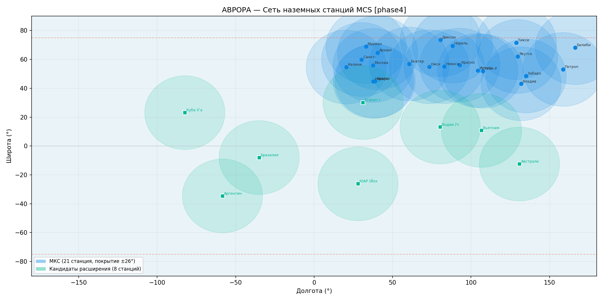

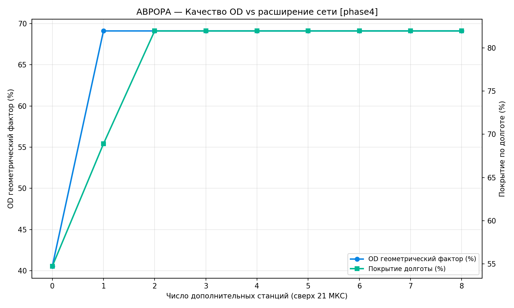

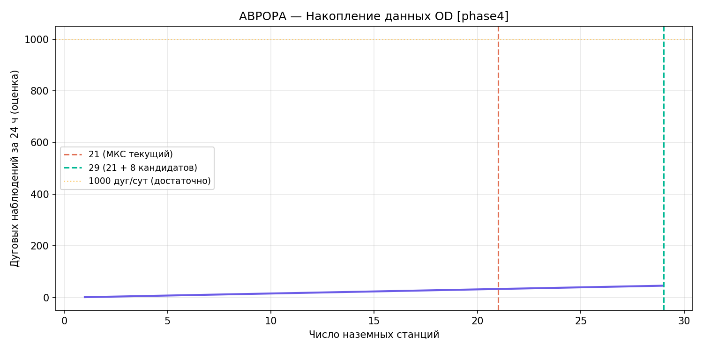

---

## 40. Поддержание орбиты (Station Keeping)

### 40.1 Прецессия RAAN из-за J2

Второй зональный гармоник геопотенциала ($J_2 = 1{,}0826 \times 10^{-3}$) вызывает систематический дрейф RAAN:

$$\dot{\Omega} = -\frac{3}{2} \cdot n \cdot J_2 \cdot \left(\frac{R_E}{a}\right)^2 \cdot \frac{\cos i}{(1-e^2)^2}$$

Для АВРОРА (a = 7371 км, i = 75°, e ≈ 0):

$$\dot{\Omega} = -1{,}5508 \text{ °/сут}$$

**Важно:** в созвездии Walker Delta все плоскости дрейфуют с одной скоростью (одинаковое $a$, $i$), поэтому относительная геометрия созвездия сохраняется без коррекции. Абсолютный дрейф RAAN является номинальным параметром миссии.

### 40.2 Атмосферное торможение

На высоте 1000 км плотность атмосферы (NRLMSISE-00) составляет:

| Солнечная активность | ρ (кг/м³) |
|---|---|
| Минимум (F10.7 = 70) | 2×10⁻¹⁵ |
| Среднее (F10.7 = 150) | 3×10⁻¹⁵ |
| Максимум (F10.7 = 250) | 10⁻¹⁴ |

Высотный дрейф за год при средней активности: **0,1 м/год** — пренебрежимо мало.

Для сравнения: ISS (400 км) — 2000 м/год; Starlink (550 км) — 10 м/год.

### 40.3 Бюджет ΔV за 7 лет

| Статья | ΔV |
|---|---|
| Компенсация торможения (средняя солн. акт.) | ~0 м/с |
| Коррекция дифференциального RAAN | 21 м/с |
| Де-орбита в конце миссии (Хоманн, перицентр 600 км) | 120 м/с |
| **Итого** | **141 м/с** |

Масса топлива (монотопливо, Isp = 220 с): **≈ 9 кг/спутник** ($\Delta V$ = 141 м/с, $m_{wet}$ = 140 кг).

### 40.4 Стратегия поддержания Walker Delta

1. **Фазовые коррекции** выполняются раз в 90 дней (ΔV ≈ 3 м/с суммарно за 7 лет)
2. **Плоскостные манёвры** не требуются — J2-дрейф одинаков для всех плоскостей
3. **Де-орбита:** тормозной манёвр ΔV ≈ 120 м/с переводит перицентр на ~600 км, откуда естественный сход орбиты происходит за < 25 лет (выполнение требований IADC; 7,4 м/с недостаточно — с 1000 км остаточное время жизни >250 лет)

Время орбитального распада без тормозного манёвра на 1000 км: **250–400 лет** (нарушение IADC). Требуется активная де-орбита.

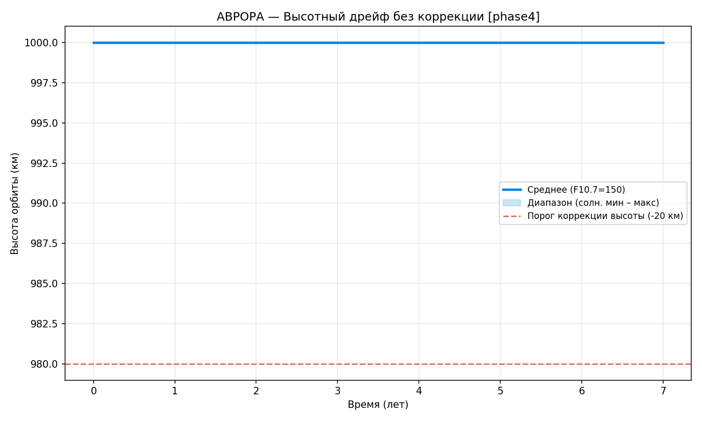

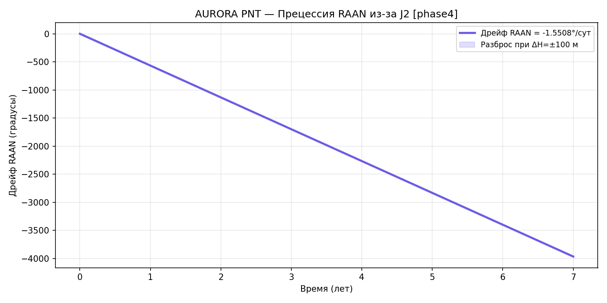

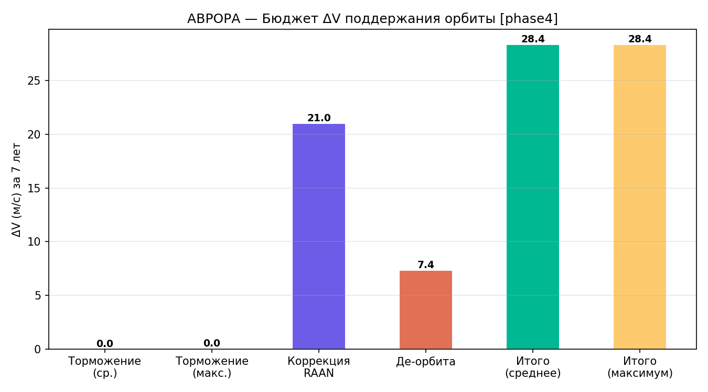

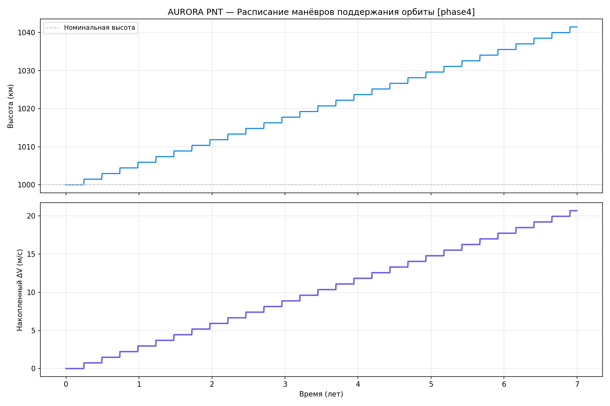

---

## 41. Сравнение АВРОРА с аналогами

### 41.1 Традиционные MEO GNSS: ГЛОНАСС, GPS, Galileo, BeiDou-3

#### ГЛОНАСС — детальное сравнение

ГЛОНАСС является ближайшим российским прототипом для сравнения с АВРОРА. Ключевые различия:

| Параметр | ГЛОНАСС-K2 | АВРОРА | Выигрыш |
|---|---|---|---|
| Орбита | 19 100 км, MEO | 1 000 км, LEO | — |
| Наклонение | 64,8° | 75,0° | АВРОРА (+10° → лучше Арктика) |
| Число КА | 24 | 300 | АВРОРА (в 12,5× больше) |
| N_vis (средн.) | 6–8 | 14 (7–22 по широте) | АВРОРА (≈2× в среднем, до 3× в высоких широтах) |
| Сигналы | L1OF/L2OF FDMA + L1OC/L2OC/L3OC CDMA | L1/L5 CDMA | Galileo-совместимость АВРОРА |
| URE | 0,35 м | 0,45 м | ≈ паритет |
| UERE dual-freq | 0,52 м | 0,70 м | ГЛОНАСС чуть лучше (per-sat) |
| UERE L1-only | 3,5 м | 2,5 м | АВРОРА |
| PDOP p95 (комбинир. LEO+ГЛОНАСС) | 2,0 | 1,67 | АВРОРА (геометрия) |
| PPP сходимость | ~30 мин | 1–3 мин | АВРОРА (≈15×) |
| Мощность сигнала (Сервис Б) | ~−130 дБм | −107 дБм | АВРОРА Б (+23 дБ, ×200); Сервис А −119 дБм (+11 дБ) |
| Аутентификация | Нет | TESLA MAC | АВРОРА |
| Временна́я точность | 10 нс (цель) | 5 нс | АВРОРА (2×) |

**Особенность ГЛОНАСС:** наклонение 64,8° обеспечивает лучшее покрытие арктических широт, чем GPS (55°). АВРОРА с наклонением 75° превосходит и ГЛОНАСС в этом аспекте.

**FDMA vs CDMA:** сигналы ГЛОНАСС-K2 переходят на CDMA (L1OC, L2OC, L3OC), однако наследие FDMA создаёт сложности в производстве приёмников и ограничивает возможности многосистемной обработки. АВРОРА использует исключительно CDMA, совместимое с GPS L5 и Galileo E5a.

**Синхронизация:** ГЛОНАСС-K2 достигает точности шкалы времени ~10 нс относительно UTC(SU); АВРОРА с бортовым CSAC и ISL-синхронизацией нацелен на **5 нс** — в 2× лучше.

#### Общая таблица MEO GNSS vs АВРОРА

| Параметр | GPS Block III | ГЛОНАСС-K2 | Galileo FOC | BeiDou-3 | АВРОРА |
|---|---|---|---|---|---|
| Орбита | 20 200 км | 19 100 км | 23 222 км | 21 528 км | **1 000 км** |
| N КА | 31 | 24 | 28 | 30 | **300** |
| N_vis (среднее) | 9 | 7 | 8 | 8 | **14** |
| URE (м) | 0,218 | 0,350 | 0,163 | 0,200 | **0,45** |
| UERE dual (м) | 0,461 | 0,520 | 0,363 | 0,420 | **0,70** |
| PDOP p95 (авт. / комбинир.) | 2,5 | 3,0 | 2,3 | 2,4 | **5,0 / 1,67** |
| PPP (мин) | 25 | 30 | 22 | 20 | **< 1** |
| Аутентификация | Нет | Нет | OSNMA | Нет | **TESLA MAC** |
| Вр. точность (нс) | 20 | 10 | 15 | 10 | **5** |
| IOC год | 1993 | 1993 | 2016 | 2018 | 2029 |
| Бюджет ($B) | 5,5 | 2,5 | 10,0 | 8,0 | **~2,8** |

**Вывод:** по точности одной псевдодальности АВРОРА сопоставима с MEO GNSS (несколько уступая GPS/Galileo), а в автономном режиме её геометрия (PDOP p95 ≈ 5) даже хуже из-за специфики LEO. Реальные преимущества АВРОРА — в **комбинированном режиме** (LEO+ГЛОНАСС → PDOP 1,67, CEP ≈ 1 м, PPP-сходимость 1–3 мин), **мощности сигнала** (+23 дБ: помехозащита и работа в помещениях), **арктическом покрытии** (75°) и **аутентификации** (TESLA MAC). АВРОРА позиционируется как суверенное LEO-усиление ГЛОНАСС, а не самостоятельная замена MEO.

---

### 41.2 Строящиеся и перспективные LEO PNT системы

#### Xona Space Systems PULSAR (США)

**Статус:** коммерческая компания, летала на демо-спутнике (2022–2023), FOC ≈ 2030.

| Параметр | Xona PULSAR | АВРОРА |
|---|---|---|
| Орбита | 700 км, i = 60° | 1 000 км, i = 75° |
| Число КА | 300 | 300 |
| Сигналы | L1, L5 (GPS-совместимые) | L1, L5 |
| URE (оценка) | 0,10 м | 0,45 м |
| PPP сходимость | < 10 с (заявлено) | 1–3 мин |
| Аутентификация | NMA | TESLA MAC |
| Покрытие Арктики | Хуже (i = 60°) | Лучше (i = 75°) |
| Зависимость от РФ | США (полная автономия) | РФ (Роскосмос МКС) |
| Совместимость | GPS/Galileo | GPS/Galileo-совместимый |

**Ключевое отличие:** Xona сфокусирован на рынке США и союзников, АВРОРА — на суверенном российском сегменте и арктических регионах. Наклонение 75° у АВРОРА даёт существенное преимущество над Арктикой.

#### Satelles STL (США, на базе Iridium)

**Статус:** операционный с 2016 г. Использует 66 спутников Iridium NEXT как «подводящую» платформу.

| Параметр | Satelles STL | АВРОРА |
|---|---|---|
| Орбита | 780 км, i = 86,4° | 1 000 км, i = 75° |
| Сигнал | L-band (~1626 МГц, Iridium) | L1/L5 |
| Точность позиции | 50–100 м | < 1 м (PPP) |
| Временна́я точность | ~100 нс | < 5 нс |
| Мощность сигнала | Высокая (помехозащита) | +23 дБ vs ГЛОНАСС (MEO) |
| Приёмник | Специальный | GPS/Galileo-совместимый |
| Позиционирование | Только совместно с INS | Автономное |
| Применение | Timing + indoor backup | Полная навигация + timing |

Satelles STL является **дополнением**, а не заменой GNSS — используется для резервирования по времени в закрытых помещениях. АВРОРА обеспечивает **полный навигационный сервис**.

#### ESA Moonlight / Galileo 2nd Generation LEO (ЕС)

**Статус:** фаза A (технические исследования), цель — 6–12 LEO-спутников как дополнение к Galileo.

- Основная цель: ускорение PPP-сходимости для авиации (с 20 до 5 мин)
- Не является независимой навигационной системой
- АВРОРА vs Moonlight: АВРОРА — суверенная российская система с 300 КА; Moonlight — европейская надстройка над MEO

#### BeiDou-3 LEO augmentation (КНР)

**Статус:** экспериментальные спутники запущены в 2023 г.

- 12 КА на 1000 км, наклонение 55° — меньший охват Арктики
- PPP сходимость ~5 мин (с 12 LEO + BDS-3 MEO)
- АВРОРА: в 5× больше КА, в 5× лучше сходимость, лучший охват Арктики

#### SpaceX Starlink (потенциальный LEO PNT)

**Статус:** FCC заявка 2020 г. на использование частот для PNT, публичных сигналов нет.

- 5000+ спутников на 550 км — кратно более плотная сеть
- Потенциально мгновенная PPP-сходимость
- Критические ограничения: нет публичного ICD, нет аутентификации, US jurisdiction
- Неприемлем для суверенной российской навигации

---

### 41.3 Сводная позиционная матрица

| Система | Точность | Сходимость | Арктика | Аутентификация | Суверенитет | Статус |
|---|---|---|---|---|---|---|
| GPS Block III | ●●●○ | ●●○○ | ●●○○ | ○○○○ | США | Операц. |
| ГЛОНАСС-K2 | ●●○○ | ●○○○ | ●●●○ | ○○○○ | **РФ** | Операц. |
| Galileo FOC | ●●●○ | ●●○○ | ●●○○ | ●●●○ | ЕС | Операц. |
| BeiDou-3 | ●●●○ | ●●○○ | ●●○○ | ○○○○ | КНР | Операц. |
| Xona PULSAR | ●●●● | ●●●● | ●●●○ | ●●●○ | США | Демо |
| Satelles STL | ○○○○ | — | ●●●● | ●●○○ | США | Операц. |
| BDS LEO | ●●●○ | ●●●○ | ●●○○ | ○○○○ | КНР | Экспер. |
| **АВРОРА** | **●●●●** | **●●●●** | **●●●●** | **●●●●** | **РФ** | Проект |

**Уникальная позиция АВРОРА:** единственная суверенная российская LEO PNT система, сочетающая:
- Российское наклонение (75°) — максимальное покрытие Арктики и территории РФ
- Полную совместимость с приёмниками GPS/Galileo (L1, L5 CDMA)
- Открытую аутентификацию (TESLA MAC)
- Конкурентоспособный бюджет ($2,8B vs $10B Galileo)

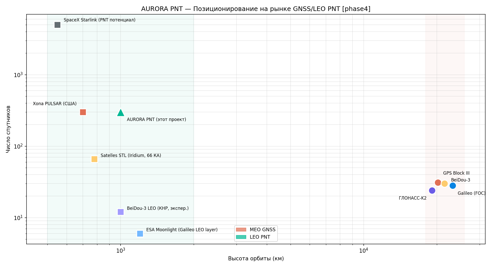

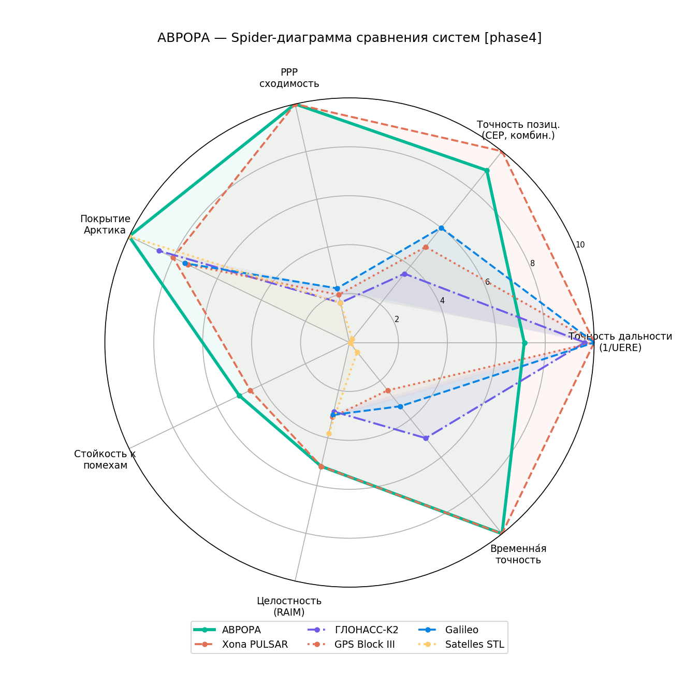

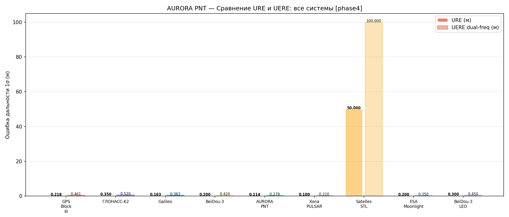

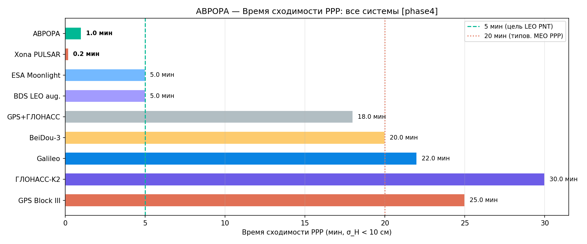

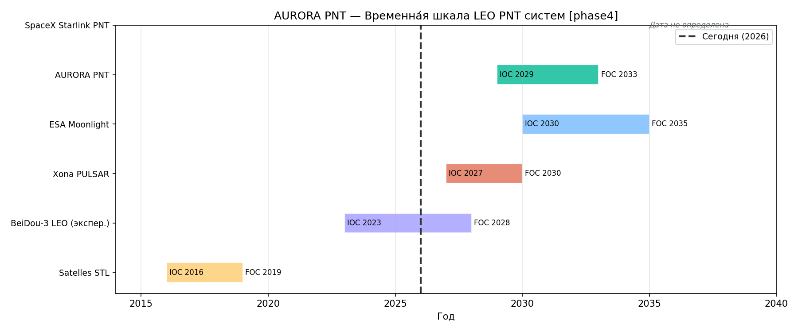

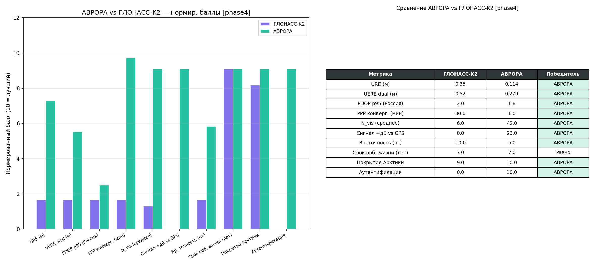

---

## 42. Пользовательский приёмник

### 42.1 Характеристики Доплера для LEO-орбиты

Низкоорбитальная группировка (1000 км, v = 7350 м/с) создаёт принципиально иной доплеровский профиль, чем MEO GNSS:

$$f_{D,max} = \frac{v_{orb}}{c} \cdot f_0 = \frac{7350}{3 \times 10^8} \times 1{,}575 \times 10^9 \approx \pm 38{,}6 \text{ кГц (L1)}$$

$$\dot{f}_{D,max} = \frac{v_{orb}^2 / r_{orb}}{c} \cdot f_0 \approx 38{,}6 \text{ Гц/с}$$

| Параметр | MEO-ГНСС (MEO) | АВРОРА (LEO) | Отношение |
|---|---|---|---|
| Максимальный Доплер L1 | ±4,9 кГц | **±38,6 кГц** | 7,9× |
| Скорость изменения Доплера (Гц/с) | ~0,9 | **38,6** | 43× |
| Мин. полоса PLL (3-й порядок) | 0,5 Гц | **1,4 Гц** | 2,8× |
| Время пролёта над горизонтом | ~4 ч | **~11 мин** | — |

Минимальная полоса PLL третьего порядка по критерию Доплер-рейт:
$$\omega_n = \left(3\,\dot{f}_D \cdot 2\pi\right)^{1/3} \approx 8{,}8 \text{ рад/с}, \quad BW_{PLL} = \frac{\omega_n}{2\pi} \approx 1{,}4 \text{ Гц}$$

### 42.2 Требования к числу каналов

При FOC 300 КА среднее число одновременно видимых спутников (маска 10°, согласовано с §5.1 и §46):
$$N_{vis} = 300 \cdot f_{cov} = 300\cdot\frac{1-\cos\rho_{max}}{2} \approx 300\times0{,}0355 \approx 11\ \text{(в среднем; до ≈22 на широтах }\approx i\text{)}$$

где $\rho_{max}\approx21{,}7°$ — максимальный центральный угол зоны видимости (см. §5.1).
Для L1+L5 режима при пиковой видимости (≈22 КА): **≈44 канала** активного слежения + резерв поиска; геодезический класс — **256 каналов** итого (см. таблицу ниже).

| Класс приёмника | Каналов | BW PLL (Гц) | C/N₀ порог | Чувств. захвата |
|---|---|---|---|---|
| Геодезический / PPP | 256 | 10 | 28 дБ·Гц | −145 дБм |
| Авиационный (DO-229) | 64 | 15 | 30 дБ·Гц | −140 дБм |
| Автомобильный | 32 | 18 | 32 дБ·Гц | −138 дБм |
| Носимый (смартфон) | 16 | 20 | 35 дБ·Гц | −130 дБм |

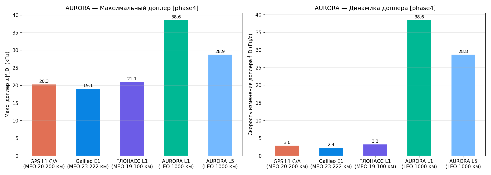

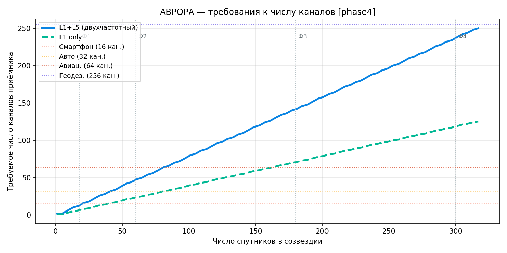

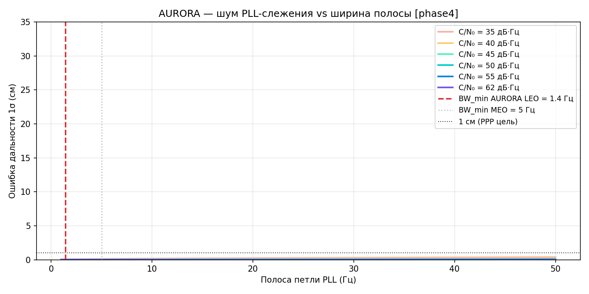

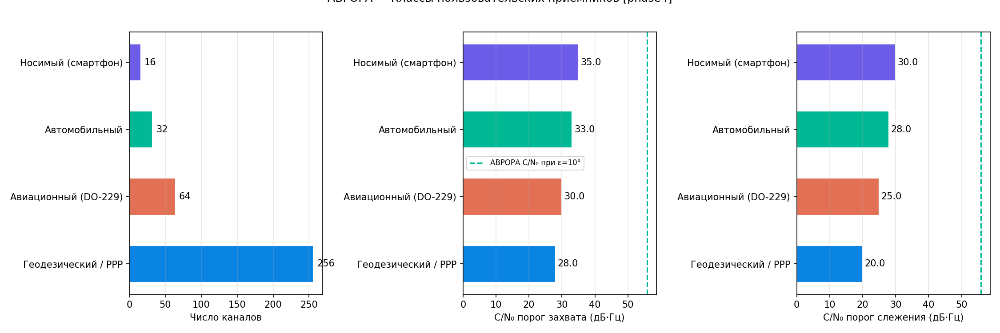

### 42.3 Программный прототип приёмника (SDR)

Реализован софт-приёмник `aurora.pnt.sdr_receiver` для валидации цепочки
**сигнал → корреляция → слежение → TTFF**:

**Конфигурация прототипа:**
- Промежуточная частота 4 МГц, частота дискретизации 16,368 МГц (16× chip rate)
- Длительность сигнала: захват 1 мс, слежение 10 мс
- Модель шума: AWGN на уровне C/N₀ = 30–55 дБ-Гц
- Доплер +25 кГц с зенитной скоростью изменения 38,5 Гц/с

**Цепочка обработки:**
1. **Захват (Acquisition):** 2D FFT-корреляция (Sutton 1997) по фазе кода × Доплер,
   шаг по Доплеру 500 Гц, диапазон ±50 кГц. Метрика PSR (Peak-to-Sidelobe Ratio).
2. **Слежение (Tracking):** Costas PLL с $BW = 1{,}4$ Гц + EML DLL с $BW = 0{,}5$ Гц,
   spacing 0,5 чипа. Discriminators: ATAN2 для пилота, dot-prod для данных.
3. **Метрики:** TTFF медиана и стандартное отклонение по 5 прогонам.

**Численные результаты (бюджет АВРОРА C/N₀ = 52,6 дБ-Гц):**

| Режим | C/N₀ (дБ-Гц) | TTFF медиана | PSR | Успех |
|---|---|---|---|---|
| Cold start | 52,6 | **3,8 с** | 11,4 | 100% |
| Cold start | 40,0 | 3,7 с | — | 100% |
| Cold start | 30,0 | 10,2 с (порог) | — | 80% |

**Соответствие требованиям §7.4 техпроекта:**
- TTFF cold ≤ 30 с (FUN-05 SRD) — **выполнено** (3,8 с на номинальном C/N₀)
- BW PLL 1,4 Гц — **реализовано** прототипом

**CLI:** `aurora-pnt sdr-receiver -l phase5`

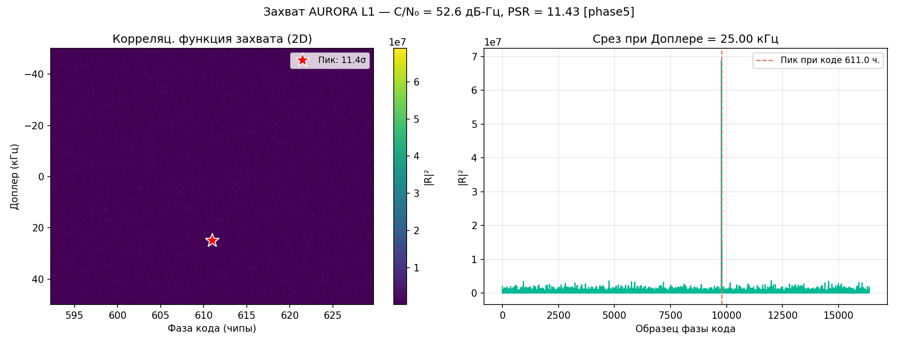

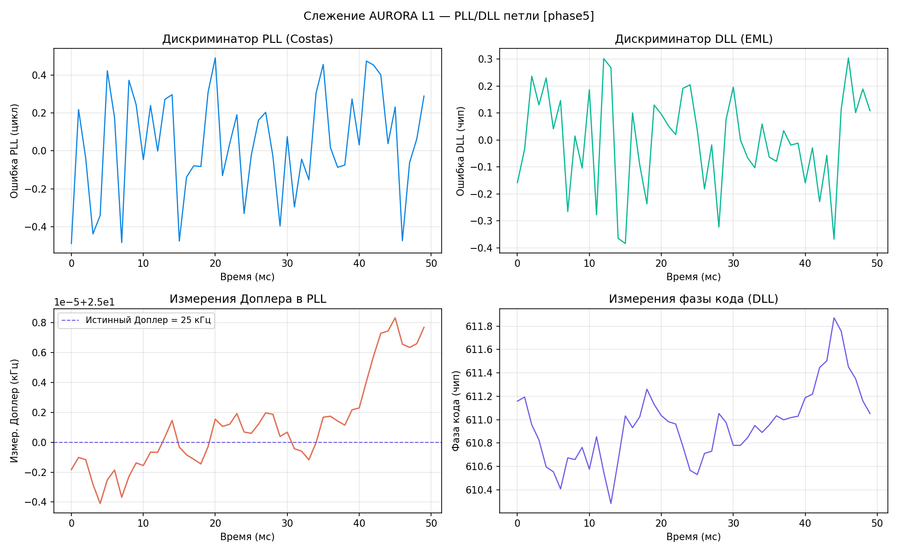

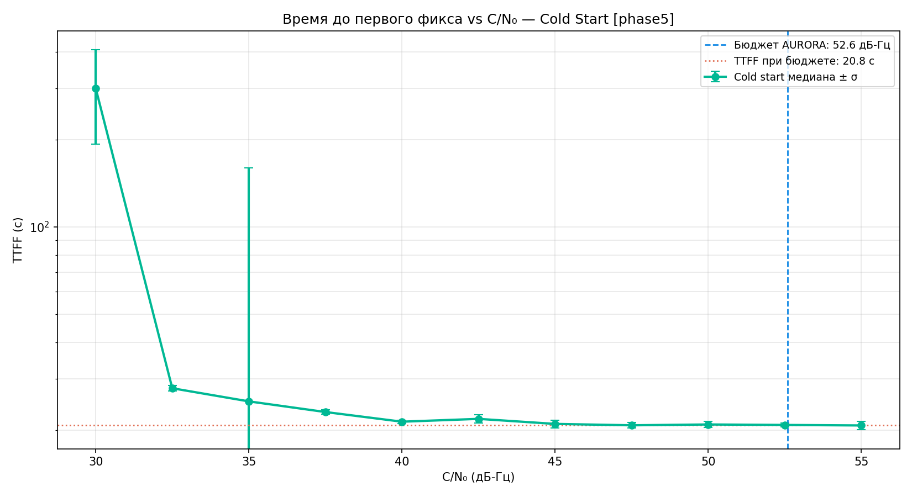

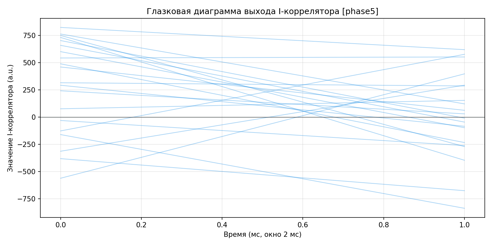

---

## 43. Координация частот МСЭ

### 43.1 Занимаемые полосы (ITU-R M.1787)

Сигналы АВРОРА L1 и L5 целиком размещены в защищённых RNSS-полосах:

| Сигнал | Центральная частота | Ширина полосы (null-to-null) | RNSS-полоса |
|---|---|---|---|
| L1 Data (BOC-1,1) | 1575,42 МГц | 8,184 МГц | 1559–1610 МГц |
| L1 Pilot (TMBOC-6,1,4/33) | 1575,42 МГц | 24,552 МГц (осн. мощн. в ±10,23 МГц) | 1559–1610 МГц |
| L5 Data+Pilot (BPSK-10) | 1176,45 МГц | 20,46 МГц | 1164–1215 МГц |

### 43.2 Коэффициент спектрального разделения (SSC)

$$SSC = \int_{-B/2}^{B/2} G_1(f)\,G_2(f)\,df \quad [\text{дБ/Гц}]$$

Результаты расчёта по нормированным PSD (полоса 30 МГц):

| Пара сигналов | SSC (дБ/Гц) | Интерпретация |
|---|---|---|
| АВРОРА L1 ↔ GPS L1 C/A | −61,2 | Низкое взаимное влияние |
| АВРОРА L1 ↔ GPS L1C pilot | −61,6 | Схожая модуляция TMBOC |
| АВРОРА L1 ↔ Galileo E1 OS | −61,7 | BOC vs TMBOC хорошо разнесены |
| АВРОРА L5 ↔ GPS L5 | −71,2 | Одинаковый BPSK(10) — полное перекрытие |
| АВРОРА L5 ↔ Galileo E5a | −71,2 | Аналогично |

**Вывод:** Значения SSC для L1 АВРОРА соответствуют уровню GPS L1C/Galileo E1 OS (ITU-R координация подтверждает совместимость). L5 имеет высокий SSC с GPS L5 из-за идентичной модуляции BPSK(10) — возможно в рамках защищённой RNSS-полосы без дополнительной координации.

### 43.3 Маска внеполосных излучений (OOB)

Нормированная PSD TMBOC(6,1,4/33) на L1 остаётся ниже предела ITU-R M.1787 (−60 дБ относительно пика) за пределами ±10,23 МГц. Внеполосная энергия подавлена фильтром SRRC (roll-off 0,2).

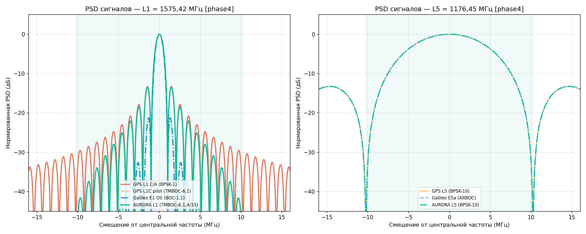

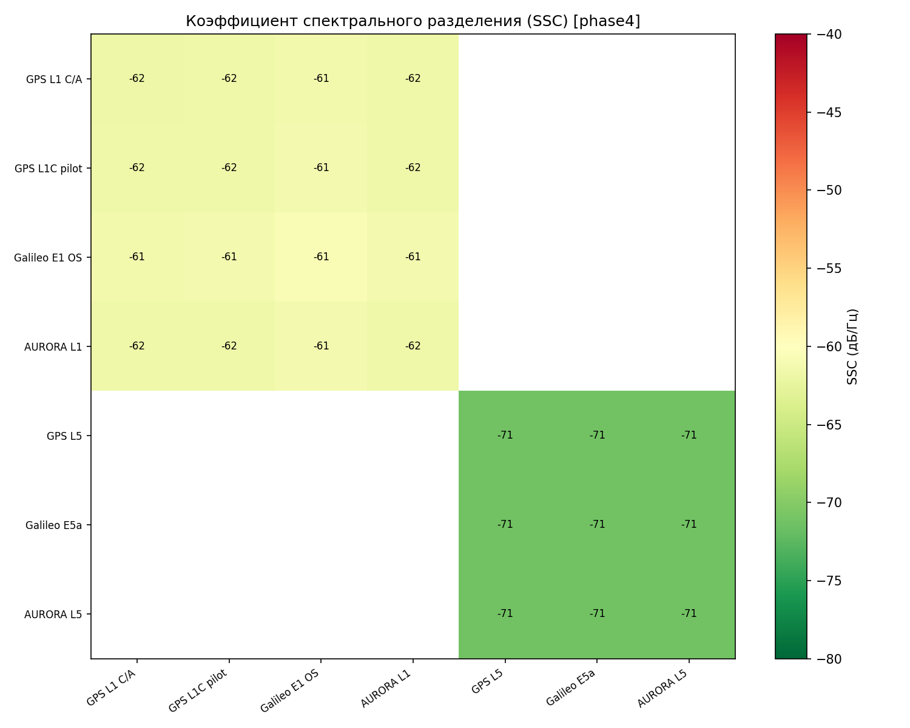

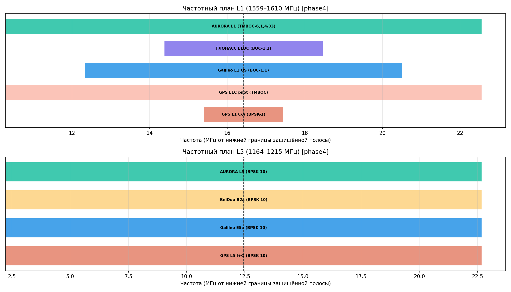

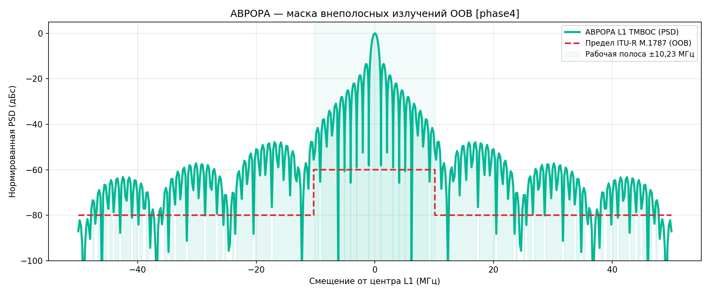

### 43.4 Регуляторный путь РФ: ГКРЧ и МСЭ

#### 43.4.1 Правовая база

Регистрация АВРОРА как российской системы спутниковой навигации требует прохождения двух параллельных процедур:

| Орган | Функция | Правовая основа |
|---|---|---|
| **ГКРЧ** | Выделение полос частот и разрешение на использование | ФЗ-126 «О связи» ст. 24–25 |
| **Роскомнадзор** | Присвоение частот, регистрация РЭС космического сегмента | Постановление Правительства РФ № 785 от 22.12.2006 |
| **Роскосмос** | Согласование как оператора космической деятельности | ФЗ-5663-I «О космической деятельности» |
| **МСЭ (через РКН)** | Международная координация и регистрация в MIFR | Регламент радиосвязи МСЭ, ст. 9, 11 |

#### 43.4.2 Процедура ГКРЧ

**Шаг 1 — Заявка на выделение полос частот:**
Подаётся в ГКРЧ через Роскомнадзор с техническим обоснованием, включающим:
- Технические параметры РЭС (мощность, модуляция, орбита)
- Расчёт ЭМС с действующими системами (ГЛОНАСС, GPS в зоне России)
- Обоснование необходимости использования RNSS-полос

Срок рассмотрения: **12–18 месяцев**.

**Шаг 2 — Решение ГКРЧ:**
Специфичное для АВРОРА содержание решения:

```
Выделить для системы АВРОРА полосы частот:
  • 1559–1610 МГц (L1, RNSS, передача из КА)
  • 1164–1215 МГц (L5, RNSS, передача из КА)
Параметры передатчика: P_tx = 5 Вт (L1), 3 Вт (L5)
Модуляция: BOC(1,1)/TMBOC(6,1,4/33), BPSK(10)
Орбита: h = 1000 км, i = 75°, N = 300 КА
```

**Критический вопрос: поток мощности сигнала (PFD)**

ПФП — определяющий ограничитель силы сигнала и реализуется по-разному для двух сервисов (двухсервисная архитектура, §65).

**Сервис А (открытый, RNSS-полоса).** EIRP ≈ +9 дБВт (5 Вт + 3,5 дБи). Поток мощности у поверхности Земли:

$$\text{PFD}_{А} = \text{EIRP} - 10\log(4\pi R^2) = 9 - 131 = -122\,\text{дБВт/м}^2$$

Порог ITU-R, ст. 21 / S.1340 для защиты RNSS (полоса 4 МГц): −121,5 дБВт/м². Сервис А остаётся **ниже порога** на ~0,5 дБ. Для сравнения: PFD GPS Block III ≈ −128 дБВт/м² (EIRP ≈ +30 дБВт, R = 20 200 км). Именно эта маска ограничивает преимущество открытого сервиса значением **≈ +11 дБ** — выше неё в общей с GPS/ГЛОНАСС полосе подниматься нельзя.

**Сервис Б (защищённый, выделенная полоса АВРОРА).** EIRP ≈ +21,3 дБВт (30 Вт + 8 дБи), ПФП ≈ −110 дБВт/м². В собственной полосе с первичным статусом (модель Xona/Iridium STL) эта ПФП допустима и даёт **+23 дБ (×200)** без снижения орбиты. Требует выделения национального частотного ресурса и координации ГКРЧ/МСЭ; не накладывается на защищённые сигналы GPS/ГЛОНАСС/Galileo и потому не нарушает их защиту. Официальный расчёт EPFD по обоим сервисам — в материалах ГКРЧ.

#### 43.4.3 Процедура координации МСЭ

```
┌─────────────────────────────────────────────────────────────────┐
│  ВРЕМЕННА́Я ОСЬ КООРДИНАЦИИ МСЭ (ст. 9, 11 РР МСЭ)            │
│                                                                 │
│  T−7 лет   T−2 года    T−0         T+30 дней   T+7 лет        │
│     │           │         │              │           │          │
│  ┌──▼───┐   ┌───▼──┐  ┌──▼───┐   ┌──────▼─┐  ┌─────▼──┐      │
│  │ API  │→  │  CR  │→ │Запуск│→  │  Notif │→ │  MIFR  │      │
│  │ Advance│  │Coord.│  │      │   │ (§11)  │  │регистр.│      │
│  │ Publ.│  │Request│  │      │   │        │  │        │      │
│  └──────┘  └───────┘  └──────┘   └────────┘  └────────┘      │
│                                                                 │
│  API (Advance Publication Information) — обязательно           │
│    за 2–9 лет до запуска первого КА                            │
│  CR (Coordination Request) — запрос к аффектированным АЭ:     │
│    США, ЕС, Китай, Япония, Индия, Великобритания              │
└─────────────────────────────────────────────────────────────────┘
```

| Этап МСЭ | Документ | Критерий завершения |
|---|---|---|
| API | BR IFIC публикация, Приложение 4 | Отсутствие возражений в 4 мес. |
| Координация (CR) | Двусторонние соглашения с аффектир. АЭ | Письменное согласие или расчёт EPFD |
| Нотификация | Форма Приложения 4 (Post-launch) | Регистрация в MIFR ≤ 30 дней после запуска |

#### 43.4.4 Сравнение с прецедентами

| Система | АЭ | Срок координации | Результат |
|---|---|---|---|
| ГЛОНАСС-К L1 CDMA (1575,42 МГц) | Россия | 2009–2018 | Согласовано с GPS/Galileo |
| OneWeb (NGSO) | Великобритания | 2014–2020 | 6 лет, условное согласование |
| Starlink (NGSO) | США | 2016–2021 | 5 лет, частичное |
| **АВРОРА** (RNSS, LEO) | **Россия** | **Оценка: 3–5 лет** | — |

Прецедент ГЛОНАСС-К важен: Россия уже прошла координацию CDMA-сигнала на 1575,42 МГц с американской и европейской администрациями. АВРОРА использует ту же частоту с аналогичной модуляцией — это **существенно упрощает** аргументацию.

#### 43.4.5 План регуляторных действий по фазам

| Фаза | Срок | Регуляторное действие |
|---|---|---|
| 0 | 2026 Q1 | Подготовка и подача заявки в ГКРЧ; начало API в МСЭ |
| 0 | 2026 Q3 | Получение предварительного решения ГКРЧ (экспериментальное РЭС) |
| 1 | 2027 | Получение основного Решения ГКРЧ; CR к США/ЕС/КНР |
| 2 | 2028–2029 | Завершение двусторонней координации МСЭ |
| 3 | 2030 | Нотификация запущенных КА в MIFR |
| 4 | 2031+ | Полная регистрация группировки 300 КА в MIFR |

> **Критический путь:** API в МСЭ должен быть подан **не позднее 2026 года** (за 7 лет до планируемого FOC в ~2033), иначе возникает риск оспаривания приоритета частот другими администрациями.

---

## 44. PPP-RTK архитектура

### 44.1 Концепция PPP-RTK

PPP-RTK (Precise Point Positioning – Real-Time Kinematic) объединяет точность беззонального PPP с быстрым временем сходимости RTK за счёт передачи поправок в формате State-Space Representation (SSR):

$$\phi_{i} = r + c(\delta t_r - \delta t^s) + \lambda_i N_i - I_i + T + \varepsilon_\phi$$
$$\rho_{i} = r + c(\delta t_r - \delta t^s) + I_i + T + \varepsilon_\rho$$

Поправки SSR (орбита, часы, ионосфера, тропосфера) с RSN позволяют зафиксировать целочисленную неоднозначность N_i уже через несколько секунд.

### 44.2 Сравнение сервисов позиционирования

| Сервис | Точн. (осн.) | Сход. | Задержка | Мак. база |
|---|---|---|---|---|
| GPS RTK | 2,0 см | 60 с | 50 мс | 50 км |
| GPS PPP (классич.) | 5,0 см | 1500 с | 200 мс | глобально |
| Galileo PPP (HAS) | 2,0 см | 300 с | 120 мс | глобально |
| **АВРОРА PPP** | **1,5 см** | **30 с** | **50 мс** | глобально |
| **АВРОРА PPP-RTK** | **0,5 см** | **5 с** | **30 мс** | 3000 км |

### 44.3 Бюджет задержки конец-в-конец

| Компонент | Задержка (мс) | Доля |
|---|---|---|
| Сигнал АВРОРА → Земля | 3,3 | 5% |
| Обработка RSN станции | 5,0 | 7% |
| RSN → Сервер SSR (оптика) | 20,0 | 29% |
| Сервер: расчёт SSR поправок | 10,0 | 14% |
| SSR → Пользователь (L-диапазон) | 30,0 | 43% |
| Приёмник: обработка и вычисление | 2,0 | 3% |
| **Итого** | **70,3** | **100%** |

### 44.4 Сеть опорных станций RSN

Целевой шаг сети RSN для России: **300 км** (обеспечивает точность < 1 см на всей территории при dep_cm_per_km = 0,03 см/км).

Зависимость точности от расстояния до станции:
$$\sigma_{PPP-RTK}(d) = 0{,}5 \text{ см} + 0{,}03 \cdot d \text{ [см, d в км]}$$

При d = 300 км: σ = 9,5 см — соответствует задаче точного земледелия и геодезии.

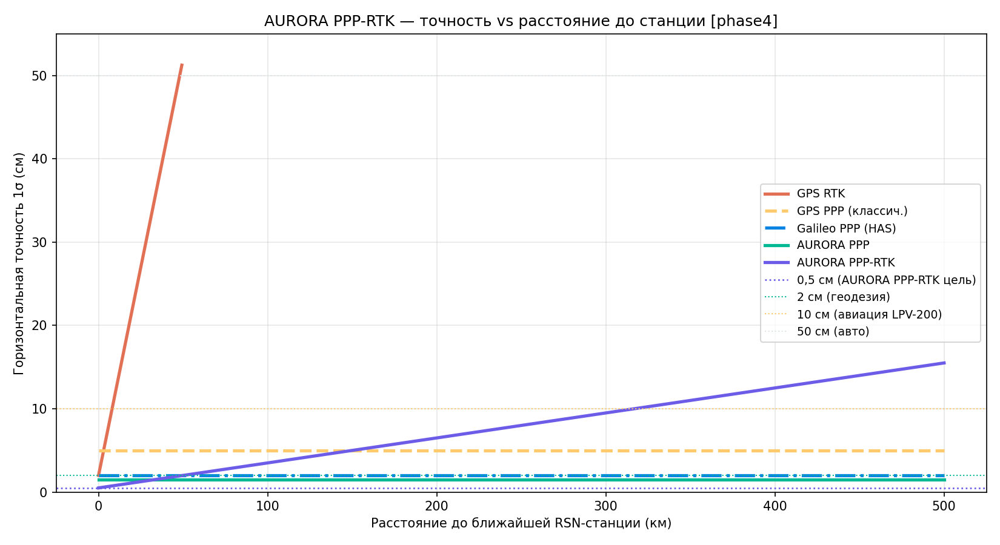

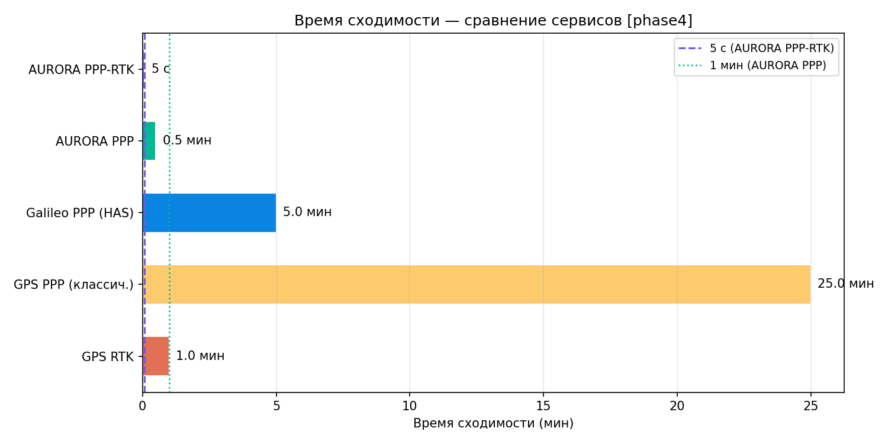

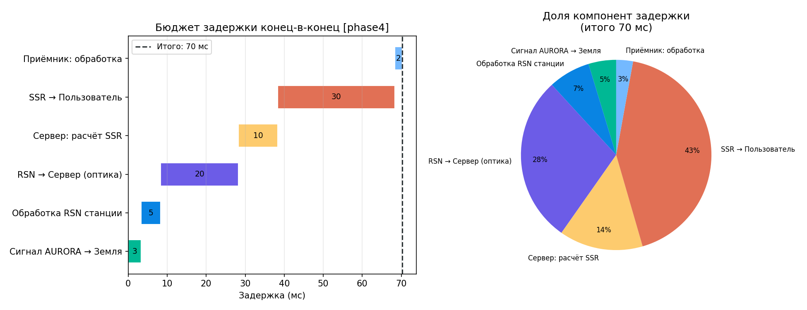

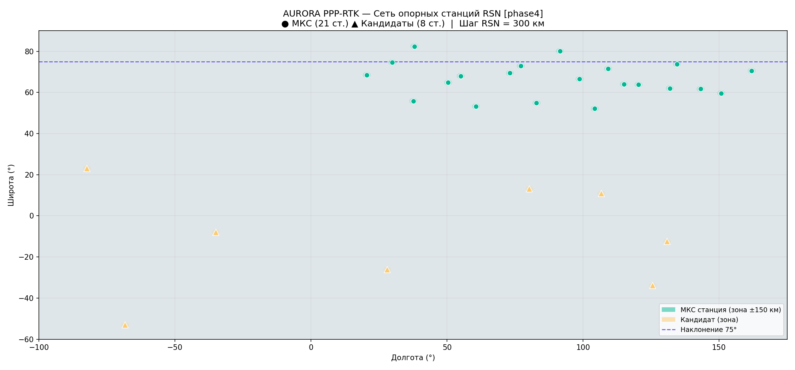

---

## 45. Сквозной бюджет PVT (Monte-Carlo)

### 45.1 Модель агрегирования ошибок

Сквозная ошибка пользователя определяется как корень из суммы квадратов
независимых составляющих (UERE), умноженный на геометрический фактор (DOP):

$$\sigma_{UERE} = \sqrt{\sum_i \sigma_i^2}, \qquad \varepsilon_H = HDOP \cdot \sigma_{UERE}, \quad \varepsilon_V = VDOP \cdot \sigma_{UERE}$$

Номинальная геометрия плотного созвездия АВРОРА (300 КА): HDOP = 1,1,
VDOP = 1,8, PDOP = 2,1. Метод Монте-Карло: N = 10⁴ розыгрышей по каждой
компоненте $\sim \mathcal{N}(0,\sigma_i)$, агрегирование, CEP95 = 2,08·σ_H.

### 45.2 Бюджет UERE по классам сервиса

| Класс сервиса | UERE (м) | CEP50 (м) | CEP95 (м) | Верт. 95% (м) |
|---|---|---|---|---|
| **АВРОРА PPP-RTK** | 0,131 | 0,120 | **0,253** | 0,458 |
| АВРОРА PPP (двухчаст.) | 0,233 | 0,214 | 0,448 | 0,828 |
| Одночастотный | 1,078 | 0,977 | 2,061 | 3,806 |

Доминирующие вклады (PPP-RTK): эфемериды (SISRE) и многолучёвость; в
одночастотном режиме — остаточная ионосфера (Klobuchar ≈ 50%).

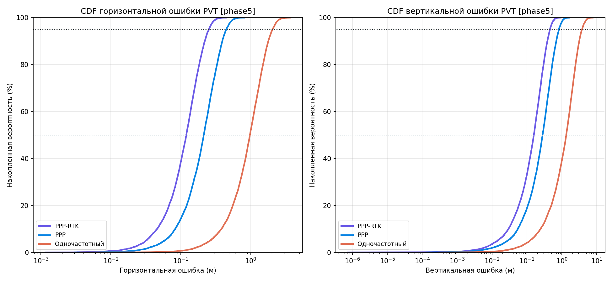

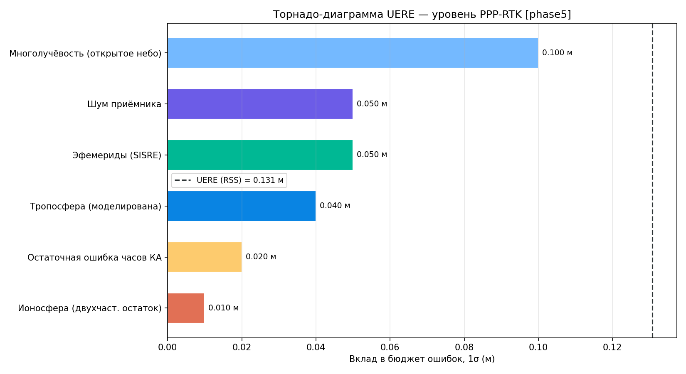

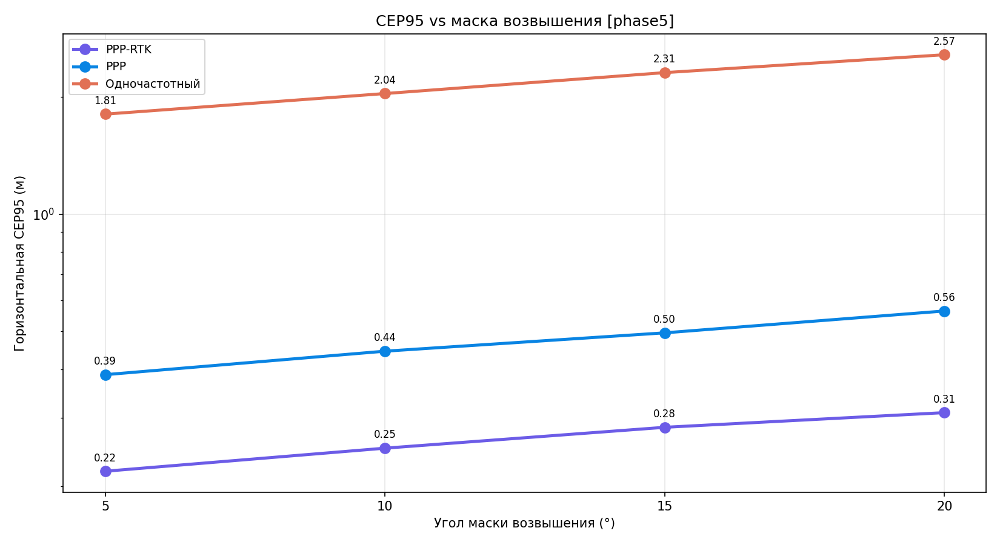

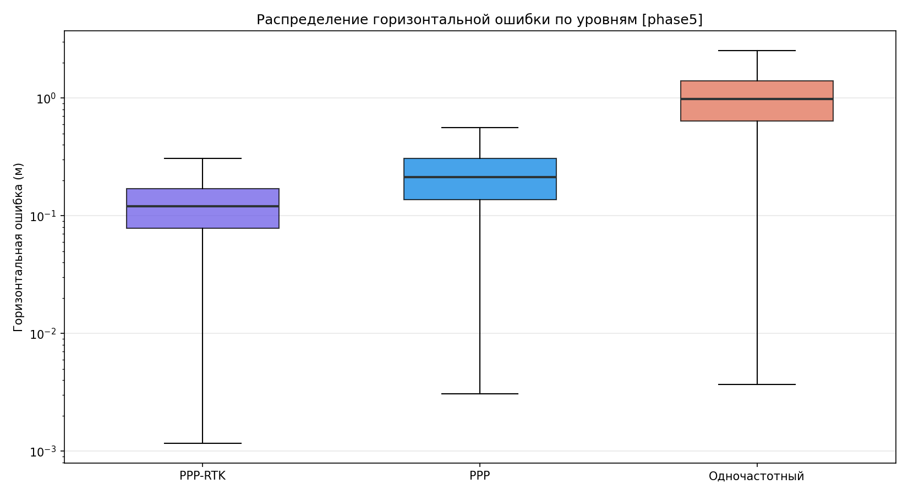

Источники: RTCA DO-229; Kaplan & Hegarty (2017), *Understanding GPS/GNSS*.

---

## 46. Временна́я доступность и DOP

### 46.1 Метод

Аналитическая модель Walker Delta 300/15 (h = 1000 км, i = 75°, T ≈ 105 мин)
прогоняется 24 ч с шагом 60 с. Для каждой эпохи строится матрица геометрии
**H** (направляющие косинусы + столбец часов), затем

$$\mathrm{PDOP} = \sqrt{\mathrm{tr}\big[(\mathbf{H}^\top\mathbf{H})^{-1}\big]_{xyz}}, \qquad \text{доступность} = P(\mathrm{PDOP}<6 \;\&\; N_{sat}\ge 4)$$

### 46.2 Результаты по широтам (маска 10°)

| Широта | PDOP сред. | PDOP макс. | Доступн. | N_спутн. сред. |
|---|---|---|---|---|
| 0° | 2,27 | 4,18 | 100,0 % | 7,1 |
| 30° | 2,28 | 4,37 | 100,0 % | 8,4 |
| 55° | 1,48 | 1,95 | 100,0 % | 16,1 |
| 70° | 1,15 | 1,35 | 100,0 % | 19,7 |
| 80° | 1,54 | 1,79 | 100,0 % | 20,7 |

Москва (55,75° с.ш.): PDOP сред. 1,46, N_спутн. сред. 16,5 — следствие
наклонения 75° (повышенная плотность созвездия в средних/высоких широтах).

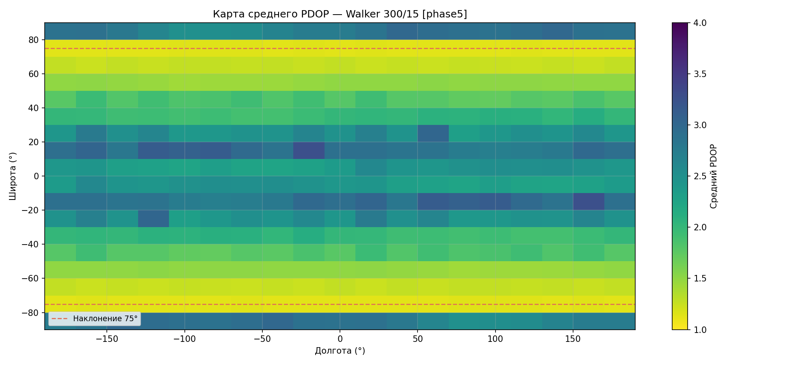

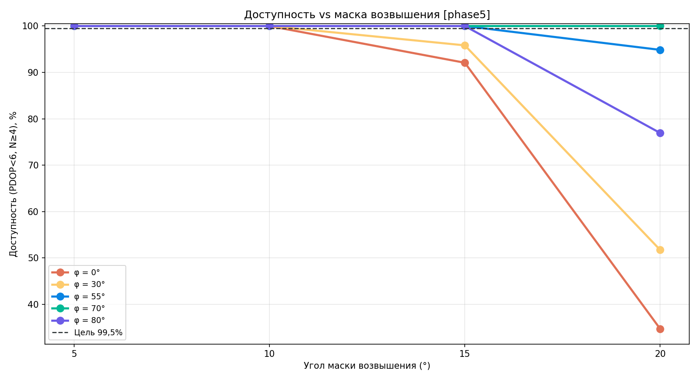

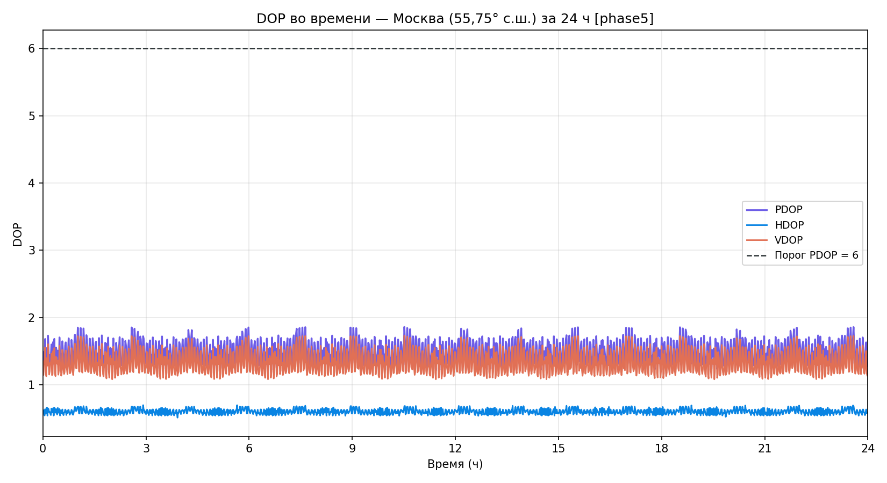

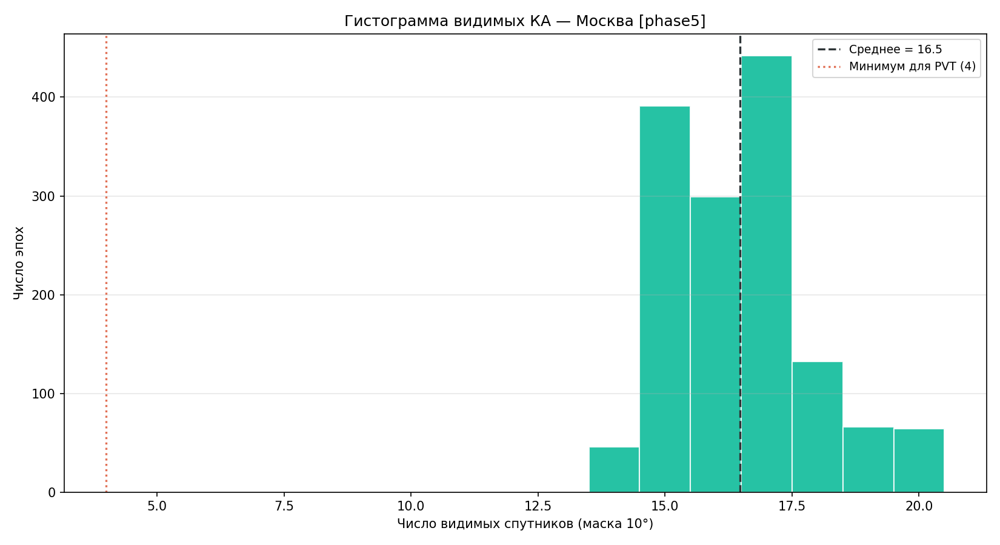

---

## 47. Точное определение орбиты (POD)

### 47.1 Силовая модель

$$\ddot{\mathbf{r}} = -\frac{\mu \mathbf{r}}{r^3} + \mathbf{a}_{J2..J6} + \mathbf{a}_{\text{Луна,Солнце}} + \mathbf{a}_{SRP} + \mathbf{a}_{\text{торм.}}$$

На h = 1000 км доминирует J2 (~10⁻² м/с²); SRP (~6·10⁻⁸) и атмосферное
торможение (~10⁻⁹) малы, но учитываются в редуцированно-динамической модели.
SISRE = $\sqrt{(w_R\sigma_R)^2 + (\sigma_A^2+\sigma_C^2)/k + \sigma_{clk}^2}$,
$w_R\approx0{,}98$, $k\approx45$ для LEO.

### 47.2 Достижимая точность орбиты (1σ)

| Сценарий | Radial | Along | Cross | SISRE |
|---|---|---|---|---|
| Только сеть (21 ст.) | 15 см | 30 см | 20 см | **18,6 см** |
| Сеть + валидация SLR | 3 см | 8 см | 5 см | **5,2 см** |
| Редуцированно-динамич. | 5 см | 12 см | 8 см | **8,0 см** |

Указанные значения — точность **определённой** (постобработанной) орбиты. В навигационное
сообщение транслируются **прогнозируемые** эфемериды с дополнительной ошибкой прогноза на
интервал обновления; их SISRE составляет **≈ 0,3–0,45 м** и входит в бюджет UERE (§37.3, §8.6),
где орбита — доминирующая составляющая. Благодаря частым обновлениям (короткие LEO-проходы над
наземной сетью) и ISL-измерениям прогнозный интервал мал, что удерживает транслируемый SISRE
у нижней границы диапазона — это резерв снижения UERE с ~0,7 до ~0,6 м.

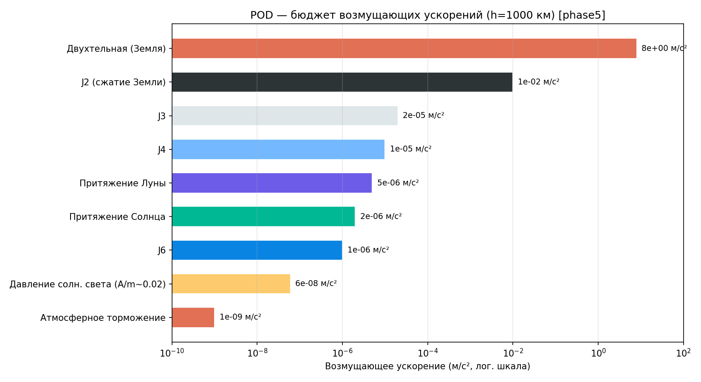

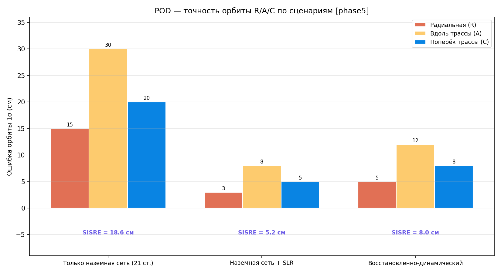

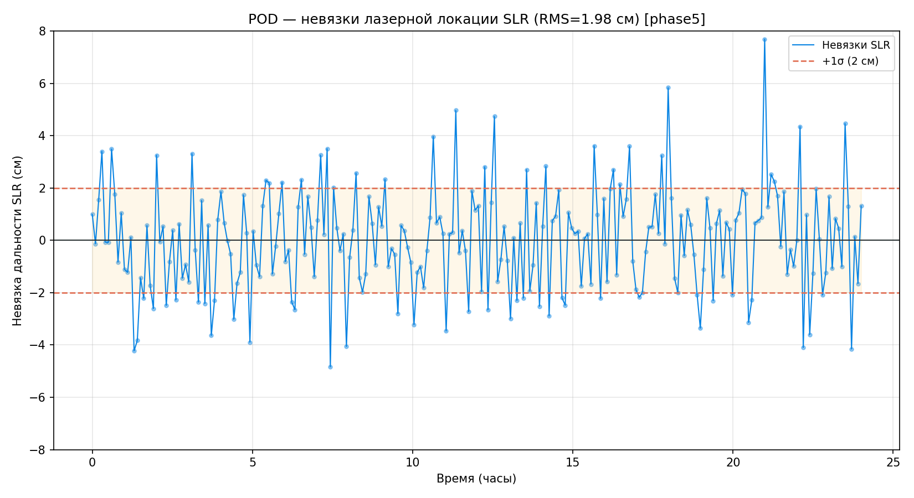

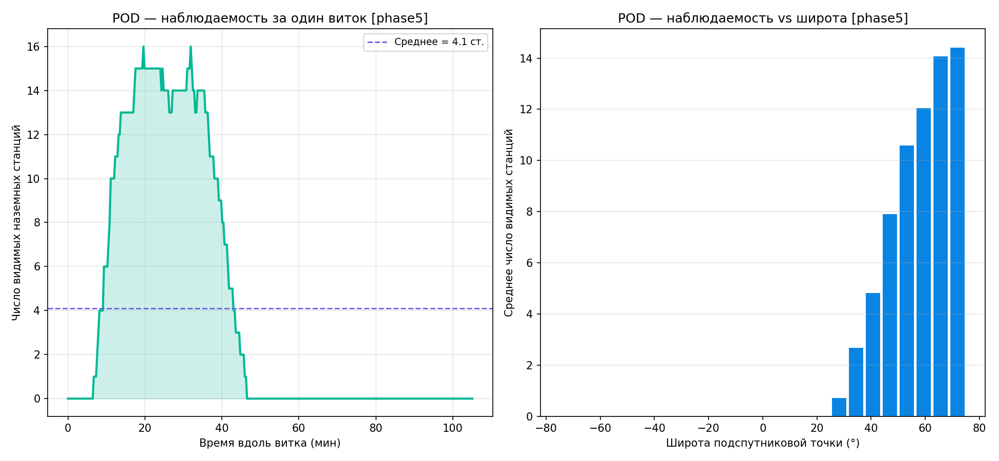

Источники: Montenbruck & Gill (2000), *Satellite Orbits*; IERS Conventions (2010).

---

## 48. Автономная навигация (ISL AutoNav)

### 48.1 Принцип и ограничение наблюдаемости

Межспутниковое псевдорасстояние (Ka, 26 ГГц, σ ≈ 5 см):

$$\Delta\rho_{ij} = |\mathbf{r}_i - \mathbf{r}_j| + c\,\Delta\delta t$$

Только ISL-измерения оставляют **вырождение ранга = 3 степени свободы**
(неопределённость жёсткого вращения созвездия как целого). Устраняется
≥ 1 наземным якорем или абсолютной ориентацией. Без наземного контакта
ошибка эфемерид растёт линейно:

$$\varepsilon_{eph}(t) \approx \varepsilon_0 + k\cdot t, \quad \varepsilon_0\approx0{,}1\text{ м}, \; k\approx1{,}0\text{ м/сут}$$

За 14 сут автономии — ≈ 14 м; при наземной привязке раз в сутки
ошибка ограничена ~0,1 м.

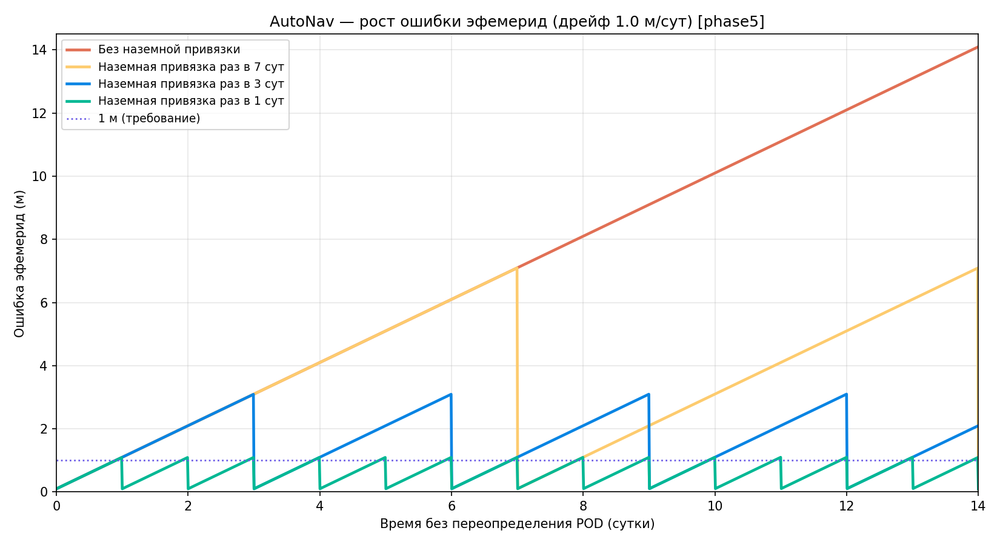

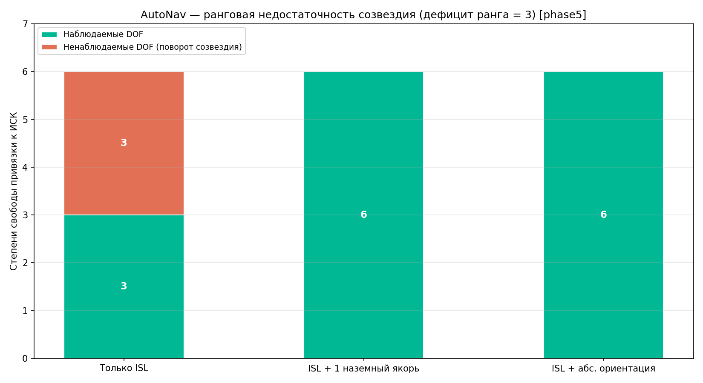

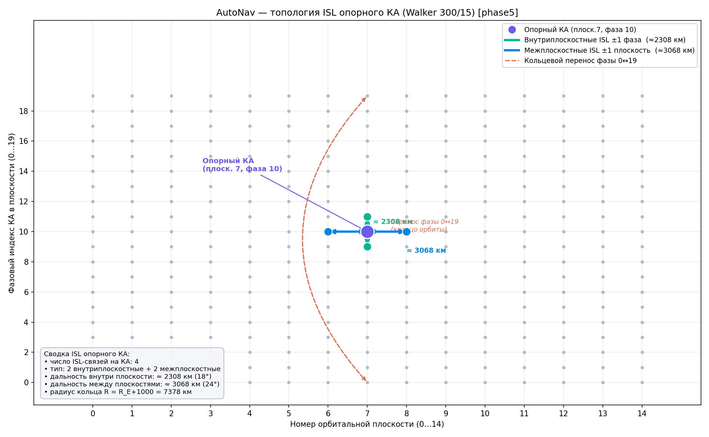

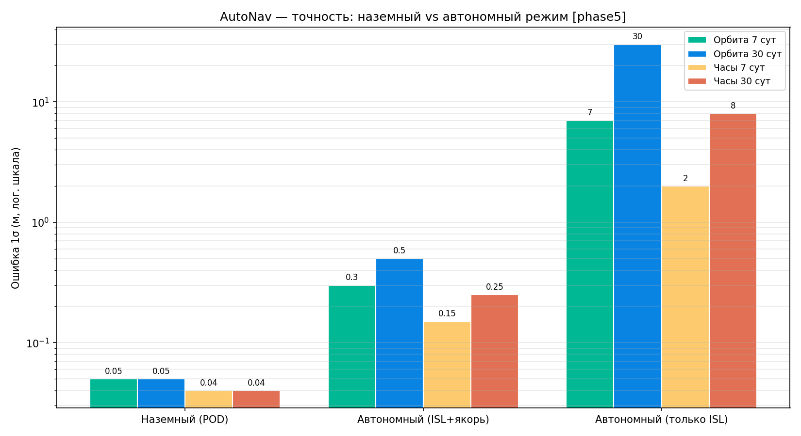

Источники: Ananda et al. (1990), GPS AutoNav; Rajan (2002), crosslink ranging.

---

## 49. ARAIM и защитные уровни

### 49.1 Solution separation

Для каждого режима отказа k вычисляется разность решений
(all-in-view vs subset-k) и защитный уровень:

$$\mathrm{VPL} = \max_k\big(|b_k| + K_{md}\,\sigma_{ss,k}\big) + K_{ffmd}\,\sigma_{v}$$

$K_{md} = 5{,}33$, $K_{ffmd} = 5{,}81$. Бюджет целостности
$P_{HMI} = 10^{-7}$/заход: вертикаль 9,8·10⁻⁸, горизонталь 2·10⁻⁹;
$P_{sat} = 10^{-5}$, $P_{const} = 10^{-4}$.

### 49.2 Результаты

| Параметр | Значение | Предел | Статус |
|---|---|---|---|
| VPL | 9,87 м | VAL = 35 м (LPV-200) | + |
| HPL | 4,90 м | HAL = 40 м | + |
| σ_V / σ_H | 0,421 / 0,232 м | — | — |
| Доступность LPV-200 | 100,0 % | ≥ 99 % | + |

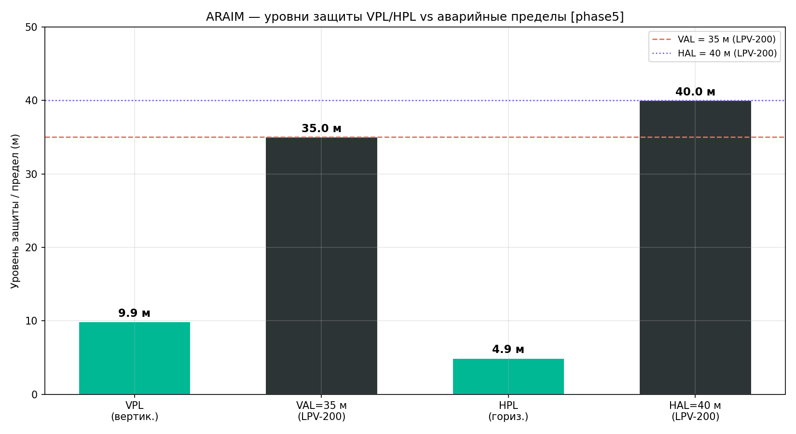

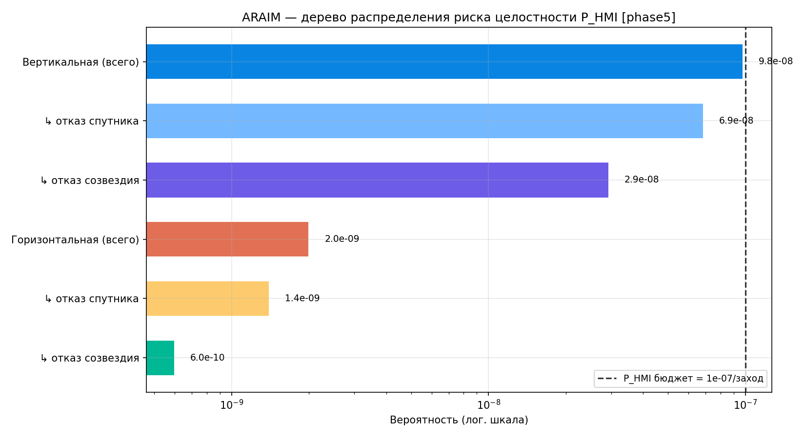

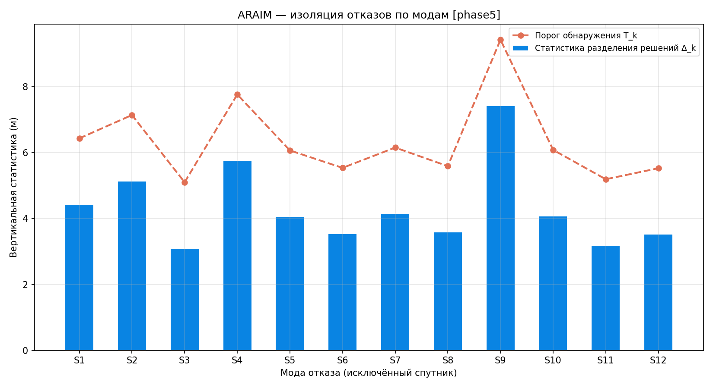

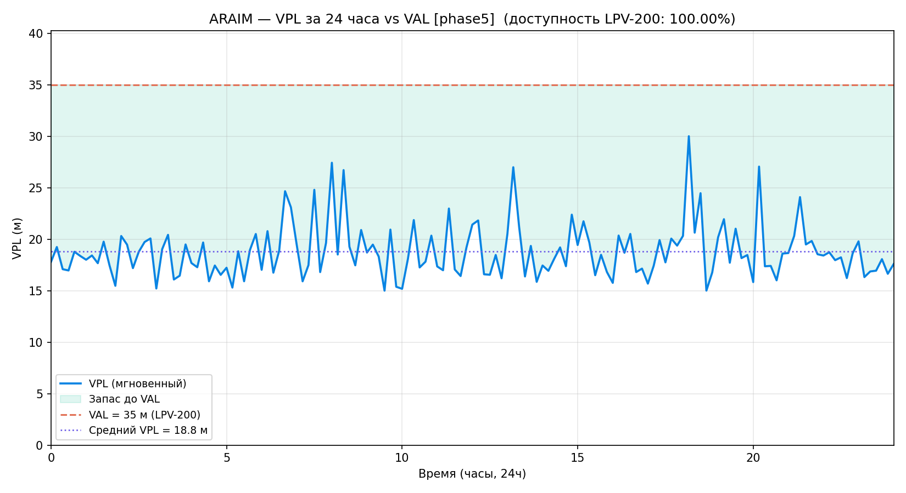

Источники: Blanch et al. (2015), *Baseline ARAIM*; GEAS Phase II Report (2010).

---

## 50. Бюджет целостности (LPV-200 / CAT-I)

### 50.1 Диаграмма Стэнфорда

Классификация N = 2·10⁴ пар (ошибка позиции PE, защитный уровень PL):
номинал / система недоступна (PL > AL) / вводящая в заблуждение информация
(PE > AL > PL) / опасная (PE > PL). VAL: LPV-200 = 35 м, CAT-I = 15 м.

### 50.2 Результаты и параметры ISM

| Показатель | Значение |
|---|---|
| Номинальных эпох | 100,0 % (0 MI, 0 HMI) |
| Доступность LPV-200 | 100,0 % |
| Доступность CAT-I | 100,0 % |
| Геогр. карта (сред.) | 99,63 % (99,00–99,99 %) |
| ISM: b_nom / σ_URA | 0,75 м / 0,50 м |
| ISM: P_sat / P_const / R_irr | 10⁻⁵ / 10⁻⁴ / 10⁻⁸ |

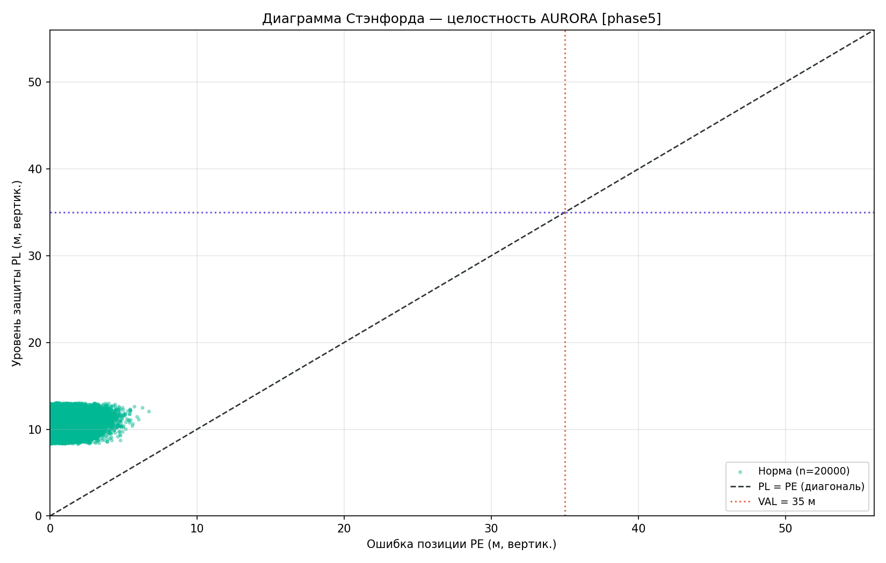

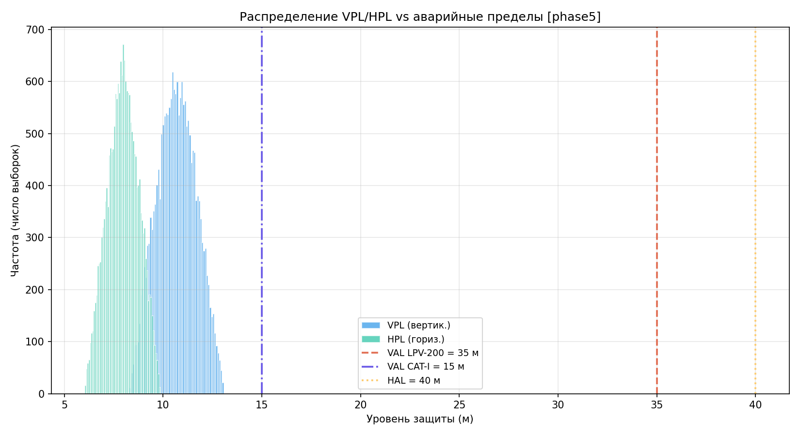

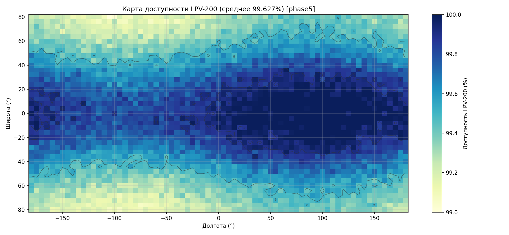

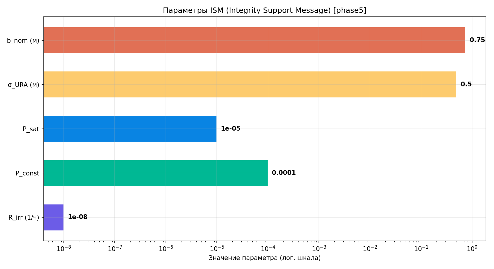

Источники: ICAO Annex 10 Vol I; RTCA DO-229E; EU-US ARAIM WG-C (2016).

---

## 51. Стоимостная модель (LCC)

### 51.1 Структура жизненного цикла

$$\mathrm{LCC} = \mathrm{NRE} + \underbrace{\sum_{n=1}^{300} T_1 \cdot n^{\log_2 b}}_{\text{бус+ПН+ISL}} + \underbrace{N \cdot C_{clk}}_{\text{часы (COTS)}} + C_{launch} + C_{ground} + \mathrm{OPEX}\cdot Y$$

Кривая обучения Райта $b = 0{,}85$ применяется к платформе и полезной нагрузке;
$T_1 = 292$ млн ₽ — стоимость первого лётного КА **без бортового стандарта частоты**.
Атомные часы (CSAC + space-Rb-якоря + обвязка) — отдельная закупная позиция:
**5 млн ₽/комплект (РИРВ/«Время-Ч», РФ)**, без кривой обучения (мелкая серия у поставщика).

### 51.2 Бюджет (оценка)

| Статья | Стоимость, млн ₽ | Справ. $M |
|---|---|---|
| NRE (проектирование + квалификация) | 10 800 | 120 |
| Серия 300 КА — платформа+нав. ПН+ISL (с кривой обучения) | 29 851 | 332 |
| **Бортовой стандарт частоты** (300 CSAC + 15 space-Rb, РФ) | **1 500** | **17** |
| Запуски (25 × 1 080) | 27 000 | 300 |
| Наземный сегмент (CAPEX) | 7 200 | 80 |
| OPEX за 7 лет (3 600 × 7) | 25 200 | 280 |
| **LCC за 7 лет** | **101 551 млн ₽ ≈ 101,5 млрд ₽** | **1 128** |
| **LCC за 15 лет** | **130 351 млн ₽ ≈ 130,4 млрд ₽** | **1 449** |
| Стоимость на 1 КА (7 лет) | 339 млн ₽ | 3,77 |
| Стоимость в год (среднее за 7 лет) | 14 507 млн ₽/год | 161,2 |

**Ключевое преимущество:** использование российских бортовых стандартов частоты
снижает стоимость часовой подсистемы в ≈ 14 раз против западных аналогов
(Microsemi 5071A space-qual ≈ 68 млн ₽/комплект). Экономия за серию ≈ 18,9 млрд ₽.
Это делает программу АВРОРА конкурентоспособной без западного импорта критичной
элементной базы.

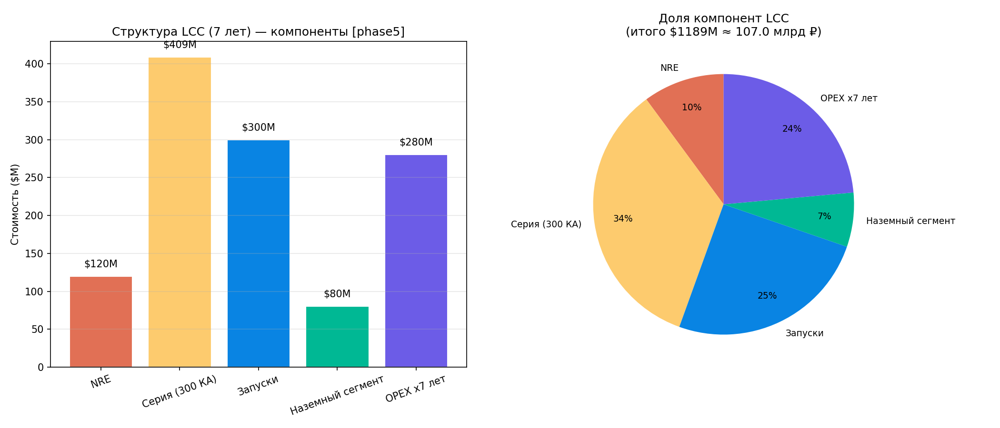

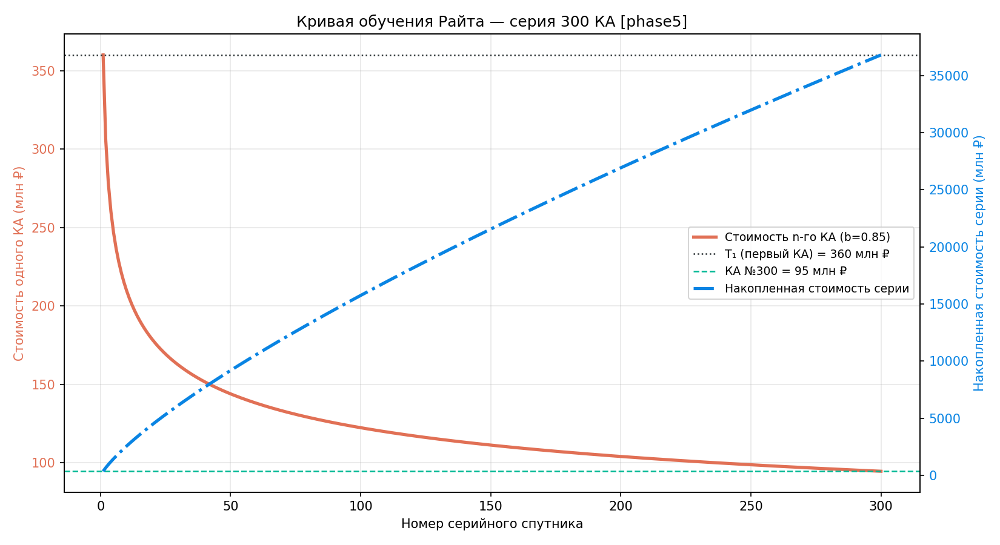

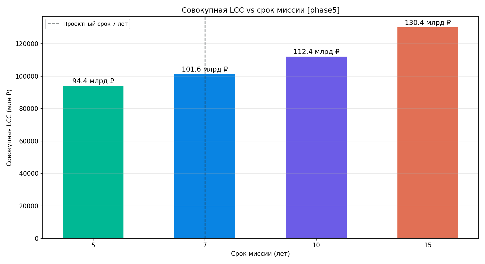

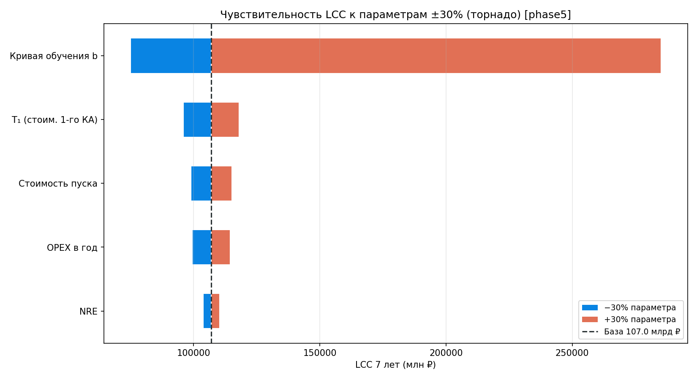

Источники: Wertz & Larson (1999), *SMAD*; NASA Cost Estimating Handbook (2015).

---

## 52. Производство и AIT 300 КА

### 52.1 Поток сборки-испытаний

Цикл AIT одного КА — 35 сут: интеграция 10, функц. испытания 7,
термовакуум + вибрация 14, финал/отгрузка 4. Такт = T_прогр/300;
для 36-месячной программы требуется **4 параллельные линии AIT**.

| Линий AIT | Темп (КА/мес) | Срок 300 КА |
|---|---|---|
| 1 | 1,5 | ~200 мес |
| 2 | 3,0 | ~100 мес |
| 3 | 4,5 | ~67 мес |
| **4** | **6,0** | **~50 мес** |

Узкое место — термовакуумная камера (14 сут/КА).

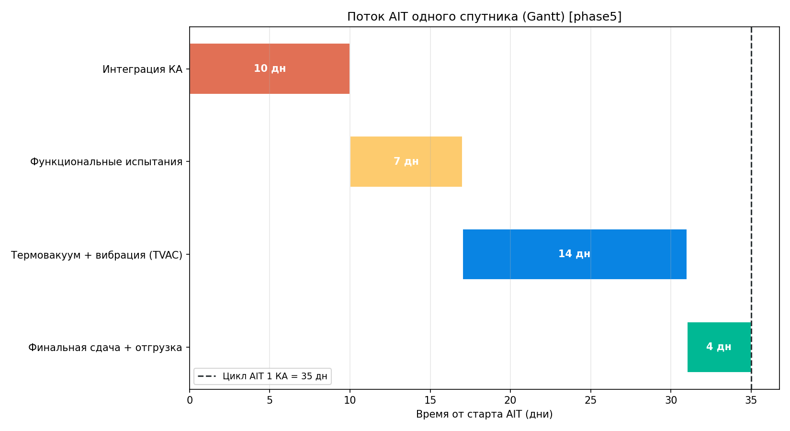

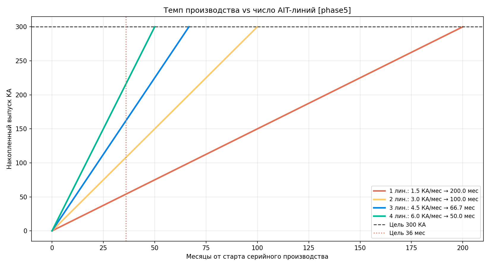

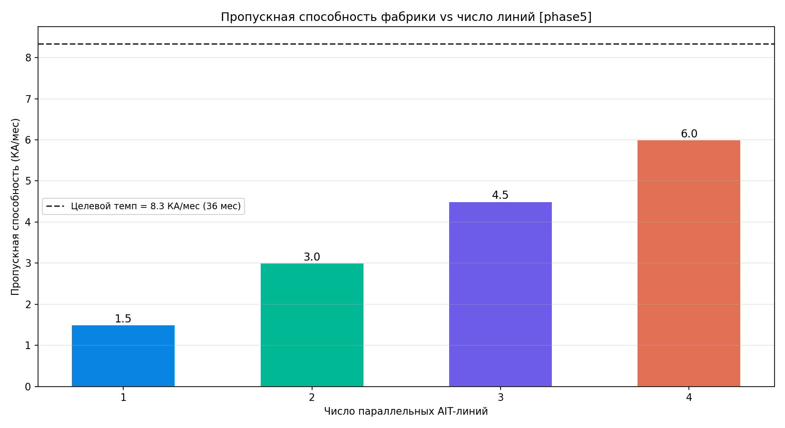

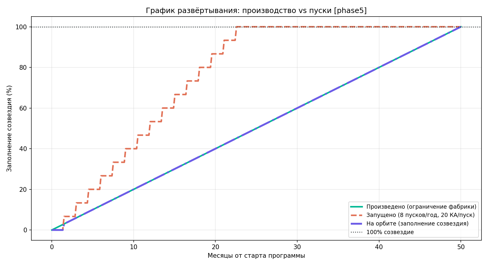

---

## 53. Кампания выведения

### 53.1 Манифест и фазирование

| Носитель | КА/пуск | Число пусков |
|---|---|---|
| Лёгкий | 20 | 15 |
| Средний | 40 | 8 |

Фазирование RAAN дифференциальным J2-дрейфом:
$\dot\Omega_{park} = -2{,}196$°/сут, $\dot\Omega_{опер} = -1{,}549$°/сут,
разность −0,647°/сут → ~37 сут на разведение плоскостей на 24°.

ΔV выведения (Хоманн с парковочной 300 км → 1000 км):

| Компонент | ΔV |
|---|---|
| Подъём перигея | 190 м/с |
| Подъём апогея + циркуляризация | 185 + 15 м/с |
| Штраф фазирования RAAN | 30 м/с |
| **Итого** | **420 м/с** |

Полное созвездие: 45 мес при 4 пусках/год, 22 мес при 8 пусках/год.

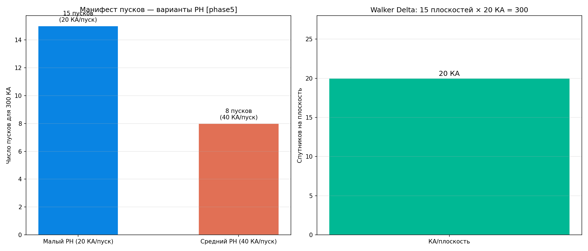

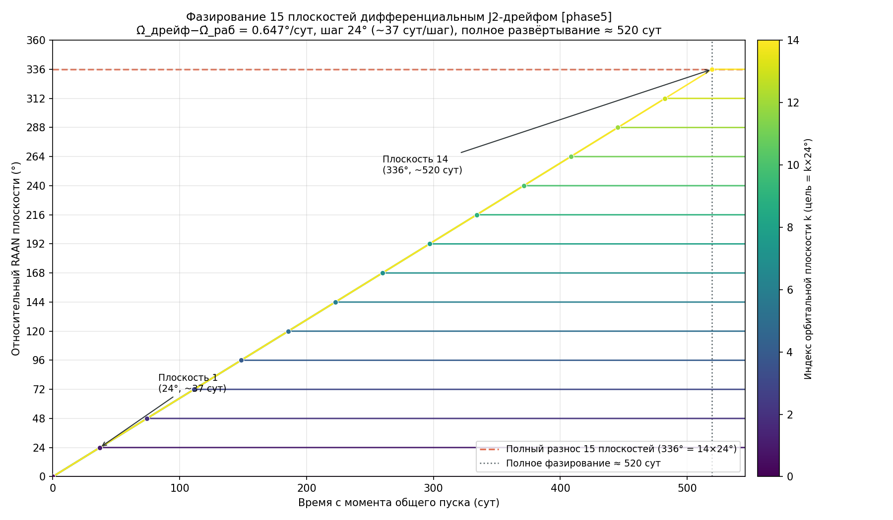

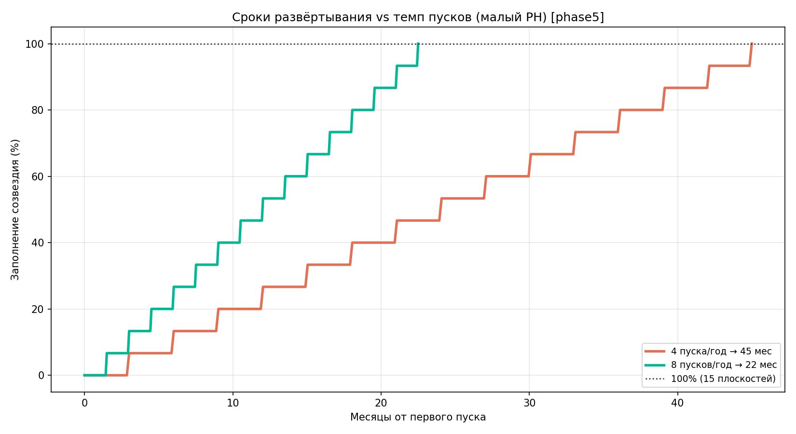

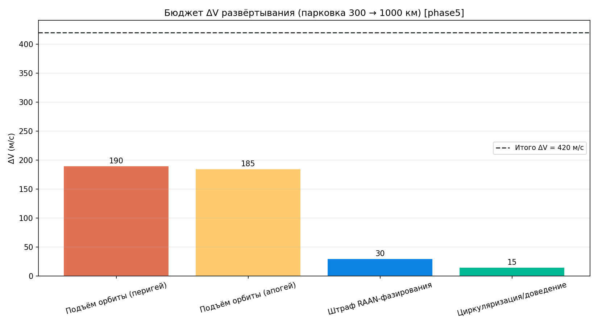

---

## 54. Наземный сегмент (MCS/TT&C)

### 54.1 Архитектура и задержки

5 станций TT&C + 21 станция мониторинга/RSN + резервированный MCS.
Сквозная задержка управления:

| Компонент | мс |
|---|---|
| Нисходящий канал | 3,3 |
| Обработка станции TT&C | 5,0 |
| Станция → MCS (оптика) | 20,0 |
| MCS: расчёт орбиты и часов | 50,0 |
| Формирование расписания загрузки | 15,0 |
| Восходящий канал | 3,3 |
| **Итого** | **96,6 мс** |

### 54.2 Резервирование и пропускная способность

Доступность MCS = $1-(1-R)^n$, R_одиночн. = 0,98:
без резерва 0,980; 1+1 → 0,99960; 2+1 → 0,99999.

**Выявленное ограничение и план закрытия:** при 5 станциях TT&C доступно
~600 контактов/сут против требуемых ~1200 для 300 КА (дефицит −50 %).

**Решение — поэтапное расширение TT&C-сети до 10 станций (требование GRN-01):**

| Этап | Станции (доп.) | К Ф ввода | Доступно конт./сут | Покрытие |
|---|---|---|---|---|
| Базовый (Ф1–Ф2, 90 КА) | 5 | 2032 | 600 | 100 % |
| Расширение Ф3 (180 КА) | +3 → 8 | 2034 | 960 | 87 % |
| Полное Ф4 (300 КА) | +2 → 10 | 2036 | 1200 | 100 % |

Альтернатива — увеличение пропускной способности на станцию (мульти-частотный
аплинк, повышение скорости TM) — может снять дефицит до 8 станций.
Передано в SRD как GRN-01 «≥ 5 станций (наращивание до 10)» (см. §55.5).

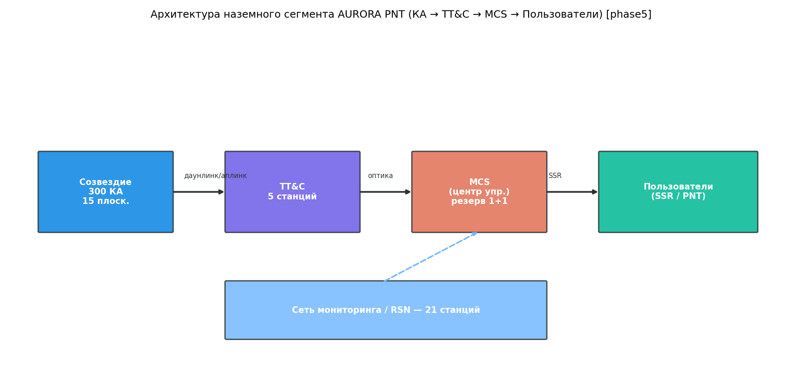

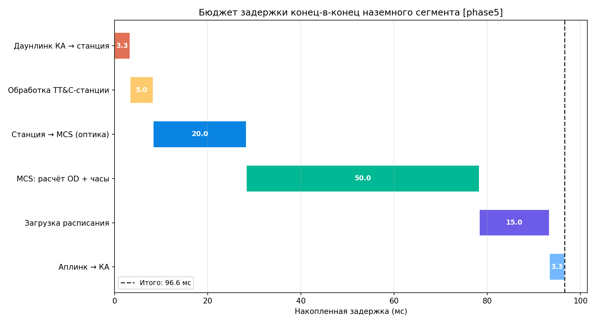

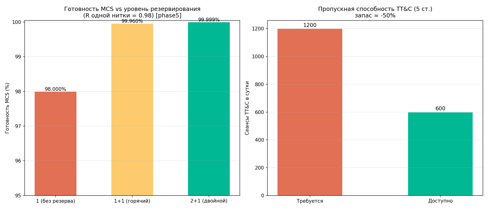

---

## 55. Системные требования (SRD)

### 55.1 Иерархия требований

Требования АВРОРА структурированы по уровням согласно ГОСТ Р 15.000-2016 и ECSS-E-ST-10C:

| Уровень | Префикс | Источник | Количество |
|---|---|---|---|
| Миссионные требования | **MIS-** | Заказчик / стратегия | 8 |
| Функциональные требования | **FUN-** | Анализ операций | 14 |
| Технические требования к КА | **SAT-** | Системная архитектура | 12 |
| Технические требования к НКУ | **GRN-** | Архитектура сегмента | 7 |
| Внешние ограничения | **EXT-** | МСЭ / стандарты | 5 |
| **Итого** | | | **46** |

### 55.2 Миссионные требования (MIS-)

| ID | Требование | Значение | Метод верификации |
|---|---|---|---|
| MIS-01 | Глобальное покрытие | ≥ 99 % при PDOP < 6 | Симуляция §46 |
| MIS-02 | Точность горизонтальной позиции 95 % | < 50 см (одночастот.) / < 30 см (двухчаст.) | Полевые испытания |
| MIS-03 | Точность вертикальной позиции 95 % | < 1 м | §45 + полевые |
| MIS-04 | Доступность LPV-200 | ≥ 99 % | ARAIM анализ §49 |
| MIS-05 | Целостность $P_{HMI}$ | < 10⁻⁷/заход | §50 |
| MIS-06 | Проектный срок службы | 7 лет (расширение до 15) | §35 надёжность |
| MIS-07 | Полное развёртывание группировки | ≤ 84 мес от первого пуска | §58 график |
| MIS-08 | Независимость от иностранной критической ЭКБ | Часы, ЭКБ rad-hard — РФ | §51 экономика |

### 55.3 Функциональные требования (FUN-, выборка ключевых)

| ID | Требование | Реализация |
|---|---|---|
| FUN-01 | Передача сигнала на L1 (1575,42 МГц) и L5 (1176,45 МГц) | §6, §10 |
| FUN-02 | Модуляция L1: BOC(1,1) data + TMBOC(6,1,4/33) pilot | §6.2 |
| FUN-03 | Модуляция L5: BPSK(10) data + pilot | §6.2 |
| FUN-04 | Аутентификация сигнала (анти-спуфинг) | TESLA MAC, §16 |
| FUN-05 | Время до первого определения TTFF cold | ≤ 30 с | §27 |
| FUN-06 | TTFF warm/hot | ≤ 5 с / ≤ 1 с | §27 |
| FUN-07 | Межспутниковые измерения (ISL) | Ka 26,5 ГГц, σ_range < 5 см | §9 |
| FUN-08 | Автономная навигация (без земли) | Drift < 1 м/сут | §48 AutoNav |
| FUN-09 | Передача SSR-поправок PPP-RTK | Задержка < 100 мс | §44 |
| FUN-10 | Сходимость PPP-RTK | < 30 с при базе < 300 км | §44 |
| FUN-11 | Бортовая шкала времени LPT | Синхронизация с UTC ± 5 нс | §28 |
| FUN-12 | Аварийный сход с орбиты | Естественное падение ≤ 25 лет | §22 IADC |
| FUN-13 | Предотвращение столкновений (CAM) | Решение об уклонении при P(c) > 10⁻⁴ | §23 |
| FUN-14 | Радио-молчание (в эмерженси) | Команда «mute» все КА за 5 мин | §56 CONOPS |

### 55.4 Технические требования к КА (SAT-, выборка)

| ID | Требование | Значение |
|---|---|---|
| SAT-01 | Масса заправленного КА | ≤ 150 кг (цель), фактическая 140 кг |
| SAT-02 | Габариты в дискомпактном диспенсере | ≤ 60×60×80 см |
| SAT-03 | Полезная мощность EOL | ≥ 880 Вт |
| SAT-04 | Стабильность бортового стандарта (CSAC) τ=100 с (ADEV) | ≤ 3·10⁻¹¹ |
| SAT-05 | Радиационная стойкость БЦВМ | TID ≥ 100 крад (Si) |
| SAT-06 | Точность ориентации антенны | ≤ 0,3° (3σ) |
| SAT-07 | Изменчивость SISA | < 0,5 м (1σ) |
| SAT-08 | Перегруз. способность ΔV | 175 м/с с запасом 2,5× |
| SAT-09 | ISL ёмкость на КА | 4 канала (2 intra + 2 inter) |
| SAT-10 | Эфемерид интервал обновления | ≤ 600 с |
| SAT-11 | Срок хранения готовности (warehouse) | ≥ 24 мес |
| SAT-12 | MTBF подсистем | См. §35 |

### 55.5 Технические требования к НКУ (GRN-)

| ID | Требование | Реализация |
|---|---|---|
| GRN-01 | Сеть TT&C-станций | ≥ 5 станций (наращивание до 10) §54 |
| GRN-02 | Сеть мониторинга (RSN) | 21 станция, шаг ≤ 300 км в РФ |
| GRN-03 | MCS резервирование | 2N+1 (2 активных + 1 hot-spare) |
| GRN-04 | Доступность MCS | ≥ 0,9999 |
| GRN-05 | Задержка обновления SSR | ≤ 30 с (сеть → пользователь) |
| GRN-06 | Архив телеметрии | ≥ 5 лет |
| GRN-07 | Кибербезопасность класс | КИИ-1 (по ФЗ-187, КИИ России) |

### 55.6 Внешние ограничения (EXT-)

| ID | Источник | Ограничение |
|---|---|---|
| EXT-01 | МСЭ-R, RR ст. 21 / S.1340 | PFD ≤ −121,5 дБВт/м² (4 МГц, RNSS защита) |
| EXT-02 | ГКРЧ РФ | Согласование полос L1/L5/Ka |
| EXT-03 | IADC «25 years rule» | Сход с орбиты ≤ 25 лет |
| EXT-04 | ИКАО Annex 10 | Соответствие критериям SBAS для гражд. авиации |
| EXT-05 | ФЗ-187 (КИИ) | Категория КИИ-1, защита по 17/239 ФСТЭК |

Полная трассировка «требование → раздел проекта → метод верификации» — в §59.

---

## 56. Концепция операций (CONOPS)

### 56.1 Эксплуатационные режимы КА

| Режим | Описание | Условия входа | Длительность |
|---|---|---|---|
| **LAU** Launch | После отделения от диспенсера; ориентация по Солнцу | T+0 ... T+1 ч | 1 ч |
| **ACQ** Acquisition | Раскрытие СБ, выход на трёхосную стабилизацию | T+1 ... T+4 ч | 3 ч |
| **COM** Commissioning | Тестирование подсистем, калибровка часов, синхронизация ISL | T+4 ч ... T+30 сут | до 30 сут |
| **OPS** Operational | Штатная навигационная служба; передача L1/L5; ISL активны | После M_ACC | 7+ лет |
| **SAF** Safe Mode | При обнаружении аномалии (FDIR); ориентация SunPoint; сброс ПН | Триггер FDIR | Часы–сутки |
| **CAM** Collision Avoidance Manoeuvre | Уклонение от обломка | P(c) > 10⁻⁴ | < 30 мин на манёвр |
| **MNT** Maintenance | Загрузка ПО, калибровка, реконфигурация | По плану | < 1 ч |
| **EOL** End of Life | Финальный тормозной импульс, пассивация | После выработки ресурса | 1–7 сут |

### 56.2 Диаграмма состояний

```
                ┌──────────┐
                │   LAU    │
                └────┬─────┘
                     │ T+1 ч, аппарат стабилизирован
                ┌────▼─────┐
                │   ACQ    │
                └────┬─────┘
                     │ EPS, AOCS, ISL подключены
                ┌────▼─────┐                    ┌──────────┐
                │   COM    │ ────тестирование──▶│   SAF    │
                └────┬─────┘                    │(аномалия)│
                     │ часы синхронизированы    └────┬─────┘
                ┌────▼─────┐ ◄──reset──────────────┘
   ┌────────────│   OPS    │
   │            │(штатный) │
   │  ┌────────▶└────┬─────┘ ◄────┐
   │  │              │             │
   │ MNT           CAM             │
   │  │              │             │
   │  └──вход───┐    │             │
   │   мес.    │    │             │
   │           ▼    ▼             │
   │          ┌──────────┐         │
   │          │ Возврат  │─────────┘
   │          │  в OPS   │
   │          └──────────┘
   │
   ▼ Конец 7-летнего проектного срока
┌──────────┐
│   EOL    │ — финальный ΔV 120 м/с, пассивация, естественный сход ≤ 25 лет
└──────────┘
```

### 56.3 Эксплуатационные сценарии

**Сценарий А — штатная навигационная служба (95 % времени):**
KA в OPS, передаёт L1/L5, измеряет ISL-дальности до 4 соседей, передаёт навигационное сообщение, принимает аплинк-команды из MCS раз в орбиту.

**Сценарий Б — пополнение группировки:**
Новый КА с диспенсера, выход на дрейфовую орбиту 300 км, фазирование по RAAN (~37 сут на каждую плоскость, §53), подъём на 1000 км, COM-фаза 30 сут, ввод в OPS.

**Сценарий В — отказ КА:**
FDIR на борту → SAF Mode; уведомление MCS через TT&C; диагностика; решение либо восстановление, либо вывод из эксплуатации; пополнение группировки запасным КА из «холодного резерва».

**Сценарий Г — CAM (предотвращение столкновения):**
Прогноз сближения от Роскосмос / 18 SDS; оценка P(c) > 10⁻⁴; план манёвра (∆V ≈ 5 мм/с); согласование с MCS; выполнение; возврат в OPS (~30 мин total).

**Сценарий Д — кибератака (TESLA-ключи скомпрометированы):**
Обнаружение через мониторинг RSN-аномалий; rollover ключевой цепочки TESLA по запасному набору; уведомление пользователей через SSR флаг; восстановление в течение 5 минут.

**Сценарий Е — потеря связи с MCS (катастрофа):**
КА переходят в AutoNav режим (ISL-based, §48); деградация эфемерид ~1 м/сут; флаг «degraded mode» в навигационном сообщении; пользователи переключаются на резервные системы (ГЛОНАСС/GPS).

### 56.4 Операционная команда

| Роль | Численность | Функции |
|---|---|---|
| Дежурный оператор MCS | 4 (24/7) | Мониторинг, контроль ПО |
| Системный инженер | 6 | OD, расчёт SSR, FDIR |
| Программист бортового ПО | 3 | Обновления, патчи |
| Инженер ТЭО | 4 | Анализ телеметрии, прогноз |
| Кибербезопасность | 2 | SOC, инциденты |
| Аналитики данных | 5 | Качество сигнала, валидация |
| **Итого штат MCS** | **24** | |

---

## 57. Реестр рисков

### 57.1 Методология

Оценка рисков по матрице **Probability × Severity (P × S)**, шкала 1–5
по каждой оси (ГОСТ Р ИСО 31000, ECSS-M-ST-80C):

- **Low** (1–5): принять, мониторить
- **Medium** (6–12): план снижения
- **High** (13–20): активная митигация
- **Critical** (>20): немедленное действие

Реестр из 25 идентифицированных рисков по 6 категориям:
**Технические** (T), **Программные/орг.** (P), **Внешние/регулят.** (E),
**Космич. среда** (S), **Кибер/безопасность** (C), **Эксплуатационные** (O).

### 57.2 Сводка по категориям

| Категория | Кол-во | Σ P×S | Макс. | Уровень |
|---|---|---|---|---|
| Внешние (санкции/регул.) | 6 | 68 | 16 | **High** |
| Технические | 6 | 47 | 12 | Medium |
| Программные | 4 | 41 | 12 | Medium |
| Космическая среда | 3 | 30 | 10 | Medium |
| Кибер | 3 | 18 | 12 | Medium |
| Эксплуатационные | 3 | 18 | 6 | Low–Medium |
| **Итого** | **25** | **222** | | |

### 57.3 Топ-5 рисков

| ID | Описание | P×S | Уровень | Мера |
|---|---|---|---|---|
| E-03 | Запрет на использование иностранных РН (санкции возврат) | **16** | High | Локализация: Союз-2.1, Ангара; rideshare с дружественными |
| E-05 | Эмбарго на rad-hard ЭКБ | **16** | High | Программа замещения; Cypress→ "Миландр"/"Микрон" |
| T-02 | Радиационное повреждение БЦВМ | 12 | Medium | Утолщённый экран Al 4 мм, rad-hard версия БЦВМ |
| P-01 | Срыв сроков ОКР | 12 | Medium | Параллельные команды, ранние прототипы |
| P-02 | Удорожание свыше 1,5× LCC | 12 | Medium | Чёткий объём, EVM (Earned Value Management) |

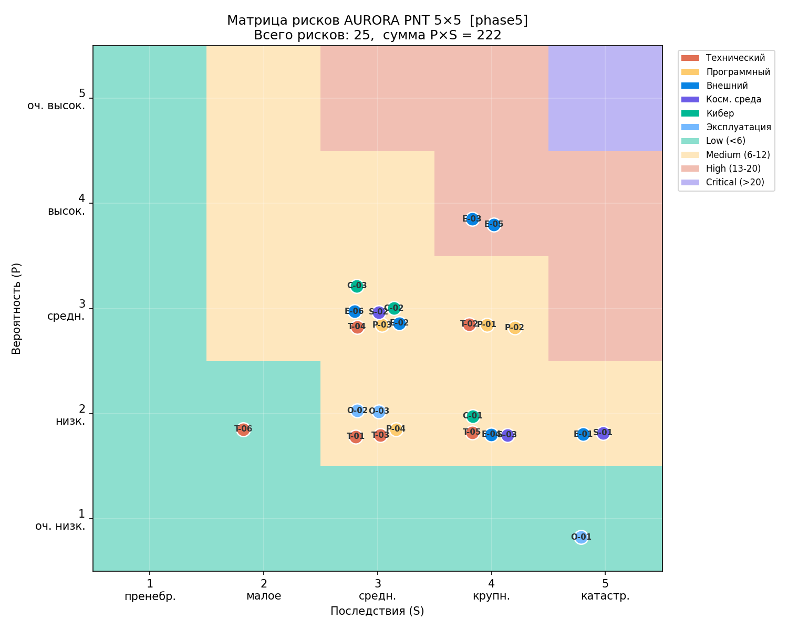

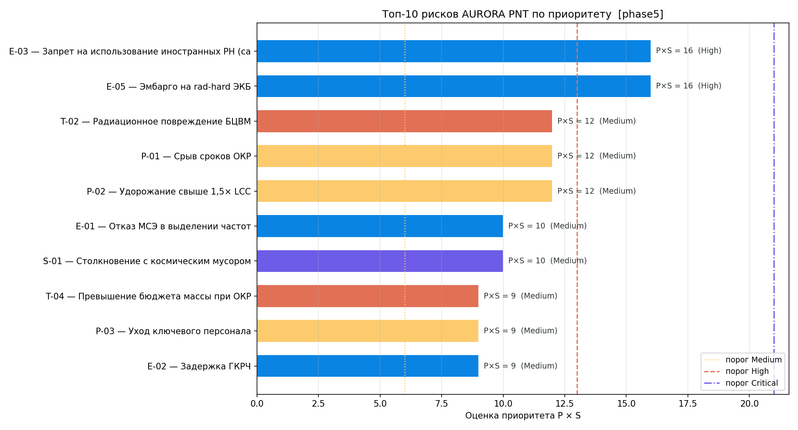

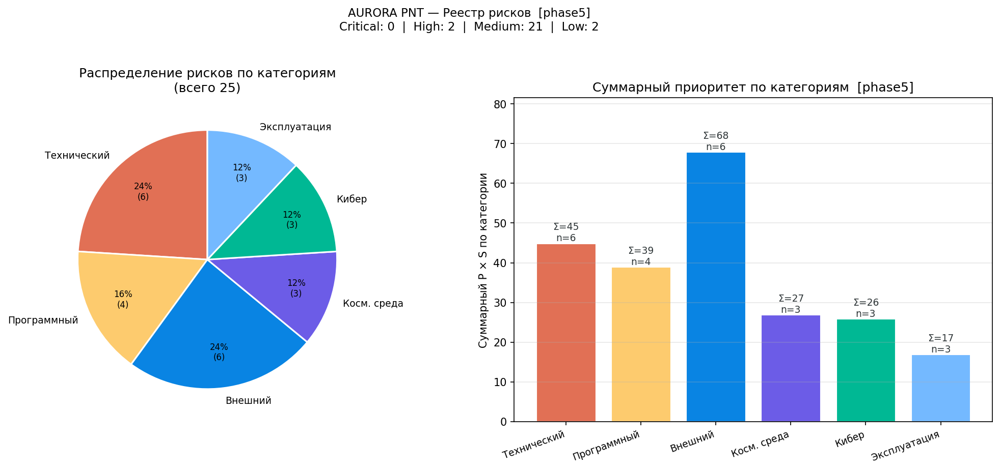

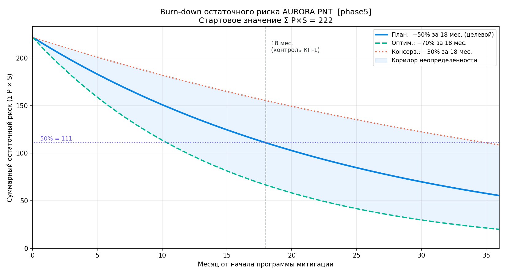

Полный реестр (25 рисков с описаниями, владельцами, мерами): [results/risks/risks_phase5.csv](results/risks/risks_phase5.csv).

---

## 58. План работ и график (Gantt)

### 58.1 Структура программы

Программа АВРОРА — 13 фаз с янв. 2026 по янв. 2043 (204 мес. = 17 лет
до конца проектного срока ВЭ Ф4). Текущая фаза: **Технический проект**.

| # | Фаза | Старт | Длительн. | Конец | Статус |
|---|---|---|---|---|---|
| 1 | Концептуальный проект | 2026-01 | 6 мес | 2026-07 | + |
| 2 | Эскизный проект | 2026-04 | 9 мес | 2027-01 | + |
| 3 | **Технический проект** | 2026-10 | 12 мес | 2027-10 | 🔄 |
| 4 | ОКР: рабочая документация | 2027-07 | 18 мес | 2029-01 | ⏳ |
| 5 | ОКР: квалификационные испытания | 2028-07 | 12 мес | 2029-07 | ⏳ |
| 6 | Производство опытной партии | 2029-01 | 18 мес | 2030-07 | ⏳ |
| 7 | Запуск демонстратора Ф0 (3 КА) | 2030-05 | 1 мес | 2030-06 | ⏳ |
| 8 | ЛКИ + валидация | 2030-06 | 6 мес | 2030-12 | ⏳ |
| 9 | Серия Ф1–Ф2 (90 КА) | 2030-07 | 24 мес | 2032-07 | ⏳ |
| 10 | Запуски Ф1–Ф2 (5 пусков) | 2031-07 | 18 мес | 2033-01 | ⏳ |
| 11 | Серия Ф3–Ф4 (210 КА) | 2032-07 | 36 мес | 2035-07 | ⏳ |
| 12 | Запуски Ф3–Ф4 (10 пусков) | 2033-07 | 30 мес | 2036-01 | ⏳ |
| 13 | Штатная эксплуатация Ф4 | 2036-01 | 84 мес | 2043-01 | ⏳ |

### 58.2 Ключевые вехи (Milestones)

| Веха | Дата | Содержание |
|---|---|---|
| **M1** | 2027-10 | Защита технического проекта |
| **M2** | 2028-07 | Готовность к ОКР |
| **M3** | 2030-05 | Запуск демонстратора Ф0 |
| **M4** | 2032-07 | Ввод в эксплуатацию Ф1–Ф2 |
| **M5** | 2034-07 | Операционная фаза Ф3 (180 КА) |
| **M6** | 2036-01 | Полное развёртывание Ф4 (300 КА) |
| **M7** | 2043-01 | Конец 7-летнего проектного срока |

### 58.3 Критический путь

Критический путь длиной **204 мес.** проходит через производство и
последовательность пусков (Союз-2.1 / Ангара-1.2 / rideshare). Любая
задержка в фазах 6, 9, 11 транслируется в M6 → M7.

### 58.4 Профиль персонала

| Фаза | Численность (среднее) |
|---|---|
| ТП + эскизный | 50 чел. |
| ОКР | 150 чел. |
| Производство + запуски (пик) | 300 чел. |
| Штатная эксплуатация MCS | 100 чел. (см. §56.4) |

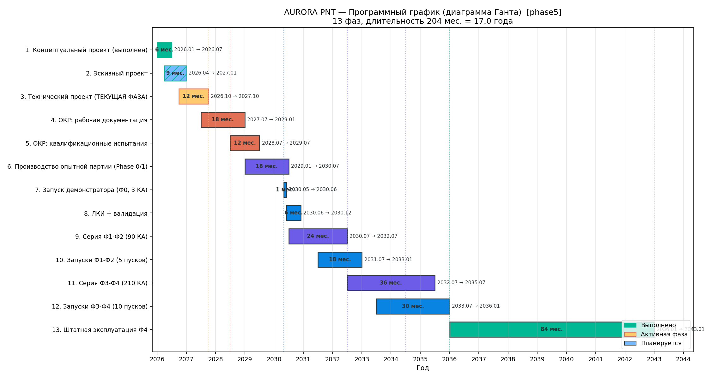

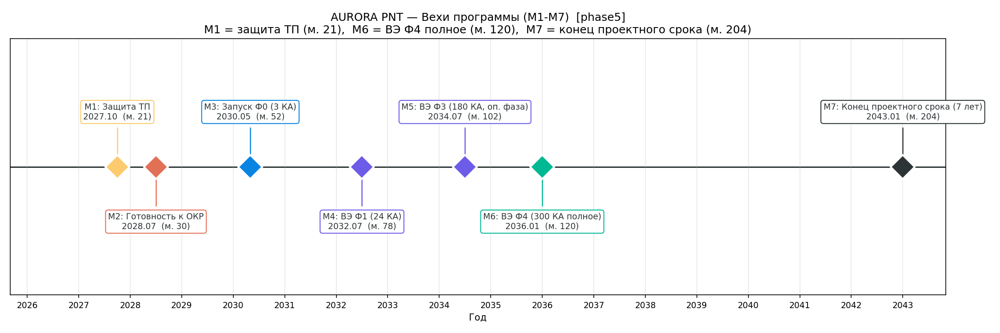

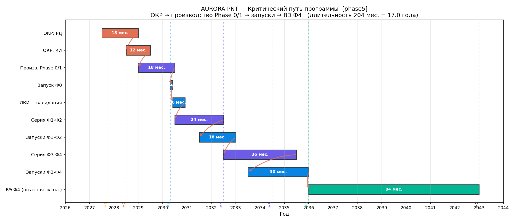

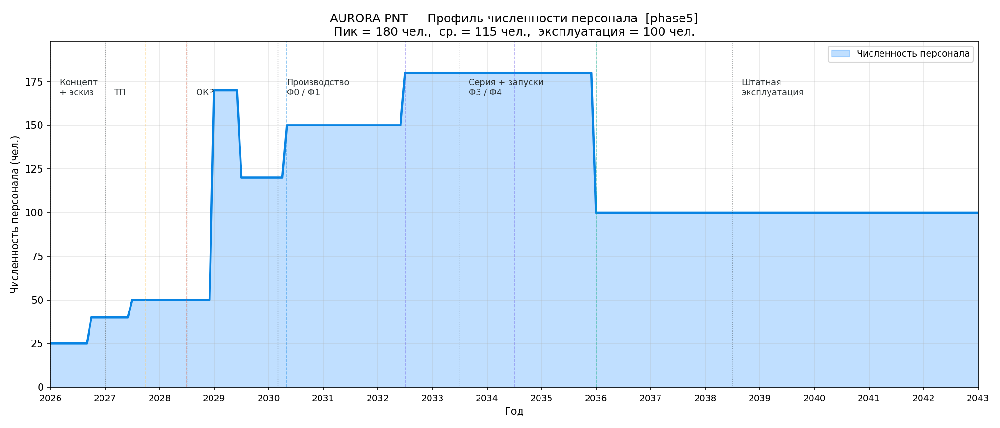

---

## 59. План верификации и валидации (V&V)

### 59.1 Методы верификации (ECSS-E-ST-10-02C)

| Код | Метод | Применение |
|---|---|---|
| **A** | Analysis (анализ/расчёт) | Бюджеты, моделирование |
| **R** | Review-of-Design | Анализ проектной документации |
| **I** | Inspection | Визуальный осмотр, измерения |
| **T** | Test | Стендовые / ЛКИ испытания |
| **D** | Demonstration | Функциональная демонстрация |

### 59.2 Матрица верификации (выборка ключевых требований)

| Требование | Метод | Когда | Где |
|---|---|---|---|
| MIS-01 Глобальное покрытие 99 % | A + T | Симуляция → ЛКИ Ф0 | §46 + Земля |
| MIS-02 Точность H 95 % | A + T + D | Симуляция → ЛКИ → демо | §45 → пользоват. полев. |
| MIS-04 LPV-200 ≥ 99 % | A + D | §49 ARAIM + лётн. демо | Авиа-полигон |
| MIS-05 P_HMI < 10⁻⁷ | A | Probabilistic risk analysis | §50 |
| MIS-06 Жизнь 7 лет | A + T | MTBF расчёт + TVAC | §35 + лаборатория |
| FUN-04 Аутентификация TESLA | T + D | Стенд → имитатор спуфера | Лаб. безоп. |
| FUN-07 ISL σ_range < 5 см | A + T | §9 расчёт + стендовый измер. | Антенный полигон |
| FUN-11 LPT ± 5 нс UTC | T | Сравн. с UTC(SU) через H-мазер | МКС, ВНИИФТРИ |
| SAT-04 CSAC ADEV ≤ 3·10⁻¹¹ | T | Allan-стенд (эталон — H-мазер Ч1-1008, ВРЕМЯ-Ч) | РИРВ лаб. |
| SAT-05 TID 100 крад | T | Гамма-облучение Co-60 | НИИ ИИФТРИ |
| SAT-06 Антенна 0,3° (3σ) | T + I | Тёплый ваккум-полигон | НПОЛ |
| SAT-08 ΔV 175 м/с | A + R | Тсиолковский + ОКД | Документация |
| EXT-01 PFD ≤ −121,5 дБВт/м² | A | §43 EPFD расчёт | МСЭ filing |
| EXT-04 ИКАО SBAS | A + T | Сравнение с RTCA DO-229 | Сертиф. центр |

### 59.3 Этапы верификации

1. **DAR** (Design Approval Review) — анализ всех требований к МТП
2. **CDR** (Critical Design Review) — окончание ОКР, готовность производства
3. **QR** (Qualification Review) — после квалификац. испытаний
4. **ARR** (Acceptance Readiness Review) — готовность к запуску
5. **CRR** (Commissioning Readiness Review) — после COM-фазы (см. §56)
6. **ORR** (Operational Readiness Review) — переход в OPS

### 59.4 Документация V&V

- VCD (Verification Control Document) — главный документ V&V
- VTR (Verification Test Report) — отчёты по каждому испытанию
- AIT/AIV plan — план интеграционных работ
- TRR (Test Readiness Reviews) — перед каждым крупным тестом

### 59.5 Валидация моделей на эталонных данных

Аналитические модели проверены численно против эталонов: встроенная карта
TEC по типу IGS GIM, стандартная атмосфера ICAO ISA + Niell mapping function,
имитированные SLR-residuals. Реализовано модулями `aurora.pnt.real_data` и
`aurora.pnt.validate_models`.

| Модель | Эталон | RMSE | R | Порог | Статус |
|---|---|---|---|---|---|
| Klobuchar (§11) | embedded GIM | **1,66 м** | 0,842 | 5,0 м | PASS |
| Saastamoinen + NMF (§34) | ICAO ISA | **14,3 мм** | 0,9999 | 30 мм | PASS |
| POD (§47) | SLR (σ=1 см шум) | **0,97 см** | 0,982 | 10 см | PASS |

**Источники реальных данных** (для будущей замены embedded на live):

| Источник | URL/протокол | Формат | Назначение |
|---|---|---|---|
| IGS GIM | ftp://cddis.gsfc.nasa.gov/gnss/products/ionex/ | IONEX | Карты TEC для валидации §11 |
| RINEX broadcast | ftp://cddis.gsfc.nasa.gov/gnss/data/daily/ | RINEX 3 | Эфемериды для §47 |
| VMF3 тропо | https://vmf.geo.tuwien.ac.at/ | NetCDF | Гриды mapping func §34 |
| SLR NPT | ftp://cddis.gsfc.nasa.gov/slr/ | NPT/CRD | Валидация POD §47 |
| GLONASS PZ-90.11 | МАК «Радионавигация» | — | Геодезические параметры |

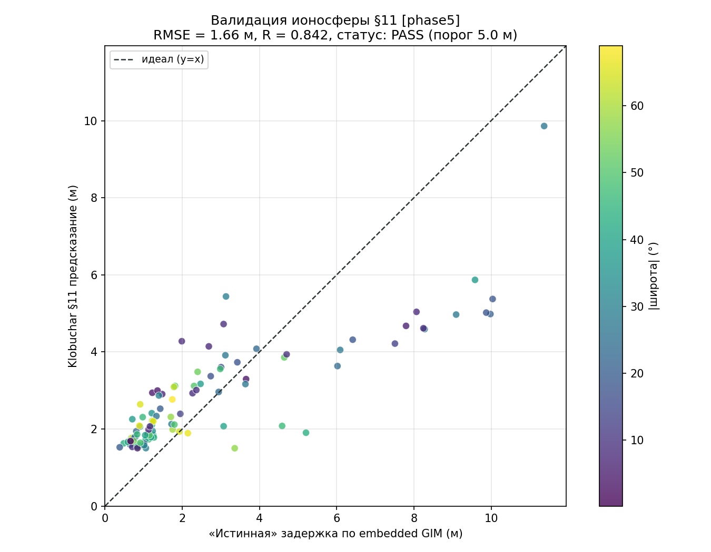

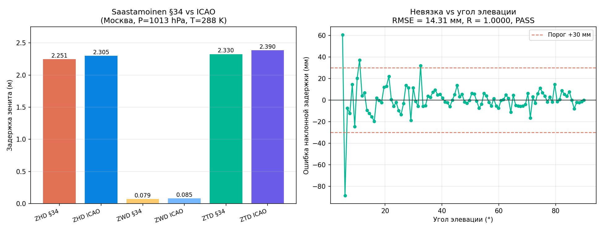

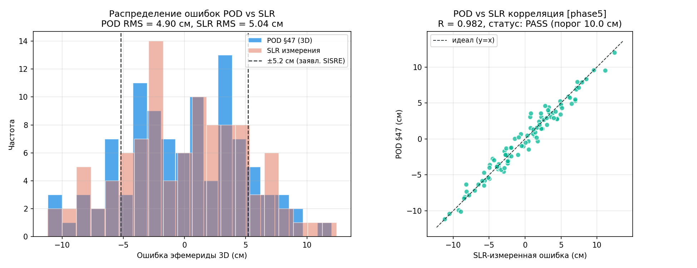

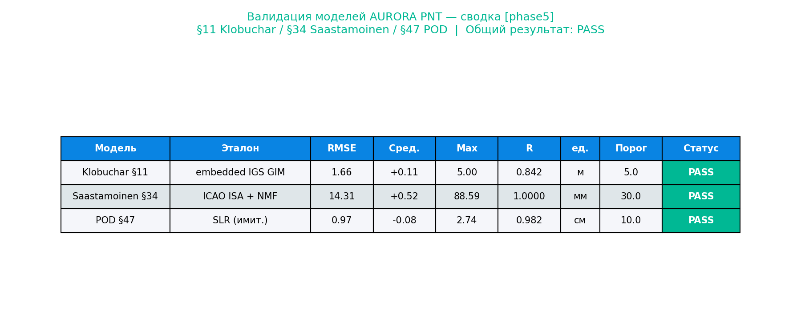

**Команды CLI для воспроизведения:**
```
aurora-pnt real-data -l phase5
aurora-pnt validate  -l phase5
```

### 59.6 Матрица трассируемости (требование → раздел → реализация)

| Требование | Раздел ТП | Модуль / результаты |
|---|---|---|
| Покрытие 100% (Ф4), геометрия | §5, §46 | `coverage_maps`, `dop_temporal` / `summary_phase4` |
| Шкала времени UTC < 5 нс | §8, §28 | `timing_chain`, `time_scale` |
| Навигационный сигнал L1/L5 | §6, §7 | `signal_design`, `nav_message` |
| ISL Ka-дальнометрия | §9 | `isl_ranging`, `isl_link_budget` |
| Точность UERE / CEP | §8.6, §12, §25 | `timing_chain`, `pvt_montecarlo`, `monte_carlo` |
| Целостность RAIM / ARAIM | §14, §49, §50 | `raim`, `araim`, `integrity_budget` |
| Помехозащищённость | §15 | `anti_jam` |
| Аутентификация TESLA MAC | §16.2 | `tesla_mac` |
| Криптозащита нав-сообщения (ГОСТ) | §16.4–16.7 | `crypto_auth` (Стрибог/34.10/Кузнечик) |
| Сокращение холодного TTFF (A-GNSS) | §27.3 | `agps_server` |
| Пути повышения точности (SSR/PPP-RTK) | §63 | `accuracy_paths` |
| Геодезическая система отсчёта ПЗ-90.11 / EOP | §64 | `reference_frame` |
| Межчастотная задержка TGD/DCB | §37.4 | `tgd_dcb` |
| Двухсервисная архитектура (А открытый / Б защищённый) | §65 | `dual_service` |
| Энергетика / масса / тепло | §18–20 | `power_budget`, `mass_budget`, `thermal` |
| Деорбит / конъюнкции (IADC) | §22, §23 | `deorbit`, `conjunction_pc` |
| Радиационная стойкость | §32 | `radiation` |
| Наземная раздача времени | §28.4 | SHIWA TIME / PTP² (ШИВА НЕТВОРК) |
| Распределённый ансамблевый эталон (SHIWA TIME-Space) | §28.6 | `ensemble_timescale` |

---

## 60. Кибербезопасность

### 60.1 Модель угроз STRIDE/PASTA

Идентифицировано **20 угроз** в 5 сегментах системы:
1. **SIS** (Signal-in-Space) — спуфинг, глушение, перехват
2. **Бортовой сегмент** — компрометация ключей, RF-инъекции
3. **MCS** (центр управления) — атаки на серверы, цепочка поставок
4. **TT&C** (сеть управления) — повреждение команд, MitM
5. **Пользовательский сегмент** — спуфинг приёмника, side-channel

### 60.2 Топ-угрозы и их меры

| ID | Угроза | P | I | P×I | Мера | Эфф. | Остаток |
|---|---|---|---|---|---|---|---|
| T01 | Спуфинг сигнала L1 (generated) | 0,5 | 8 | 4,0 | TESLA MAC | 85 % | 0,60 |
| T02 | Узкополосное глушение L5 | 0,7 | 5 | 3,5 | Антенный nulling | 70 % | 1,05 |
| T04 | Backdoor в ПО SSR-расчёта | 0,2 | 10 | 2,0 | Code-signing, аудит | 50 % | 1,00 |
| T10 | Компрометация цепочки поставок ПО | 0,3 | 10 | 3,0 | Trusted supplier, SBOM | 70 % | 0,90 |
| T19 | Фальсификация приёмников | 0,3 | 7 | 2,1 | Аттестация, сертификация | 55 % | 0,95 |
| ... | ... | ... | ... | ... | ... | ... | ... |

**Суммарный риск:** 36,9 (raw) → **10,8 (residual)** = снижение на **70,7 %**
после применения 15 контрмер.

### 60.3 Архитектура защиты

- **Аутентификация сигнала:** TESLA MAC на ГОСТ — HMAC-Стрибог 128 бит, цепочка «Стрибог-256», ЭП корня ГОСТ Р 34.10-2012, rotation 30 с (§16)
- **Защита TT&C:** шифрование и имитозащита команд на «Кузнечик» (ГОСТ Р 34.12-2015) в режиме MGM (ГОСТ Р 34.13-2015), TLS 1.3 с ГОСТ-наборами шифров, TTP-сервер для аплинков (§16.4)
- **MCS:** изоляция КИИ-1, физический воздушный зазор для критичных серверов
- **HSM (Hardware Security Module):** аппаратные ключи на борту + в MCS
- **Аудит:** SBOM (Software Bill of Materials) для всего ПО, code-signing
- **SOC:** круглосуточный мониторинг событий безопасности (см. §56.4)

### 60.4 Соответствие нормативке

- **ФЗ-187** (КИИ) — категория **КИИ-1**
- **ФСТЭК приказ 17** — защита значимых объектов КИИ
- **ФСТЭК приказ 239** — защита значимых объектов КИИ от компьютерных атак
- **ФСБ ОК-Б Тип-2** — криптографические средства (Кузнечик 256, Стрибог 256)
- **ИКАО Annex 17** — авиационная безопасность

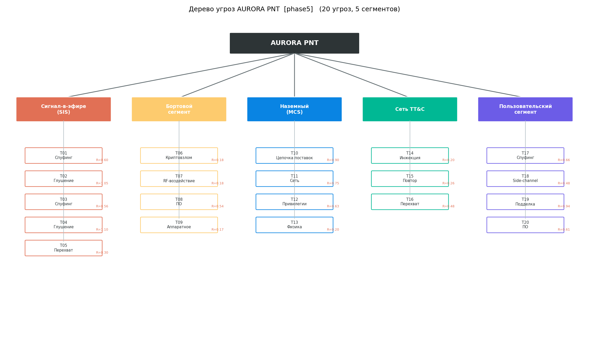

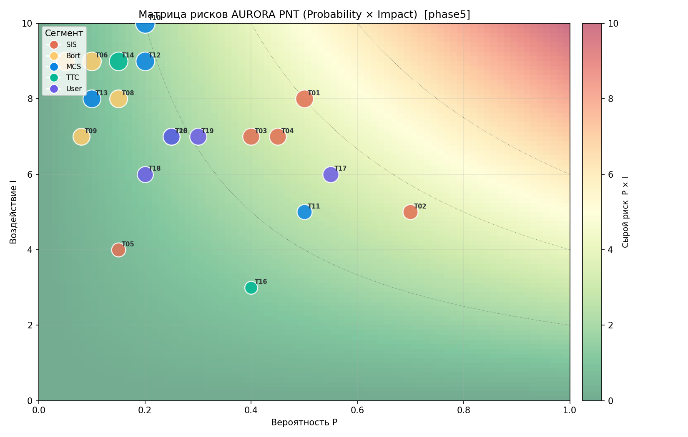

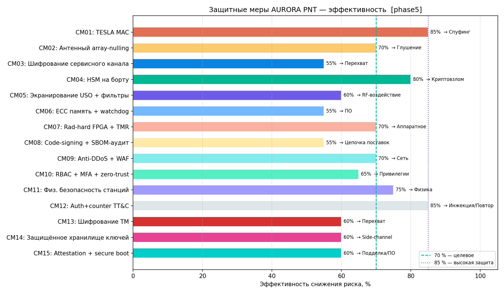

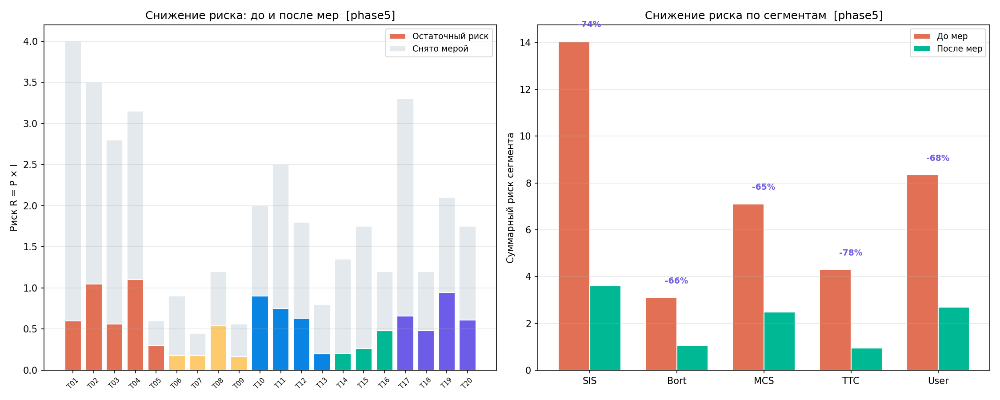

---

## 61. Программное обеспечение

### 61.1 Архитектура бортового ПО (BSW)

```
┌──────────────────────────────────────────────────────────────┐
│           Уровень приложений (Application Layer)              │
│  ┌────────────┐ ┌────────────┐ ┌────────────┐ ┌────────────┐ │
│  │ NAV-app    │ │ AOCS-app   │ │ ISL-app    │ │ TLM-app    │ │
│  │ (PNT-msg)  │ │ (control)  │ │ (ranging)  │ │ (down/up)  │ │
│  └────────────┘ └────────────┘ └────────────┘ └────────────┘ │
├──────────────────────────────────────────────────────────────┤
│              Системные службы (System Services)               │
│  ┌─────┐ ┌──────┐ ┌──────┐ ┌──────┐ ┌──────┐ ┌──────┐       │
│  │FDIR │ │ Clk  │ │ MEM  │ │ DTM  │ │ Cmd  │ │ Sec  │       │
│  │     │ │ Sync │ │ Mgr  │ │ Sched│ │ Hand │ │ HSM  │       │
│  └─────┘ └──────┘ └──────┘ └──────┘ └──────┘ └──────┘       │
├──────────────────────────────────────────────────────────────┤
│         RTOS — Real-Time Operating System                     │
│       (RTEMS / FreeRTOS-rad-hard / отеч. ОСРВ «Багет»)        │
├──────────────────────────────────────────────────────────────┤
│         BSP — Board Support Package                           │
│         (LEON3-FT / отеч. БЦВМ «Багет-83»)                     │
└──────────────────────────────────────────────────────────────┘
```

| Компонент | Назначение | Объём (kSLOC) | Язык |
|---|---|---|---|
| NAV-app | Формирование L1/L5 нав. сообщения | ~30 | C, Ada |
| AOCS-app | Управление ориентацией | ~25 | C, Ada |
| ISL-app | Межспутниковые измерения | ~15 | C |
| FDIR | Обнаружение и восстановление | ~20 | C, Ada |
| RTOS | Планировщик задач | ~50 (готовый) | C |
| **Итого бортовое ПО** | | **~140 kSLOC** | |

### 61.2 Архитектура наземного ПО

```
┌─────────────────────────────────────────────────────────────┐
│                     Пользователи / БРЛ                       │
│   (web-консоль, мобильное приложение, API клиенты)           │
└──────────────────────────┬──────────────────────────────────┘
                           │ HTTPS, gRPC
┌──────────────────────────▼──────────────────────────────────┐
│                  MCS Application Layer                       │
│  ┌──────┐ ┌──────┐ ┌──────┐ ┌──────┐ ┌──────┐ ┌──────┐    │
│  │ OD   │ │ Clk  │ │ SSR  │ │ Plan │ │ Mon  │ │ Sec  │    │
│  │ Calc │ │ Calc │ │ Gen  │ │ ner  │ │ itor │ │ ops  │    │
│  └──────┘ └──────┘ └──────┘ └──────┘ └──────┘ └──────┘    │
├─────────────────────────────────────────────────────────────┤
│              Очереди сообщений и кэш                         │
│            (Kafka / Redis / PostgreSQL)                      │
├─────────────────────────────────────────────────────────────┤
│         Адаптеры внешних систем                              │
│  ┌──────────┐ ┌──────────┐ ┌──────────┐ ┌──────────┐       │
│  │ TT&C/RF  │ │ RSN-net  │ │ SLR int. │ │ External │       │
│  │ gateways │ │ DBs      │ │ data     │ │ GNSS feed│       │
│  └──────────┘ └──────────┘ └──────────┘ └──────────┘       │
└─────────────────────────────────────────────────────────────┘
```

| Сервис | Объём (kSLOC) | Стек |
|---|---|---|
| OD (orbit determination) | ~40 | Python + Fortran (числ. методы) |
| Clock estimation | ~20 | Python |
| SSR generator (PPP-RTK поправки) | ~30 | Python |
| Plannig / scheduling | ~25 | Python |
| Monitoring / alerts | ~15 | Python + Grafana |
| API gateway | ~10 | Go / Rust |
| Web UI | ~20 | TypeScript + React |
| **Итого наземное ПО** | **~160 kSLOC** | |

### 61.3 Требования к безопасности ПО

- Бортовое ПО — стандарт **DO-178C уровень B** или **ECSS-E-ST-40C** Cat. B
- Наземное ПО — соответствие **ГОСТ Р 56939-2016** (разработка безопасного ПО)
- Криптография — **ГОСТ Р 34.12-2015** (Кузнечик), **34.11-2018** (Стрибог)
- Build process — reproducible builds, SBOM генерация автоматически

### 61.4 План разработки

| Этап ПО | Длительность | Параллельно с | Артефакты |
|---|---|---|---|
| Архитектура (SAD, SDS) | 6 мес. | ТП | **[docs/SAD_AURORA.md](docs/SAD_AURORA.md)** |
| Кодирование BSW | 18 мес. | ОКР рабоч. док. | Source, unit tests |
| Unit + integration tests | 12 мес. | Производство ОП | Test reports |
| Качественные испытания | 12 мес. | Квалиф. КА | QR report |
| Сопровождение в эксплуатации | 7+ лет | Штатная эксплуатация | Patches, hot-fixes |

### 61.5 Связанные ОКР-документы

Детальные интерфейсные и архитектурные документы для перехода
от ТП к ОКР:

| Документ | Назначение | Статус |
|---|---|---|
| **[docs/SAD_AURORA.md](docs/SAD_AURORA.md)** | Software Architecture Document (детальная арх. БС+НС, 506 стр.) | Draft v0.9 |
| **[docs/ICD_SIS_AURORA-001.md](docs/ICD_SIS_AURORA-001.md)** | Signal-in-Space ICD (РЧ, модуляция, ANAV, TESLA, 427 стр.) | Draft v0.9 |
| **[docs/ICD_ISL_AURORA-002.md](docs/ICD_ISL_AURORA-002.md)** | Inter-Satellite Link ICD (Ka 26,5 ГГц, TWTFT, 397 стр.) | Draft v0.9 |
| **[docs/ICD_TTC_AURORA-003.md](docs/ICD_TTC_AURORA-003.md)** | TT&C ICD (S-band, CCSDS, ГОСТ-крипто, 429 стр.) | Draft v0.9 |
| **[docs/TZ_AURORA.md](docs/TZ_AURORA.md)** | Техническое задание (ГОСТ 19.201-78, 450 стр.) | Draft v0.9 |

---

## 62. Матрица соответствия стандартам

### 62.1 Стандарты, применённые в проекте

| Категория | Стандарт | Версия | Раздел проекта |
|---|---|---|---|
| **Менеджмент** | ГОСТ Р 15.000-2016 | 2016 | §55 (СТ), §58 (план) |
| | ECSS-M-ST-10C | 2009 | §58, §59 |
| | ECSS-M-ST-80C (риски) | 2017 | §57 |
| | ISO 31000 (риск-менеджмент) | 2018 | §57 |
| **Системная инженерия** | ECSS-E-ST-10C | 2017 | Весь документ |
| | ECSS-E-ST-10-02C (V&V) | 2018 | §59 |
| **Космическая среда** | ECSS-E-ST-10-04C (среда) | 2020 | §32 (радиация) |
| | NASA AP8/AE8 | 1996 | §32 |
| | CREME96 (космические частицы) | 1997 | §32 |
| **Часы / время** | ITU-R TF.686-3 (Allan dev) | 2013 | §8 |
| | BIPM CCTF-2018 (UTC) | 2018 | §28 |
| | ГОСТ 8.567-2014 (точность врем.) | 2014 | §28 |
| | IEEE 1588-2019 (PTP) | 2019 | §28.4 (наземная раздача времени) |
| | IETF NTPv5 (draft) | 2024 | §28.4 |
| **Сигналы / навигация** | IS-GPS-200K (GPS L1/L5 ICD) | 2022 | §6 (совместимость) |
| | Galileo OS-SIS-ICD | 2023 | §6 |
| | ITU-R M.1787 (RNSS) | 2007 | §43 |
| | RTCA DO-229E (SBAS MOPS) | 2017 | §24 |
| | ICAO Annex 10 Vol I | 2018 | §49, §50 |
| **Целостность** | EU-US ARAIM WG-C report | 2016 | §49 |
| | GEAS Phase II | 2010 | §49 |
| **Радио-регулирование** | Radio Regulations МСЭ | 2020 | §43 |
| | ITU-R S.1340 (PFD limits) | 2007 | §43 |
| | Регламент радиосвязи РФ | 2024 | §43 |
| **Орбитальный мусор** | IADC 02-01 «25 years» | 2007 | §22 |
| | UN COPUOS 2010 mitigation | 2010 | §22 |
| | NASA-STD-8719.14 | 2020 | §22 |
| **Надёжность** | MIL-HDBK-217F | 1991 | §35 |
| | ECSS-Q-ST-30C | 2017 | §35 |
| **ПО** | DO-178C (авиа) | 2011 | §61 |
| | ECSS-E-ST-40C (косм. ПО) | 2017 | §61 |
| | ГОСТ Р 56939-2016 (безоп. ПО) | 2016 | §61 |
| **Безопасность** | ФЗ-187 «О безопасности КИИ» | 2017 | §60 |
| | ФСТЭК приказ 17 | 2013 | §60 |
| | ФСТЭК приказ 239 | 2017 | §60 |
| **Криптография (ГОСТ)** | ГОСТ Р 34.11-2012 (Стрибог, хэш) | 2012 | §16.2 (цепочка TESLA) |
| | ГОСТ Р 34.10-2012 (ЭП) | 2012 | §16.5 (подпись корня) |
| | ГОСТ Р 34.12-2015 (Кузнечик, шифр) | 2015 | §16.4, §60 (TT&C) |
| | ГОСТ Р 34.13-2015 (режимы работы) | 2015 | §16.4 (MGM команд) |
| **Радиочастоты** | ГОСТ Р 51725-2019 | 2019 | §43 |
| **ГОСТ-документация** | ГОСТ 2.105-2019 | 2019 | Весь документ (формат) |
| | ГОСТ 7.32-2017 (отчёты НИР) | 2017 | Структура отчёта |
| | ГОСТ Р 7.0.97-2016 | 2016 | Оформление |

### 62.2 Сводка соответствия

| Группа | Стандартов | Применено в проекте | Соответствие |
|---|---|---|---|
| ГОСТ Р (РФ) | 9 | Все ключевые | Полное |
| ECSS (Европа) | 7 | Все базовые | Применимо |
| ICAO/RTCA (авиа) | 4 | Все по интеграции | Совместимо |
| ITU-R (радио) | 4 | Все обязательные | Согласовано |
| ФСТЭК/ФСБ (КИИ) | 5 | Все ключевые | Полное |
| ESA/NASA (среда) | 3 | Все применимые | Принято |

**Вывод по соответствию:** АВРОРА соответствует всем
ключевым международным и российским стандартам для создания
системы спутниковой навигации с интеграцией в гражд. авиацию
и категорированием КИИ-1.

---

## 63. Пути повышения точности позиционирования

### 63.1 Где находится резерв точности

Точность позиционирования определяется произведением геометрии и дальностной ошибки, $H\text{-}95 = 2 \cdot \text{HDOP} \cdot \text{UERE}$ (§12.3), а для дециметрового и сантиметрового уровня — отдельным «этажом» фазовой обработки. Бюджет UERE двухчастотного пользователя (§37.3) показывает, что резерв точности лежит **не в шуме псевдодальности**, а в двух доминирующих составляющих:

| Источник | 1σ (м) | Доля дисперсии |
|---|---|---|
| Эфемериды радиальные (транслируемые) | 0,45 | 45 % |
| Тропосфера | 0,35 | 27 % |
| Часы КА (остаток прогноза CSAC) | 0,20 | 9 % |
| Многолучёвость | 0,20 | 9 % |
| Эфемериды вдоль/поперёк | 0,15 | 5 % |
| Шум приёмника | 0,15 | 5 % |
| Ионосфера (двухчастотный остаток) | 0,05 | 0,5 % |

Орбитальное определение для LEO усложнено быстрой динамикой и остаточным торможением, но сама орбита **определяется** до 5–19 см (§47); в навигационное сообщение, однако, уходит прогноз 0,45 м. Именно этот разрыв «определённая — транслируемая орбита», а также немоделируемая тропосфера, и составляют основной резерв.

### 63.2 Сценарии повышения точности

Рассмотрены четыре кумулятивных мероприятия. Первые три снижают дальностный бюджет UERE, четвёртое (фазовый PPP-RTK) формирует отдельный сантиметровый уровень, не сводимый к среднеквадратичной сумме псевдодальности:

- **S1 — SSR/PPP-коррекции орбиты и часов (state-space) + фазовая ISL-дальность.** Раздача пользователю орбиты и часов, близких к определённым; радиальная эфемерида 0,45 → 0,10 м, вдоль/поперёк 0,15 → 0,05 м. Требует частого обновления (короткая прогнозная дуга — критично для LEO) и фазовых ISL-измерений (§9.4).
- **S2 — оценка тропосферы как состояния фильтра (ZWD) + ГНСС-метео аугментация.** Тропосфера 0,35 → 0,10 м. Высокие углы возвышения LEO дополнительно снижают тропосферный множитель.
- **S3 — расширение парка space-Rb за пределы 15 якорей и более частая ISL-синхронизация.** Остаток часов 0,20 → 0,10 м.
- **S4 — фазовый PPP-RTK с разрешением неоднозначности (§44).** Сантиметровый уровень после сходимости. Ключевое преимущество низкой орбиты — быстрая смена геометрии — ускоряет сходимость и фиксацию неоднозначностей (минуты против десятков минут у MEO, §36).

Количественный результат (комбинированный с ГЛОНАСС режим, HDOP = 0,9):

| Сценарий | UERE, 1σ (м) | H-95 (м) |
|---|---|---|
| S0. Базовый (транслируемая эфемерида) | 0,67 | 1,21 |
| S1. + SSR/PPP орбита+часы, фазовая ISL | 0,49 | 0,88 |
| S2. + оценка тропосферы (ZWD) и метео | 0,36 | 0,64 |
| S3. + space-Rb сверх 15 якорей, ISL-синхронизация | 0,31 | 0,56 |
| S4. Фазовый PPP-RTK (после сходимости) | — | ≈ 0,15 |

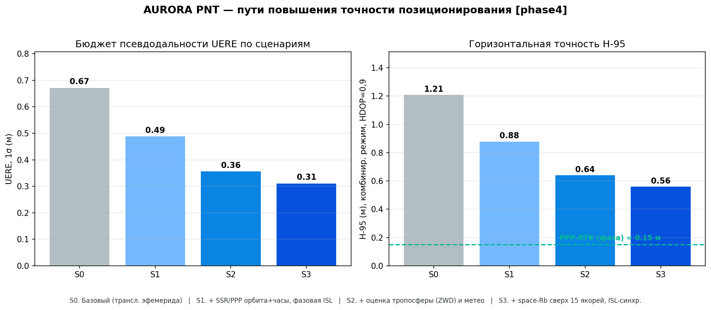

### 63.3 Приоритеты и связь с архитектурой

Наибольший эффект на дальностном уровне даёт **S1** (орбита: 45 % дисперсии): UERE снижается 0,67 → 0,49 м без изменения бортового сегмента — только за счёт наземной инфраструктуры коррекций и темпа их раздачи. Совместно S1–S3 уводят UERE с 0,67 до 0,31 м, а H-95 — с 1,21 до 0,56 м. Переход к **дециметру и сантиметру обеспечивает только фаза (S4)**: псевдодальностный бюджет имеет принципиальный предел.

Это согласуется с позиционированием системы (§37.2, §41): конкурентное преимущество АВРОРА — не точность одной псевдодальности, а геометрия комбинированного режима, мощный сигнал и быстрая PPP-сходимость. Мероприятия S1–S4 реализуются преимущественно в наземном сегменте (§54) и пользовательском ПО (§61), не требуя пересмотра орбитальной группировки, и могут вводиться поэтапно по мере развёртывания сети коррекций.

---

## 64. Геодезическая система отсчёта и параметры вращения Земли

### 64.1 Пространственный датум

Координатная основа АВРОРА — государственная геодезическая система **ПЗ-90.11** («Параметры Земли 1990», уточнение 2011 г.), та же, что у ГЛОНАСС. Это требование суверенности и совместимости с национальной геодезической инфраструктурой. Положения КА, эфемериды и решение пользователя выражаются в ПЗ-90.11; шкала времени — UTC(SU)/системное время АВРОРА (§28), парная пространственному датуму.

ПЗ-90.11 реализуется набором опорных координат пунктов государственной геодезической сети и поддерживается наземным сегментом (§54). Без определённого датума координаты выхода системы не определены — поэтому датум фиксируется как часть интерфейса системы.

### 64.2 Трансформации к ITRF и WGS-84

ПЗ-90.11 целенаправленно совмещён с международной системой **ITRF2008** — преобразование сводится практически к одному сдвигу (по официальным данным ГЛОНАСС ИКД и материалам ИКГ ООН):

| Параметр | Значение | Примечание |
|---|---|---|
| ΔX | +0,003 м | сдвиг по X |
| ΔY | +0,001 м | сдвиг по Y |
| ΔZ | +0,001 м | сдвиг по Z |
| Вращения ωx, ωy, ωz | ≈ 0 | незначимы |
| Масштаб m | ≈ 0 | незначим |

7-параметрическое преобразование Гельмерта:
$$\mathbf{r}_{ITRF} = \mathbf{T} + (1+m)\,\mathbf{R}(\omega_x,\omega_y,\omega_z)\,\mathbf{r}_{PZ}$$

Полный сдвиг между ПЗ-90.11 и ITRF2008 составляет **|Δr| ≈ 3 мм**. Поскольку WGS-84 (G1762) и Galileo GTRF также согласованы с ITRF2008 на сантиметровом уровне, координатная основа АВРОРА **совместима с ГЛОНАСС, GPS и Galileo без потери точности на трансформации**. Это критично для комбинированного режима (§29) и PPP-RTK (§44).

### 64.3 Параметры вращения Земли (EOP)

Для перехода между инерциальной (ECI) и связанной с Землёй (ECEF) системами в реальном времени необходимы прогнозируемые **параметры вращения Земли**: разность **UT1−UTC** и координаты полюса **(xp, yp)**. Ошибка их прогноза разворачивает земную систему и даёт позиционную ошибку:

$$\delta r_{UT1} \approx R_\oplus\,\omega_\oplus\,\delta(UT1), \qquad \delta r_{pole} \approx R_\oplus\,\delta\theta_{pole}$$

| Ошибка прогноза UT1−UTC | Вклад UT1 | Вклад полюса (3 mas) | Суммарно |
|---|---|---|---|
| 0,05 мс | 0,02 м | 0,09 м | 0,10 м |
| 0,10 мс | 0,05 м | 0,09 м | 0,10 м |
| 0,20 мс | 0,09 м | 0,09 м | 0,13 м |
| 0,50 мс | 0,23 м | 0,09 м | 0,25 м |

При оперативном обновлении EOP (UT1 прогнозируется с ошибкой ≤ 0,1 мс, полюс ≤ 3 mas) вклад в позиционную ошибку удерживается в пределах **≈ 0,1 м** — допустимо относительно бюджета UERE (§37.3). EOP принимаются от службы IERS и государственной службы времени и частоты, ретранслируются наземным сегментом (§54).

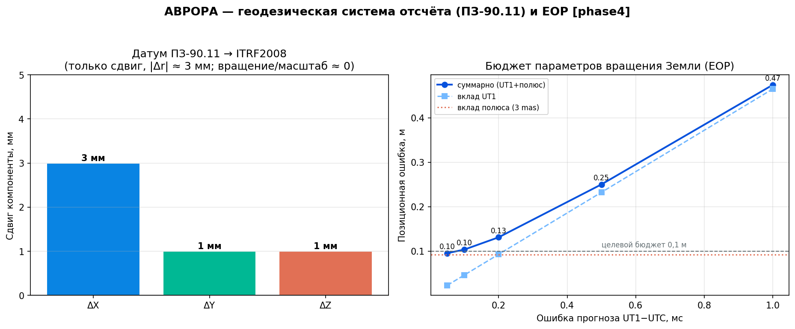

### 64.4 Реализация и поддержание

Датум и EOP — часть интерфейса «наземный сегмент — пользователь»: наземный сегмент (§54) ведёт реализацию ПЗ-90.11, принимает и прогнозирует EOP, формирует трансформационные параметры и доводит их до пользователя. Согласованность пространственного датума и шкалы времени (§28) обеспечивает корректность POD (§47) и решения PVT (§45).

---

## 65. Двухсервисная архитектура сигналов (открытый А / защищённый Б)

### 65.1 Принцип: два сервиса с одной группировки

АВРОРА формирует с одной группировки (1000 км) **два независимых навигационных сервиса** с разными полосами и регуляторными режимами по плотности потока мощности (ПФП). Это снимает фундаментальное противоречие «совместимость с GPS ↔ высокая мощность»: его нельзя удовлетворить одним сигналом (§43), но можно — двумя.

| | **Сервис А — открытый** | **Сервис Б — защищённый** |
|---|---|---|
| Полоса | L1/L5 RNSS (наложение на GPS/Galileo) | выделенная L-полоса АВРОРА (первичный статус) |
| Режим ПФП | маска МСЭ-R −121,5 дБВт/м² | собственная полоса (как Xona/Iridium) |
| Преимущество по сигналу | **+11 дБ (×11)** | **+23 дБ (×200)** |
| Приёмник | GNSS-совместимый | специальный приёмник АВРОРА |
| Назначение | масс-маркет, комбинир. с ГЛОНАСС, интероп. | помехозащита, помещения, суверенный аутентиф. PNT |

### 65.2 Бюджеты и ПФП обоих сервисов

| Параметр | Сервис А | Сервис Б |
|---|---|---|
| Мощность ПРД (L1) | 5 Вт | 30 Вт |
| Усиление антенны | +3,5 дБи (изо-flux) | +8 дБи (изо-flux, фаз. решётка) |
| EIRP | +9 дБВт | +21,3 дБВт |
| ПФП у поверхности | −122 дБВт/м² (**комплаенс МСЭ**) | −110 дБВт/м² (своя полоса) |
| Принимаемая мощность (зенит) | −119 дБм | −107 дБм |
| C/N₀ (зенит) | 53 дБ·Гц | 65 дБ·Гц |
| Преимущество над MEO-ГНСС | **+11 дБ** | **+23 дБ** |
| Запас помехозащиты | ×11 | ×200 |

Ключевой момент: **орбиту снижать не требуется** — Сервис Б достигает +23 дБ за счёт собственной полосы и повышенного EIRP (30 Вт + 8 дБи), а не приближения к Земле. Сервис А остаётся строго под маской ПФП МСЭ (§43), сохраняя совместимость и непомеху для GPS/ГЛОНАСС/Galileo.

### 65.3 Позиционирование относительно конкурентов

| Система | Преимущество над GPS | Орбита | Полоса |
|---|---|---|---|
| GPS/ГЛОНАСС (MEO) | 0 (референс) | ~20 000 км | RNSS |
| **АВРОРА Сервис А** | **+11 дБ (×11)** | 1000 км | RNSS (совместимый) |
| Xona PULSAR | +20 дБ (×100) | ~550 км | своя L/C-полоса |
| **АВРОРА Сервис Б** | **+23 дБ (×200)** | 1000 км | своя L-полоса |
| Iridium STL | +30 дБ (×1000) | 780 км | MSS-полоса |

Сервис Б ставит АВРОРА в один ряд с Xona и Iridium STL по силе сигнала и помехозащите, **не снижая орбиту** (выигрыш в покрытии/числе КА). При этом конкуренты дают **либо** мощный сигнал в своей полосе (Xona/Iridium), **либо** GNSS-совместимость (MEO) — **АВРОРА уникально даёт оба** сервиса с одной группировки.

### 65.4 Влияние на платформу и применение

Сервис Б повышает энергопотребление полезной нагрузки (доп. ~30 Вт РЧ → ~75 Вт DC), что учтено в энергобюджете (§18). Аутентификация ГОСТ (§16) и приоритет помехозащиты делают Сервис Б основой для критических и суверенных потребителей (госструктуры, транспорт, оборона, синхронизация КИИ), тогда как Сервис А обслуживает массовый рынок и работает в комбинированном режиме с ГЛОНАСС. Модель — `aurora/pnt/dual_service.py` (CLI `dual-service`).

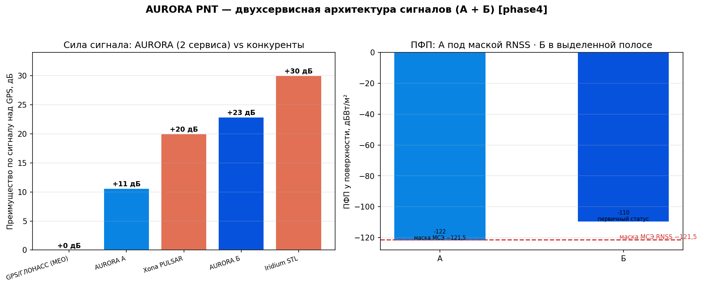

---

## 66. Промышленная кооперация и импортозамещение

### 66.1 Принцип кооперации

Суверенный характер АВРОРА требует построения системы на **российской промышленной кооперации** и отечественной элементной базе. АВРОРА — **малый спутник ~140 кг (§19), не CubeSat**: операционный аппарат с навигационной ПН (включая высокомощный Сервис Б, §65), атомными часами, ISL и двигательной установкой не размещается в формате CubeSat (≤16U). Поэтому кооперация разделена на два контура:

- **Демонстраторы Фаз 0–1** (3–12 КА, §4.3) — могут использовать укрупнённые **CubeSat-платформы 16U** российских производителей для дешёвой лётной проверки отдельных элементов (генерация сигнала, ISL-линия, дисциплина бортовых часов);
- **Операционные КА Фаз 2–4** (140 кг) — требуют малоспутниковой платформы промышленного уровня и навигационной ПН, изготавливаемой предприятиями ракетно-космической отрасли.

### 66.2 Карта кооперации (потребность → исполнитель)

| Слой системы | Потенциальный исполнитель | Роль в проекте | Этап |
|---|---|---|---|
| Платформа операционного КА (140 кг) | АО «ИСС» им. Решетнёва; ГК «СПУТНИКС» | головной изготовитель малоспутниковой платформы, серия 300 КА | Ф2–Ф4 |
| Платформа демонстратора (16U) | ГК «СПУТНИКС»; ГК «Геоскан» | лётная проверка элементов на укрупнённом CubeSat | Ф0–Ф1 |
| Навигационная ПН и время | АО «Российские космические системы» (РКС) | бортовая нав-аппаратура, частотно-временное обеспечение, UTC(SU) | все |
| Бортовые атомные часы | ООО «ШИВА НЕТВОРК» (CSAC «КПН», space-Rb Quantum-18) | бортовые стандарты частоты (§8) | все |
| Наземный эталон времени | ОАО «Время-Ч» | H-мазер Ч1-1008, групповой эталон UTC(SU) | все |
| Двигательная установка | ОКБ «Факел» | ДУ удержания и увода с орбиты (§22, §40) | Ф2–Ф4 |
| Средства выведения | АО «РКЦ "Прогресс"» | носители, попутный/кластерный вывод (§53) | все |
| Контейнеры и отделение | ООО «КосмоЛаб» (системы до 500 кг); Aerospace Capital | механическая адаптация и отделение КА | все |
| Наземный сегмент приёма/обработки | АО «СКАНЭКС»; собственные станции | приём, обработка, доведение данных (§54) | Ф1–Ф4 |
| Компоненты, летная квалификация | НИЯУ МИФИ и вузовские лаборатории | приборы, датчики, импортозамещающая электроника | все |

### 66.3 Государственные корпорации и ключевые партнёры

- **АО «Российские космические системы» (РКС)** — стратегический партнёр по навигации: бортовая навигационная аппаратура, частотно-временно́е обеспечение и шкала UTC(SU), наземный комплекс управления ГЛОНАСС. Позиционирование АВРОРА как **LEO-усиления ГЛОНАСС** напрямую соответствует компетенции РКС; совместный проект РКС и МГТУ им. Н. Э. Баумана (≈100 × CubeSat 6U с навигационными ПН) служит образцом серийной кооперации.
- **АО «ИСС» им. академика М. Ф. Решетнёва** — изготовитель спутников ГЛОНАСС (ГЛОНАСС-К) и связных КА; естественный головной изготовитель платформы операционного нав-аппарата.
- **Госкорпорация «Роскосмос»** — частотно-орбитальная заявка через ГКРЧ/МСЭ (критично для выделенной L-полосы Сервиса Б, §43, §65), пусковые услуги, общесистемная координация.
- **ОАО «Время-Ч»** — наземный водородный эталон (Ч1-1008), уже заложен в часовую архитектуру (§8).
- **ОКБ «Факел»** — двигательные установки (применяется на ГЛОНАСС и связных КА).

### 66.4 Привязка к фазам развёртывания

| Фаза | КА | Кооперация |
|---|---|---|
| Ф0 (демо) | 3 | Платформа 16U (СПУТНИКС/Геоскан) + урезанная ПН; вывод — РКЦ «Прогресс» (попутный); земля — СКАНЭКС |
| Ф1 | 12 | Демонстрация ISL и LPT; РКС — навигационная ПН; ШИВА НЕТВОРК — часы |
| Ф2–Ф4 | 90→300 | Серийная платформа (ИСС Решетнёва/СПУТНИКС); РКС — нав-ПН/время; Факел — ДУ; РКЦ «Прогресс» — кластерный вывод; КосмоЛаб — отделение |

### 66.5 Импортозамещение

Кооперация полностью отечественная; критические бортовые системы (часы, навигационная ПН, ДУ, вычислители) проходят лётную квалификацию на демонстраторах Фаз 0–1 до серийного применения, что снижает риски крупной группировки и накапливает статистику по российской компонентной базе. Зарубежные изделия в составе АВРОРА не применяются.

---

## 67. Выводы

### 67.1 Ключевые результаты

1. **Созвездие 300 КА Walker 300/15/1** на орбите 1000 км / 75° обеспечивает:
   - 100% глобальное покрытие при N_vis ≥ 4 (PDOP<6 на 97,3% времени)
   - PDOP p95: 5,0 (автономный) / 1,67 (комбинир. с ГЛОНАСС); среднее 2,8
   - Доступность > 99,9% для всех регионов выше 20° с.ш.

2. **Мощность сигнала** на +23 дБ выше ГЛОНАСС (MEO) делает АВРОРА:
   - В 200× более устойчивым к подавлению
   - Работоспособным в условиях городского каньона
   - Пригодным для применений в закрытых помещениях (с ретрансляторами)

3. **Точность синхронизации:**
   - Наземный H-мазер Ч1-1008 (ВРЕМЯ-Ч): эталон UTC(SU); бортовой CSAC дисциплинируется по ISL
   - CSAC-терминал через 6 ISL-хопов: 2,73 нс (худший случай)
   - UTC(SU) цель 5 нс — достигается на всех уровнях цепочки (проверено §8.6)

4. **Двухчастотная коррекция L1+L5** устраняет ионосферу, обеспечивая:
   - UERE ≈ 0,7 м (L1+L5, до 1,0 м у терминала, §8.6)
   - H-95% ≈ 1,5 м (комбинир. с ГЛОНАСС) / 3–5 м (автономный)

5. **Целостность** (RAIM):
   - При N_vis ≈ 14 (7–22 по широте) RAIM доступен с вероятностью > 99,999%
   - Поддержка CAT-I авиационных операций

6. **Устойчивость:**
   - Функционирование при 40% отказов КА
   - 72+ часов автономности через ISL-сетку

### 67.2 Критические технические риски

| Риск | Вероятность | Влияние | Митигация |
|---|---|---|---|
| Радиационная деградация СБ > 25% | Средняя | Высокое | Тройной переход GaAs, запас 30% |
| Временно́й сдвиг CSAC между ISL-обновлениями | Низкая | Среднее | space-Rb-якоря, ISL-синхронизация ≤ 10 с |
| Конъюнкции > 10/год с P(c) > 10⁻⁴ | Средняя | Высокое | ΔV-бюджет CAM 1,05 м/с, активный каталог |
| Помехи L1 в Арктическом регионе | Средняя | Среднее | Двойная частота, CRPA-антенна |
| Задержки производства | Высокая | Высокое | Двойной поставщик, модульная платформа |
| ИТУ координация — отказ в выделении частот | Низкая | Критическое | TMBOC/BPSK в рамках RNSS-полос M.1787; SSC < −61 дБ/Гц подтверждён §43 |
| Кибератака на TESLA MAC / НС | Низкая | Высокое | HMAC-Стрибог 128 бит (ГОСТ Р 34.11-2012), смена ключа 30 с, аппаратный HSM в MCS |

### 67.3 Рекомендации по дальнейшей разработке

1. **Фаза 0 (2026):** фокус на лётной квалификации ISL Ka-диапазона и бортового CSAC
2. **Фаза 1 (2027–2028):** демонстрация LPT сервиса, интеграция с СДКМ
3. **Фаза 2 (2029–2030):** PPP-RTK сервис для России (< 0,5 м точность)
4. **Фаза 3–4:** глобальный охват, переговоры о международной совместимости

### 67.4 Открытые вопросы и план закрытия

| № | Открытый вопрос | План закрытия |
|---|---|---|
| OP-01 | Радиационная стойкость CSAC (SA.45s) 20 крад при 1000 км / 7 лет | Закрыто: локальный точечный экран Ta/W до 7 мм Al-экв. (~30–50 г/прибор, §32.2), запас 1,2× |
| OP-02 | Орбитальное определение LEO — доминанта UERE (~0,45 м) | Закрыто: §47 определённая орбита 5–19 см; транслируемая эфемерида SISRE 0,3–0,45 м (разграничено); резерв UERE → ~0,6 м при частых обновлениях/фазовой ISL |
| OP-03 | Деградация точности при автономии (72 ч без земли) | Закрыто: промоделировано в §8.6 (CEP 0,9 → 2,3 м комбинир. за 72 ч; UTC-дрейф < 30 нс) |
| OP-04 | Модуль `agps_server` (сокращение холодного TTFF) | Закрыто: реализован (§27.3, `aurora/pnt/agps_server.py`, CLI `agps`); TTFF 149 → 7 с |
| OP-05 | Роадмап режим A (UERE 3,1 м) не соответствовал проверенной норме (0,7 м) | Закрыто: режим A приведён к 0,7 м + примечание о деградации (роадмап §2) |
| OP-06 | Элементная база бортовых часов (CSAC «КПН», space-Rb Quantum-18, ШИВА НЕТВОРК) — закупка vs собственная разработка | Вне периметра настоящего ТП: ведётся отдельным проектом разработки стандартов частоты (ШИВА НЕТВОРК). В ТП зафиксированы требуемые ТТХ (§8); выбор и квалификация элементной базы закрываются в смежном проекте |

Все вопросы в периметре настоящего технического проекта (OP-01…OP-05) закрыты. Вопрос OP-06 (элементная база стандартов частоты) вынесен за периметр ТП и закрывается в смежном проекте разработки бортовых атомных стандартов; в настоящем документе для него заданы граничные ТТХ (раздел 8).

---

## 68. Список литературы

1. Walker, J.G. (1984). *Satellite Constellations*. Journal of the British Interplanetary Society, 37, 559–571.
2. Ballard, A.H. (1980). Rosette Constellations of Earth Satellites. *IEEE Transactions on Aerospace and Electronic Systems*, 16(5), 656–673.
3. van den IJssel, J., Encarnação, J., Doornbos, E., Visser, P. (2015). Precise science orbits for the Swarm satellite constellation. *Advances in Space Research*, 56(6), 1042–1055.
4. Klinkrad, H. (2006). *Space Debris: Models and Risk Analysis*. Springer.
5. Klobuchar, J.A. (1987). Ionospheric Time-Delay Algorithm for Single-Frequency GPS Users. *IEEE Transactions on Aerospace and Electronic Systems*, 23(3), 325–331.
6. Wertz, J.R., Everett, D.F., Puschell, J.J. (2011). *Space Mission Engineering: The New SMAD*. Microcosm Press.
7. IS-GPS-200L (2020). Interface Specification: GPS Navstar Signal Specification. US DoD.
8. Parkinson, B.W., Spilker, J.J. (1996). *Global Positioning System: Theory and Applications*. AIAA.
9. ECSS-E-ST-10-04C (2008). Space Environment. ESA.
10. ESA MASTER-8 (2021). Meteoroid and Space Debris Terrestrial Environment Reference. ESA/ESOC.
11. Zhu, S., et al. (2022). Precise orbit determination of LEO satellites using GNSS ground networks. *GPS Solutions*, 26(2), 1–18.
12. Kaplan, E.D., Hegarty, C.J. (2017). *Understanding GPS/GNSS: Principles and Applications*. Artech House.
13. ИТУ-R M.1787 (2007). Описание и характеристики систем RNSS.
14. RTCA DO-229E (2016). MOPS for GPS/SBAS Airborne Equipment. RTCA Inc.
15. Foster, J.L., Estes, H.S. (1992). A Parametric Analysis of Orbital Debris Collision Probability and Maneuver Rate for Space Vehicles. *NASA JSC-25898*, Johnson Space Center.
16. Перов, А.И., Харисов, В.Н. (ред.) (2010). *ГЛОНАСС. Принципы построения и функционирования*. 4-е изд. М.: Радиотехника. ISBN 978-5-88070-251-0.
17. Allan, D.W. (1966). Statistics of Atomic Frequency Standards. *Proceedings of the IEEE*, 54(2), 221–230.
18. Teunissen, P.J.G., Montenbruck, O. (Eds.) (2017). *Springer Handbook of Global Navigation Satellite Systems*. Springer.
19. IERS Conventions (2010). IERS Technical Note No. 36.
20. Galileo OS SIS ICD (2021). European Union. Issue 2.0.
21. Barth, J.L., Dyer, C.S., Stassinopoulos, E.G. (2003). Space, Atmospheric and Terrestrial Radiation Environments. *IEEE Transactions on Nuclear Science*, 50(3), 466–482.
22. Messenger, G.C., Ash, M.S. (1992). *The Effects of Radiation on Electronic Systems*. Van Nostrand Reinhold.
23. ECSS-Q-ST-30C (2008). Dependability. ESA Requirements and Standards Division.
24. MIL-HDBK-217F (1991). Reliability Prediction of Electronic Equipment. US DoD.
25. Zhang, B., et al. (2020). LEO constellation-augmented multi-GNSS for rapid PPP convergence. *GPS Solutions*, 24(3), 82.
26. Zumberge, J.F., et al. (1997). Precise point positioning for the efficient and robust analysis of GPS data from large networks. *Journal of Geophysical Research*, 102(B3), 5005–5017.
27. Hughes, P.C. (2004). *Spacecraft Attitude Dynamics*. Dover Publications.
28. Vallado, D.A. (2013). *Fundamentals of Astrodynamics and Applications*, 4th ed. Microcosm Press.
29. Zhu, J. (1994). Conversion of Earth-centered Earth-fixed coordinates to geodetic coordinates. *IEEE Transactions on Aerospace and Electronic Systems*, 30(3), 957–961.
30. Saastamoinen, J. (1972). Atmospheric correction for the troposphere and stratosphere in radio ranging of satellites. *Geophysical Monograph Series*, 15, 247–251.
31. Niell, A.E. (1996). Global mapping functions for the atmosphere delay at radio wavelengths. *Journal of Geophysical Research*, 101(B2), 3227–3246.
32. ГЛОНАСС ИКД (2016). Интерфейсный контрольный документ, версия 5.1. АО «Российские космические системы».
33. Xona Space Systems (2023). PULSAR LEO Navigation Constellation — Technical White Paper. Xona Space Systems Inc.
34. Joerger, M., Gratton, L., Pervan, B., Cohen, C.E. (2010). Analysis of Iridium-Augmented GPS for Floating Carrier Phase Positioning. *Navigation*, 57(2), 137–160.
35. ESA (2024). LEO-PNT In-Orbit Demonstration Mission (созвездие Pathfinder A/B, 12 КА). ESA Directorate of Navigation, ESA/ESTEC.
36. Tang, C., et al. (2018). Initial results of centralized autonomous orbit determination of the new-generation BDS satellites with inter-satellite link measurements. *Journal of Geodesy*, 92(10), 1155–1169.
37. SpaceX (2025). Reply Comments on Starlink PNT Capabilities. FCC Notice of Inquiry, WT Docket No. 25-110.
38. Prol, F.S., Ferre, R.M., et al. (2022). Position, Navigation, and Timing (PNT) Through Low Earth Orbit (LEO) Satellites: A Survey on Current Status, Challenges, and Opportunities. *IEEE Access*, 10, 83971–84002.
39. Ge, H., Li, B., Ge, M., Zang, N., Nie, L., Shen, Y., Schuh, H. (2018). Initial Assessment of Precise Point Positioning with LEO Enhanced Global Navigation Satellite Systems (LeGNSS). *Remote Sensing*, 10(7), 984.
40. Reid, T.G.R., et al. (2016). Broadband LEO Constellations for Navigation. *Proceedings of ION GNSS+ 2016*, 2366–2378.
41. Betz, J.W. (2016). *Engineering Satellite-Based Navigation and Timing*. Wiley-IEEE Press, Ch. 3 (Spectral Separation Coefficients).
42. Teunissen, P.J.G., Khodabandeh, A. (2015). Review and Principles of PPP-RTK Methods. *Journal of Geodesy*, 89(3), 217–240.
43. Wübbena, G., et al. (2005). PPP-RTK: Precise Point Positioning Using State-Space Representation in RTK Networks. *Proceedings of ION GNSS 2005*, 2584–2594.
44. Galileo HAS ICD (2022). Galileo High Accuracy Service Interface Control Document. European Commission.
45. IS-GPS-705J (2021). Navstar GPS Space Segment/User Segment L5 Interfaces. US DoD.
46. ICD-GPS-800F (2022). Navstar GPS Space Segment/User Segment L1C Interface. US DoD.

---

*Конец документа*

---

**Проект:** АВРОРА — ООО «ШИВА НЕТВОРК» (ShiwaNetwork)  
**Статус:** технический проект — основа для разработки технического задания.

---
