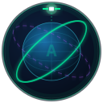
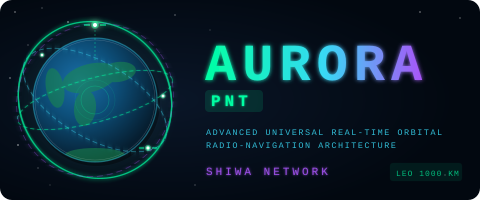

# AURORA PNT




### Advanced Universal Real-time Orbital Radio-navigation Architecture
**разработка Shiwa Network**

---

AURORA PNT — собственная LEO-навигационная и временна́я система, разрабатываемая компанией **Shiwa Network**. Система обеспечивает точное позиционирование, навигацию и синхронизацию времени на базе низкоорбитальной спутниковой группировки с возможностью работы как автономно (собственная шкала времени LPT), так и в комбинированном режиме с ГЛОНАСС, и с дифференциальными поправками СДКМ.

Данный репозиторий содержит **полный фреймворк моделирования** — 60+ аналитических модулей, покрывающих все аспекты системы: орбитальную геометрию, сигнал, синхронизацию времени, целостность, помехозащищённость, аутентификацию, ISL-связь, надёжность, программу работ, стоимостную модель, кибербезопасность.

---

## 📘 Технический проект

Главный артефакт репозитория — **технический проект уровня ОКР** по ГОСТ 2.105/7.32 + ECSS:

- 📄 [**AURORA_PNT_Technical_Project.md**](AURORA_PNT_Technical_Project.md) — исходник (Markdown, 64 раздела)
- 📋 [**AURORA_PNT_GOST.docx**](AURORA_PNT_GOST.docx) — финальный DOCX по ГОСТ (168 рисунков, 108 таблиц, 14,7 МБ)
- 📕 [**AURORA_PNT_GOST.pdf**](AURORA_PNT_GOST.pdf) — PDF-версия (13,4 МБ) для печати/рассылки
- 🗓️ [**PLAN_PNT_EXPANSION_PHASE2.md**](PLAN_PNT_EXPANSION_PHASE2.md) — план расширения моделирования
- 🌍 [**Cesium 3D-демо**](results/phase4/cesium_phase4_global.html) — интерактивная визуализация группировки (откройте в браузере)

**Дополнительные документы ОКР** (для перехода от ТП к рабочей конструкторской документации) — в папке [`docs/`](docs/):

| Документ | Назначение | Объём |
|---|---|---|
| [SAD_AURORA.md](docs/SAD_AURORA.md) | Software Architecture Document | 506 строк |
| [ICD_SIS_AURORA-001.md](docs/ICD_SIS_AURORA-001.md) | Signal-in-Space ICD | 427 строк |
| [ICD_ISL_AURORA-002.md](docs/ICD_ISL_AURORA-002.md) | Inter-Satellite Link ICD | 397 строк |
| [ICD_TTC_AURORA-003.md](docs/ICD_TTC_AURORA-003.md) | TT&C ICD | 429 строк |
| [TZ_AURORA.md](docs/TZ_AURORA.md) | Техническое задание (ГОСТ 19.201-78) | 450 строк |

**Покрытие техпроекта по разделам:**
- **§3–§31** — Базовая системная инженерия (концепция, сигнал, орбита, бюджеты)
- **§32–§44** — Радиация, релятивистика, тропосфера, надёжность, PPP, ADCS, PPP-RTK
- **§45–§54** — Сквозная PVT, POD, AutoNav, ARAIM, целостность, LCC, производство, выведение
- **§55–§62** — SRD, CONOPS, риски, Gantt, V&V, кибербезопасность, ПО, стандарты
- **§63–§64** — Выводы, литература

**Ключевые числа Фазы 5:**

| Показатель | Значение | Источник |
|---|---|---|
| End-to-end PVT CEP95 | **21–36 см** (4 точки, 24 ч) | §45, e2e_pipeline.py |
| POD SISRE (сеть + SLR) | **5,2 см** | §47, pod_filter.py |
| ARAIM VPL @ LPV-200 | **9,87 м** < VAL 35 м | §49, araim.py |
| LCC 7 лет (рос. часы 5 млн ₽) | **101,5 млрд ₽** | §51, cost_model.py |
| Бортовой стандарт частоты | **5 млн ₽/комплект** (РИРВ) | §51 |
| Снижение остаточн. кибер-риска | **−70,7%** после 15 мер | §60, cybersec_threat.py |
| Полное развёртывание Ф4 | **2036-01** (M6, 84 мес от первого пуска) | §58, schedule.py |

---

## Ключевые характеристики (Фаза 4 — Глобальная)

| Параметр | Значение |
|---|---|
| Спутников | 300 (15 орбит × 20 сат) |
| Высота | 1000 км |
| Наклонение | 75° |
| Тип | Walker Delta, phase_diff=true |
| Маска возвышения | 10° (LEO) / 5° (ГЛОНАСС) |
| PDOP p95 (автономный) | 5.04 |
| PDOP p95 (LEO+ГЛОНАСС) | **1.67** |
| Покрытие 4+ спутника | 100% (глобально, 24 ч) |
| Преимущество сигнала vs GPS | **+25 дБ (мощность ×316)** |

---

## Режимы работы

| Режим | Описание | UERE | CEP 50% |
|---|---|---|---|
| A — Автономный LPT | Только LEO, суверенная шкала времени, без внешней зависимости | 3.10 м | 6.46 м |
| B — Combined LEO+ГЛОНАСС | ISB решается как 5-й неизвестный, наилучшая точность | 1.69 м | **1.18 м** |
| C — Combined + СДКМ | Режим B + российские дифференциальные поправки СДКМ | **0.94 м** | **0.93 м** |

---

## Дорожная карта развёртывания

| Фаза | Спутников | Конфигурация | Покрытие 4+ | PDOP<6 | CEP (combined) |
|---|---|---|---|---|---|
| 0 — Демонстратор | 3 | 1×3, 87° | 0% | — | — |
| 1 — Тестовая | 12 | 3×4, 87° | 5% | 2% | — |
| 2 — Региональная | 90 | 9×10, 75° | **82%** | **62%** | ~3 м |
| 3 — Операционная (Россия) | **180** | **12×15, 75°** | **100%** | **97%** | **1.18 м** |
| 4 — Глобальная | 300 | 15×20, 75° | 100% | 97%+ | **1.18 м** |

---

## Установка

```bash
pip install aurora-pnt
```

Или из исходного кода:

```bash
git clone https://github.com/SiwaNetwork/aurora-pnt.git
cd aurora-pnt
pip install -e .
```

**Зависимости:** Python 3.8+, numpy, matplotlib, sgp4, pyyaml, scipy

---

## Быстрый старт

```bash
# Симуляция Фазы 3 (операционное покрытие России)
aurora-pnt run -c aurora/config/pnt/phase3_global.yaml -o results/phase3 -l phase3

# Комбинированный LEO+ГЛОНАСС (максимальная точность)
aurora-pnt combined -c aurora/config/pnt/phase4_global.yaml -o results/combined -l combined

# Режим C — Combined + СДКМ дифференциальные поправки
aurora-pnt sdcm -l phase3 -o results/sdcm

# Анализ ISL-дальности (автономное определение орбит)
aurora-pnt isl-ranging --n-planes 12 --n-sats 15 -l phase3 -o results/isl_ranging

# Анализ помехозащищённости vs GPS
aurora-pnt anti-jam -l phase3 -o results/anti_jam

# Аутентификация TESLA MAC / anti-spoofing
aurora-pnt tesla-mac -l phase3 -o results/tesla_mac

# Деорбит и живучесть на орбите
aurora-pnt deorbit --altitude-km 1000 --n-sats 180 -l phase3

# Анализ захвата сигнала и TTFF
aurora-pnt acquisition -l phase3

# Анализ сервиса точного времени AURORA-T (PTP/NTP)
aurora-pnt timing-service -o results/timing -l phase4

# Архитектура бортовых часов (OCXO/Rb/Cs)
aurora-pnt clock-arch -o results/clock_arch -l phase4
```

---

## Справочник команд CLI

### Навигация и покрытие
```bash
aurora-pnt run              # PNT-симуляция (покрытие, PDOP, видимость)
aurora-pnt combined         # LEO+ГЛОНАСС мультисозвездие (--mode combined/autonomous/glonass)
aurora-pnt sdcm             # Режим C: СДКМ дифференциальные поправки, CEP 0.93 м
aurora-pnt raim             # Целостность RAIM (HPL, VPL, доступность)
aurora-pnt resilience       # Анализ живучести (отказы спутников)
aurora-pnt experiment       # Параметрические эксперименты (sweep)
aurora-pnt info             # План симуляции (без запуска)
```

### Точность и сигнал
```bash
aurora-pnt ranging          # Бюджет UERE, точность позиционирования
aurora-pnt link-budget      # Линк-бюджет (FSPL, Doppler, C/N0)
aurora-pnt multipath        # Многолучёвость по типам среды (6 сценариев)
aurora-pnt acquisition      # Захват сигнала, TTFF (холодный/тёплый/горячий старт)
aurora-pnt agps             # A-GNSS сервер: сокращение холодного TTFF 149→7 с
aurora-pnt accuracy-paths   # Пути повышения точности: UERE/H-95 (SSR, тропо, PPP-RTK)
aurora-pnt freq-plan        # Частотный план (МСЭ, совместимость с GPS/ГЛОНАСС)
aurora-pnt anti-jam         # Помехозащищённость J/S, радиус глушения vs GPS
```

### Время и синхронизация
```bash
aurora-pnt time-scale       # Анализ шкалы времени LPT (стабильность, UERE по режимам)
aurora-pnt timing-service   # AURORA-T: точность PTP/NTP Grandmaster
aurora-pnt clock-arch       # Архитектура часов CSAC/space-Rb/H-мазер: ISL-цепочка, удержание
aurora-pnt clock-analysis   # Референс-сравнение типов часов (TCXO/OCXO/Rb/Cs/Maser)
aurora-pnt tesla-mac        # Аутентификация TESLA MAC, anti-spoofing
aurora-pnt crypto-auth      # Криптозащита нав-сообщения на ГОСТ (Стрибог/34.10/Кузнечик)
```

### ISL и сеть
```bash
aurora-pnt network-metrics  # Топология ISL/GSL, задержки, стабильность маршрутизации
aurora-pnt isl-ranging      # Автономное определение орбит через ISL-дальнометрию
aurora-pnt isl-link         # RF линк-бюджет ISL (Ka/V/Optical диапазоны)
```

### Орбита и обеспечение
```bash
aurora-pnt deorbit          # Срок жизни орбиты, деорбит (IADC, дельта-V)
aurora-pnt viz              # 3D-глобус + наземные треки
aurora-pnt cesium           # Интерактивный 3D-глобус CesiumJS
```

---

## Структура проекта

```
aurora/
├── pnt/                    # Ядро симуляции PNT
│   ├── pnt_simulator.py    # Основной движок (Walker-Delta, SGP4)
│   ├── combined_sim.py     # LEO+ГЛОНАСС мультисозвездие (ISB)
│   ├── sdcm.py             # СДКМ дифференциальные поправки (Режим C)
│   ├── time_scale.py       # Шкала LPT, бюджет UERE по режимам
│   ├── timing_service.py   # Протокол AURORA-T, точность PTP/NTP
│   ├── tesla_mac.py        # TESLA MAC аутентификация, anti-spoofing
│   ├── anti_jam.py         # Анализ помехозащищённости J/S vs GPS
│   ├── multipath.py        # Модель многолучёвости (6 сред)
│   ├── acquisition.py      # Захват сигнала, TTFF (холодный/тёплый/горячий)
│   ├── isl_ranging.py      # ISL дальнометрия, автономное OD
│   ├── isl_link_budget.py  # RF линк-бюджет ISL (Ka/V/Optical)
│   ├── frequency_plan.py   # Частотный план, МСЭ, интерференция
│   ├── glonass.py          # Модель созвездия ГЛОНАСС
│   ├── dop.py              # Вычисление DOP (4- и 5-параметрическая матрица H)
│   ├── coverage.py         # Пропагация SGP4, видимость, footprint
│   ├── raim.py             # Целостность RAIM (HPL/VPL)
│   ├── resilience.py       # Анализ отказов спутников
│   ├── deorbit.py          # Срок жизни орбиты, деорбит
│   └── cli.py              # Точка входа CLI aurora-pnt (75 команд)
├── link_budget/            # FSPL, Doppler, C/N0 по парам НС-спутник
├── network_metrics/        # Топология ISL/GSL, стабильность маршрутов (Hypatia)
├── ranging/                # UERE, точность позиции, анализ часов
└── config/pnt/             # YAML-конфигурации для всех фаз
results/                    # Результаты симуляций (генерируются автоматически)
```

---

## Собственная шкала времени LPT

AURORA формирует и поддерживает суверенную шкалу времени LPT (LEO PNT Time), независимую от GPS и ГЛОНАСС:

```
Мастер-часы МЦУ (Cs/H-Maser, Железногорск)
    │
    ├─ TWSTT (двусторонний) -> наземные станции     sigma = 0.37 нс
    │
    ├─ ISL-цепочка -> все 300 спутников             sigma_ISL = sqrt(N) x ppb x T_sync
    │
    └─ Трансляция AURORA-T (L1/L5, кадр 10 с)
         │
         └─ Наземный приёмник
              ├─ Выход 1PPS              < 5 нс (с Cs-мастером)
              ├─ PTP Grandmaster         IEEE 1588-2019, Class 25
              └─ NTP Stratum-1           RFC 5905, refid="AURA"
```

| Мастер-часы | Точность времени | Класс PTP |
|---|---|---|
| OCXO (1 ppb) | 169.7 нс | Class 33 |
| Rb (0.1 ppb) | 17.0 нс | **Class 25** |
| Cs (0.01 ppb) | **2.2 нс** | **Class 25 — Stratum-0** |

---

## Архитектура бортовых часов

| Ярус | Тип | Кол-во (Фаза 4) | Точность ISL | Удержание при разрыве ISL |
|---|---|---|---|---|
| Якорные (1/плоскость) | Миниатюрный Cs | 15 | 0.60 нс | 16.7 мин |
| Ретрансляторы (3/плоскость) | Миниатюрный Rb | 45 | 6.03 нс | 1.7 мин |
| Терминальные | OCXO | 240 | 6.03 нс | 10 с |

Суммарный бюджет часов на 300 спутников: **57.3 кг / 1350 Вт** (191 г / 4.5 Вт на спутник).

---

## ISL — межспутниковые каналы

| Параметр | Phase 3 (180 сат) | Phase 4 (300 сат) |
|---|---|---|
| Каналов ISL на спутник | 4 (±in-plane, ±cross-plane) | 4 |
| Расстояние in-plane | 3068 км | 2680 км |
| Расстояние cross-plane | 3820 км | 3325 км |
| RF диапазон | **Ka-band 26 ГГц** | Ka-band 26 ГГц |
| Дальность Ka (3 дБ маржа) | **3814 км** | 3814 км |
| Удержание эфемерид без МЦУ | **35 ч** (с ISL OD) | 35 ч |
| Выигрыш ISL OD vs без OD | **24× по времени** | 24× |

**Замечание:** Cross-plane ISL для Phase 3 (3820 км) находится на границе дальности Ka-диапазона. Для Phase 4 (3325 км) — с запасом.

---

## Помехозащищённость

| Параметр | GPS L1 | AURORA L1 | Выигрыш |
|---|---|---|---|
| Уровень сигнала у приёмника | −160 dBW | **−124 dBW** | **+36 дБ** |
| Радиус глушения (авт. 1 Вт) | 10.4 км | **0.8 км** | **13× меньше** |
| Площадь глушения | ×1 | **×0.01** | **99% меньше** |
| Работа в глубоком городе | частично | **да** | |
| Работа в помещении | нет | **да (CEP 8.7 м)** | |

---

## Аутентификация TESLA MAC

- Алгоритм: TESLA (Galileo OSNMA совместимость), AES-128 ключевая цепочка
- Задержка раскрытия ключа: **6 кадров = 60 с**
- Окно уязвимости: **90 с** с холодного старта (GPS: неограничено)
- Заблокированные атаки: Replay, Meaconing, Generation, Simulation, MITM — **5 из 6**
- Брутфорс AES-128: **1.1 × 10¹³ лет**

---

## Бюджет UERE (L1+L5 dual-freq)

| Источник ошибки | Автономный (A) | Combined (B) | СДКМ (C) |
|---|---|---|---|
| Смещение часов | 3.0 м | 1.5 м | 0.8 м |
| Эфемериды | 0.5 м | 0.1 м | 0.05 м |
| Ионосфера | 0.05 м | 0.05 м | 0.04 м |
| Тропосфера | 0.5 м | 0.5 м | 0.25 м |
| Многолучёвость | 0.3 м | 0.3 м | 0.30 м |
| Остаток ISB | — | 0.5 м | 0.30 м |
| **UERE RSS** | **3.10 м** | **1.69 м** | **0.94 м** |
| **CEP 50%** | **6.46 м** | **1.18 м** | **0.93 м** |

---

## Многолучёвость по типу среды

| Среда | AURORA CEP | GPS CEP | Выигрыш |
|---|---|---|---|
| Открытое небо | 4.84 м | 3.3 м | — |
| Городской (canyon) | 5.05 м | 5.3 м | ×1.0 |
| Глубокий город | 5.69 м | 10.8 м | **×1.9** |
| Помещение | **8.74 м** | недоступен | >> |

---

## Захват сигнала и TTFF

| Параметр | AURORA L1 | AURORA L5 | GPS L1 |
|---|---|---|---|
| Макс. Доплер | **41.0 кГц** | 30.6 кГц | 20.4 кГц |
| Скорость Доплера | 38.5 Гц/с | 28.7 Гц/с | 3.0 Гц/с |
| TTFF холодный | 130 с | 185 с | 130 с |
| TTFF тёплый | **21 с** | 21 с | 21 с |
| TTFF горячий | **1.5 с** | 1.5 с | 1.5 с |

---

## Деорбит и орбитальная ответственность

| Параметр | Значение |
|---|---|
| Срок естественного распада (1000 км) | **471 лет** (нарушение IADC) |
| Требование IADC/ООН | **≤25 лет** |
| Дельта-V деорбита | **214 м/с** на спутник |
| Топливо деорбита | **15.7 кг** на спутник (10.4% массы) |
| Топливо всего флота (180 сат) | **2820 кг** зарезервировано |
| Активный деорбит | ОБЯЗАТЕЛЕН, цель: < 5 лет после ЕОЛ |

---

## Наземная инфраструктура МЦУ (Фаза 4 — 21 станция)

| Регион | Станции |
|---|---|
| Россия | Владимир, Мурманск, Новосибирск, Железногорск, Якутск, Хабаровск, Владивосток |
| СНГ | Минск, Алматы |
| Ближний Восток | Тегеран |
| Азия | Урумчи, Дели, Янгон, Джакарта, Пхеньян, Улан-Батор |
| Африка | Луанда, Найроби, Йоханнесбург |
| Западное полушарие | Гавана, Буэнос-Айрес |

---

## Преимущество сигнала LEO vs GPS

| Параметр | GPS (MEO, 20200 км) | AURORA (LEO, 1000 км) | Выигрыш |
|---|---|---|---|
| FSPL в зените | −166.3 дБ | −141.4 дБ | **+24.9 дБ** |
| FSPL при 10° | −177.9 дБ | −157.7 дБ | **+20.2 дБ** |
| Мощность сигнала | ×1 | **×316 (зенит)** | |
| Задержка распространения | ~67 мс | **<4 мс** | |
| Радиус глушения (1 Вт) | 10.4 км | **0.8 км** | **13×** |
| Работа в помещениях | нет | **да** | |

---

## Лицензия

Copyright (c) 2026 Shiwa Network. Все права защищены.
Подробнее см. [LICENSE](LICENSE).

---

*AURORA PNT by Shiwa Network — 2026*
