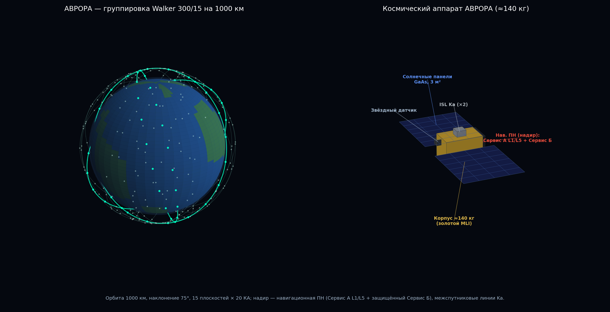

# АВРОРА — инвестиционная презентация

> Проект **АВРОРА** — суверенная российская низкоорбитальная система навигации,
> позиционирования и синхронизации (LEO-PNT). НИР «Сияние», ООО «ШИВА НЕТВОРК».
>
> Документ — каркас инвест-питча. Технические числа взяты из техпроекта
> (СИЯНИЕ-ТП-001); поля `[Заполнить: …]` — данные, которые вносит владелец
> (рынок, модель выручки, команда, объём раунда). **Не выдумывать — подставить
> реальные.** Честная рамка: система на стадии аванпроекта (**TRL 2–3**), демонстраторы
> Фаз 0–1 — инструмент снижения рисков.

---

## Слайд 1 — Титул
**АВРОРА** — суверенное LEO-усиление ГЛОНАСС: точность, Арктика, помехозащита, время.
ООО «ШИВА НЕТВОРК». Контакт: `[Заполнить]`.

## Слайд 2 — Проблема
Среднеорбитальные ГНСС (ГЛОНАСС/GPS/Galileo, ~20 000 км) ограничены:
- слабый сигнал (на ~26 дБ слабее, чем с 1000 км) → легко глушится;
- слабое покрытие выше 70° с.ш. (Арктика — стратегический регион РФ);
- медленная сходимость высокоточного позиционирования (PPP) — 20–40 мин;
- стратегическая уязвимость единственного орбитального эшелона.

## Слайд 3 — Решение
Низкоорбитальная группировка **300 КА (Walker 300/15)**, 1000 км, наклонение 75°:
- сильный сигнал, быстрая смена геометрии, покрытие Арктики;
- **двухсервисная архитектура** (§65): открытый Сервис А (совместим с GPS/Galileo,
  +11 дБ) + защищённый Сервис Б (своя L-полоса, **+23 дБ, ×200 к помехозащите**);
- служба точного времени SHIWA TIME.

## Слайд 4 — Почему сейчас
- Мировая гонка LEO-PNT: Xona PULSAR (США), CentiSpace/Geespace (КНР), Starlink-PNT.
- Суверенный запрос РФ: независимость от зарубежных ГНСС, Арктика, КИИ.
- Окно: войти в программу «Сфера» как навигационно-временно́й столп (§66.6).

## Слайд 5 — Продукт и сервисы
- **Сервис А** — масс-маркет, комбинированный режим с ГЛОНАСС (CEP ≈ 1 м).
- **Сервис Б** — защищённый PNT для КИИ/транспорта/обороны (помехозащита, аутентификация ГОСТ).
- **Время** — суверенная служба UTC(SU), наносекундный уровень, распределённый эталон (§28.6).

## Слайд 6 — В чём преимущество (честно)
Не точность одной псевдодальности (тут АВРОРА на уровне ГЛОНАСС), а:
- **PPP-сходимость 1–3 мин** (против 20–40) — подтверждено натурными данными (§45.3);
- **Арктика** (75°), **помехозащита** (+23 дБ), **аутентификация на ГОСТ**, **суверенность**.

## Слайд 7 — Рынок
Сегменты: высокоточный транспорт и БПЛА, синхронизация КИИ (телеком/энергетика/финансы),
геодезия и кадастр, оборона и спецпотребители, Арктическая зона.
> [Заполнить: TAM / SAM / SOM по РФ и ЕАЭС; динамика; доля защищённого сегмента.]

## Слайд 8 — Бизнес-модель
- Сервисные подписки (PPP-RTK, время-как-услуга);
- государственные контракты и программа «Сфера»;
- защищённый сервис для КИИ/спецпотребителей;
- лицензирование наземной инфраструктуры SHIWA TIME.
> [Заполнить: тарифы, целевая выручка по годам, маржинальность, окупаемость.]

## Слайд 9 — Экономика (из техпроекта)
- LCC (с восполнением группировки): **≈ 113 млрд ₽ за 7 лет / ≈ 183 млрд ₽ за 15 лет** (§51).
- Цена изготовления КА (серия): **≈ 105 млн ₽**; удельная LCC ≈ 378 млн ₽/КА.
- Удешевление старта: демонстраторы Ф0–1 на **16U CubeSat** — ≈ 820 млн ₽ (×3 дешевле полноразмерных).
- На порядок дешевле GPS/Galileo ($10+ млрд).

## Слайд 10 — Конкуренты
GPS III, ГЛОНАСС-K2, Galileo, BeiDou (MEO); Xona PULSAR, CentiSpace/Geespace, Starlink-PNT (LEO).
АВРОРА — единственная даёт оба сервиса (GNSS-совместимый + защищённый) с одной группировки,
не снижая орбиту, на суверенной базе (§41).

## Слайд 11 — Зрелость и риски (честно)
Текущий **TRL 2–3** (аванпроект). Критический путь — 4 риска:
- **К-1** — бортовой стандарт CSAC: нет российского производителя (ищется партнёр);
- **К-2** — орбитальное определение / фазовая ISL — лётное подтверждение;
- **К-4** — выделение L-полосы Сервиса Б (ГКРЧ/МСЭ);
- **К-3** — экономика восполнения (учтена в LCC).

## Слайд 12 — План и де-рискинг
Фазы **3 → 12 → 90 → 180 → 300 КА** (2026→2034). Дешёвые демонстраторы Ф0–1 (16U)
проверяют сигнал, ISL и дисциплину часов **до** инвестиций в серию (~30 млрд ₽).

## Слайд 13 — Команда
> [Заполнить: ключевые компетенции ШИВА НЕТВОРК — часы (Quantum-18), SHIWA TIME (демон),
> партнёры по платформе/ПН; послужной список.]

## Слайд 14 — Запрос (ask)
> [Заполнить: объём раунда; распределение (CSAC-НИОКР, демо Ф0–1, наземный сегмент,
> регуляторика); вехи, разблокируемые этим раундом; целевая оценка/доля.]

---

**Приложение:** полный техпроект `AURORA_PNT_GOST.pdf` (СИЯНИЕ-ТП-001).
Воспроизводимость расчётов — программный комплекс `aurora.pnt` (90 модулей, §29.3).
