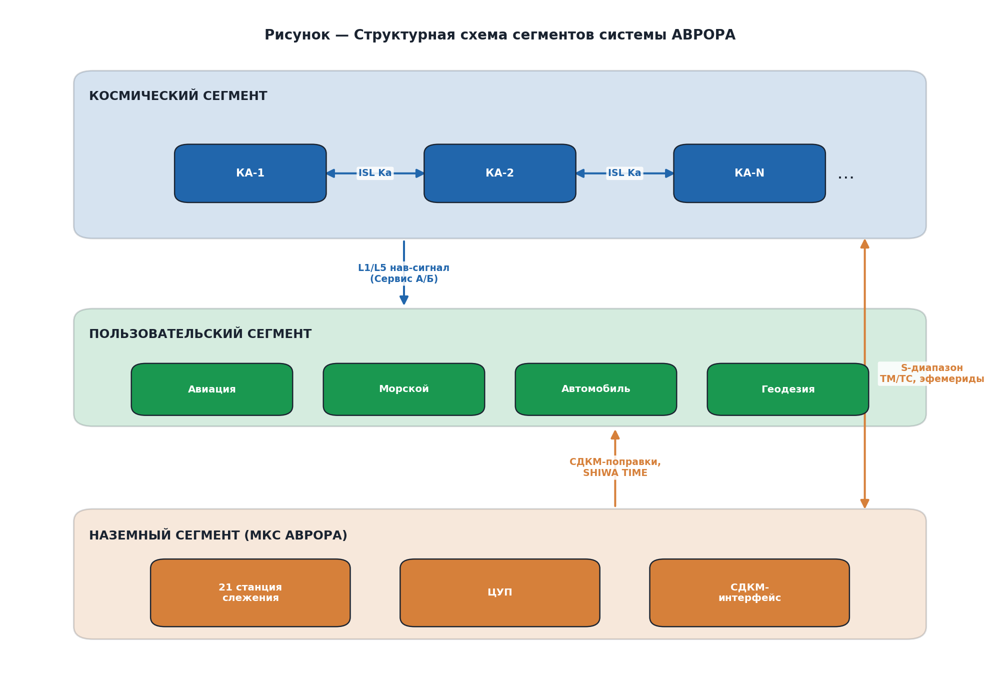
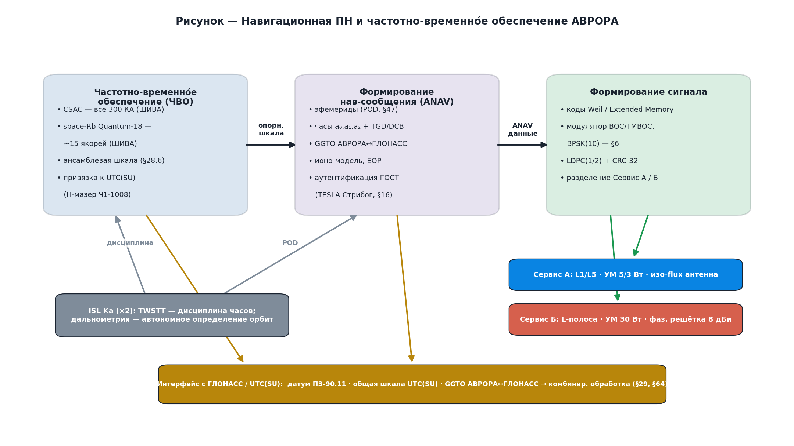
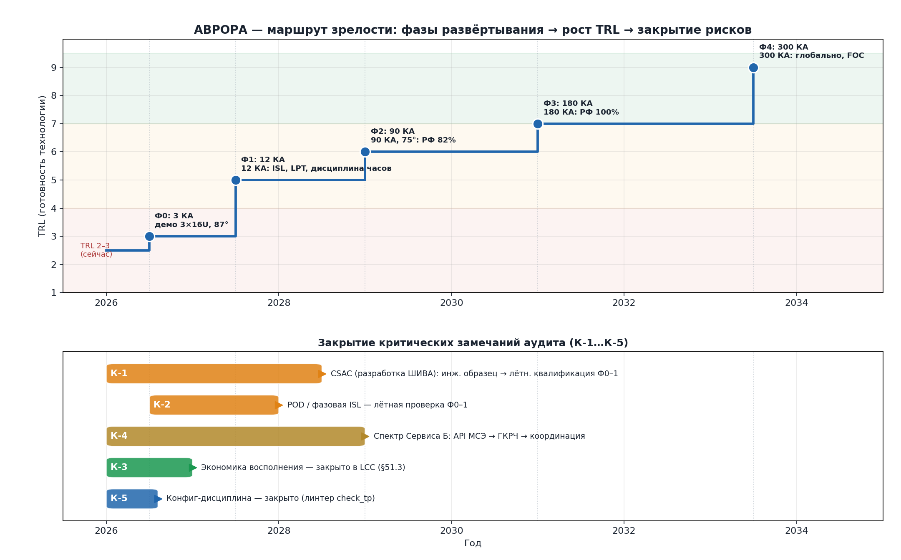

# АВРОРА — технический брифинг для РКС и Роскосмоса

> Система **АВРОРА** — суверенная LEO-PNT (навигация, позиционирование, синхронизация),
> позиционируется как **низкоорбитальное усиление ГЛОНАСС** (не замена MEO). НИР «Сияние»,
> ООО «ШИВА НЕТВОРК». Источник — техпроект СИЯНИЕ-ТП-001 (по ГОСТ 7.32/2.105).
>
> Документ — для технико-стратегического диалога: обоснованность, суверенность,
> кооперация, маршрут зрелости. Числа — выход верифицированного комплекса моделирования
> (`aurora.pnt`, §29.3), не натурные измерения; внешняя сверка — §45.3.

---

## 1. Назначение и суверенный статус
Суверенное усиление ГЛОНАСС в части точности, помехозащиты, Арктики и службы времени.
Координатная основа — **ПЗ-90.11** (как ГЛОНАСС, §64); шкала — **UTC(SU)** (H-мазер
Ч1-1008, ВРЕМЯ-Ч); криптозащита навигационного сообщения — **только ГОСТ** (Стрибог/
34.10/Кузнечик, §16); элементная и наземная база — отечественная (§66).

## 2. Позиционирование (не конкурент ГЛОНАСС, а усиление)
LEO-эшелон дополняет MEO-ГЛОНАСС: комбинированный режим LEO+ГЛОНАСС даёт **CEP ≈ 1 м**
и **PPP-сходимость 1–3 мин**. Прямо вписывается в многоорбитальную программу «Сфера»
как навигационно-временно́й столп рядом со связным «Гонцом» (§66.6).

## 3. Архитектура системы
Группировка Walker **300/15**, 1000 км, 75°; три сегмента (космос с ISL Ka /
пользователь / наземный МКС); двухсервисная сигнальная архитектура (§65).

**Навигационная ПН и частотно-временно́е обеспечение** (домен РКС): ЧВО на отечественных
стандартах ШИВА НЕТВОРК (CSAC + space-Rb Quantum-18) → формирование ANAV (эфемериды, часы,
TGD, GGTO, крипто ГОСТ) → сигнал (Сервис А/Б). Интерфейс с ГЛОНАСС/UTC(SU): датум ПЗ-90.11,
общая шкала UTC(SU), GGTO АВРОРА↔ГЛОНАСС → комбинированная обработка (§3.5, §29, §64).

## 4. Суверенность инфраструктуры (ключевое для РКС)
| Слой | Решение | Раздел |
|---|---|---|
| Датум | ПЗ-90.11, совмещён с ITRF2008 (≈3 мм) | §64 |
| Время | UTC(SU), H-мазер Ч1-1008 (ВРЕМЯ-Ч), ансамбль на борту | §8, §28 |
| Криптография | ГОСТ: Стрибог, 34.10, Кузнечик/MGM (не NIST) | §16 |
| Сигнал | Сервис А (RNSS-совм.) + Сервис Б (своя L-полоса) | §65 |
| ЭКБ и наземка | отечественная, кооперация РКП | §66 |

## 5. Техническая обоснованность
Все характеристики получены **математической моделью и программным комплексом**
моделирования группировки (`aurora.pnt`: 90 модулей, CLI, 84 набора результатов,
154 теста, линтер связности; §29.3). Точностные числа **сверены с натурными LEO-PNT
данными** (CentiSpace, LeGNSS): PPP-сходимость, N_vis и орбита — подтверждены; POD —
помечен как оптимистичный, требует лётной проверки (§45.3).

## 6. Промышленная кооперация
| Слой | Возможный исполнитель |
|---|---|
| Платформа операционного КА (140 кг) | АО «ИСС» им. Решетнёва; ГК «СПУТНИКС» |
| Навигационная ПН и время | **АО «РКС»** (нав-аппаратура, ЧВО, UTC(SU)) |
| Бортовые атомные часы | **ООО «ШИВА НЕТВОРК»** — собственная разработка (space-Rb Quantum-18 + чип-цезий CSAC) |
| Наземный эталон | ОАО «Время-Ч» (Ч1-1008) |
| ДУ | ОКБ «Факел» |
| Выведение | АО «РКЦ "Прогресс"» |
| Демонстраторы 16U | СПУТНИКС / Геоскан |

Полная карта — §66; синергия с «Гонец»/«Сфера» — §66.6.

## 7. Регуляторный маршрут (ГКРЧ / МСЭ)
RNSS-полосы Сервиса А — под маской ПФП МСЭ (прецедент ГЛОНАСС-K CDMA на 1575,42 МГц).
Сервис Б — выделенная L-полоса (национальный ресурс, заявка ГКРЧ + координация МСЭ).
Критический путь: **API в МСЭ не позднее 2026 г.** (§43.4).

## 8. Зрелость и закрытие рисков
Текущий **TRL 2–3**. Демонстраторы Ф0–1 (дешёвые 16U) закрывают критический путь до серии.

| Риск | Суть | Закрытие |
|---|---|---|
| **К-1** | CSAC — лётная квалификация | собственная разработка ШИВА (как Quantum-18); инж. образец → квалификация Ф0–1 |
| **К-2** | POD / фазовая ISL — заявочные | лётная отработка Ф0–1 → POD-фильтр Ф2 (детально §67.5) |
| **К-4** | спектр Сервиса Б не выделен | API МСЭ 2026 → ГКРЧ → координация; резерв — ведомств. режим (§67.5) |
| **К-3** | экономика восполнения | учтена в LCC (§51.3) |

## 9. Что предлагаем (запрос к РКС/Роскосмосу)
- **РКС** — головной партнёр по навигационной ПН и частотно-временно́му обеспечению,
  интерфейс с ГЛОНАСС/UTC(SU); совместный НИОКР по нав-ПН.
- **Роскосмос** — частотно-орбитальная заявка (ГКРЧ/МСЭ), пусковые услуги, включение в «Сферу».
- **Бортовые часы (Quantum-18 + CSAC) — компетенция ШИВА НЕТВОРК**, вносится в кооперацию
  готовой; внешней зависимости по элементной базе часов нет (закрытие К-1 — лётная квалификация на Ф0–1).
> [Заполнить: конкретные роли, объёмы, сроки этапов ОКР.]

---

**Приложение:** техпроект `AURORA_PNT_GOST.pdf` (СИЯНИЕ-ТП-001, 68 разделов, по ГОСТ).
