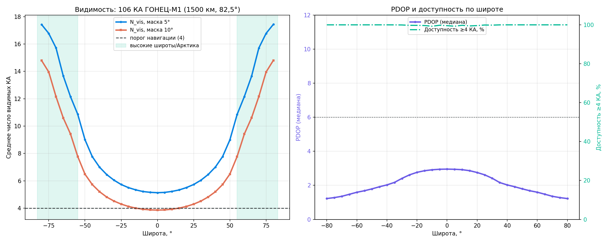
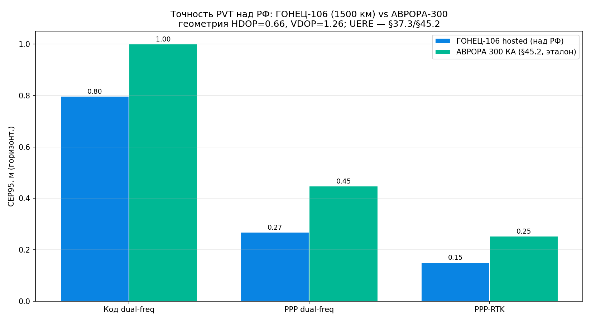
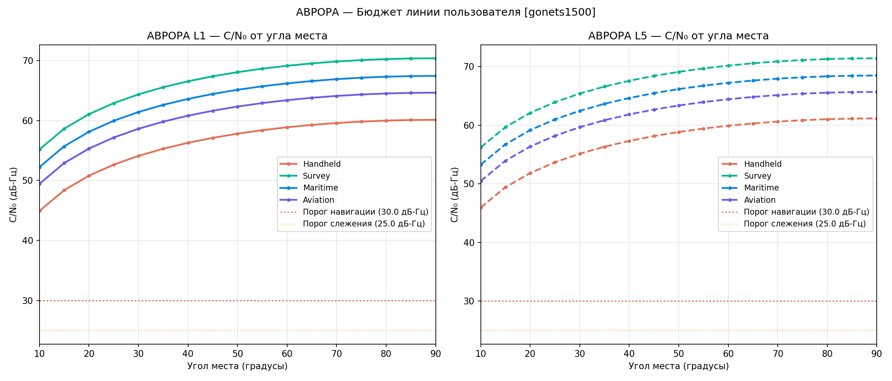
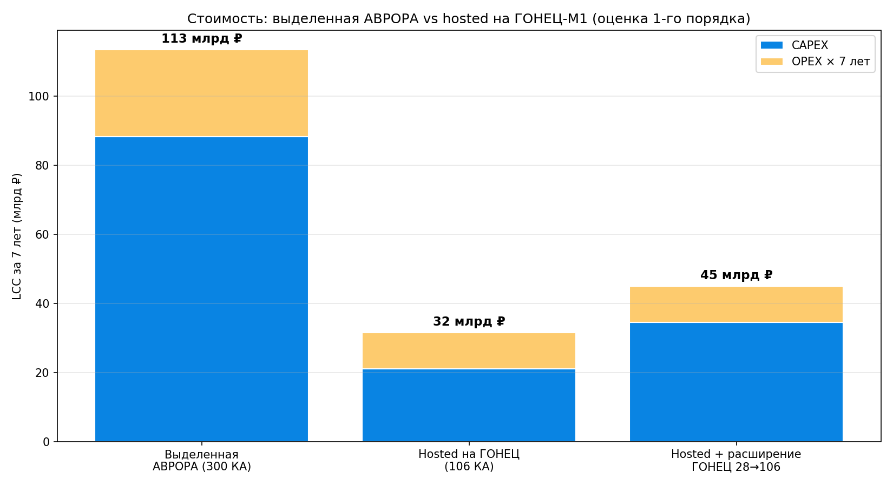

# Исследование: размещение нав-ПН АВРОРА на платформе ГОНЕЦ-М1 (hosted-payload)

**Идентификатор:** АВРОРА-ГОНЕЦ-001
**Редакция:** 0.1 (предварительная)
**Дата:** 2026-06-28
**Шифр темы:** «АВРОРА» (НИР «Сияние»)
**Разработчик:** ООО «ШИВА НЕТВОРК» (ShiwaNetwork).

> Отдельное прикладное исследование внутри проекта АВРОРА. **Не является частью
> основного техпроекта** (СИЯНИЕ-ТП-001) и не вносит в него изменений. Цель —
> оценить вариант с размещением полезной нагрузки АВРОРЫ на чужой платформе вместо
> строительства выделенной группировки из 300 КА.

---

## 1. Идея и аналог

Рассматривается размещение **навигационно-временно́й ПН АВРОРЫ** (сигнал L-диапазона +
бортовой стандарт частоты CSAC + опционально ISL-дальнометрия) как **hosted-payload**
на космических аппаратах новой российской системы связи **ГОНЕЦ-М1**, с предоставлением
**навигации и синхронизации как дополнительного сервиса**.

Прямой коммерческий и инженерный аналог — **Iridium STL** (Satellite Time & Location):
сервис защищённого времени и местоположения, размещённый на связной LEO-группировке
Iridium. Принцип тот же: не строить отдельное созвездие PNT, а «подсадить» нагрузку на
существующую/планируемую инфраструктуру.

**Позиционирование** сохраняется как у АВРОРЫ: **LEO-усиление ГЛОНАСС, не замена MEO.**

---

## 2. Система ГОНЕЦ — исходные данные

| Система | Орбита | КА (план) | Платформа / масса | Диапазон | Статус |
|---|---|---|---|---|---|
| ГОНЕЦ-М (2-е пок.) | 1350–1500 км, 82,5–82,6° | 12 (4 пл.×3) | КАУР-1, 280 кг, ≤300 Вт, 5 лет | UHF (~0,2–0,4 ГГц) | в эксплуатации |
| **ГОНЕЦ-М1 (новое пок.)** | ~1400–1500 км, 82,6° | 28 (по др. источ. 48: 6×8) | новая безгермоплатформа Решетнёва, ~220 кг, **10 лет**, ФАР | P/S/C-band | развёртывание ~2029 |
| Марафон IoT (Сфера) | ~750 км | 264 (иногда 137), 12 пл. | малые 1,5–50 кг | — | тест-КА 28.12.2025; программа приостанавливалась |
| ГОНЕЦ.МКА | LEO | 40 к 2027 → до 1000 | малые | — | планы |

**Принятая для расчёта конфигурация:** **106 КА** на платформе ГОНЕЦ-М1, орбита
**1500 км, наклонение 82,5°**, 6 плоскостей (Walker-star).

> **Оговорка по числу 106.** В открытых источниках числа 106 нет — это проектная
> оценка заказчика. Официальные опорные: 28 (ГОНЕЦ-М1), 137–264 (Марафон IoT).
> 106 принято как вход исследования; при ином числе геометрию следует пересчитать.

Источники: [Гонец (Вики)](https://ru.wikipedia.org/wiki/Гонец_(спутниковая_система_связи)),
[russianspaceweb.com/gonets.html](https://www.russianspaceweb.com/gonets.html),
[Gunter's Gonets-M1](https://space.skyrocket.de/doc_sdat/gonets-m1.htm),
[ТАСС (Марафон)](https://tass.ru/kosmos/12033241),
[ComNews, 12.2025](https://www.comnews.ru/content/243120/2025-12-24/2025-w52/1007/marafonec-vernulsya-distanciyu-testovyy-sputnik-marafon-iot-vzletit-cherez-3-dnya).

---

## 3. Геометрия группировки (результат моделирования)

Геометрия доступности рассчитана автономным симулятором (`aurora/pnt/gonets_hosted.py`):
круговые орбиты, кеплеровская пропагация + вращение Земли, сетка наблюдателей по Земле,
окно 6 ч с шагом 120 с. Метрики — число видимых КА (N_vis), PDOP (по матрице
направляющих косинусов в ENU), доступность (доля времени с N_vis ≥ 4).

| Пояс широт | N_vis (маска 5°) | Доступность ≥4 | PDOP медиана | PDOP p95 |
|---|---|---|---|---|
| Экваториальный (0–30°) | 5,4 | 99,6 % | 2,83 | 4,14 |
| Средние (30–55°) | 7,3 | 100 % | 2,06 | 3,06 |
| **Высокие (55–83°)** | **14,4** | **100 %** | **1,44** | **1,78** |
| **Территория РФ** (41–82°) | **14,4** (мин 7,8) | **100 %** | **1,41** | **1,62** |

**Интерпретация.** Форма «U» по видимости и «∩» по PDOP — характерная подпись
**приполярной** группировки: наклонение 82,5° концентрирует покрытие над высокими
широтами. Конфигурация ГОНЕЦ **сама по себе оптимальна для суверенной задачи** —
максимум геометрии приходится на РФ и Арктику, а не на экватор.

**Главный вывод по геометрии:** 106 КА ГОНЕЦ-М1 **более чем достаточно** для навигации
и синхронизации над РФ. PDOP p95 = **1,62 над РФ в одиночном режиме** — уровень,
сопоставимый с комбинированным режимом полной 300-КА АВРОРЫ (1,67, §5 ТП) и существенно
лучше её автономного p95 5,0. Доступность ≥4 КА — 100 % по всей территории РФ; над
Арктикой геометрия наилучшая (N_vis 14, PDOP 1,4).

### 3.1 Валидация и границы метода
- Метод проверен: на конфигурации 300 КА / 1000 км / 75° даёт N_vis ≈ 14 — совпадает с
  §-результатом АВРОРЫ.
- **Это геометрия (PDOP), а не точность.** Итоговая точность = UERE × PDOP; UERE на
  1500 км несколько хуже (см. §4) — отдельный расчёт.
- Фаза Walker не оптимизирована (F = 2 принято разумно, не лучшее) — PDOP может
  отличаться на ±10–20 %.
- Сравнение «106 ГОНЕЦ vs 300 АВРОРА» корректно **только над РФ/Арктикой** (за счёт
  приполярности); на экваторе геометрия слабее (N_vis 5,4, PDOP до ~4).
- Совмещение с ГЛОНАСС не учитывалось — в комбинации показатели лучше.

### 3.2 Сквозная точность PVT (CEP/верт.)

Геометрия переведена в точность по методике §45 ТП: ошибка = DOP × UERE, где
$\mathrm{CEP}_{95} = 1{,}73\cdot HDOP\cdot \mathrm{UERE}$, $V_{95}=1{,}96\cdot VDOP\cdot
\mathrm{UERE}$ (коэффициенты сверены с §45.2). Геометрия над РФ:
**HDOP = 0,66**, VDOP = 1,26 (медиана). UERE кода dual-freq на 1500 км пересчитан по
§37.3 с шумом приёмника ×1,5 (из-за −3,5 дБ, §4.1): **0,693 м** — практически как у
АВРОРЫ (0,70 м), т.е. высота на ошибку дальности почти не влияет.

| Класс сервиса | UERE, м | CEP50, м | **CEP95, м** | Верт. 95%, м |
|---|---|---|---|---|
| Код dual-freq | 0,693 | 0,38 | **0,80** | 1,72 |
| PPP dual-freq | 0,233 | 0,13 | **0,27** | 0,58 |
| **PPP-RTK** | 0,131 | 0,07 | **0,15** | 0,33 |

(При худшей геометрии p95 над РФ: код dual CEP95 ≈ 1,06 м. В комбинации с ГЛОНАСС код
dual CEP95 ≈ 0,56 м.)

**Вывод по точности:** над РФ hosted-вариант достигает **AURORA-классов точности** —
сантиметры в PPP-RTK (CEP95 ≈ 0,15 м), дециметры в PPP (0,27 м), субметр кодом (0,80 м).
**Оговорка:** числа получаются даже лучше эталона АВРОРЫ (§45.2) **не потому, что система
лучше**, а из-за благоприятной приполярной геометрии именно над РФ (HDOP 0,66 против
номинальных 1,1 АВРОРЫ); на экваторе точность была бы заметно хуже. UERE — прогнозная
величина (§37.3), подлежит лётному подтверждению.

---

## 4. Размещение ПН на ГОНЕЦ-М1 (предварительно)

| Аспект | Оценка | Замечание |
|---|---|---|
| Орбита 1500 км | +3,5 дБ потерь на трассе vs 1000 км | давит на бюджет Сервиса А; Сервис Б (30 Вт+8 дБи) сохраняет запас — пересчёт по `user_link_budget` |
| Наклонение 82,6° | **лучше** 75° АВРОРЫ | отличная высокоширотная/арктическая геометрия |
| Частоты | ГОНЕЦ — UHF/P/S/C; навигация АВРОРЫ — **L-диапазон** | нужна **новая ПН** + частотная координация МСЭ (не переиспользование связной ПН) |
| Бус ~220 кг, ≤300 Вт, 10 лет | запас под нав-ПН есть | вся АВРОРА-КА = 140 кг; инкремент ПН (L-передатчик + антенна + CSAC) мал |
| Бортовой стандарт частоты | CSAC — чип-масштаб, ~35 г | ключевой носимый элемент сервиса синхронизации |
| Радиация | 1500 км — выше дозы (край внутр. пояса) | ужесточает скрининг ЭКБ vs 1000 км |
| ISL-дальнометрия | опционально | повышает автономность синхронизации/эфемерид |

Вывод: реальный носитель — **только ГОНЕЦ-М1-класс** (бус ~220 кг). Малые КА Марафона
(1,5 кг) не вмещают CSAC + L-передатчик и для полного PNT не подходят.

### 4.1 Бюджет линии на 1500 км

Бюджет линии пересчитан той же методикой и константами, что у АВРОРЫ
(`aurora/pnt/link_budget.py`), с заменой высоты орбиты 1000 → 1500 км.

| Сигнал / терминал | Место | C/N₀ 1000 км | C/N₀ 1500 км | Δ |
|---|---|---|---|---|
| L1 / Survey | 90° | 73,9 | 70,4 | −3,5 дБ |
| L1 / Survey | 30° | 67,9 | 64,4 | −3,5 дБ |
| L1 / Handheld | 30° | 57,6 | 54,1 | −3,5 дБ |
| L1 / Handheld | 10° | 48,4 | 44,9 | −3,5 дБ |

**Потеря на трассе при 1000 → 1500 км — равномерно −3,5 дБ** (= 20·lg(1,5)). Линия
закрывается с большим запасом: нав-маржа (Survey, 30°) = **34 дБ**, термошум
псевдодальности ≈ 20 см; даже бытовой терминал (Handheld) на 10° даёт C/N₀ ≈ 45 дБ-Гц
(порог навигации 30, слежения 25). Анти-джам-запас над MEO-ГНСС с учётом −3,5 дБ:
**Сервис А +7,5 дБ** (было +11), **Сервис Б +19,5 дБ** (было +23) — последнее
по-прежнему уровня Xona (+20).

**Вывод по линии:** переход на 1500 км стоит модест­ные −3,5 дБ; бюджет линии
**состоятелен**, запасы навигации и анти-джама сохраняются.

---

## 5. Экономика hosted-варианта (оценка первого порядка)

Сравнение с выделенной группировкой АВРОРЫ (300 КА, §51 ТП). **Ключевое допущение:**
106 КА ГОНЕЦ-М1 строятся и запускаются для связи **в любом случае**, а АВРОРА
доплачивает только за инкремент нав-ПН + хостинг. Расчёт — `aurora/pnt/gonets_econ.py`.

| Вариант | LCC за 7 лет | Кратность |
|---|---|---|
| Выделенная АВРОРА (300 КА) | 113,4 млрд ₽ | базовая |
| **Hosted на ГОНЕЦ (106 КА)** | **≈ 31,6 млрд ₽** | **× 3,6 дешевле** |
| Hosted + расширение ГОНЕЦ 28→106 (пессим.) | ≈ 45,0 млрд ₽ | × 2,5 дешевле |

Структура hosted-CAPEX (≈ 21 млрд ₽): NRE адаптации ПН 5,0; нав-ПН+CSAC ×106 — 6,0;
интеграция/хостинг — 2,1; доп. выведение (масса ПН) — 2,0; наземный нав-контур — 6,0.
OPEX ниже (1,5 vs 3,6 млрд ₽/год — нет своей платформы); восполнение тоже ниже (буса́
заменяет оператор ГОНЕЦ, АВРОРА восполняет только ПН).

**Существенная оговорка.** Экономия ×3,6 справедлива, **только если носители уже
финансируются для связи**. Официально у ГОНЕЦ-М1 28 КА, не 106; если расширение
28→106 ляжет на АВРОРУ (+13,4 млрд ₽), выигрыш сокращается до ×2,5. Числа — первого
порядка; главная неопределённость — стоимость хостинга/интерфейса оператора.

---

## 6. Преимущества варианта

- **Резкая экономия CAPEX:** не строится выделенная группировка АВРОРЫ из 300 КА
  (LCC 113–183 млрд ₽, §51 ТП). Оплачивается лишь инкремент ПН на готовой/планируемой
  национальной платформе.
- **Суверенность сохраняется:** ГОНЕЦ — российская система (ИСС Решетнёва).
- **Арктика:** приполярная орбита даёт лучшую геометрию именно над РФ.
- **Прецедент:** Iridium STL подтверждает работоспособность hosted-PNT-модели.
- **Ресурс:** платформа ГОНЕЦ-М1 рассчитана на 10 лет (vs 5 у ГОНЕЦ-М).

---

## 7. Риски и открытые вопросы

1. **Программная волатильность ГОНЕЦ:** Марафон IoT приостанавливался ради экономии;
   ГОНЕЦ-М1 сдвигался к ~2029. Hosted-вариант наследует график и риски носителя.
2. **Число КА:** 106 — оценка заказчика, официально 28 (М1). Нужно согласовать:
   расширение М1 до 106 либо отдельный «ГОНЕЦ-ПНТ»-вариант.
3. **Размещение ПН:** требуется интерфейс hosted-payload оператора (масса/мощность/
   наведение/ЭМС) — подтвердить с ИСС Решетнёва.
4. **Спектр:** L-диапазон навигации требует частотной координации (МСЭ), отдельно от
   связных полос ГОНЕЦ.
5. **Точность (UERE) на 1500 км:** ниже, чем на 1000 км — отдельный сквозной расчёт PVT.
6. **Управление и эфемериды:** ADCS и стабильность платформы ГОНЕЦ под нав-требования —
   проверить (нужны точная орбита и удержание).

---

## 8. Предварительные выводы

1. **Геометрически вариант состоятелен.** 106 КА ГОНЕЦ-М1 (1500 км, 82,5°) обеспечивают
   над РФ N_vis ≈ 14, доступность ≥4 КА = 100 %, PDOP p95 ≈ 1,6 — навигацию уровня
   «почти самостоятельной системы» плюс синхронизацию, **без строительства 300 КА**.
2. **Точность над РФ — AURORA-класса** (§3.2): UERE на 1500 км ≈ 0,69 м (как у АВРОРЫ),
   CEP95 ≈ 0,15 м (PPP-RTK) / 0,27 м (PPP) / 0,80 м (код dual). UERE почти не зависит от
   высоты; точность определяется геометрией, а она над РФ благоприятна.
3. **Линия закрывается:** переход на 1500 км стоит −3,5 дБ, нав-маржа ≈ 34 дБ, анти-джам
   Сервиса Б +19,5 дБ над MEO (§4.1).
4. **Экономически вариант резко выгоднее:** LCC-7 ≈ 31,6 млрд ₽ против 113,4 у выделенной
   (× 3,6; даже с расширением ГОНЕЦ — × 2,5), §5 — **при условии**, что носители строятся
   для связи независимо.
5. **Конфигурация ГОНЕЦ естественно оптимальна для РФ/Арктики** (приполярность).
6. **Решающие следующие шаги:** (а) согласование размещения ПН и числа КА с ИСС Решетнёва;
   (б) частотная координация L-диапазона (МСЭ); (в) оценка стоимости хостинга/интерфейса
   оператора — главная экономическая неопределённость; (г) лётное подтверждение UERE
   (прогнозная величина §37.3) на демонстраторе.

---

*Источники данных по ГОНЕЦ — §2. Расчёты: геометрия — `aurora/pnt/gonets_hosted.py`;
точность PVT — `aurora/pnt/gonets_pvt.py` (методика §45 ТП); бюджет линии —
`aurora/pnt/gonets_linkbudget.py` (переиспользует `link_budget.py`); экономика —
`aurora/pnt/gonets_econ.py` (переиспользует `cost_model.py`). Рисунки и выгрузки —
`results/gonets/`. Все показатели — предварительная инженерная оценка первого порядка
при заявленных допущениях.*
