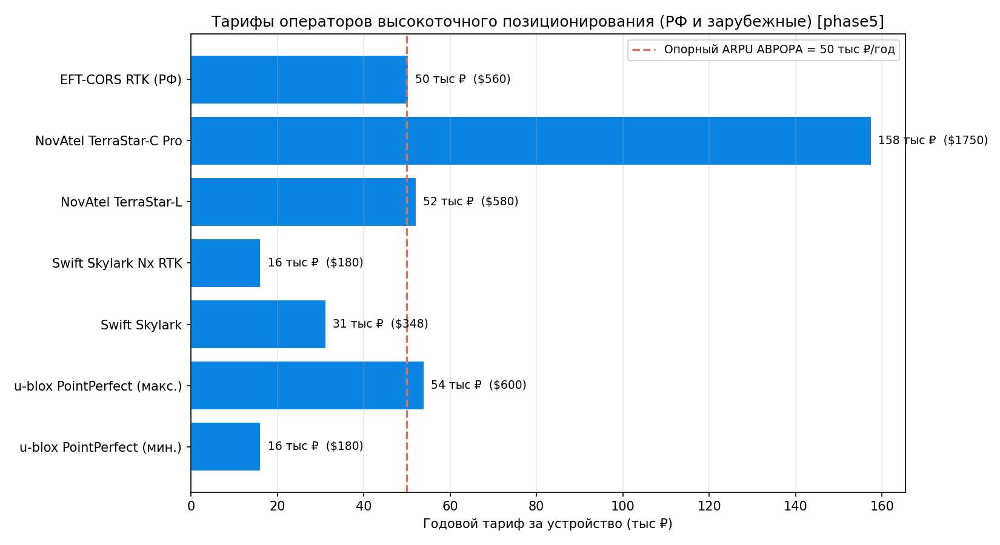
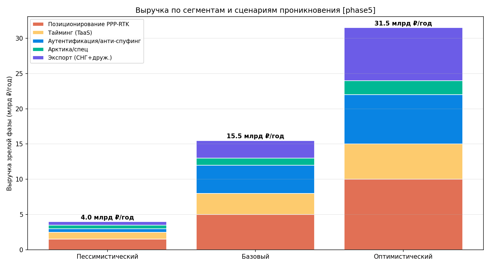
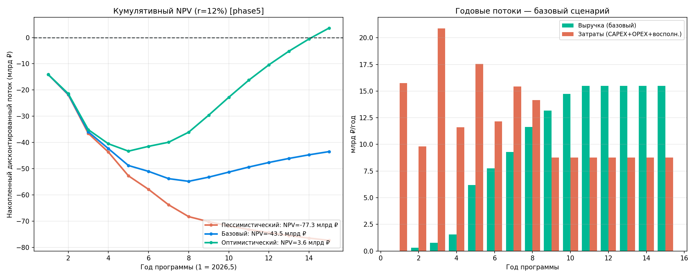
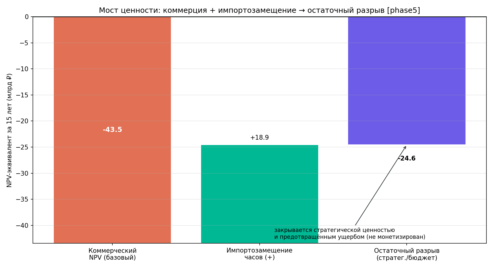

# Технико-экономическое обоснование (ТЭО)

## «Создание низкоорбитальной системы навигации, позиционирования и синхронизации AURORA PNT (АВРОРА)»

**Идентификатор:** АВРОРА-ТЭО-001
**Редакция:** 0.1 (предварительная, краткая)
**Дата:** 2026-06-27
**Шифр темы:** «АВРОРА» (НИР «Сияние»)
**Основание:** ГОСТ Р 15.201-2000 (стадия обоснования разработки), ГОСТ 2.103;
методические подходы — «Методические рекомендации по оценке эффективности
инвестиционных проектов» (утв. Минэкономики, Минфином, Госстроем РФ).
**Разработчик:** ООО «ШИВА НЕТВОРК» (ShiwaNetwork).

> Документ выпущен во исполнение указания §31 технического проекта
> (СИЯНИЕ-ТП-001): оценка рынка, коммерческая модель, выручка и срок окупаемости
> вынесены из ТП в самостоятельный документ. Стоимостные оценки заимствованы из
> §51 «Стоимостная модель (LCC)» ТП и не пересчитываются.

---

## 1. Назначение и предмет

ТЭО оценивает экономическую целесообразность создания суверенной
низкоорбитальной системы PNT АВРОРА (LEO, 1000 км, до 300 КА) как **LEO-усиления
ГЛОНАСС**, а не его замены. Рассматриваются: источники денежного потока,
модели монетизации, финансовые показатели проекта, эффект импортозамещения,
предотвращённый ущерб и немонетизируемая стратегическая ценность.

**Характер документа.** Предварительная (краткая) редакция. Рыночные и доходные
оценки имеют статус **экспертного прогноза** и подлежат уточнению в расширенной
редакции по результатам маркетингового исследования. Затратная часть — инженерная
оценка LCC (§51 ТП), достоверность которой ограничена допущениями ТП.

---

## 2. Исходные положения и допущения

| Параметр | Значение | Источник |
|---|---|---|
| Горизонт оценки | 15 лет (2026–2041) | §51 ТП |
| Ввод навигации, 100% РФ | 2031 (Фаза 3, 180 КА) | §30.2 ТП |
| Глобальный FOC | 2033,5 (Фаза 4, 300 КА) | §30.2 ТП |
| Сервис тайминга (LPT) | с Фазы 0 (2026,5) | §30.3 ТП |
| Ставка дисконтирования $r$ | 12% (базовая); 10–14% (диапазон) | принято |
| Валюта | млрд ₽ (справочно $1 ≈ 90 ₽) | §51 ТП |

Допущение о доходе: коммерческий поток существенно начинается **с 2031 г.**
(100% покрытие РФ); тайминговый сервис даёт ограниченный доход с более ранних фаз.

---

## 3. Затраты (из §51 ТП)

| Статья | 7 лет (2026–2033) | 15 лет (2026–2041) |
|---|---|---|
| NRE (проектирование, квалификация) | 10,8 | 10,8 |
| Демонстраторы Ф0–1 (16U CubeSat) | 0,82 | 0,82 |
| Серия 300 КА (бус+ПН+ISL) + часы | 31,35 | 31,35 |
| Запуски | 27,0 | 27,0 |
| Наземный сегмент (CAPEX) | 7,2 | 7,2 |
| Восполнение группировки | 11,1 | 51,9 |
| OPEX | 25,2 | 54,0 |
| **LCC, млрд ₽** | **≈ 113,4** | **≈ 183,0** |

CAPEX до глобального FOC (без OPEX и восполнения) ≈ **77,2 млрд ₽**; эксплуатационные
расходы в зрелой фазе (OPEX ≈ 3,6 + восполнение ≈ 5,2) ≈ **8,8 млрд ₽/год**.
Все статьи сверены с `aurora/pnt/cost_model.py` (§51 ТП).

---

## 4. Рынок и модели монетизации

Денежный поток формируют свойства, недоступные MEO-системам (см. §65, §43, §28 ТП):
быстрый PPP-RTK (сходимость 1–3 мин), защищённый аутентифицированный тайминг,
аутентификация сигнала/анти-спуфинг (+23 дБ, Сервис Б) и покрытие высоких широт (75°).
Навигация L1/L5 (Сервис А, открытый) — бесплатный сервис привлечения; платны —
точность, гарантия и защита.

| № | Сервис (модель) | Целевые потребители | Тип дохода |
|---|---|---|---|
| 1 | Высокоточное позиционирование PPP-RTK | АПК, геодезия/кадастр, стройка, карьеры, автономный транспорт | Подписка B2B |
| 2 | Тайминг как услуга (Timing-as-a-Service) | Связь 5G, ЦОД, энергосети, финтех/биржи, КИИ | Подписка/SLA |
| 3 | Аутентификация и анти-спуфинг (Сервис Б) | Оборона, КИИ, страхование грузов/БПЛА, антифрод | Гос/спец + лицензии |
| 4 | Арктический и спецсервис | Севморпуть, заполярная добыча, оборона | Гос + отраслевой |

Открытый Сервис А монетизируется косвенно (стимулирование экосистемы приёмников и
импортозамещение чипсетов), прямой выручки не несёт.

**Тарифные ориентиры (фактические цены, по состоянию на июнь 2026).** Опорная цена
заимствована для оценки выручки, а не назначается как тариф АВРОРЫ:

| Оператор / источник | Тариф (за устройство/сервис) | Назначение |
|---|---|---|
| u-blox PointPerfect | $15–50/мес (usage-based) | PPP-RTK поправки |
| Swift Skylark / Nx RTK | от $29/мес (~$350/год) / Nx от $15/мес (5 лет) | PPP-RTK подписка |
| NovAtel TerraStar-L / C Pro | $580 / ≈ $1 750 в год | PPP корр., профи |
| **EFT-CORS RTK (РФ)** | **50 400 ₽/год за приёмник** | внутренний тариф РФ (якорь ARPU) |
| **Iridium STL** (тайминг+анти-спуфинг, LEO) | **цель >$100 млн/год выручки к 2030** | прямой аналог Сервиса Б |
| **Qianxun SI (КНР)** | **>390 млн клиентов, 2 800 станций** | масштаб рынка (ориентир экспорта) |
| Рынок Assured PNT | $0,9 млрд (2025) → $3,0 млрд (2030), CAGR ≈ 28% | адресуемый рынок защиты |
| Рынок GNSS (EUSPA) | €300 млрд (2024) → €580 млрд (2034) | общий контекст |

Опорный тариф высокоточного позиционирования принят **50 000 ₽/год за устройство** и
**привязан к российскому рынку**: EFT-CORS RTK = 50 400 ₽/год за приёмник (фактический
тариф РФ, подтверждён в июне 2026). Зарубежный массовый вход ниже (Skylark от $29/мес
≈ $350/год), профессиональные тарифы выше (TerraStar-C Pro ≈ $1 750/год) — 50 000 ₽
лежит в реалистичной середине для РФ. Iridium STL (LEO-тайминг и анти-спуфинг, цель
>$100 млн/год) — **прямой коммерческий аналог Сервиса Б** и ориентир масштаба сегментов
2–3. Qianxun SI (единый оператор точного позиционирования КНР, >390 млн клиентов) задаёт
**потолок спроса единого национального рынка** и масштаб для оценки экспорта (берётся
как малая его доля). Тарифы TerraStar в июне 2026 повторно не сверялись (значение из
более ранних данных 2026 г.).

---

## 5. Финансовая модель (сценарная, расчётная)

Выручка зрелой фазы построена **«снизу вверх»** по пяти сегментам на опорных тарифах §4
(модуль `aurora/pnt/econ_model.py`); число платящих абонентов — допущение трёх
сценариев проникновения. Сегменты 1–4 — рынок РФ+СНГ; **сегмент 5 (экспорт)** —
дружественные государства, абоненты × экспортный ARPU (50 000 ₽/год, как внутренний).
Статус доходных оценок — экспертный прогноз.

Результаты дисконтированной модели (горизонт 15 лет, $r$=12%; источник — расчёт
`econ_model.py`, выгрузка `results/econ/econ_summary_phase5.csv`):

| Показатель | Пессим. | Базовый | Оптим. |
|---|---|---|---|
| Выручка зрелой фазы, млрд ₽/год | 4,0 | 15,5 | 31,5 |
| в т.ч. экспорт (СНГ+друж.), млрд ₽/год | 0,5 | 2,5 | 7,5 |
| Операционные расходы (OPEX+восполн.), млрд ₽/год | ≈ 8,8 | ≈ 8,8 | ≈ 8,8 |
| **Коммерческий NPV (15 лет, $r$=12%), млрд ₽** | **−77,3** | **−43,5** | **+3,6** |
| Коммерческий IRR | не опр. (<0) | −6,6% | +13,1% |
| Простой срок окупаемости CAPEX | > 15 лет | > 15 лет | ≈ 11 лет |
| Дисконтированный срок окупаемости | > 15 лет | > 15 лет | ≈ 15 лет |

**Интерпретация (главный вывод).** В **базовом** сценарии полной коммерческой
окупаемости LCC не достигается: NPV −43,5 млрд ₽, IRR ниже ставки. Причина
структурная — CAPEX 77,2 млрд ₽ понесён в 2026–2033 гг., а выручка выходит на зрелость
лишь после 2031 г. (ввод навигации) и при $r$=12% сильно дисконтируется. Это
**нормально и ожидаемо** для суверенной PNT-инфраструктуры: GPS, Galileo и ГЛОНАСС
также не являются коммерчески самоокупаемыми и финансируются государством. Вместе с
тем **оптимистический сценарий выходит в коммерческий плюс** (NPV +3,6 млрд ₽,
IRR 13,1% > ставки, окупаемость ≈ 11 лет) — и решающий вклад в этот перелом даёт
**экспорт**: рост экспортных абонентов с 50 тыс. (базовый) до 150 тыс. добавляет
+5 млрд ₽/год выручки. Таким образом, экспорт — главный коммерческий рычаг, способный
довести проект до самоокупаемости.

**Мост ценности (базовый сценарий).** Коммерческий NPV −43,5 млрд ₽ + избегаемая
закупка западных часов (импортозамещение) +18,9 млрд ₽ = остаточный экономический
разрыв ≈ **−24,6 млрд ₽ (NPV)**, который закрывается **не коммерчески** — бюджетным
мандатом, стратегической ценностью и предотвращённым ущербом от подавления/подмены
GNSS (последний здесь не монетизирован, §7).

---

## 6. Эффект импортозамещения (монетизируемый, §51 ТП)

- **Бортовые стандарты частоты РФ** (CSAC + space-Rb) дешевле западных аналогов
  (Microsemi 5071A space-qual) в ≈ 14 раз → экономия ≈ **18,9 млрд ₽** за серию.
- **Стоимость программы** ≈ 113 млрд ₽ (≈ $1,26 млрд) за 7 лет против $10+ млрд у
  GPS/Galileo — экономия более чем на порядок при сопоставимом наборе сервисов
  (за счёт малых КА, отечественных часов, серийности).
- **Независимость от иностранной критической ЭКБ** (MIS-08, §35/§51 ТП) снимает
  риск санкционной остановки производства.

---

## 7. Предотвращённый ущерб (анти-спуфинг / анти-джем)

Сервис Б обеспечивает аутентифицированный сигнал и тайминг, устойчивые к
подавлению и подмене. Экономическая зависимость транспорта, авиации, энергетики,
связи и финансов от GNSS высока; инциденты подавления/подмены GNSS в приграничье и
на акваториях документированы и нарастают. Предотвращённый ущерб от срывов PNT/UTC —
**ключевая статья, закрывающая остаточный экономический разрыв §5** (≈ 25 млрд ₽ NPV
в базовом сценарии), но в настоящей редакции **не монетизирована** (требует отдельной
количественной оценки). Косвенный масштаб задаёт рынок Assured PNT ($3,0 млрд к 2030,
§4): сам факт его роста на ≈ 28%/год отражает готовность платить за защиту от срывов.

---

## 8. Стратегическая (немонетизируемая) ценность

- Суверенный гарантированный PNT и эталон времени при деградации/недоступности
  иностранных и собственных MEO-средств.
- Технологический задел: серийные малые нав-КА, ISL, бортовые часы, наземный
  комплекс времени (SHIWA TIME) — основа для смежных программ.
- Геополитическая устойчивость КИИ и обороны; **экспорт сервиса** для дружественных
  государств выделен отдельным расчётным сегментом (§5): 0,5 / 2,5 / 7,5 млрд ₽/год по
  сценариям. Масштаб берётся как малая доля единого рынка-аналога (Qianxun, КНР,
  >390 млн клиентов, §4); в оптимистическом сценарии экспорт переводит проект в
  коммерческий плюс.

---

## 9. Чувствительность и риски

- **MTBF КА** — главный рычаг LCC: при росте ресурса 7 → 20 лет восполнение за 15 лет
  снижается 74,8 → 26,2 млрд ₽, LCC-15 — 206 → 157 млрд ₽ (§51.3 ТП). Прямо улучшает
  и финансовые показатели.
- **Темп проникновения сервисов** — определяет переход между сценариями §5; ключевой
  рыночный риск.
- **Экспорт** — главный коммерческий рычаг: переход 50→150 тыс. экспортных абонентов
  (база→оптимизм) переводит NPV из −43,5 в +3,6 млрд ₽. Риски — геополитические
  (доступ на рынки дружественных стран) и конкуренция (Qianxun, Geespace, Xona).
- **Сценарий охвата** — региональный РФ+СНГ (180 КА, LCC-7 ≈ 92,9 млрд ₽, §51.4 ТП)
  снижает CAPEX и порог окупаемости при отказе от глобального покрытия.
- **Валютный/закупочный риск** — частично снят импортозамещением (§6).

---

## 10. Выводы

1. Проект АВРОРА экономически целесообразен как **суверенная стратегическая
   инфраструктура двойного назначения с частичной коммерческой самоокупаемостью**,
   а не как чисто коммерческое предприятие с полным возвратом инвестиций.
2. **Денежный поток** концентрируется в тайминге, аутентификации/анти-спуфинге и
   сантиметровом PPP-RTK; открытая навигация служит якорем экосистемы.
3. **Коммерческая окупаемость зависит от экспорта.** Базовый сценарий — NPV −43,5 млрд ₽
   (не окупается, как и все государственные GNSS); **оптимистический — NPV +3,6 млрд ₽,
   IRR 13,1%** за счёт экспорта в дружественные страны. С учётом импортозамещения
   (+18,9 млрд ₽) остаточный разрыв базового сценария ≈ 25 млрд ₽ (NPV) — «цена
   суверенитета», подлежащая бюджетному покрытию; ущерб от срывов GNSS не монетизирован.
4. Решающие рычаги эффективности — **экспорт**, **ресурс КА (MTBF)** и **темп
   проникновения платных сервисов**; выбор охвата (300 vs 180 КА) — управленческое
   решение «глобальный сервис / суверенное покрытие РФ дешевле».
5. Для перевода в окончательную редакцию требуется **маркетинговое исследование**
   (объёмы сегментов, эластичность спроса, тарифы) и **количественная оценка
   предотвращённого ущерба**.

---

### Источники

**Внутренние:** §30, §31, §35, §51, §65 технического проекта СИЯНИЕ-ТП-001;
расчётный модуль `aurora/pnt/econ_model.py`, выгрузка `results/econ/econ_summary_phase5.csv`.

**Тарифы и рынок (веб, 2026):**
- u-blox PointPerfect — usage-based plans: https://www.u-blox.com/en/PointPerfect-usage-based-plans
- Swift Navigation Skylark: https://www.swiftnav.com/products/skylark
- NovAtel/TerraStar service options: https://terrastar.net/services/terrastar-service-options
- Iridium STL (Satellite Time & Location), цель >$100 млн/год к 2030:
  https://investor.iridium.com/2024-04-02-Iridium-Completes-Satelles-Acquisition-Introduces-Iridium-Satellite-Time-and-Location-STL
- Satellite PNT / Assured PNT market (MarketsandMarkets):
  https://www.marketsandmarkets.com/Market-Reports/satellite-positioning-navigation-timing-pnt-market-67260062.html
- EUSPA EO & GNSS Market Report 2024: https://www.euspa.europa.eu/sites/default/files/euspa_market_report_2024.pdf
- Xona Space (Pulsar): https://www.xonaspace.com/pulsar
- EFT-CORS (РФ), тарифы RTK: https://eft-cors.ru/prices
- Qianxun SI (КНР), масштаб рынка: https://en.qxwz.com/

**Методическая база:** методические рекомендации по оценке эффективности
инвестиционных проектов (РФ); ГОСТ Р 15.201-2000.

*Затратная часть — инженерная оценка LCC (§51 ТП). Доходные показатели —
предварительный экспертный прогноз: тарифы фактические, число абонентов — допущение,
подлежащее уточнению маркетинговым исследованием.*
